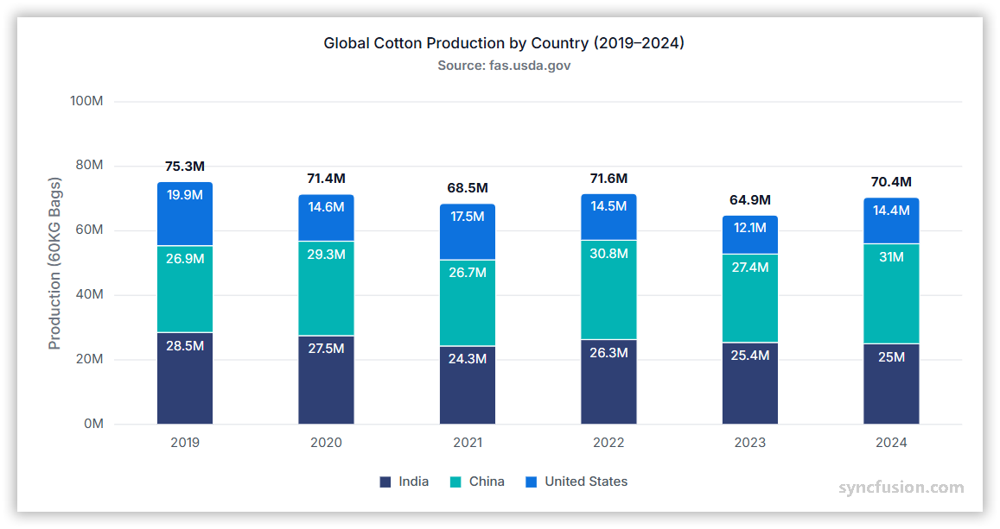

# Stacked Column Chart in Angular Charts

## Stacked Column

A stacked column chart displays vertical columns divided into segments that represent different series. It helps compare totals while showing the contribution of each series.



Configure a stacked column chart as follows:

1. **Set the series type**: Set the series [`type`](https://ej2.syncfusion.com/angular/documentation/api/chart/seriesDirective#type) to `StackingColumn`.
2. **Register the required services**: Import `ChartModule`, and add `StackingColumnSeriesService` and the required axis services, such as `CategoryService`, to the component or NgModule `providers` array.

















## Binding data to a series

Bind an array of JSON objects or a `DataManager` instance to the series with the [`dataSource`](https://ej2.syncfusion.com/angular/documentation/api/chart/seriesDirective#datasource) property. Map the category field with [`xName`](https://ej2.syncfusion.com/angular/documentation/api/chart/seriesDirective#xname) and map a value field for each series with [`yName`](https://ej2.syncfusion.com/angular/documentation/api/chart/seriesDirective#yname).

















## Series customization

Use the following properties to customize a stacked column series.

### Solid fill

Use the [`fill`](https://ej2.syncfusion.com/angular/documentation/api/chart/seriesDirective#fill) property to set a solid CSS color for a series.

















### Gradient fill

The [`fill`](https://ej2.syncfusion.com/angular/documentation/api/chart/seriesDirective#fill) property can apply an SVG gradient to a stacked column series. Define each gradient in an SVG `<defs>` element with a unique ID, and assign it to the series in the `url(#gradientId)` format.

Place the SVG gradient definitions in the application's `index.html` file, inside the `<body>` element and outside the `<app-container>` element.

```html
<svg>
    <defs>
        <linearGradient id="gradient1">
            <stop offset="0%" style="stop-color:darkblue;stop-opacity:5" />
            <stop offset="50%" style="stop-color:dimgrey;stop-opacity:5" />
        </linearGradient>
    </defs>
</svg>
<svg>
    <defs>
        <linearGradient id="gradient2">
            <stop offset="0%" style="stop-color:darkred;stop-opacity:5" />
            <stop offset="50%" style="stop-color:darkorange;stop-opacity:5" />
        </linearGradient>
    </defs>
</svg>
<svg>
    <defs>
        <linearGradient id="gradient3">
            <stop offset="0%" style="stop-color:darkmagenta;stop-opacity:5" />
            <stop offset="50%" style="stop-color:darkcyan;stop-opacity:5" />
        </linearGradient>
    </defs>
</svg>
<svg>
    <defs>
        <linearGradient id="gradient4">
            <stop offset="0%" style="stop-color:darkviolet;stop-opacity:5" />
            <stop offset="50%" style="stop-color:darkgoldenrod;stop-opacity:5" />
        </linearGradient>
    </defs>
</svg>
```

Set the series `fill` values to `url(#gradient1)`, `url(#gradient2)`, `url(#gradient3)`, and `url(#gradient4)`, respectively.

















### Opacity

Use the [`opacity`](https://ej2.syncfusion.com/angular/documentation/api/chart/seriesDirective#opacity) property to control series transparency. Set a value from `0` for fully transparent to `1` for fully opaque.

















### Border

Use the [`border`](https://ej2.syncfusion.com/angular/documentation/api/chart/seriesDirective#border) property to customize the color and width of the series border.

















## Stacking group

Use [`stackingGroup`](https://ej2.syncfusion.com/angular/documentation/api/chart/seriesDirective#stackinggroup) to organize stacked column and 100% stacked column series into separate stacks. Series with the same nonempty group name are stacked together; series with different group names form separate stacks.

















## Cylindrical stacked column chart

Set the [`columnFacet`](https://ej2.syncfusion.com/angular/documentation/api/chart/seriesDirective#columnfacet) property to `Cylinder` to render a stacked column series with a cylindrical shape. The default value is `Rectangle`.

















## Empty points

A data point whose mapped value is `null` or `undefined` is considered empty. Configure empty-point behavior with [`emptyPointSettings.mode`](https://ej2.syncfusion.com/angular/documentation/api/chart/emptyPointSettingsModel#mode). The default mode is `Gap`; use another supported mode when the chart must display a replacement value instead of a gap.

### Mode

Use `mode` to control how the series handles an empty point. The supported modes are:

- `Gap`: Leaves a gap at the empty point. This is the default mode.
- `Zero`: Replaces the missing value with zero.
- `Average`: Replaces the missing value with an average derived from neighboring points.
- `Drop`: Omits the empty point from rendering.

















### Empty-point fill

Use [`emptyPointSettings.fill`](https://ej2.syncfusion.com/angular/documentation/api/chart/emptyPointSettingsModel#fill) to set the fill color of an empty point when the selected mode renders a replacement point. It has no visible effect when the empty point is rendered as a gap.

















### Empty-point border

Use [`emptyPointSettings.border`](https://ej2.syncfusion.com/angular/documentation/api/chart/emptyPointSettingsModel#border) to set the width and color of an empty point's border when the selected mode renders a replacement point.

















## Stack labels

Stack labels display the total value for each stack. Enable them by setting `stackLabelSettings.visible` to `true` in the chart configuration. For negative stacks, the label is positioned relative to the negative stack.

















### Stack label customization

Use the following [`stackLabelSettings`](https://ej2.syncfusion.com/angular/documentation/api/chart/stackLabelSettings) properties to customize stack labels:

- [`visible`](https://ej2.syncfusion.com/angular/documentation/api/chart/stackLabelSettings#visible): Displays stack labels when set to `true`. The default is `false`.
- [`fill`](https://ej2.syncfusion.com/angular/documentation/api/chart/stackLabelSettings#fill): Sets the label background using a valid CSS color. The default is `transparent`.
- [`format`](https://ej2.syncfusion.com/angular/documentation/api/chart/stackLabelSettings#format): Formats label text and supports placeholders such as `{value}` for the total stack value. The default is `null`.
- [`angle`](https://ej2.syncfusion.com/angular/documentation/api/chart/stackLabelSettings#angle): Sets the rotation angle in degrees. The default is `0`.
- [`rx`](https://ej2.syncfusion.com/angular/documentation/api/chart/stackLabelSettings#rx): Sets the horizontal corner radius of the label background. The default is `5`.
- [`ry`](https://ej2.syncfusion.com/angular/documentation/api/chart/stackLabelSettings#ry): Sets the vertical corner radius of the label background. The default is `5`.
- [`margin`](https://ej2.syncfusion.com/angular/documentation/api/chart/stackLabelSettings#margin): Sets the spacing around the label.
- [`border`](https://ej2.syncfusion.com/angular/documentation/api/chart/stackLabelSettings#border): Sets the label border. Configure its width and color for rounded corners to be visible.
- [`font`](https://ej2.syncfusion.com/angular/documentation/api/chart/stackLabelSettings#font): Customizes the label text size, color, style, weight, and family.

















## Corner radius

### Series corner radius

Use [`cornerRadius`](https://ej2.syncfusion.com/angular/documentation/api/chart/seriesDirective#cornerradius) to round the corners of all points in the stacked column series. Configure individual corners with `topLeft`, `topRight`, `bottomLeft`, and `bottomRight`.

















### Point corner radius

Handle the [`pointRender`](https://ej2.syncfusion.com/angular/documentation/api/chart#pointrender) event and set the event argument's [`cornerRadius`](https://ej2.syncfusion.com/angular/documentation/api/chart/iPointRenderEventArgs#cornerradius) property to customize an individual point before it is rendered.

















## Events

### Series render

The [`seriesRender`](https://ej2.syncfusion.com/angular/documentation/api/chart/index-default#seriesrender) event runs before a series is rendered. Use its event arguments to customize supported series properties such as data, fill, and name.

















### Point render

The [`pointRender`](https://ej2.syncfusion.com/angular/documentation/api/chart#pointrender) event runs before each point is rendered. Use its event arguments to customize supported point properties. See [Point corner radius](#point-corner-radius) for a per-point styling example.

















## Troubleshooting

- **No columns are displayed**: Confirm that `StackingColumnSeriesService` and the required axis services are registered, the series type is `StackingColumn`, and the `xName` and `yName` fields exist in the data source.
- **Series do not stack together**: Confirm that the series use the same chart type, compatible category values, and the same `stackingGroup` when grouping is configured.
- **A point is missing**: Check whether its mapped value is `null` or `undefined`, and review `emptyPointSettings.mode`.
- **A gradient is not displayed**: Confirm that the SVG gradient ID exists in `index.html` and exactly matches the ID referenced by the series `fill` value.

## See also

- [Data labels](../../../chart-elements/data-labels)
- [Tooltip](../../../chart-interactive/tool-tip)