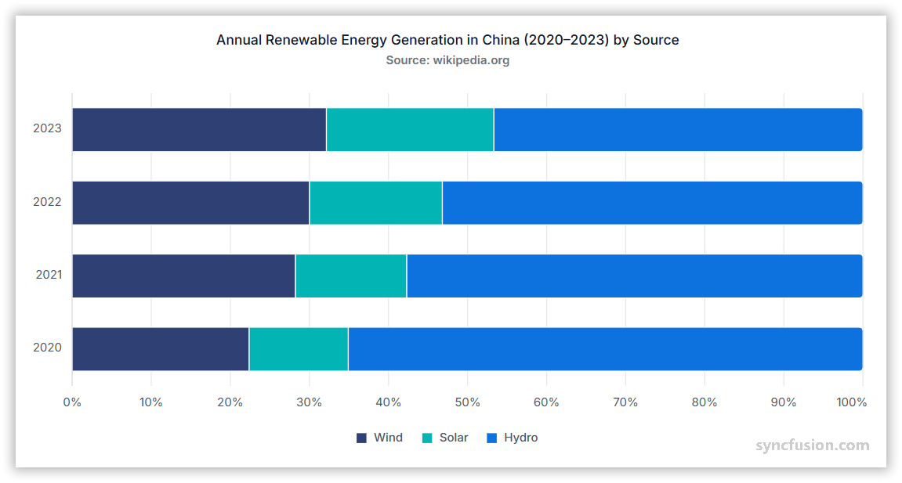

# 100% Stacked Bar Chart in Angular Charts

## 100% Stacked Bar

A 100% stacked bar chart displays horizontal stacked bars normalized to a total of 100% for each category.
It is used to compare percentage contributions across categories.

To render a [100% stacked bar](https://www.syncfusion.com/angular-components/angular-charts/chart-types/100-stacked-bar-chart) series in your chart, you need to follow a few steps to configure it correctly.

Here's a concise guide on how to do this:

1. **Set the series type**: Define the series [`type`](https://ej2.syncfusion.com/angular/documentation/api/chart/seriesDirective#type) as `StackingBar100` in your chart configuration. This indicates that the data should be represented as a 100% stacked bar chart, with segments that show the percentage contribution of each part.

2. **Provide StackingBarSeriesService**: Use the `@NgModule.providers` method to inject the `StackingBarSeriesService` module into your chart. This step is essential, as it ensures that the necessary functionalities for rendering the 100% stacked bar series are available in your chart.

















## Binding data with series

You can bind data to the chart using the [`dataSource`](https://ej2.syncfusion.com/angular/documentation/api/chart/seriesDirective#datasource) property within the series configuration. This allows you to connect a JSON dataset or remote data to your chart. To display the data correctly, map the fields from the data to the chart series [`xName`](https://ej2.syncfusion.com/angular/documentation/api/chart/seriesDirective#xname) and [`yName`](https://ej2.syncfusion.com/angular/documentation/api/chart/seriesDirective#yname) properties.

















## Series customization

The following properties can be used to customize the `100% stacked bar` series.

**Fill**

The [fill](https://ej2.syncfusion.com/angular/documentation/api/chart/seriesDirective#fill) property determines the color applied to the series.

















The [fill](https://ej2.syncfusion.com/angular/documentation/api/chart/seriesDirective#fill) property can be used to apply a gradient color to the 100% stacked bar series. By configuring this property with gradient values, you can create a visually appealing effect in which the color transitions smoothly from one shade to another.

















**Opacity**

The [opacity](https://ej2.syncfusion.com/angular/documentation/api/chart/seriesDirective#opacity) property specifies the transparency level of the fill. Adjusting this property allows you to control how opaque or transparent the fill color of the series appears.

















**Border**

Use the [border](https://ej2.syncfusion.com/angular/documentation/api/chart/seriesDirective#border) property to customize the width, color and dasharray of the series border.

















## 100% Cylindrical stacked bar chart

To render a 100% cylindrical stacked bar chart, set the [`columnFacet`](https://ej2.syncfusion.com/angular/documentation/api/chart/seriesDirective#columnfacet) property to `Cylinder` in the chart series. This property transforms the regular 100% stacked bars into cylindrical shapes, enhancing the visual representation of the data.

















## Empty points

Data points with `null` or `undefined` values are considered empty. Empty data points are ignored and not plotted on the chart.

**Mode**

Use the [`mode`](https://ej2.syncfusion.com/angular/documentation/api/chart/emptyPointSettingsModel#mode) property to define how empty or missing data points are handled in the series. The default mode for empty points is `Gap`.

















**Fill**

Use the [`fill`](https://ej2.syncfusion.com/angular/documentation/api/chart/emptyPointSettingsModel#fill) property to customize the fill color of empty points in the series.

















**Border**

Use the [`border`](https://ej2.syncfusion.com/angular/documentation/api/chart/emptyPointSettingsModel#border) property to customize the width and color of the border for empty points.

















## Corner radius

The [`cornerRadius`](https://ej2.syncfusion.com/angular/documentation/api/chart/series#cornerradius) property in the chart series is used to customize the corner radius for bar series. This allows you to create bars with rounded corners, giving your chart a more polished appearance. You can customize each corner of the bars using the topLeft, topRight, bottomLeft, and bottomRight properties.

















### Point corner radius

We can customize the corner radius for individual points in the chart series using the [`pointRender`](https://ej2.syncfusion.com/angular/documentation/api/chart/iPointRenderEventArgs) event by setting the [`cornerRadius`](https://ej2.syncfusion.com/angular/documentation/api/chart/iPointRenderEventArgs#cornerradius) property in its event argument.

















## Events

### Series render

The [`seriesRender`](https://ej2.syncfusion.com/angular/documentation/api/chart/iSeriesRenderEventArgs) event allows you to customize series properties, such as data, fill, and name, before they are rendered on the chart.

















### Point render

The [`pointRender`](https://ej2.syncfusion.com/angular/documentation/api/chart/iPointRenderEventArgs) event allows you to customize each data point before it is rendered on the chart.

















## See Also

* [Data label](../../../chart-elements/data-labels)
* [Tooltip](../../../chart-interactive/tool-tip)
