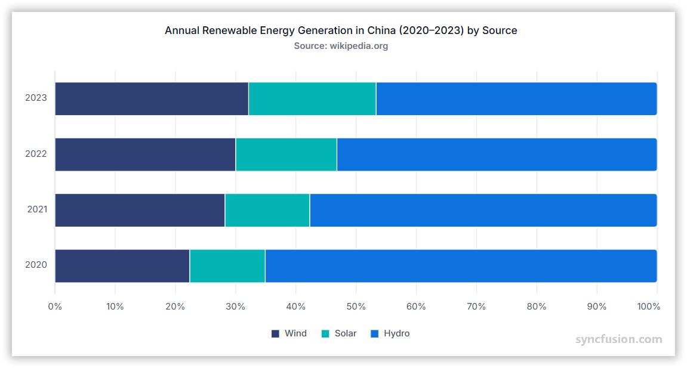

# 100% Stacked Bar Chart in Angular Charts

## 100% Stacked Bar

A 100% stacked bar chart displays horizontal stacked bars normalized to a total of 100% for each category.
It is used to compare percentage contributions across categories.



Configure a [100% stacked bar](https://www.syncfusion.com/angular-components/angular-charts/chart-types/100-stacked-bar-chart) series as follows:

1. **Set the series type**: Set the series [`type`](https://ej2.syncfusion.com/angular/documentation/api/chart/seriesDirective#type) to `StackingBar100`.
2. **Register the required services**: Add `ChartModule` to the component or NgModule `imports` array. Add `StackingBarSeriesService` and required axis services, such as `CategoryService`, to the `providers` array.

















## Binding data to a series

Bind an array of JSON objects or a `DataManager` instance with the [`dataSource`](https://ej2.syncfusion.com/angular/documentation/api/chart/seriesDirective#datasource) property. Map the category field with [`xName`](https://ej2.syncfusion.com/angular/documentation/api/chart/seriesDirective#xname) and each series value field with [`yName`](https://ej2.syncfusion.com/angular/documentation/api/chart/seriesDirective#yname). Handle loading and request errors before assigning remote data to the chart.

















## Series customization

Use the following properties to customize a 100% stacked bar series.

### Solid fill

Use the [`fill`](https://ej2.syncfusion.com/angular/documentation/api/chart/seriesDirective#fill) property to set a solid CSS color for a series.

















### Gradient fill

The [`fill`](https://ej2.syncfusion.com/angular/documentation/api/chart/seriesDirective#fill) property can apply an SVG gradient to a 100% stacked bar series. Define each gradient in an SVG `<defs>` element with a unique ID, and assign it to the series in the `url(#gradientId)` format.

Place the following SVG gradient definitions in the application's `index.html` file, inside the `<body>` element and outside the `<app-container>` element.

```html
<svg>
    <defs>
        <linearGradient id="gradient1">
            <stop offset="0%" style="stop-color:blue;stop-opacity:5" />
            <stop offset="50%" style="stop-color:violet;stop-opacity:5" />
        </linearGradient>
    </defs>
</svg>
<svg>
    <defs>
        <linearGradient id="gradient2">
            <stop offset="0%" style="stop-color:darkred;stop-opacity:5" />
            <stop offset="50%" style="stop-color:darkorange;stop-opacity:5" />
        </linearGradient>
    </defs>
</svg>
<svg>
    <defs>
        <linearGradient id="gradient3">
            <stop offset="0%" style="stop-color:darkgreen;stop-opacity:5" />
            <stop offset="50%" style="stop-color:darkslateblue;stop-opacity:5" />
        </linearGradient>
    </defs>
</svg>
```

Set the series `fill` values to `url(#gradient1)`, `url(#gradient2)`, and `url(#gradient3)`, respectively.

















### Opacity

Use the [`opacity`](https://ej2.syncfusion.com/angular/documentation/api/chart/seriesDirective#opacity) property to control series transparency. Set a value from `0` for fully transparent to `1` for fully opaque.

















### Border

Use the [`border`](https://ej2.syncfusion.com/angular/documentation/api/chart/seriesDirective#border) property to customize the color and width of the series border.

















## 100% cylindrical stacked bar chart

Set the [`columnFacet`](https://ej2.syncfusion.com/angular/documentation/api/chart/seriesDirective#columnfacet) property to `Cylinder` to render a 100% stacked bar series with a cylindrical shape. The default value is `Rectangle`.

















## Empty points

A data point whose mapped value is `null` or `undefined` is considered empty. Configure empty-point behavior with [`emptyPointSettings.mode`](https://ej2.syncfusion.com/angular/documentation/api/chart/emptyPointSettingsModel#mode). The default mode is `Gap`.

### Mode

Use [`mode`](https://ej2.syncfusion.com/angular/documentation/api/chart/emptyPointSettingsModel#mode) to control how the series handles an empty point. The supported modes are:

- `Gap`: Leaves a gap at the empty point. This is the default mode.
- `Zero`: Replaces the missing value with zero.
- `Average`: Replaces the missing value with an average derived from neighboring points.
- `Drop`: Omits the empty point from rendering.

















### Empty-point fill

Use [`emptyPointSettings.fill`](https://ej2.syncfusion.com/angular/documentation/api/chart/emptyPointSettingsModel#fill) to set the fill color when the selected mode renders a replacement point.

















### Empty-point border

Use [`emptyPointSettings.border`](https://ej2.syncfusion.com/angular/documentation/api/chart/emptyPointSettingsModel#border) to set the width and color of an empty point's border when the selected mode renders a replacement point.

















## Corner radius

### Series corner radius

Use [`cornerRadius`](https://ej2.syncfusion.com/angular/documentation/api/chart/seriesDirective#cornerradius) to round the corners of all points in the series. Configure individual corners with `topLeft`, `topRight`, `bottomLeft`, and `bottomRight`.

















### Point corner radius

Handle the [`pointRender`](https://ej2.syncfusion.com/angular/documentation/api/chart#pointrender) event and set the event argument's [`cornerRadius`](https://ej2.syncfusion.com/angular/documentation/api/chart/iPointRenderEventArgs#cornerradius) property to customize an individual point before it is rendered.

















## Events

### Series render

The [`seriesRender`](https://ej2.syncfusion.com/angular/documentation/api/chart#seriesrender) event allows you to customize series properties, such as data, fill, and name, before they are rendered on the chart.

















### Point render

The [`pointRender`](https://ej2.syncfusion.com/angular/documentation/api/chart#pointrender) event allows you to customize each data point before it is rendered on the chart.


















## Troubleshooting

- **No bars are displayed**: Confirm that `StackingBarSeriesService` and the required axis services are registered, the series type is `StackingBar100`, and the `xName` and `yName` fields exist in the data source.
- **A point is missing**: Check whether its mapped value is `null` or `undefined`, and review `emptyPointSettings.mode`.
- **A gradient is not displayed**: Confirm that the SVG gradient ID exists in `index.html` and matches the ID referenced by the series `fill` value.


## See also

* [Data labels](../../../chart-elements/data-labels)
* [Tooltip](../../../chart-interactive/tool-tip)
