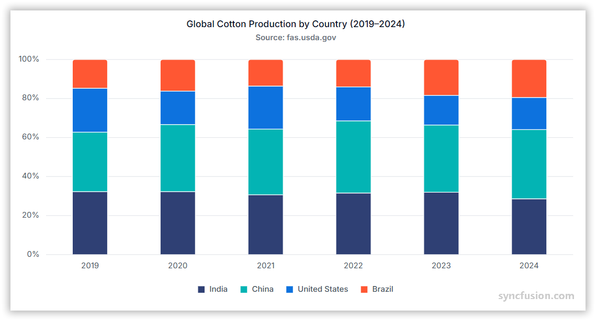

# 100% Stacked Column Chart in Angular Charts

## 100% Stacked Column

A 100% stacked column chart displays data in vertical columns where each column represents 100% of the data at that point, with individual series shown as segments proportional to their contribution.



Configure a [100% stacked column](https://www.syncfusion.com/angular-components/angular-charts/chart-types/100-stacked-column-chart) series as follows:

1. **Set the series type**: Set the series [`type`](https://ej2.syncfusion.com/angular/documentation/api/chart/seriesDirective#type) to `StackingColumn100`.

2. **Register StackingColumnSeriesService**: Register `StackingColumnSeriesService` (along with any other chart services you need) in the component's `providers` array.














  


## Binding data to a series

Bind an array of JSON objects or a `DataManager` instance with the [`dataSource`](https://ej2.syncfusion.com/angular/documentation/api/chart/seriesDirective#datasource) property. Map the category field with [`xName`](https://ej2.syncfusion.com/angular/documentation/api/chart/seriesDirective#xname) and each series value field with [`yName`](https://ej2.syncfusion.com/angular/documentation/api/chart/seriesDirective#yname). Handle loading and request errors before assigning remote data to the chart.














  


## Series customization

Use the following properties to customize a 100% stacked column series.

### Solid fill

Use the [`fill`](https://ej2.syncfusion.com/angular/documentation/api/chart/seriesDirective#fill) property to set a solid CSS color for a series.














  


### Gradient fill

The [`fill`](https://ej2.syncfusion.com/angular/documentation/api/chart/seriesDirective#fill) property can apply an SVG gradient to a 100% stacked column series. Define each gradient in an SVG `<defs>` element with a unique ID, and assign it in the `url(#gradientId)` format.

Place the following definitions in `index.html`, inside `<body>` and outside `<app-container>`.

```html
<svg>
    <defs>
        <linearGradient id="gradient1">
            <stop offset="0%" style="stop-color:darkblue;stop-opacity:5" />
            <stop offset="50%" style="stop-color:dimgrey;stop-opacity:5" />
        </linearGradient>
    </defs>
</svg>
<svg>
    <defs>
        <linearGradient id="gradient2">
            <stop offset="0%" style="stop-color:darkred;stop-opacity:5" />
            <stop offset="50%" style="stop-color:darkorange;stop-opacity:5" />
        </linearGradient>
    </defs>
</svg>
<svg>
    <defs>
        <linearGradient id="gradient3">
            <stop offset="0%" style="stop-color:darkmagenta;stop-opacity:5" />
            <stop offset="50%" style="stop-color:darkcyan;stop-opacity:5" />
        </linearGradient>
    </defs>
</svg>
<svg>
    <defs>
        <linearGradient id="gradient4">
            <stop offset="0%" style="stop-color:darkviolet;stop-opacity:5" />
            <stop offset="50%" style="stop-color:darkgoldenrod;stop-opacity:5" />
        </linearGradient>
    </defs>
</svg>
```

Set the series `fill` values to `url(#gradient1)`, `url(#gradient2)`, `url(#gradient3)`, and `url(#gradient4)`, respectively.














  


### Opacity

Use the [`opacity`](https://ej2.syncfusion.com/angular/documentation/api/chart/seriesDirective#opacity) property to control series transparency. Set a value from `0` to `1`.














  


### Border

Use the [`border`](https://ej2.syncfusion.com/angular/documentation/api/chart/seriesDirective#border) property to customize the color and width of the series border.














  


## 100% cylindrical stacked column chart

Set the [`columnFacet`](https://ej2.syncfusion.com/angular/documentation/api/chart/seriesDirective#columnfacet) property to `Cylinder` to render a cylindrical shape. The default is `Rectangle`.














  


## Empty points

A data point whose mapped value is `null` or `undefined` is empty. Configure its behavior with [`emptyPointSettings.mode`](https://ej2.syncfusion.com/angular/documentation/api/chart/emptyPointSettingsModel#mode).

### Mode

Use [`mode`](https://ej2.syncfusion.com/angular/documentation/api/chart/emptyPointSettingsModel#mode) to control empty-point rendering. The supported modes are:

- `Gap`: Leaves a gap at the empty point. This is the default mode.
- `Zero`: Replaces the missing value with zero.
- `Average`: Replaces the missing value with an average derived from neighboring points.
- `Drop`: Omits the empty point from rendering.














  


### Empty-point fill

Use [`emptyPointSettings.fill`](https://ej2.syncfusion.com/angular/documentation/api/chart/emptyPointSettingsModel#fill) when the selected mode renders a replacement point.














  


### Empty-point border

Use [`emptyPointSettings.border`](https://ej2.syncfusion.com/angular/documentation/api/chart/emptyPointSettingsModel#border) to style a rendered replacement point.














  



## Corner radius

### Series corner radius

Use [`cornerRadius`](https://ej2.syncfusion.com/angular/documentation/api/chart/seriesDirective#cornerradius) to round series points. Configure `topLeft`, `topRight`, `bottomLeft`, and `bottomRight`.














  


### Point corner radius

You can customize the corner radius for individual points in the chart series using the [`pointRender`](https://ej2.syncfusion.com/angular/documentation/api/chart#pointrender) event by setting the [`cornerRadius`](https://ej2.syncfusion.com/angular/documentation/api/chart/iPointRenderEventArgs#cornerradius) property in its event argument.














  


## Events

### Series render

The [`seriesRender`](https://ej2.syncfusion.com/angular/documentation/api/chart#seriesrender) event allows you to customize series properties, such as data, fill, and name, before they are rendered on the chart.














  


### Point render

The [`pointRender`](https://ej2.syncfusion.com/angular/documentation/api/chart#pointrender) event allows you to customize each data point before it is rendered on the chart.














  



## Troubleshooting

- **No columns are displayed**: Confirm that `StackingColumnSeriesService` and required axis services are registered, the series type is `StackingColumn100`, and mapped fields exist.
- **Series do not normalize correctly**: Confirm that all series use `StackingColumn100` and compatible category values.
- **A point is missing**: Check for `null` or `undefined` data and review `emptyPointSettings.mode`.
- **A gradient is not displayed**: Confirm that the SVG gradient ID matches the series `fill` value.

## See also

* [Data labels](../../../chart-elements/data-labels)
* [Tooltip](../../../chart-interactive/tool-tip)