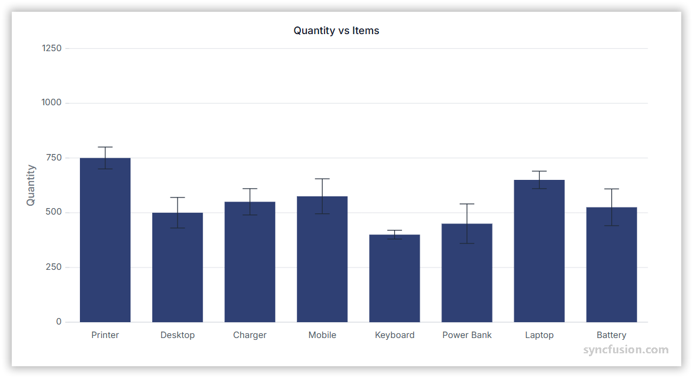

# Error Bar Chart in Angular Charts

## Error Bar

Error bars are graphical representations of the variability of data and are used on graphs to indicate the error or uncertainty in a reported measurement.



Configure an error bar on a series as follows:

1. **Set the series type**: Use any series that supports error bars (for example, `Line`).
2. **Enable error bars**: Set [`errorBarSettings.visible`](https://ej2.syncfusion.com/angular/documentation/api/chart/errorBarSettingsModel#visible) to `true` on the `<e-series>` directive.
3. **Register the service**: Register `ErrorBarService` (and the matching series / axis services) in the module `providers` array, or in `ApplicationConfig.providers` for standalone applications. Confirm that `ChartModule` is imported.










  


## Error bar type

Use [`errorBarSettings.type`](https://ej2.syncfusion.com/angular/documentation/api/chart/errorBarSettingsModel#type) to set the error bar variant. Combine with [`errorBarSettings.verticalError`](https://ej2.syncfusion.com/angular/documentation/api/chart/errorBarSettingsModel#verticalerror) (or the per-direction `verticalNegativeError` / `verticalPositiveError`) to control magnitude.

| Type                | Use it to |
|---------------------|-----------|
| `Fixed`             | Apply a constant magnitude from `verticalError` to every point. |
| `Percentage`        | Apply a magnitude that is a percentage of the y-value. |
| `StandardDeviation` | Apply a magnitude derived from the data's standard deviation. |
| `StandardError`     | Renders a standard error type error bar. |
| `Custom`            | Provide per-point positive and negative errors via the data source. |










  


## Customizing error bar type

To provide per-point errors, set `errorBarSettings.type` to `Custom` and map fields on the data source to [`verticalNegativeError`](https://ej2.syncfusion.com/angular/documentation/api/chart/errorBarSettingsModel#verticalnegativeerror), [`verticalPositiveError`](https://ej2.syncfusion.com/angular/documentation/api/chart/errorBarSettingsModel#verticalpositiveerror), [`horizontalNegativeError`](https://ej2.syncfusion.com/angular/documentation/api/chart/errorBarSettingsModel#horizontalnegativeerror), and [`horizontalPositiveError`](https://ej2.syncfusion.com/angular/documentation/api/chart/errorBarSettingsModel#horizontalpositiveerror).














  


## Error bar mode

Use [`errorBarSettings.mode`](https://ej2.syncfusion.com/angular/documentation/api/chart/errorBarSettingsModel#mode) to choose how the error bar is drawn.

| Mode        | Visual behavior |
|-------------|-----------------|
| `Vertical`  | Draw a vertical line only. |
| `Horizontal`| Draw a horizontal line only. |
| `Both`      | Draw vertical and horizontal lines. |














  


## Error bar direction

Use [`errorBarSettings.direction`](https://ej2.syncfusion.com/angular/documentation/api/chart/errorBarSettingsModel#direction) to choose which side of the point receives the error bar.

| Direction | Visual behavior |
|-----------|-----------------|
| `Both`    | Draw error bars on both sides of the point. |
| `Minus`   | Draw the error bar on the minus side only. |
| `Plus`    | Draw the error bar on the plus side only. |














  


## Customizing error bar cap

Use [`errorBarSettings.errorBarCap`](https://ej2.syncfusion.com/angular/documentation/api/chart/errorBarSettingsModel#errorbarcap) to customize the end caps of an error bar.

| Property | Type     | Use it to |
|----------|----------|-----------|
| `length` | `number` | Cap length in pixels. |
| `width`  | `number` | Cap width in pixels. |
| `color`   | `string` | Cap fill color. |
| `opacity`| `number` | Cap opacity (0 to 1). |














  


## Customizing error bar color

Use the [`errorBarColorMapping`](https://ej2.syncfusion.com/angular/documentation/api/chart/errorBarSettingsModel#errorbarcolormapping) property to map data values to error-bar colors. The per-point error fields listed below accept numeric values that override `verticalError` and `horizontalError` for each point.

| Property                                  | Use it to |
|-------------------------------------------|-----------|
| [`verticalError`](https://ej2.syncfusion.com/angular/documentation/api/chart/errorbarsettingsmodel#verticalerror)                    | Default vertical error magnitude. |
| [`horizontalError`](https://ej2.syncfusion.com/angular/documentation/api/chart/errorbarsettingsmodel#horizontalerror)                  | Default horizontal error magnitude. |
| [`verticalNegativeError`](https://ej2.syncfusion.com/angular/documentation/api/chart/errorbarsettingsmodel#verticalnegativeerror)            | Vertical error on the minus side. |
| [`verticalPositiveError`](https://ej2.syncfusion.com/angular/documentation/api/chart/errorbarsettingsmodel#horizontalpositiveerror)            | Vertical error on the plus side. |
| [`horizontalNegativeError`](https://ej2.syncfusion.com/angular/documentation/api/chart/errorbarsettingsmodel#horizontalnegativeerror)          | Horizontal error on the minus side. |
| [`horizontalPositiveError`](https://ej2.syncfusion.com/angular/documentation/api/chart/errorbarsettingsmodel#horizontalpositiveerror)          | Horizontal error on the plus side. |














  


## Events

### Series render

The [`seriesRender`](https://ej2.syncfusion.com/angular/documentation/api/chart#seriesrender) event allows you to customize series properties, such as `data`, `fill`, and `name`, before they are rendered on the chart. The callback receives an `ISeriesRenderEventArgs` argument that exposes mutable `series` and `data` properties.

```html
<ejs-chart (seriesRender)="onSeriesRender($event)"></ejs-chart>
```














  


### Point render

The [`pointRender`](https://ej2.syncfusion.com/angular/documentation/api/chart#pointrender) event allows you to customize each data point before it is rendered on the chart. The callback receives an `IPointRenderEventArgs` argument that exposes the current `point`, `series`, `fill`, and `border`, plus a `cancel` flag.

```html
<ejs-chart (pointRender)="onPointRender($event)"></ejs-chart>
```














  


## Troubleshooting

The following symptoms map to the most common configuration issues.

- **Error bars do not appear**: Confirm that `ErrorBarService` is registered, and that the series has `[errorBarSettings]='errorBarSettings'` with `visible: true`.
- **Error bars are the same length on every point**: With `type: 'Fixed'`, the magnitude is taken from `verticalError`. Switch to `Custom` to provide per-point values.
- **The custom error values are ignored**: Verify that `errorBarSettings.type` is `Custom`, and that the data source fields match the names mapped via `verticalNegativeError`, `verticalPositiveError`, `horizontalNegativeError`, and `horizontalPositiveError`.
- **`pointRender` does not fire**: Confirm you bind the event on the `<ejs-chart>` element with `(pointRender)="..."`, not on the series.

## See also

* [Data labels](../../../chart-elements/data-labels)
* [Tooltip](../../../chart-interactive/tool-tip)
* [Axis customization](../../axis/axis-customization)
* [Data binding](../../data-binding/working-with-data)
* [Legend](../../../chart-elements/legend)