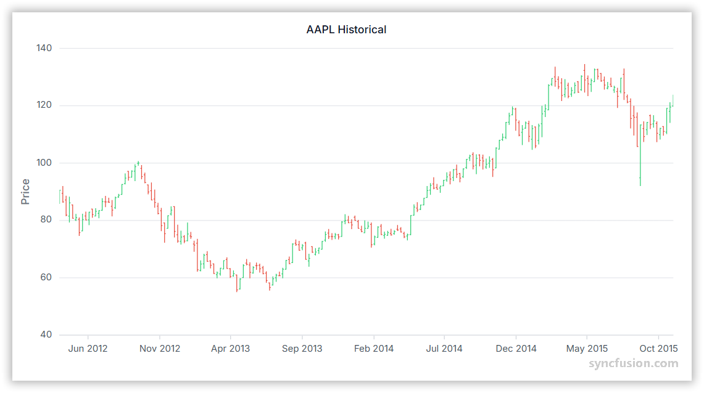

# High Low Open Close Chart in Angular Charts

## High Low Open Close

To render a [`hiloOpenClose`](https://www.syncfusion.com/angular-components/angular-charts/chart-types/ohlc-chart) series in your chart, you need to follow a few steps to configure it correctly.

Here's how to configure it:

1. **Set the series type**: Define the series [`type`](https://ej2.syncfusion.com/angular/documentation/api/chart/seriesDirective#type) as `HiloOpenClose` in your chart configuration. This indicates that the data should be represented as a high-low-open-close chart, which displays the high, low, open, and close values for each data point, providing a comprehensive visualization of stock price movements.

2. **Inject the HiloOpenCloseSeries module**: Use the `@NgModule.providers` method to inject the `HiloOpenCloseSeriesService` into your chart. This step is essential, as it ensures that the necessary functionalities for rendering high-low-open-close series are available in your chart.

3. **Provide high, low, open, and close values**: The `HiloOpenClose` series requires five fields (x, high, low, open, and close) to accurately display the stock's high, low, open, and close prices. Ensure that your data source includes these fields to create a detailed representation of stock price movements over time.














  


## Binding data with series

You can bind data to the chart using the [`dataSource`](https://ej2.syncfusion.com/angular/documentation/api/chart/seriesDirective#datasource) property within the series configuration. This allows you to connect a JSON dataset or remote data to your chart. To display the data correctly, map the fields from the data to the chart series [`xName`](https://ej2.syncfusion.com/angular/documentation/api/chart/seriesDirective#xname), [`high`](https://ej2.syncfusion.com/angular/documentation/api/chart/seriesDirective#high), [`low`](https://ej2.syncfusion.com/angular/documentation/api/chart/seriesDirective#low), [`open`](https://ej2.syncfusion.com/angular/documentation/api/chart/seriesDirective#open) and [`close`](https://ej2.syncfusion.com/angular/documentation/api/chart/seriesDirective#close) properties.














  


## Series customization

In the `hiloOpenClose` series, the [`bullFillColor`](https://ej2.syncfusion.com/angular/documentation/api/chart/seriesDirective#bullfillcolor) property is used to fill the segment when the open value is greater than the close value, while the [`bearFillColor`](https://ej2.syncfusion.com/angular/documentation/api/chart/seriesDirective#bearfillcolor) property is used to fill the segment when the open value is less than the close value. By default, [`bullFillColor`](https://ej2.syncfusion.com/angular/documentation/api/chart/seriesDirective#bullfillcolor) is set to **#e74c3d** (red) and [`bearFillColor`](https://ej2.syncfusion.com/angular/documentation/api/chart/seriesDirective#bearfillcolor) is set to **#2ecd71** (green).














  


## Empty points

Data points with `null` or `undefined` values are considered empty. Empty data points are ignored and not plotted on the chart.

**Mode**

Use the [`mode`](https://ej2.syncfusion.com/angular/documentation/api/chart/emptyPointSettingsModel#mode) property to define how empty or missing data points are handled in the series. The default mode for empty points is `Gap`.














  


**Fill**

Use the [`fill`](https://ej2.syncfusion.com/angular/documentation/api/chart/emptyPointSettingsModel#fill) property to customize the fill color of empty points in the series.














  


## Events

### Series render

The [`seriesRender`](https://ej2.syncfusion.com/angular/documentation/api/chart/iSeriesRenderEventArgs) event allows you to customize series properties, such as data, fill, and name, before they are rendered on the chart.














  


### Point render

The [`pointRender`](https://ej2.syncfusion.com/angular/documentation/api/chart/iPointRenderEventArgs) event allows you to customize each data point before it is rendered on the chart.














  


## See Also

* [Data label](../../chart-elements/data-labels)
* [Tooltip](../../chart-interactive/tool-tip)