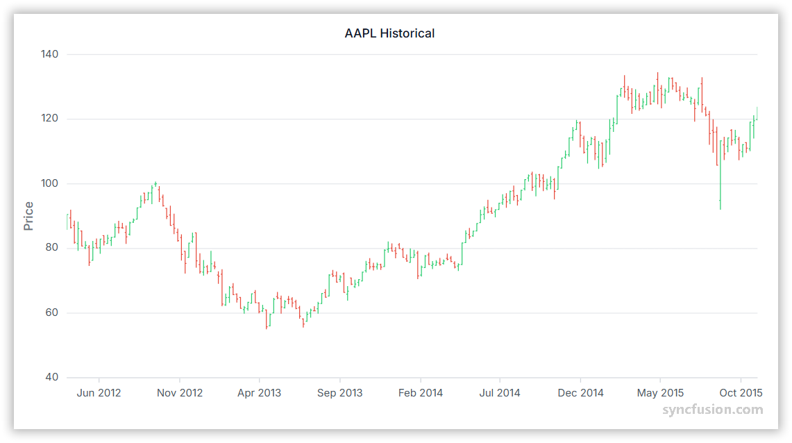

# High Low Open Close Chart in Angular Charts

## High Low Open Close

A High Low Open Close series renders stock-style bars that show the high, low, open, and close prices for each data point. The data is typically time-based, with the x-axis representing the trading period and each bar showing the four OHLC values.



Configure a Hilo Open Close series as follows:

1. **Set the series type**: Set the series [`type`](https://ej2.syncfusion.com/angular/documentation/api/chart/seriesDirective#type) to `HiloOpenClose`.
2. **Register the service**: Register `HiloOpenCloseSeriesService` (and any required axis services) in the module `providers` array, or in `ApplicationConfig.providers` for standalone applications. Confirm that `ChartModule` is imported.
3. **Map the OHLC fields**: Bind the data with [`dataSource`](https://ej2.syncfusion.com/angular/documentation/api/chart/seriesDirective#datasource), and map the date and price fields with [`xName`](https://ej2.syncfusion.com/angular/documentation/api/chart/seriesDirective#xname), [`high`](https://ej2.syncfusion.com/angular/documentation/api/chart/seriesDirective#high), [`low`](https://ej2.syncfusion.com/angular/documentation/api/chart/seriesDirective#low), [`open`](https://ej2.syncfusion.com/angular/documentation/api/chart/seriesDirective#open), and [`close`](https://ej2.syncfusion.com/angular/documentation/api/chart/seriesDirective#close).










  



## Series customization

Customize a Hilo Open Close series using the following properties.

### Bull and bear colors

Use [`bullFillColor`](https://ej2.syncfusion.com/angular/documentation/api/chart/seriesDirective#bullfillcolor) to color the segment when the close value is **greater** than the open value, and [`bearFillColor`](https://ej2.syncfusion.com/angular/documentation/api/chart/seriesDirective#bearfillcolor) to color the segment when the close value is **less** than the open value.














  


## Empty points

A data point whose mapped value is `null` or `undefined` is empty. Configure its behavior with [`emptyPointSettings.mode`](https://ej2.syncfusion.com/angular/documentation/api/chart/emptyPointSettingsModel#mode).

### Mode

Use [`mode`](https://ej2.syncfusion.com/angular/documentation/api/chart/emptyPointSettingsModel#mode) to control empty-point rendering. The default is `Gap`.

| Mode      | Visual behavior |
|-----------|-----------------|
| `Gap`     | Skip the empty point; subsequent bars are still rendered. |
| `Zero`    | Treat the empty point as `0` and render a flat bar. |
| `Drop`    | Drop the empty bar; subsequent points are still rendered. |
| `Average` | Replace the empty value with the average of the surrounding points. |














  



### Empty-point fill

Use the [`emptyPointSettings.fill`](https://ej2.syncfusion.com/angular/documentation/api/chart/emptyPointSettingsModel#fill) property to customize the fill color of empty-point bars.














  


## Events

### Series render

The [`seriesRender`](https://ej2.syncfusion.com/angular/documentation/api/chart#seriesrender) event allows you to customize series properties, such as `data`, `fill`, and `name`, before they are rendered on the chart. The callback receives an `ISeriesRenderEventArgs` argument that exposes mutable `series` and `data` properties.

```html
<ejs-chart (seriesRender)="onSeriesRender($event)"></ejs-chart>
```










  


### Point render

The [`pointRender`](https://ej2.syncfusion.com/angular/documentation/api/chart#pointrender) event allows you to customize each data point before it is rendered on the chart. The callback receives an `IPointRenderEventArgs` argument that exposes the current `point`, `series`, `fill`, and `border`, plus a `cancel` flag.

```html
<ejs-chart (pointRender)="onPointRender($event)"></ejs-chart>
```










  


## Troubleshooting

The following symptoms map to the most common configuration issues.

- **Bars are not rendered**: Confirm that `HiloOpenCloseSeriesService` is registered, the series [`type`](https://ej2.syncfusion.com/angular/documentation/api/chart/seriesDirective#type) is `HiloOpenClose`, and that `xName`, `high`, `low`, `open`, and `close` map to fields in the data source.
- **All bars use the same color**: Verify that `bullFillColor` and `bearFillColor` are set, and that the open and close values are not identical.
- **An empty point renders as a flat zero bar**: Review `emptyPointSettings.mode`. Use `Gap` to skip rendering or `Drop` to keep subsequent bars.

## See also

* [Data labels](../../../chart-elements/data-labels)
* [Tooltip](../../../chart-interactive/tool-tip)
* [Axis customization](../../axis/axis-customization)
* [Data binding](../../data-binding/working-with-data)
* [Legend](../../../chart-elements/legend)