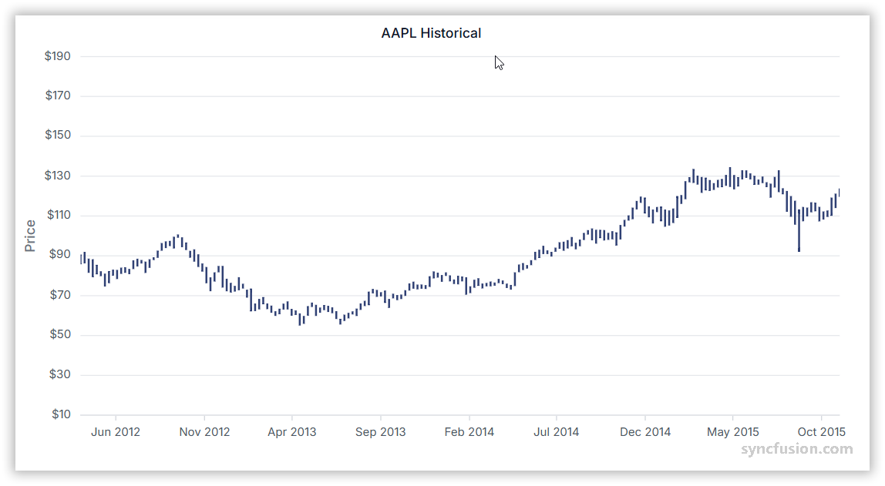

# High Low Chart in Angular Charts

## Hilo

To render a Hilo series in your chart, follow these steps to configure it correctly.



Here's a concise guide on how to do this:

1. **Set the series type**: Define the series [`type`](https://ej2.syncfusion.com/angular/documentation/api/chart/seriesDirective#type) as **`Hilo`** in your chart configuration. This indicates that the data should be represented as a Hilo chart, which shows the high and low values for each data point.

2. **Provide HiloSeriesService**: Inject the `HiloSeriesService` into the component `providers` array. This is required for rendering Hilo series.

3. **Provide high and low values**: The `Hilo` series requires two y-values for each data point. Map both the high and low fields from the data to the [`high`](https://ej2.syncfusion.com/angular/documentation/api/chart/seriesDirective#high) and [`low`](https://ej2.syncfusion.com/angular/documentation/api/chart/seriesDirective#low) properties.














  


## Series customization

Customize a Hilo series using the following properties.

### Solid color

Use the [`fill`](https://ej2.syncfusion.com/angular/documentation/api/chart/seriesDirective#fill) property to set a single solid color. Accepted values are CSS color names (for example, `blue`), hexadecimal strings (for example, `#1A75FF`), and `rgba(...)` strings.














  


### Gradient color

The [`fill`](https://ej2.syncfusion.com/angular/documentation/api/chart/seriesDirective#fill) property can also reference an SVG `<linearGradient>` defined in the host `index.html`. Define each gradient inside an SVG `<defs>` element and reference it with `url(#gradientId)`:

```html
<svg>
    <defs>
        <linearGradient id="gradient">
            <stop offset="0%" style="stop-color:blue;stop-opacity:5" />
            <stop offset="50%" style="stop-color:violet;stop-opacity:5" />
        </linearGradient>
    </defs>
</svg>
```

> The `id` referenced by `fill="url(#gradient)"` must exist in the DOM of the page that hosts the chart.














  


### Opacity

The [`opacity`](https://ej2.syncfusion.com/angular/documentation/api/chart/seriesDirective#opacity) property specifies the transparency of the fill. Accepts values from `0` (fully transparent) to `1` (fully opaque).














  


## Empty points

A data point whose mapped value is `null` or `undefined` is empty. Configure its behavior with [`emptyPointSettings.mode`](https://ej2.syncfusion.com/angular/documentation/api/chart/emptyPointSettingsModel#mode).

### Mode

Use [`mode`](https://ej2.syncfusion.com/angular/documentation/api/chart/emptyPointSettingsModel#mode) to control empty-point rendering. The default is `Gap`.

| Mode | Visual behavior |
|------|-----------------|
| `Gap` | Skip the empty point; subsequent segments are still rendered. |
| `Drop` | Break the connecting line at the empty point. |
| `Zero` | Treat the empty point as `0`. |
| `Average` | Replace the empty value with the average of the surrounding points. |














  


### Empty-point fill

Use the [`emptyPointSettings.fill`](https://ej2.syncfusion.com/angular/documentation/api/chart/emptyPointSettingsModel#fill) property to customize the fill color of empty points. You can also set `border: { width, color }` inside `emptyPointSettings` to style the empty-point outline.














  


## Events

### Series render

The [`seriesRender`](https://ej2.syncfusion.com/angular/documentation/api/chart#seriesrender) event allows you to customize series properties, such as `data`, `fill`, and `name`, before they are rendered on the chart. The callback receives an `ISeriesRenderEventArgs` argument that exposes mutable `series` and `data` properties.

```html
<ejs-chart (seriesRender)="onSeriesRender($event)"></ejs-chart>
```














  


### Point render

The [`pointRender`](https://ej2.syncfusion.com/angular/documentation/api/chart#pointrender) event allows you to customize each data point before it is rendered on the chart. The callback receives an `IPointRenderEventArgs` argument that exposes the current `point`, `series`, `fill`, and `border`, plus a `cancel` flag.

```html
<ejs-chart (pointRender)="onPointRender($event)"></ejs-chart>
```














  


## Troubleshooting

The following symptoms map to the most common configuration issues.

- **No series is rendered**: Verify that `HiloSeriesService` (and, for category x-axis data, `CategoryService`) are registered, the series [`type`](https://ej2.syncfusion.com/angular/documentation/api/chart/seriesDirective#type) is `Hilo`, and that `xName`, `high`, and `low` map to fields in the data source.
- **Empty-point styling has no effect**: Confirm that `null` or `undefined` exists in the data values mapped to `high` or `low`, and that `emptyPointSettings.mode` matches the desired behavior.
- **Event handlers do not fire**: Confirm that `seriesRender` or `pointRender` are bound on the `<ejs-chart>` element, not on the `<e-series>`, and that the handler is a `public` method on the component.

## See also

* [Data labels](../../../chart-elements/data-labels)
* [Tooltip](../../../chart-interactive/tool-tip)
* [Axis customization](../../axis/axis-customization)
* [Data binding](../../data-binding/working-with-data)
* [Legend](../../../chart-elements/legend)