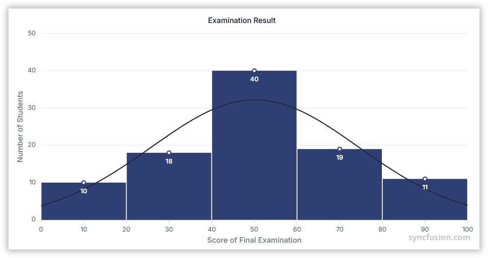

# Histogram Chart in Angular Charts

## Histogram

A histogram displays the distribution of numeric data by grouping values into bins and showing their frequencies as vertical bars. The `Histogram` series automatically calculates bin counts and can optionally overlay a normal-distribution curve for statistical analysis.



To render a [histogram](https://www.syncfusion.com/angular-components/angular-charts/chart-types/histogram-chart) series in your chart, follow these steps to configure it correctly:

1. **Set the series type**: Define the series [`type`](https://ej2.syncfusion.com/angular/documentation/api/chart/seriesDirective#type) as **`Histogram`**. Histogram is ideal for visualizing large datasets that are difficult to read in tabular form.

2. **Provide HistogramSeriesService**: Inject the `HistogramSeriesService` into the component `providers` array. This is required for rendering Histogram series.

3. **Bind numeric data**: A Histogram series requires a single numeric field on each data point. Map the field to the series [`yName`](https://ej2.syncfusion.com/angular/documentation/api/chart/seriesDirective#yname) property.














  


## Events

### Series render

The [`seriesRender`](https://ej2.syncfusion.com/angular/documentation/api/chart#seriesrender) event allows you to customize series properties, such as `data`, `fill`, and `name`, before they are rendered on the chart. The callback receives an `ISeriesRenderEventArgs` argument that exposes mutable `series` and `data` properties.

```html
<ejs-chart (seriesRender)="onSeriesRender($event)"></ejs-chart>
```














  


### Point render

The [`pointRender`](https://ej2.syncfusion.com/angular/documentation/api/chart#pointrender) event allows you to customize each data point before it is rendered on the chart. The callback receives an `IPointRenderEventArgs` argument that exposes the current `point`, `series`, `fill`, and `border`, plus a `cancel` flag.

```html
<ejs-chart (pointRender)="onPointRender($event)"></ejs-chart>
```














  


## Troubleshooting

The following symptoms map to the most common configuration issues.

- **No series is rendered**: Verify that `HistogramSeriesService` is registered, the series [`type`](https://ej2.syncfusion.com/angular/documentation/api/chart/seriesDirective#type) is `Histogram`, and that `yName` maps to a numeric field on each data point.
- **Event handlers do not fire**: Confirm that `seriesRender` or `pointRender` are bound on the `<ejs-chart>` element, not on the `<e-series>`, and that the handler is a `public` method on the component.

## See also

* [Data labels](../../chart-elements/data-labels)
* [Tooltip](../../chart-interactive/tool-tip)
* [Axis customization](../../axis/axis-customization)
* [Data binding](../../data-binding/working-with-data)
* [Legend](../../chart-elements/legend)