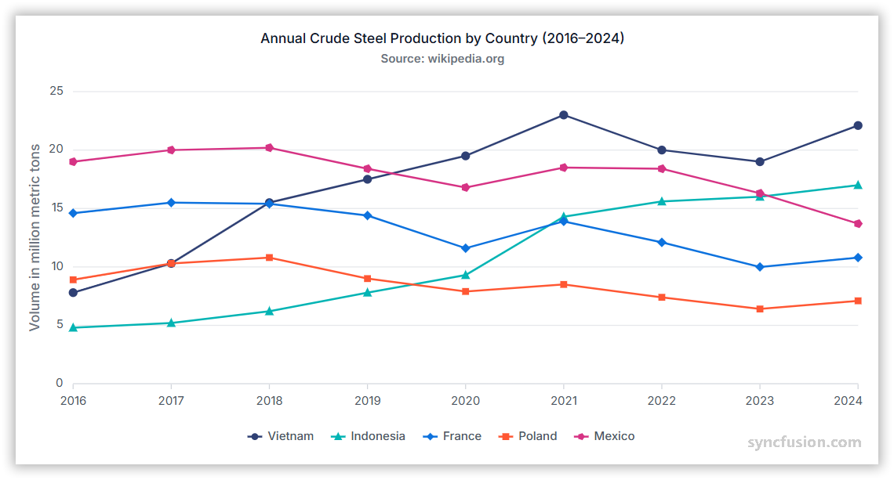

# Line Chart in Angular Charts

## Line

A line chart displays data points connected by straight lines to show trends over time or continuous values.

Configure a line series as follows:

1. **Set the series type**: Set the series [`type`](https://ej2.syncfusion.com/angular/documentation/api/chart/seriesDirective#type) to `Line`.
2. **Register the required services**: Register `LineSeriesService` and required axis services, such as `CategoryService`, in the module `providers` array. Confirm that `ChartModule` is imported.
3. **Map the data fields**: Bind the data with [`dataSource`](https://ej2.syncfusion.com/angular/documentation/api/chart/seriesDirective#datasource), and map fields with [`xName`](https://ej2.syncfusion.com/angular/documentation/api/chart/seriesDirective#xname) and [`yName`](https://ej2.syncfusion.com/angular/documentation/api/chart/seriesDirective#yname).

















## Series customization

Customize a line series using the following properties.

### Solid color

Use the [`fill`](https://ej2.syncfusion.com/angular/documentation/api/chart/seriesDirective#fill) property to set a single solid stroke color. Accepted values are CSS color names (for example, `blue`), hexadecimal strings (for example, `#1A75FF`), and `rgba(...)` strings.

















### Gradient color

The [`fill`](https://ej2.syncfusion.com/angular/documentation/api/chart/seriesDirective#fill) property can reference an SVG gradient for a line series. Define the gradient in an SVG `<defs>` element, and assign it in the `url(#gradientId)` format.

















### Opacity

Use the [`opacity`](https://ej2.syncfusion.com/angular/documentation/api/chart/seriesDirective#opacity) property to control line transparency. Set a value from `0` to `1`.

















### Dash array

Use the [`dashArray`](https://ej2.syncfusion.com/angular/documentation/api/chart/seriesDirective#dasharray) property to define the line stroke's dash pattern. Provide a comma or whitespace-separated list of stroke-gap sizes in pixels, for example `"5,5"`, `"2,2,10,2"`, or `"4 4"`.

















### Width

Use the [`width`](https://ej2.syncfusion.com/angular/documentation/api/chart/seriesDirective#width) property to set the line stroke width in pixels.

















## Multicolored line

Configure a multicolored line series as follows:

1. **Set the series type**: Set [`type`](https://ej2.syncfusion.com/angular/documentation/api/chart/seriesDirective#type) to `MultiColoredLine`.
2. **Register the service**: Register `MultiColoredLineSeriesService` in the module `providers` array.
3. **Map colors**: Set [`pointColorMapping`](https://ej2.syncfusion.com/angular/documentation/api/chart/seriesDirective#pointcolormapping) to the data field that contains each point color. Each row in the data source must include a field whose value is a CSS color string — for example `{ x: 'Jan', y: 35, color: 'red' }`.

















## Empty points

A data point whose mapped value is `null` or `undefined` is empty. Configure its behavior with [`emptyPointSettings.mode`](https://ej2.syncfusion.com/angular/documentation/api/chart/emptyPointSettingsModel#mode).

### Mode

Use [`mode`](https://ej2.syncfusion.com/angular/documentation/api/chart/emptyPointSettingsModel#mode) to control empty-point rendering. The default is `Gap`.

| Mode      | Visual behavior |
|-----------|-----------------|
| `Gap`     | Leave a gap at the empty position and continue the line through the next available point. |
| `Zero`    | Treat the empty point as `0` and connect it. |
| `Drop`    | Drop the line segment; subsequent points are still rendered. |
| `Average` | Replace the empty value with the average of the surrounding points. |

















### Empty-point fill

Use the [`emptyPointSettings.fill`](https://ej2.syncfusion.com/angular/documentation/api/chart/emptyPointSettingsModel#fill) property to customize the fill color of empty points in the series.

















### Empty-point border

Use the [`emptyPointSettings.border`](https://ej2.syncfusion.com/angular/documentation/api/chart/emptyPointSettingsModel#border) property to customize the width and color of a rendered empty point. Example: `{ width: 2, color: '#FF0000' }`.

















## Events

### Series render

The [`seriesRender`](https://ej2.syncfusion.com/angular/documentation/api/chart#seriesrender) event allows you to customize series properties, such as `data`, `fill`, and `name`, before they are rendered on the chart. The callback receives an `ISeriesRenderEventArgs` argument that exposes mutable `series`, `fill`, and `data` properties.

















### Point render

The [`pointRender`](https://ej2.syncfusion.com/angular/documentation/api/chart#pointrender) event allows you to customize each data point before it is rendered on the chart. The callback receives an `IPointRenderEventArgs` argument that exposes the current `point`, `series`, `fill`, and `border`, plus a `cancel` flag.

















## Troubleshooting

- **The line is not displayed**: Confirm that `LineSeriesService` and required axis services are registered, the series type is `Line`, and mapped fields exist.
- **A multicolored line uses one color**: Confirm that `MultiColoredLineSeriesService` is registered and `pointColorMapping` matches the color field in the data source.
- **An empty point is missing**: Review `emptyPointSettings.mode` and verify that the mapped value is `null` or `undefined`.
- **A gradient is not displayed**: Confirm that the SVG gradient ID in `index.html` matches the series `fill` value.

## See also

* [Data labels](../../../chart-elements/data-labels)
* [Tooltip](../../../chart-interactive/tool-tip)
* [Axis customization](../../../axis/axis-customization)
* [Data binding](../../../data-binding/working-with-data)
* [Legend](../../../chart-elements/legend)

