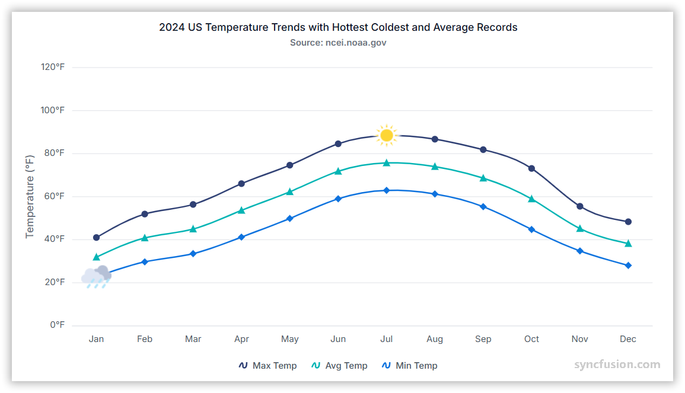

# Spline Chart in Angular Charts

## Spline

A spline chart is a smooth, curved version of a line chart that connects data points using splines instead of straight lines.

To render a [spline](https://www.syncfusion.com/angular-components/angular-charts/chart-types/spline-chart) series in your chart, you need to follow a few steps to configure it correctly.

Here's a concise guide on how to do this:

1. **Set the series type**: Define the series [`type`](https://ej2.syncfusion.com/angular/documentation/api/chart/seriesDirective/#type) as `Spline` in your chart configuration. This indicates that the series should be represented as a smooth curve, connecting data points with a spline rather than straight lines.

2. **Inject the SplineSeries module**: Use the `@NgModule.providers` method to inject the `SplineSeriesService` module into your chart. This step is essential, as it ensures that the necessary functionalities for rendering spline series are available in your chart.

















## Binding data with series

You can bind data to the chart using the [`dataSource`](https://ej2.syncfusion.com/angular/documentation/api/chart/seriesDirective/#datasource) property within the series configuration. This allows you to connect a JSON dataset or remote data to your chart. To display the data correctly, map the fields from the data to the chart series [`xName`](https://ej2.syncfusion.com/angular/documentation/api/chart/seriesDirective/#xname) and [`yName`](https://ej2.syncfusion.com/angular/documentation/api/chart/seriesDirective/#yname) properties.

















## Spline type

Use the [`splineType`](https://ej2.syncfusion.com/angular/documentation/api/chart/seriesDirective/#splinetype) to define the type of the spline series. The default type is `Natural`, which creates a smooth curve through the data points.

















## Series customization

The following properties can be used to customize the `spline` series.

**Fill**

The [fill](https://ej2.syncfusion.com/angular/documentation/api/chart/seriesDirective/#fill) property determines the color applied to the series.

















The [fill](https://ej2.syncfusion.com/angular/documentation/api/chart/seriesDirective/#fill) property can be used to apply a gradient color to the spline series. By configuring this property with gradient values, you can create a visually appealing effect in which the color transitions smoothly from one shade to another.

















**Opacity**

The [opacity](https://ej2.syncfusion.com/angular/documentation/api/chart/seriesDirective/#opacity) property specifies the transparency level of the fill. Adjusting this property allows you to control how opaque or transparent the fill color of the series appears.

















**Dash array**

The [dashArray](https://ej2.syncfusion.com/angular/documentation/api/chart/seriesDirective/#dasharray) property determines the pattern of dashes and gaps in the series.

















**Width**

The [width](https://ej2.syncfusion.com/angular/documentation/api/chart/seriesDirective/#width) property specifies the stroke width applied to the series.

















## Empty points

Data points with `null` or `undefined` values are considered empty. Empty data points are ignored and not plotted on the chart.

**Mode**

Use the [`mode`](https://ej2.syncfusion.com/angular/documentation/api/chart/emptyPointSettingsModel/#mode) property to define how empty or missing data points are handled in the series. The default mode for empty points is `Gap`.

















**Fill**

Use the [`fill`](https://ej2.syncfusion.com/angular/documentation/api/chart/emptyPointSettingsModel/#fill) property to customize the fill color of empty points in the series.

















**Border**

Use the [`border`](https://ej2.syncfusion.com/angular/documentation/api/chart/emptyPointSettingsModel/#border) property to customize the width and color of the border for empty points.

















## Events

### Series render

The [`seriesRender`](https://ej2.syncfusion.com/angular/documentation/api/sparkline/iSeriesRenderingEventArgs/) event allows you to customize series properties, such as data, fill, and name, before they are rendered on the chart.

















### Point render

The [`pointRender`](https://ej2.syncfusion.com/angular/documentation/api/chart/iPointRenderEventArgs/) event allows you to customize each data point before it is rendered on the chart.

















## See Also

* [Data label](./data-labels/)
* [Tooltip](./tool-tip/)
