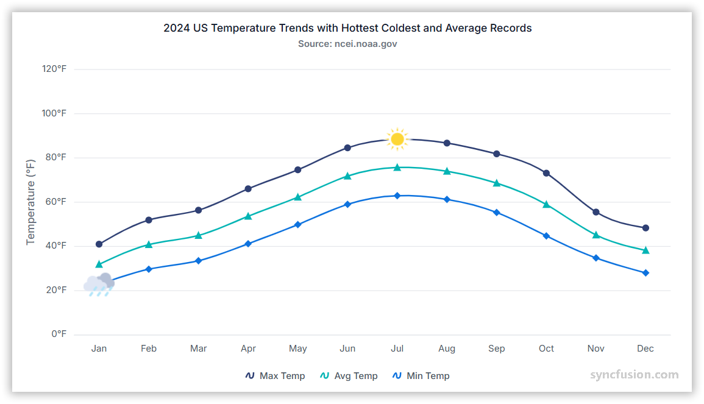

# Spline Chart in Angular Charts

## Spline

A spline chart is a smooth, curved version of a line chart that connects data points using splines instead of straight lines.



Configure a spline series as follows:

1. **Set the series type**: Set the series [`type`](https://ej2.syncfusion.com/angular/documentation/api/chart/seriesDirective#type) to `Spline`.
2. **Register the service**: Register `SplineSeriesService` (and any required axis services) in the module `providers` array, or in `ApplicationConfig.providers` for standalone applications. Confirm that `ChartModule` is imported.
3. **Map the data fields**: Bind the data with [`dataSource`](https://ej2.syncfusion.com/angular/documentation/api/chart/seriesDirective#datasource), and map fields with [`xName`](https://ej2.syncfusion.com/angular/documentation/api/chart/seriesDirective#xname) and [`yName`](https://ej2.syncfusion.com/angular/documentation/api/chart/seriesDirective#yname).

















## Spline type

Use the [`splineType`](https://ej2.syncfusion.com/angular/documentation/api/chart/seriesDirective#splinetype) to define the type of the spline series. The default type is `Natural`, which creates a smooth curve through the data points.

| Spline type | Visual behavior |
|-------------|-----------------|
| `Natural`   | Smooth curve; passes through each data point. Default. |
| `Cardinal`  | Cardinal spline interpolation; tension can be controlled with [`cardinalSplineTension`](https://ej2.syncfusion.com/angular/documentation/api/chart/seriesDirective#cardinalsplinetension) (typically between `0` and `1`). |
| `Clamped` | Renders a clamped spline. |
| `Monotonic` | Less wavy curve that does not overshoot at peaks and troughs; suitable when data does not follow a smooth progression. |

















## Series customization

Customize a spline series using the following properties.

### Solid color

Use the [`fill`](https://ej2.syncfusion.com/angular/documentation/api/chart/seriesDirective#fill) property to set a single solid stroke color. Accepted values are CSS color names (for example, `blue`), hexadecimal strings (for example, `#1A75FF`), and `rgba(...)` strings.

















### Gradient color

The [`fill`](https://ej2.syncfusion.com/angular/documentation/api/chart/seriesDirective#fill) property can reference an SVG gradient. Define the gradient in an SVG `<defs>` element and assign it in the `url(#gradientId)` format.

Place the following definition in the application's `index.html` file, inside `<body>` and outside `<app-container>`.


<svg width="0" height="0" aria-hidden="true">
    <defs>
        <linearGradient id="gradient">
            <stop offset="0%" style="stop-color:#FF0000;stop-opacity:5" />
            <stop offset="70%" style="stop-color:#00FF00;stop-opacity:5" />
        </linearGradient>
    </defs>
</svg>


Set the series `fill` value to `url(#gradient)`.

















### Opacity

Use the [`opacity`](https://ej2.syncfusion.com/angular/documentation/api/chart/seriesDirective#opacity) property to control spline transparency. Set a value from `0` to `1`.

















### Dash array

Use the [`dashArray`](https://ej2.syncfusion.com/angular/documentation/api/chart/seriesDirective#dasharray) property to define the spline's dash pattern. Provide a comma or whitespace-separated list of stroke-gap sizes in pixels, for example `"5,5"`, `"2,2,10,2"`, or `"4 4"`.

















### Width

Use the [`width`](https://ej2.syncfusion.com/angular/documentation/api/chart/seriesDirective#width) property to set the spline stroke width in pixels.

















## Empty points

A data point whose mapped value is `null` or `undefined` is empty. Configure its behavior with [`emptyPointSettings.mode`](https://ej2.syncfusion.com/angular/documentation/api/chart/emptyPointSettingsModel#mode).

### Mode

Use [`mode`](https://ej2.syncfusion.com/angular/documentation/api/chart/emptyPointSettingsModel#mode) to control empty-point rendering. The default is `Gap`.

| Mode      | Visual behavior |
|-----------|-----------------|
| `Gap`     | Leave a gap at the empty position and continue the curve through the next available point. |
| `Zero`    | Treat the empty point as `0` and connect it. |
| `Drop`    | Drop the curve segment; subsequent points are still rendered. |
| `Average` | Replace the empty value with the average of the surrounding points. |

















### Empty-point fill

Use the [`emptyPointSettings.fill`](https://ej2.syncfusion.com/angular/documentation/api/chart/emptyPointSettingsModel#fill) property to customize the fill color of empty points.

















### Empty-point border

Use the [`emptyPointSettings.border`](https://ej2.syncfusion.com/angular/documentation/api/chart/emptyPointSettingsModel#border) property to customize the width and color of a rendered empty point.

















## Events

### Series render

The [`seriesRender`](https://ej2.syncfusion.com/angular/documentation/api/chart#seriesrender) event allows you to customize series properties, such as `data`, `fill`, and `name`, before they are rendered on the chart. The callback receives an `ISeriesRenderEventArgs` argument that exposes mutable `series` and `data` properties.

```html
<ejs-chart (seriesRender)="onSeriesRender($event)"></ejs-chart>
```

















### Point render

The [`pointRender`](https://ej2.syncfusion.com/angular/documentation/api/chart#pointrender) event allows you to customize each data point before it is rendered on the chart. The callback receives an `IPointRenderEventArgs` argument that exposes the current `point`, `series`, `fill`, and `border`, plus a `cancel` flag.

```html
<ejs-chart (pointRender)="onPointRender($event)"></ejs-chart>
```

















## Troubleshooting

- **The spline curve is not displayed**: Confirm that `SplineSeriesService` is registered, the series [`type`](https://ej2.syncfusion.com/angular/documentation/api/chart/seriesDirective#type) is `Spline`, and that `xName` / `yName` map to fields in the data source.
- **A gradient is not displayed**: Confirm that the SVG gradient ID defined in `index.html` matches the series `fill` value (`url(#gradient)`) exactly.
- **An empty point is missing**: Review `emptyPointSettings.mode` and verify that the mapped value is `null` or `undefined` (not `0` or `''`).
- **The `width` property has no effect**: Confirm that you are setting `width` on the `<e-series>` directive and not on `border.width`.

## See also

* [Data labels](../../../chart-elements/data-labels)
* [Tooltip](../../../chart-interactive/tool-tip)
* [Axis customization](../../../axis/axis-customization)
* [Data binding](../../../data-binding/working-with-data)
* [Legend](../../../chart-elements/legend)
