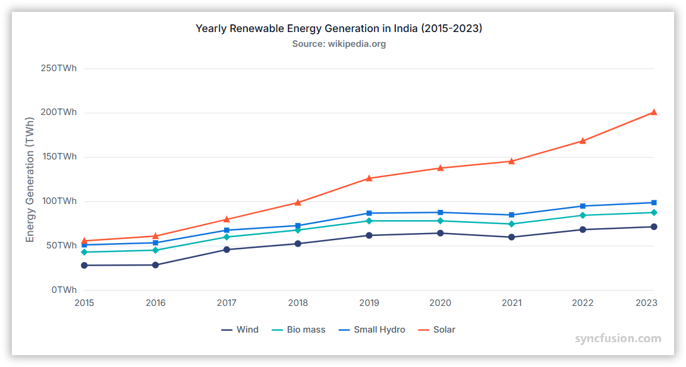

# Stacked Line Chart in Angular Charts

## Stacked Line

A stacked line chart displays multiple line series stacked on top of each other to show the cumulative total at each point.

 
Configure a stacked line series as follows:

1. **Set the series type**: Set the series [`type`](https://ej2.syncfusion.com/angular/documentation/api/chart/seriesDirective#type) to `StackingLine`. Use `StackingLine100` to render a 100% stacked line chart.
2. **Register the service**: Register `StackingLineSeriesService` (and any required axis services) in the module `providers` array, or in `ApplicationConfig.providers` for standalone applications. Confirm that `ChartModule` is imported.
3. **Bind the data**: Add at least two `<e-series>` entries that share the same `type`. Bind each entry to the data via [`dataSource`](https://ej2.syncfusion.com/angular/documentation/api/chart/seriesDirective#datasource), and assign a different [`xName`](https://ej2.syncfusion.com/angular/documentation/api/chart/seriesDirective#xname) / [`yName`](https://ej2.syncfusion.com/angular/documentation/api/chart/seriesDirective#yname) pair so each series contributes a separate value to the stack.














  


## Series customization

Customize a stacked line series using the following properties.

### Solid color

Use the [`fill`](https://ej2.syncfusion.com/angular/documentation/api/chart/seriesDirective#fill) property to set a single solid stroke color. Accepted values are CSS color names (for example, `blue`), hexadecimal strings (for example, `#1A75FF`), and `rgba(...)` strings. To color several series independently, set a different `fill` per `<e-series>` element.

















### Gradient color

The [`fill`](https://ej2.syncfusion.com/angular/documentation/api/chart/seriesDirective#fill) property can reference an SVG gradient. Define each gradient in an SVG `<defs>` element and assign it in the `url(#gradientId)` format.

















### Opacity

Use the [`opacity`](https://ej2.syncfusion.com/angular/documentation/api/chart/seriesDirective#opacity) property to control line transparency. Set a value from `0` to `1`.

















### Dash array

Use the [`dashArray`](https://ej2.syncfusion.com/angular/documentation/api/chart/seriesDirective#dasharray) property to define the line stroke's dash pattern. Provide a comma or whitespace-separated list of stroke-gap sizes in pixels, for example `"5,5"`, `"2,2,10,2"`, or `"4 4"`.

















### Width

Use the [`width`](https://ej2.syncfusion.com/angular/documentation/api/chart/seriesDirective#width) property to set the line stroke width in pixels.

















## Empty points

A data point whose mapped value is `null` or `undefined` is empty. Configure its behavior with [`emptyPointSettings.mode`](https://ej2.syncfusion.com/angular/documentation/api/chart/emptyPointSettingsModel#mode).

### Mode

Use [`mode`](https://ej2.syncfusion.com/angular/documentation/api/chart/emptyPointSettingsModel#mode) to control empty-point rendering. The default is `Gap`.

| Mode      | Visual behavior |
|-----------|-----------------|
| `Gap`     | Leave a gap at the empty position and continue the stack through the next available point. |
| `Zero`    | Treat the empty point as `0` and connect it. |
| `Drop`    | Drop the line segment; subsequent points are still rendered. |
| `Average` | Replace the empty value with the average of the surrounding points. |

















### Empty-point fill

Use the [`emptyPointSettings.fill`](https://ej2.syncfusion.com/angular/documentation/api/chart/emptyPointSettingsModel#fill) property to customize the fill color of empty points.

















### Empty-point border

Use the [`emptyPointSettings.border`](https://ej2.syncfusion.com/angular/documentation/api/chart/emptyPointSettingsModel#border) property to customize the width and color of a rendered empty point's border.

















## Stack labels

Stacked charts can display cumulative totals directly on the chart using [`stackLabels`](https://ej2.syncfusion.com/angular/documentation/api/chart/chartModel#stacklabels). When a stacked point has negative values, the stack labels render below the point.

















### Stack labels customization

Stack labels have the following [`stackLabelSettings`](https://ej2.syncfusion.com/angular/documentation/api/chart/stackLabelSettings) properties for customization:

| Property | Behavior | Default |
|----------|----------|---------|
| [`visible`](https://ej2.syncfusion.com/angular/documentation/api/chart/stackLabelSettings#visible) | Specifies whether stack labels are visible. Setting to `true` will display the labels. | `false` |
| [`fill`](https://ej2.syncfusion.com/angular/documentation/api/chart/stackLabelSettings#fill) | Defines the background color of the stack labels. Accepts valid CSS color strings (hex, RGBA, etc.). | `transparent` |
| [`format`](https://ej2.syncfusion.com/angular/documentation/api/chart/stackLabelSettings#format) | Formats the text displayed in the stack labels. Supports placeholders such as `{value}`. | `null` |
| [`angle`](https://ej2.syncfusion.com/angular/documentation/api/chart/stackLabelSettings#angle) | Specifies the rotation angle for stack labels in degrees. | `0` |
| [`rx`](https://ej2.syncfusion.com/angular/documentation/api/chart/stackLabelSettings#rx) | Defines the rounded corner radius along the X-axis (horizontal direction) for the stack label background. | `5` |
| [`ry`](https://ej2.syncfusion.com/angular/documentation/api/chart/stackLabelSettings#ry) | Defines the rounded corner radius along the Y-axis (vertical direction) for the stack label background. | `5` |
| [`margin`](https://ej2.syncfusion.com/angular/documentation/api/chart/stackLabelSettings#margin) | Configures the margin around the stack label (`left`, `right`, `top`, and `bottom`). | — |
| [`border`](https://ej2.syncfusion.com/angular/documentation/api/chart/stackLabelSettings#border) | Configures the appearance of the stack label's border. | — |
| [`font`](https://ej2.syncfusion.com/angular/documentation/api/chart/stackLabelSettings#font) | Customizes the stack label text, including font size, color, style, weight, and family. | — |

















## Events

### Series render

The [`seriesRender`](https://ej2.syncfusion.com/angular/documentation/api/chart#seriesrender) event allows you to customize series properties, such as `data`, `fill`, and `name`, before they are rendered on the chart. The callback receives an `ISeriesRenderEventArgs` argument that exposes mutable `series` and `data` properties.

```html
<ejs-chart (seriesRender)="onSeriesRender($event)"></ejs-chart>
```

















### Point render

The [`pointRender`](https://ej2.syncfusion.com/angular/documentation/api/chart#pointrender) event allows you to customize each data point before it is rendered on the chart. The callback receives an `IPointRenderEventArgs` argument that exposes the current `point`, `series`, `fill`, and `border`, plus a `cancel` flag.

```html
<ejs-chart (pointRender)="onPointRender($event)"></ejs-chart>
```

















## Troubleshooting

- **The stack does not appear**: Confirm that `StackingLineSeriesService` is registered, every series uses [`type`](https://ej2.syncfusion.com/angular/documentation/api/chart/seriesDirective#type) `StackingLine` (or `StackingLine100`), and that `xName` / `yName` map to valid fields.
- **Stack labels do not appear**: Confirm that `DataLabelService` is registered and that `stackLabels.visible` is set to `true`.
- **An empty point is missing**: Review `emptyPointSettings.mode` and verify that the mapped value is `null` or `undefined` (not `0` or `''`).
- **The `width` property has no effect**: Confirm that you are setting `width` on the `<e-series>` directive and not on `border.width`.

## See also

* [Data labels](../../../chart-elements/data-labels)
* [Tooltip](../../../chart-interactive/tool-tip)
* [Axis customization](../../../axis/axis-customization)
* [Data binding](../../../data-binding/working-with-data)
* [Legend](../../../chart-elements/legend)
