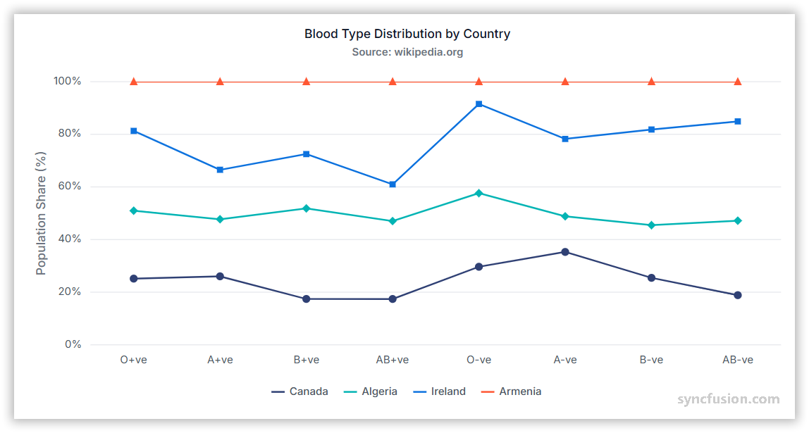

# 100% Stacked Line Chart in Angular Charts

## 100% Stacked Line

A 100% stacked line chart displays the relative percentage contribution of each series, with the total normalized to 100% at every point.



To render a [100% stacked line](https://www.syncfusion.com/angular-components/angular-charts/chart-types/100-stacked-line-chart) series in your chart, you need to follow a few steps to configure it correctly.

Here's a concise guide on how to do this:

1. **Set the series type**: Set the series [`type`](https://ej2.syncfusion.com/angular/documentation/api/chart/seriesDirective#type) to `StackingLine100`. The 100% stacked variant normalizes the stacked totals at each `x` value so that all series always sum to 100%.
2. **Register the service**: Register `StackingLineSeriesService` (and any required axis services) in the module `providers` array, or in `ApplicationConfig.providers` for standalone applications. Confirm that `ChartModule` is imported.
3. **Bind the data**: Add at least two `<e-series>` entries that share the same `type` but use *different* [`yName`](https://ej2.syncfusion.com/angular/documentation/api/chart/seriesDirective#yname) values. Each wrapper series contributes one slice of the 100% total at every data point.














  


## Series customization

Customize a 100% stacked line series using the following properties.

### Solid color

Use the [`fill`](https://ej2.syncfusion.com/angular/documentation/api/chart/seriesDirective#fill) property to set a single solid stroke color. Accepted values are CSS color names (for example, `blue`), hexadecimal strings (for example, `#1A75FF`), and `rgba(...)` strings. To color several series independently, set a different `fill` per `<e-series>` element.

















### Gradient color

The [`fill`](https://ej2.syncfusion.com/angular/documentation/api/chart/seriesDirective#fill) property can also reference an SVG gradient. Define each gradient in an SVG `<defs>` element and assign it in the `url(#gradientId)` format.

Place the following definitions in the application's `index.html` file, inside `<body>` and outside `<app-container>`.


<svg>
    <defs>
        <linearGradient id="gradient1">
            <stop offset="0%" style="stop-color:blue;stop-opacity:1" />
            <stop offset="50%" style="stop-color:violet;stop-opacity:1" />
        </linearGradient>
    </defs>
</svg>

<svg>
    <defs>
        <linearGradient id="gradient2">
            <stop offset="0%" style="stop-color:darkred;stop-opacity:1" />
            <stop offset="50%" style="stop-color:darkorange;stop-opacity:1" />
        </linearGradient>
    </defs>
</svg>

<svg>
    <defs>
        <linearGradient id="gradient3">
            <stop offset="0%" style="stop-color:darkmagenta;stop-opacity:1" />
            <stop offset="50%" style="stop-color:darkcyan;stop-opacity:1" />
        </linearGradient>
    </defs>
</svg>

<svg>
    <defs>
        <linearGradient id="gradient4">
            <stop offset="0%" style="stop-color:darkviolet;stop-opacity:1" />
            <stop offset="50%" style="stop-color:darkgoldenrod;stop-opacity:1" />
        </linearGradient>
    </defs>
</svg>


Set each series `fill` to `url(#gradient1)`, `url(#gradient2)`, … and so on.

















### Opacity

Use the [`opacity`](https://ej2.syncfusion.com/angular/documentation/api/chart/seriesDirective#opacity) property to control line transparency. Set a value from `0` to `1`.

















### Dash array

Use the [`dashArray`](https://ej2.syncfusion.com/angular/documentation/api/chart/seriesDirective#dasharray) property to define the line stroke's dash pattern. Provide a comma or whitespace-separated list of stroke-gap sizes in pixels, for example `"5,5"`, `"2,2,10,2"`, or `"4 4"`.

















### Width

Use the [`width`](https://ej2.syncfusion.com/angular/documentation/api/chart/seriesDirective#width) property to set the line stroke width in pixels.

















## Empty points

A data point whose mapped value is `null` or `undefined` is empty. Configure its behavior with [`emptyPointSettings.mode`](https://ej2.syncfusion.com/angular/documentation/api/chart/emptyPointSettingsModel#mode).

### Mode

Use [`mode`](https://ej2.syncfusion.com/angular/documentation/api/chart/emptyPointSettingsModel#mode) to control empty-point rendering. The default is `Gap`.

| Mode      | Visual behavior |
|-----------|-----------------|
| `Gap`     | Leave a gap at the empty position and continue the stack through the next available point. |
| `Zero`    | Treat the empty point as `0` and connect it. |
| `Drop`    | Drop the line segment; subsequent points are still rendered. |
| `Average` | Replace the empty value with the average of the surrounding points. |

















### Empty-point fill

Use the [`emptyPointSettings.fill`](https://ej2.syncfusion.com/angular/documentation/api/chart/emptyPointSettingsModel#fill) property to customize the fill color of empty points.

















### Empty-point border

Use the [`emptyPointSettings.border`](https://ej2.syncfusion.com/angular/documentation/api/chart/emptyPointSettingsModel#border) property to customize the width and color of a rendered empty point's border.

















## Events

### Series render

The [`seriesRender`](https://ej2.syncfusion.com/angular/documentation/api/chart#seriesrender) event allows you to customize series properties, such as `data`, `fill`, and `name`, before they are rendered on the chart. The callback receives an `ISeriesRenderEventArgs` argument that exposes mutable `series` and `data` properties.

```html
<ejs-chart (seriesRender)="onSeriesRender($event)"></ejs-chart>
```

















### Point render

The [`pointRender`](https://ej2.syncfusion.com/angular/documentation/api/chart#pointrender) event allows you to customize each data point before it is rendered on the chart. The callback receives an `IPointRenderEventArgs` argument that exposes the current `point`, `series`, `fill`, and `border`, plus a `cancel` flag.

```html
<ejs-chart (pointRender)="onPointRender($event)"></ejs-chart>
```

















## Troubleshooting

- **All stacks collapse to a single value**: Verify each `<e-series>` references a different `yName`. If every series uses the same field, the stack will sum to that one value rather than accumulate across series.
- **The 100% normalization is missing**: Confirm that the series [`type`](https://ej2.syncfusion.com/angular/documentation/api/chart/seriesDirective#type) is exactly `StackingLine100` (not `StackingLine`).
- **An empty point is missing**: Review `emptyPointSettings.mode` and verify that the mapped value is `null` or `undefined` (not `0` or `''`).
- **The `width` property has no effect**: Confirm that you are setting `width` on the `<e-series>` directive and not on `border.width`.

## See also

* [Data labels](../../../chart-elements/data-labels)
* [Tooltip](../../../chart-interactive/tool-tip)
* [Axis customization](../../../axis/axis-customization)
* [Data binding](../../../data-binding/working-with-data)
* [Legend](../../../chart-elements/legend)