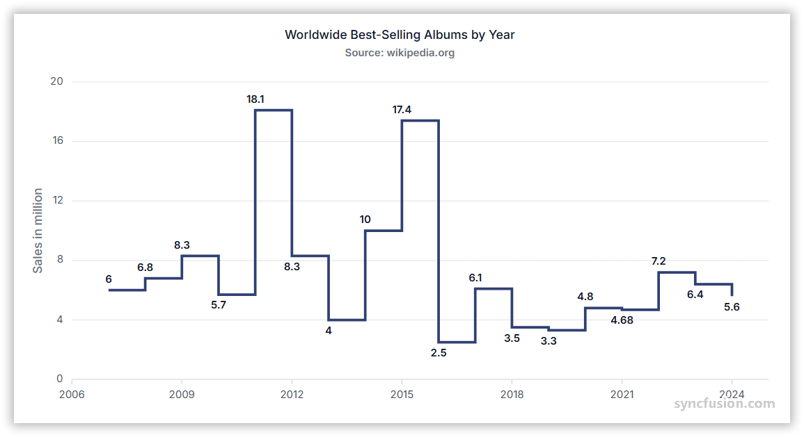

# Step Line Chart in Angular Charts

## Step Line

A step line chart displays data points connected by horizontal and vertical lines, creating a staircase-like pattern.



Configure a step line series as follows:

1. **Set the series type**: Set the series [`type`](https://ej2.syncfusion.com/angular/documentation/api/chart/seriesDirective#type) to `StepLine`.
2. **Register the service**: Register `StepLineSeriesService` (and any required axis services) in the module `providers` array, or in `ApplicationConfig.providers` for standalone applications. Confirm that `ChartModule` is imported.
3. **Map the data fields**: Bind the data with [`dataSource`](https://ej2.syncfusion.com/angular/documentation/api/chart/seriesDirective#datasource), and map fields with [`xName`](https://ej2.syncfusion.com/angular/documentation/api/chart/seriesDirective#xname) and [`yName`](https://ej2.syncfusion.com/angular/documentation/api/chart/seriesDirective#yname).














  


## Series customization

Customize a step line series using the following properties.

### Solid color

Use the [`fill`](https://ej2.syncfusion.com/angular/documentation/api/chart/seriesDirective#fill) property to set a single solid stroke color. Accepted values are CSS color names (for example, `blue`), hexadecimal strings (for example, `#1A75FF`), and `rgba(...)` strings.














  


### Gradient color

The [`fill`](https://ej2.syncfusion.com/angular/documentation/api/chart/seriesDirective#fill) property can also reference an SVG gradient. Define each gradient in an SVG `<defs>` element and assign it in the `url(#gradientId)` format.














  


### Opacity

Use the [`opacity`](https://ej2.syncfusion.com/angular/documentation/api/chart/seriesDirective#opacity) property to control step line transparency. Set a value from `0` (fully transparent) to `1` (fully opaque).














  


### Dash array

Use the [`dashArray`](https://ej2.syncfusion.com/angular/documentation/api/chart/seriesDirective#dasharray) property to define the step line's dash pattern. Provide a comma or whitespace-separated list of stroke-gap sizes in pixels (e.g. `"5,5"`, `"2,2,10,2"`, or `"4 4"`).














  


### Width

Use the [`width`](https://ej2.syncfusion.com/angular/documentation/api/chart/seriesDirective#width) property to set the step line stroke width in pixels.














  


### Step

The [`step`](https://ej2.syncfusion.com/angular/documentation/api/chart/seriesDirective#step) property controls where the vertical riser is positioned between two adjacent data points. Supported values are `Left`, `Center`, and `Right`. The default is `Left`.














  


### No risers

Use the [`noRisers`](https://ej2.syncfusion.com/angular/documentation/api/chart/seriesModel#norisers) property to render the step line without the vertical lines between points. Bind it as a boolean property (`[noRisers]="true"`).














  


## Empty points

A data point whose mapped value is `null` or `undefined` is empty. Configure its behavior with [`emptyPointSettings.mode`](https://ej2.syncfusion.com/angular/documentation/api/chart/emptyPointSettingsModel#mode).

### Mode

Use [`mode`](https://ej2.syncfusion.com/angular/documentation/api/chart/emptyPointSettingsModel#mode) to control empty-point rendering. The default is `Gap`.

| Mode      | Visual behavior |
|-----------|-----------------|
| `Gap`     | Leave a gap at the empty position and continue the staircase through the next available point. |
| `Zero`    | Treat the empty point as `0` and connect it. |
| `Drop`    | Drop the step segment; subsequent points are still rendered. |
| `Average` | Replace the empty value with the average of the surrounding points. |














  


### Empty-point fill

Use the [`emptyPointSettings.fill`](https://ej2.syncfusion.com/angular/documentation/api/chart/emptyPointSettingsModel#fill) property to customize the fill color of empty points.














  


### Empty-point border

Use the [`emptyPointSettings.border`](https://ej2.syncfusion.com/angular/documentation/api/chart/emptyPointSettingsModel#border) property to customize the width and color of a rendered empty point's border.














  


## Events

### Series render

The [`seriesRender`](https://ej2.syncfusion.com/angular/documentation/api/chart#seriesrender) event allows you to customize series properties, such as `data`, `fill`, and `name`, before they are rendered on the chart. The callback receives an `ISeriesRenderEventArgs` argument that exposes mutable `series` and `data` properties.

```html
<ejs-chart (seriesRender)="onSeriesRender($event)"></ejs-chart>
```














  


### Point render

The [`pointRender`](https://ej2.syncfusion.com/angular/documentation/api/chart#pointrender) event allows you to customize each data point before it is rendered on the chart. The callback receives an `IPointRenderEventArgs` argument that exposes the current `point`, `series`, `fill`, and `border`, plus a `cancel` flag.

```html
<ejs-chart (pointRender)="onPointRender($event)"></ejs-chart>
```














  


## Troubleshooting

The following symptoms map to the most common configuration issues.

- **The step line is not displayed**: Confirm that `StepLineSeriesService` is registered, the series [`type`](https://ej2.syncfusion.com/angular/documentation/api/chart/seriesDirective#type) is `StepLine`, and that `xName` / `yName` map to fields in the data source.
- **An empty point is missing**: Review `emptyPointSettings.mode` and verify that the mapped value is `null` or `undefined` (not `0` or `''`).
- **The `width` property has no effect**: Confirm that you are setting `width` on the `<e-series>` directive and not on `border.width`.
- **Risers remain visible despite `noRisers`**: Bind the property with brackets (`[noRisers]="true"`) so Angular treats it as a boolean; the string `'true'` is not coerced to a boolean in Angular templates.

## See also

* [Data labels](../../../chart-elements/data-labels)
* [Tooltip](../../../chart-interactive/tool-tip)
* [Axis customization](../../../axis/axis-customization)
* [Data binding](../../../data-binding/working-with-data)
* [Legend](../../../chart-elements/legend)