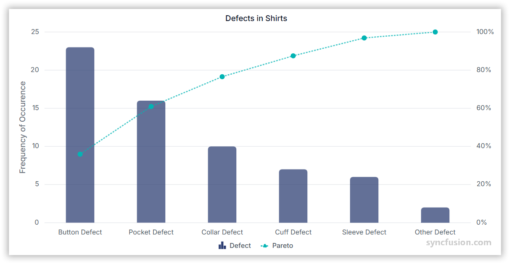

# Pareto Chart in Angular Charts

## Pareto

A Pareto chart ranks categorical data by frequency and overlays a cumulative percentage line. It is a combination of `Column` and `Line` series, where the bars represent individual category counts (sorted descending) and the line represents the running cumulative percentage.



To render a Pareto series in your chart, follow these steps to configure it correctly:

1. **Set the series type**: Define the series [`type`](https://ej2.syncfusion.com/angular/documentation/api/chart/seriesDirective#type) as **`Pareto`** in your chart configuration.

2. **Register the services**: Inject `ParetoSeriesService`, `LineSeriesService`, and `ColumnSeriesService` into the component `providers` array. For category-axis data also include `CategoryService`. These services power the line, column, and pareto sub-renderers that compose a Pareto series.

3. **Map the category and count data**: Bind the data through the series [`dataSource`](https://ej2.syncfusion.com/angular/documentation/api/chart/seriesDirective#datasource) property and map the category and value fields to [`xName`](https://ej2.syncfusion.com/angular/documentation/api/chart/seriesDirective#xname) and [`yName`](https://ej2.syncfusion.com/angular/documentation/api/chart/seriesDirective#yname). The chart sorts categories by `yName` in descending order by default.














  


## Pareto customization

Customize a Pareto series using the [`paretoOptions`](https://ej2.syncfusion.com/angular/documentation/api/chart/seriesDirective#paretooptions) object that exposes `fill`, `width`, `dashArray`, `marker`, and `showAxis` for the cumulative **line**, and standard column properties (`fill`, `width`, `columnWidth`, `cornerRadius`, `opacity`) for the **bars**.

### Fill

Use the [`paretoOptions.fill`](https://ej2.syncfusion.com/angular/documentation/api/chart/paretoOptionsModel#fill) property to apply a color to the Pareto line.














  


### Width

Use the [`paretoOptions.width`](https://ej2.syncfusion.com/angular/documentation/api/chart/paretoOptionsModel#width) property to control the thickness of the Pareto line, in pixels.














  


### Dash array

Use the [`paretoOptions.dashArray`](https://ej2.syncfusion.com/angular/documentation/api/chart/paretoOptionsModel#dasharray) property to apply a custom dash pattern (for example `"3,3"`) to the Pareto line.














  



### Marker

Use the [`paretoOptions.marker`](https://ej2.syncfusion.com/angular/documentation/api/chart/paretoOptionsModel#marker) object to display and customize markers on every Pareto line point. Set `visible: true`, and tune `width`, `height`, `isFilled`, and `shape`.














  


### Show axis

Use the [`paretoOptions.showAxis`](https://ej2.syncfusion.com/angular/documentation/api/chart/paretoOptionsModel#showaxis) boolean to show or hide the secondary value axis used for the cumulative percentage. Set `showAxis: false` to suppress the secondary axis.














  


## Empty points

A data point whose mapped value is `null` or `undefined` is empty. Configure its behavior with [`emptyPointSettings.mode`](https://ej2.syncfusion.com/angular/documentation/api/chart/emptyPointSettingsModel#mode). The cumulative line recalculates around empty bars according to the chosen mode.

### Mode

Use [`mode`](https://ej2.syncfusion.com/angular/documentation/api/chart/emptyPointSettingsModel#mode) to control empty-point rendering. The default is `Gap`.

| Mode | Visual behavior |
|------|-----------------|
| `Gap` | Skip the empty point; the cumulative line breaks at the gap. |
| `Drop` | Drop the empty bar; the cumulative line continues from the previous point. |
| `Zero` | Treat the empty point as `0` and render a flat bar. |
| `Average` | Replace the empty value with the average of the surrounding points. |














  


### Empty-point fill

Use the [`emptyPointSettings.fill`](https://ej2.syncfusion.com/angular/documentation/api/chart/emptyPointSettingsModel#fill) property to customize the fill color of empty bars.














  


### Empty-point border

Use the [`emptyPointSettings.border`](https://ej2.syncfusion.com/angular/documentation/api/chart/emptyPointSettingsModel#border) object (`{ width, color }`) to customize the outline of empty bars.














  


## Events

### Series render

The [`seriesRender`](https://ej2.syncfusion.com/angular/documentation/api/chart#seriesrender) event allows you to customize series properties, such as `data`, `fill`, and `name`, before they are rendered on the chart. The callback receives an `ISeriesRenderEventArgs` argument that exposes mutable `series`, `data`, and `fill` properties — assigning `args.fill` recolors the Pareto **bars** by default.

```html
<ejs-chart (seriesRender)="onSeriesRender($event)"></ejs-chart>
```














  


### Point render

The [`pointRender`](https://ej2.syncfusion.com/angular/documentation/api/chart#pointrender) event allows you to customize each data point before it is rendered on the chart. The callback receives an `IPointRenderEventArgs` argument that exposes the current `point`, `series`, `fill`, and `border`. On Pareto this affects the rendered bar color.

```html
<ejs-chart (pointRender)="onPointRender($event)"></ejs-chart>
```














  


## Troubleshooting

The following symptoms map to the most common configuration issues.

- **No chart is rendered**: Confirm that `ParetoSeriesService`, `LineSeriesService`, and `ColumnSeriesService` are all registered. For category-axis data also register `CategoryService`. The series [`type`](https://ej2.syncfusion.com/angular/documentation/api/chart/seriesDirective#type) must be `Pareto`.
- **Bars render but no cumulative line appears**: Verify `LineSeriesService` is in `providers` and that `paretoOptions` is not accidentally set to `undefined`.
- **Event handlers do not fire**: Confirm that `seriesRender` or `pointRender` are bound on the `<ejs-chart>` element, not on the `<e-series>`, and that the handler is a `public` method on the component.

## See also

* [Data labels](../../../chart-elements/data-labels)
* [Tooltip](../../../chart-interactive/tool-tip)
* [Axis customization](../../axis/axis-customization)
* [Data binding](../../data-binding/working-with-data)
* [Legend](../../../chart-elements/legend)
