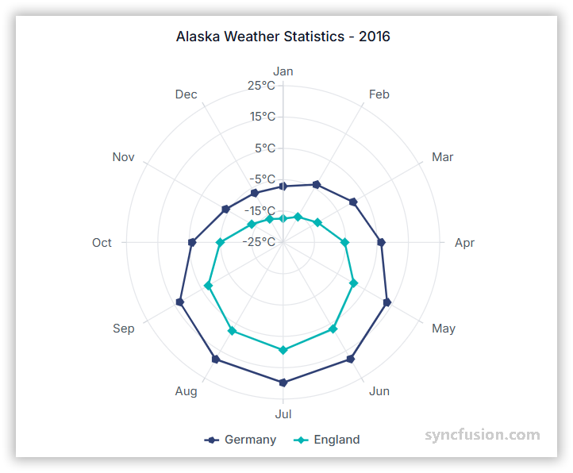

# Polar Chart in Angular Charts

## Polar

A polar chart plots data on a circular grid using angle and radius values. It is useful for visualizing cyclic data or comparing multivariate values.



To render a [polar](https://www.syncfusion.com/angular-components/angular-charts/chart-types/polar-chart) series in your chart, follow these steps to configure it correctly:

1. **Set the series type**: Define the series [`type`](https://ej2.syncfusion.com/angular/documentation/api/chart/seriesDirective#type) as **`Polar`** in your chart configuration. The optional `drawType` (default `Line`) controls the inner plotting style.

2. **Provide PolarSeriesService**: Inject the `PolarSeriesService` into the component `providers` array. For category-axis data also include `CategoryService`, and register the service that matches the chosen `drawType` (for example `LineSeriesService`, `SplineSeriesService`, `ColumnSeriesService`).

3. **Bind category and value data**: Bind data through the series [`dataSource`](https://ej2.syncfusion.com/angular/documentation/api/chart/seriesDirective#datasource) property and map the category and value fields to [`xName`](https://ej2.syncfusion.com/angular/documentation/api/chart/seriesDirective#xname) and [`yName`](https://ej2.syncfusion.com/angular/documentation/api/chart/seriesDirective#yname).














  


## Draw Types

Use the [`drawType`](https://ej2.syncfusion.com/angular/documentation/api/chart/seriesDirective#drawtype) property to change the series plotting style in a Polar chart to line, spline, area, stacking area, column, stacking column, range column, scatter, or spline area. The default value of `drawType` is `Line`. Each draw type requires the matching series service in `providers`.

### Line

Use `drawType='Line'` to render a polar line chart, with lines connecting each data point. The [`isClosed`](https://ej2.syncfusion.com/angular/documentation/api/chart/seriesDirective#isclosed) property determines whether the start and end points join to form a closed path. Default is `true`. Required service: `LineSeriesService`.














  


### Spline

Use `drawType='Spline'` to render a polar spline chart, with smooth curved lines connecting each data point. Required service: `SplineSeriesService`.














  


### Area

Use `drawType='Area'` to render a polar area chart, with filled areas below the connecting line. Required service: `AreaSeriesService`.














  


### Stacked Area

Use `drawType='StackingArea'` to render multiple areas stacked on top of each other. Required service: `StackingAreaSeriesService`. This draw type needs at least two `<e-series>` elements to demonstrate stacking.














  


### Column

Use `drawType='Column'` to render values as radial columns. Required service: `ColumnSeriesService`.














  


### Stacked Column

Use `drawType='StackingColumn'` to render multiple columns stacked on each category. Required service: `StackingColumnSeriesService`. This draw type needs at least two `<e-series>` elements to demonstrate stacking.














  


### Range Column

Use `drawType='RangeColumn'` to render columns that span a value range. Each data point must include `high` and `low` fields mapped to series properties of the same name. Required service: `RangeColumnSeriesService`.














  


### Scatter

Use `drawType='Scatter'` to render individual polar markers. Required service: `ScatterSeriesService`.














  


### Spline Area

Use `drawType='SplineArea'` to render a polar spline area chart with smooth curved fills. Required service: `SplineAreaSeriesService`.














  


## Series customization

### Start angle

Use the [`startAngle`](https://ej2.syncfusion.com/angular/documentation/api/chart/axis#startangle) property on `primaryXAxis` to rotate the angular axis. Default is `0` degrees.














  


### Radius

Use the [`coefficient`](https://ej2.syncfusion.com/angular/documentation/api/chart/axis#coefficient) property on `primaryXAxis` to adjust the radial extent of the polar chart. Default is `100`.














  


## Empty points

A data point whose mapped value is `null` or `undefined` is empty. Configure its behavior with [`emptyPointSettings.mode`](https://ej2.syncfusion.com/angular/documentation/api/chart/emptyPointSettingsModel#mode).

### Mode

Use [`mode`](https://ej2.syncfusion.com/angular/documentation/api/chart/emptyPointSettingsModel#mode) to control empty-point rendering. The default is `Gap`.

| Mode | Visual behavior |
|------|-----------------|
| `Gap` | Skip the empty point; the line breaks at the gap. |
| `Drop` | Drop the empty bar; subsequent segments are still rendered. |
| `Zero` | Treat the empty point as `0` and render a flat segment. |
| `Average` | Replace the empty value with the average of the surrounding points. |














  


### Empty-point fill

Use the [`emptyPointSettings.fill`](https://ej2.syncfusion.com/angular/documentation/api/chart/emptyPointSettingsModel#fill) property to customize the fill color of empty segments.














  


### Empty-point border

Use the [`emptyPointSettings.border`](https://ej2.syncfusion.com/angular/documentation/api/chart/emptyPointSettingsModel#border) object (`{ width, color }`) to customize the outline of empty segments.














  


## Events

### Series render

The [`seriesRender`](https://ej2.syncfusion.com/angular/documentation/api/chart#seriesrender) event allows you to customize series properties, such as `data`, `fill`, and `name`, before they are rendered on the chart. The callback receives an `ISeriesRenderEventArgs` argument that exposes mutable `series`, `data`, and `fill` properties.

```html
<ejs-chart (seriesRender)="onSeriesRender($event)"></ejs-chart>
```














  


### Point render

The [`pointRender`](https://ej2.syncfusion.com/angular/documentation/api/chart#pointrender) event allows you to customize each data point before it is rendered on the chart. The callback receives an `IPointRenderEventArgs` argument that exposes the current `point`, `series`, `fill`, and `border`.

```html
<ejs-chart (pointRender)="onPointRender($event)"></ejs-chart>
```














  


## Troubleshooting

The following symptoms map to the most common configuration issues.

- **Empty plot area**: Verify that `PolarSeriesService` is registered, the series [`type`](https://ej2.syncfusion.com/angular/documentation/api/chart/seriesDirective#type) is `Polar`, and the draw-type-specific service (for example `LineSeriesService`, `SplineSeriesService`, `ColumnSeriesService`) is also registered.
- **`startAngle` or `coefficient` has no effect**: They live on `primaryXAxis`, not on the series — Verify the property is set in the axis block, not on `<e-series>`.
- **Empty-point settings have no visual effect**: Confirm that `null` or `undefined` exists in the data values mapped to `yName`, and that `emptyPointSettings.mode` matches the desired behavior.
- **Event handlers do not fire**: Confirm that `seriesRender` or `pointRender` are bound on the `<ejs-chart>` element, not on the `<e-series>`, and that the handler is a `public` method on the component.

## See also

* [Data labels](../../../chart-elements/data-labels)
* [Tooltip](../../../chart-interactive/tool-tip)
* [Axis customization](../../axis/axis-customization)
* [Data binding](../../data-binding/working-with-data)
* [Legend](../../../chart-elements/legend)