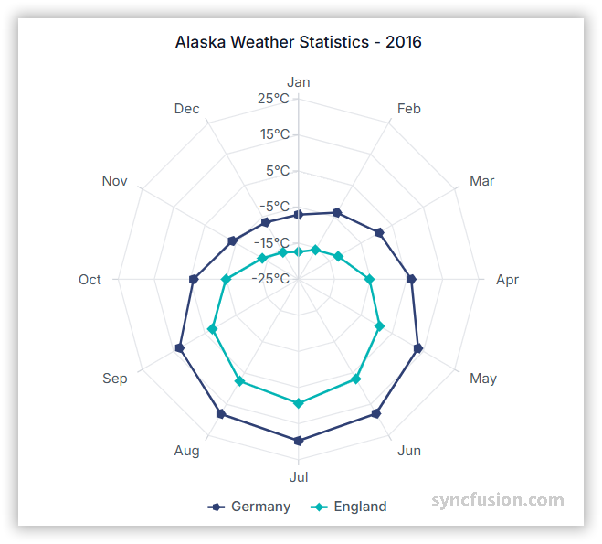

# Radar Chart in Angular Charts

## Radar

A radar chart displays values on multiple axes arranged radially around a center point. It compares multiple variables across categories in a star-shaped form.



To render a [radar](https://www.syncfusion.com/angular-components/angular-charts/chart-types/radar-chart) series in your chart, follow these steps to configure it correctly:

1. **Set the series type**: Define the series [`type`](https://ej2.syncfusion.com/angular/documentation/api/chart/seriesDirective#type) as **`Radar`** in your chart configuration. The optional `drawType` (default `Line`) controls the inner plotting style.

2. **Provide RadarSeriesService**: Inject the `RadarSeriesService` into the component `providers` array. For category-axis data also include `CategoryService`, and register the service that matches the chosen `drawType` (for example `LineSeriesService`, `SplineSeriesService`, `AreaSeriesService`).

3. **Bind category and value data**: Bind data through the series [`dataSource`](https://ej2.syncfusion.com/angular/documentation/api/chart/seriesDirective#datasource) property and map the category and value fields to [`xName`](https://ej2.syncfusion.com/angular/documentation/api/chart/seriesDirective#xname) and [`yName`](https://ej2.syncfusion.com/angular/documentation/api/chart/seriesDirective#yname). For radar charts, the chart maps `xName` to the angular axis and `yName` to the radial axis.

### Draw type

Use the [`drawType`](https://ej2.syncfusion.com/angular/documentation/api/chart/seriesDirective#drawtype) property to change the inner plotting style in a Radar chart to `Line`, `Column`, `Area`, `RangeColumn`, `Spline`, `Scatter`, `StackingArea`, `SplineArea`, or `StackingColumn`. Default is `Line`. Each draw type requires its matching service in `providers`.














  


## Series customization

### Start angle

You can customize the start angle of the radar series using the [`startAngle`](https://ej2.syncfusion.com/angular/documentation/api/chart/axis#startangle) property. By default, `startAngle` is 0 degree.














  


### Radius

Use the [`coefficient`](https://ej2.syncfusion.com/angular/documentation/api/chart/axis#coefficient) property on `primaryXAxis` to adjust the radial extent of the radar chart. Default is `100`.














  


## Empty points

A data point whose mapped value is `null` or `undefined` is empty. Configure its behavior with [`emptyPointSettings.mode`](https://ej2.syncfusion.com/angular/documentation/api/chart/emptyPointSettingsModel#mode). Be sure your data contains at least one `null` / `undefined` entry for the change to be visible.

### Mode

Use [`mode`](https://ej2.syncfusion.com/angular/documentation/api/chart/emptyPointSettingsModel#mode) to control empty-point rendering. The default is `Gap`.

| Mode | Visual behavior |
|------|-----------------|
| `Gap` | Skip the empty point; the line breaks at the gap. |
| `Drop` | Drop the empty point; subsequent segments are still rendered. |
| `Zero` | Treat the empty point as `0` and render a flat segment. |
| `Average` | Replace the empty value with the average of the surrounding points. |














  


### Empty-point fill

Use the [`emptyPointSettings.fill`](https://ej2.syncfusion.com/angular/documentation/api/chart/emptyPointSettingsModel#fill) property to customize the fill color of empty segments.














  


### Empty-point border

Use the [`emptyPointSettings.border`](https://ej2.syncfusion.com/angular/documentation/api/chart/emptyPointSettingsModel#border) object (`{ width, color }`) to customize the outline of empty segments.














  


## Events

### Series render

The [`seriesRender`](https://ej2.syncfusion.com/angular/documentation/api/chart#seriesrender) event allows you to customize series properties, such as `data`, `fill`, and `name`, before they are rendered on the chart. The callback receives an `ISeriesRenderEventArgs` argument that exposes mutable `series`, `data`, and `fill` properties.

```html
<ejs-chart (seriesRender)="onSeriesRender($event)"></ejs-chart>
```














  


### Point render

The [`pointRender`](https://ej2.syncfusion.com/angular/documentation/api/chart#pointrender) event allows you to customize each data point before it is rendered on the chart. The callback receives an `IPointRenderEventArgs` argument that exposes the current `point`, `series`, `fill`, and `border`.

```html
<ejs-chart (pointRender)="onPointRender($event)"></ejs-chart>
```














  


## Troubleshooting

The following symptoms map to the most common configuration issues.

- **No chart is rendered**: Verify that `RadarSeriesService` is registered, the series [`type`](https://ej2.syncfusion.com/angular/documentation/api/chart/seriesDirective#type) is `Radar`, and the draw-type-specific service (for example `LineSeriesService`, `SplineSeriesService`) is also registered.
- **`startAngle` or `coefficient` has no effect**: They live on `primaryXAxis`, not on the series — Verify the property is set in the axis block, not on `<e-series>`.
- **Empty-point settings have no visual effect**: Confirm that `null` or `undefined` exists in the data values mapped to `yName`, and that `emptyPointSettings.mode` matches the desired behavior.
- **Event handlers do not fire**: Confirm that `seriesRender` or `pointRender` are bound on the `<ejs-chart>` element, not on the `<e-series>`, and that the handler is a `public` method on the component.

## See also

* [Data labels](../../../chart-elements/data-labels)
* [Tooltip](../../../chart-interactive/tool-tip)
* [Axis customization](../../axis/axis-customization)
* [Data binding](../../data-binding/working-with-data)
* [Legend](../../../chart-elements/legend)