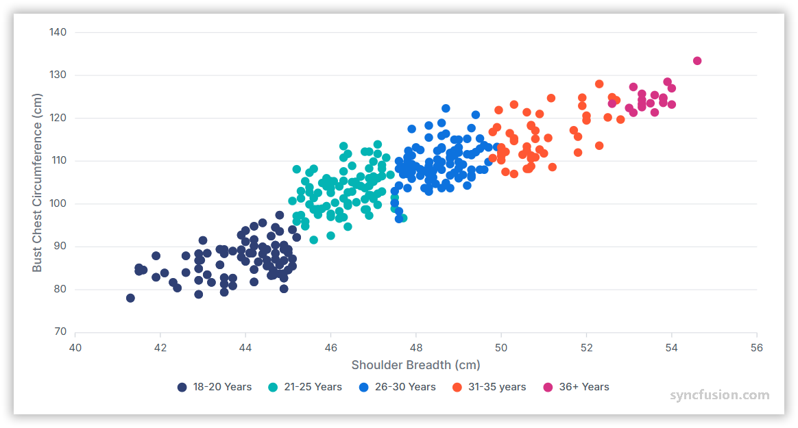

# Scatter Chart in Angular Charts

## Scatter

A scatter chart plots individual data points based on their x and y values, rendering a separate marker for each data point.

To render a [scatter](https://www.syncfusion.com/angular-components/angular-charts/chart-types/scatter-chart) series in your chart, you need to follow a few steps to configure it correctly. Here's a concise guide on how to do this:

1. **Set the series type**: Define the series [`type`](https://ej2.syncfusion.com/angular/documentation/api/chart/seriesDirective#type) as `Scatter` in your chart configuration. This indicates that the data should be displayed as individual points scattered across the chart.

2. **Provide ScatterSeriesService**: Inject the `ScatterSeriesService` into the component `providers` array. This is required for rendering scatter series.

3. **Bind datasource**: Bind data to the chart using the [`dataSource`](https://ej2.syncfusion.com/angular/documentation/api/chart/seriesDirective#datasource) property within the series configuration. To display the data correctly, map the fields from the data to the chart series [`xName`](https://ej2.syncfusion.com/angular/documentation/api/chart/seriesDirective#xname) and [`yName`](https://ej2.syncfusion.com/angular/documentation/api/chart/seriesDirective#yname) properties.













## Series customization

The following properties can be used to customize the `scatter` series.

### Fill

The [`fill`](https://ej2.syncfusion.com/angular/documentation/api/chart/seriesDirective#fill) property determines the color applied to the series.













### Opacity

The [`opacity`](https://ej2.syncfusion.com/angular/documentation/api/chart/seriesDirective#opacity) property specifies the transparency level of the fill. Adjusting this property allows you to control how opaque or transparent the fill color of the series appears.













### Shape

The [`shape`](https://ej2.syncfusion.com/angular/documentation/api/chart/markerSettingsModel#shape) property allows you to customize the appearance of the markers by specifying different shapes.













## Empty points

Data points with `null` or `undefined` values are considered empty. Empty data points are ignored and not plotted on the chart.

### Mode

Use the [`mode`](https://ej2.syncfusion.com/angular/documentation/api/chart/emptyPointSettingsModel#mode) property to define how empty or missing data points are handled in the series. The default mode for empty points is `Gap`.

| Mode | Description |
|------|-------------|
| `Gap` | Empty points are rendered as gaps, leaving the area empty. |
| `Drop` | Empty points are dropped, and the next point is connected to the previous point. |
| `Zero` | Empty points are considered as zero values. |
| `Average` | Empty points are replaced with the average value of the surrounding points. |

















### Fill

Use the [`fill`](https://ej2.syncfusion.com/angular/documentation/api/chart/emptyPointSettingsModel#fill) property to customize the fill color of empty points in the series.

















### Border

Use the [`border`](https://ej2.syncfusion.com/angular/documentation/api/chart/emptyPointSettingsModel#border) property to customize the width and color of the border for empty points.

















## Events

### Series render

The [`seriesRender`](https://ej2.syncfusion.com/angular/documentation/api/chart#seriesrender) event allows you to customize series properties, such as data, fill, and name, before they are rendered on the chart.

















### Point render

The [`pointRender`](https://ej2.syncfusion.com/angular/documentation/api/chart#pointrender) event allows you to customize each data point before it is rendered on the chart.

















## Troubleshooting

The following points explain common issues that may arise while configuring or rendering a scatter chart, along with their resolutions.

**Scatter points are not rendered**

The `ScatterSeriesService` is not registered in the component `providers` array. Add `ScatterSeriesService` to the `providers` array of the standalone component.

**Points fall on a single vertical line**

`xName` and `yName` are swapped, or `xName` is mapped to a non-numeric field. Verify that `xName` maps to a numeric field on the data record and that `yName` maps to the response variable.

**Empty-point styling is not applied**

`emptyPointSettings` is defined but not bound on the `<e-series>` element. Bind `[emptyPointSettings]='emptyPointSettings'` on the series and configure the `fill`, `border`, and `mode` properties.

**Markers render as the default circle regardless of `shape`**

`marker` is defined in the component class but not bound to `[marker]` on `<e-series>`. Bind `[marker]='marker'` on the series element.

## See also

* [Data label](../../../chart-elements/data-labels)
* [Tooltip](../../../chart-interactive/tool-tip)
