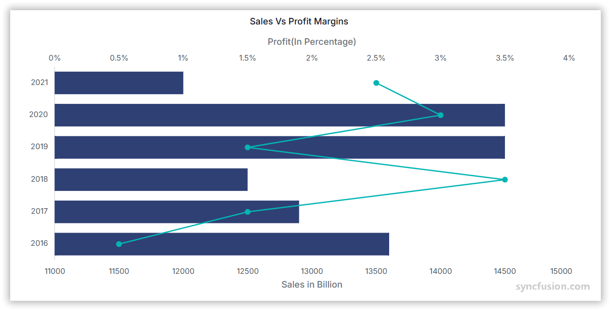

# Vertical Chart in Angular Charts



## Vertical Chart

To draw a chart in a vertical manner, change the orientation of the axes using the [`isTransposed`](https://ej2.syncfusion.com/angular/documentation/api/chart#istransposed) property. The property is supported by all series types and works with the `@syncfusion/ej2-angular-charts` package.

Configure a vertical chart as follows:

1. **Set the series type**: Define the series [`type`](https://ej2.syncfusion.com/angular/documentation/api/chart/seriesDirective#type) for the series you want to render vertically (the example below uses `Spline`).
2. **Register the service**: Register `SplineSeriesService` (and any required axis services) in the module `providers` array, or in `ApplicationConfig.providers` for standalone applications. Confirm that `ChartModule` is imported.
3. **Bind the data and apply the transpose flag**: Bind data with [`dataSource`](https://ej2.syncfusion.com/angular/documentation/api/chart/seriesDirective#datasource) and map the fields with [`xName`](https://ej2.syncfusion.com/angular/documentation/api/chart/seriesDirective#xname) and [`yName`](https://ej2.syncfusion.com/angular/documentation/api/chart/seriesDirective#yname). Add the `isTransposed='true'` attribute on the `<ejs-chart>` element to transpose the axes.

















## Empty points

A data point whose mapped value is `null` or `undefined` is empty. Configure its behavior with [`emptyPointSettings.mode`](https://ej2.syncfusion.com/angular/documentation/api/chart/emptyPointSettingsModel#mode).

### Mode

Use [`mode`](https://ej2.syncfusion.com/angular/documentation/api/chart/emptyPointSettingsModel#mode) to control empty-point rendering. The default is `Gap`.

| Mode      | Visual behavior |
|-----------|-----------------|
| `Gap`     | Skip the empty point; the remaining bars are still rendered. |
| `Zero`    | Treat the empty point as `0` and render a flat bar. |
| `Drop`    | Drop the empty bar; subsequent points are still rendered. |
| `Average` | Replace the empty value with the average of the surrounding points. |

















### Empty-point fill

Use [`emptyPointSettings.fill`](https://ej2.syncfusion.com/angular/documentation/api/chart/emptyPointSettingsModel#fill) to customize the fill color of empty-point bars.

















### Empty-point border

Use [`border`](https://ej2.syncfusion.com/angular/documentation/api/chart/emptyPointSettingsModel#border) to customize the width and color of the border for empty-point bars.

















## Events

### Series render

The [`seriesRender`](https://ej2.syncfusion.com/angular/documentation/api/chart#seriesrender) event allows you to customize series properties, such as `data`, `fill`, and `name`, before they are rendered on the chart. The callback receives an `ISeriesRenderEventArgs` argument that exposes mutable `series` and `data` properties.

```html
<ejs-chart (seriesRender)="onSeriesRender($event)"></ejs-chart>
```

















### Point render

The [`pointRender`](https://ej2.syncfusion.com/angular/documentation/api/chart#pointrender) event allows you to customize each data point before it is rendered on the chart. The callback receives an `IPointRenderEventArgs` argument that exposes the current `point`, `series`, `fill`, and `border`, plus a `cancel` flag.

```html
<ejs-chart (pointRender)="onPointRender($event)"></ejs-chart>
```

















## Troubleshooting

The following symptoms map to the most common configuration issues.

- **Series renders in the default orientation**: Confirm that the `isTransposed='true'` attribute is set on the `<ejs-chart>` element.
- **Empty-point styling is not applied**: Confirm that `[emptyPointSettings]='emptyPointSettings'` is bound on the `<e-series>` element and that `mode`, `fill`, and `border` are configured.
- **Provider error at runtime**: Confirm that the registered series service (for example, `SplineSeriesService`) matches the [`type`](https://ej2.syncfusion.com/angular/documentation/api/chart/seriesDirective#type) declared on the `<e-series>` element.

## See also

* [Data label](../../../chart-elements/data-labels)
* [Tooltip](../../../chart-interactive/tool-tip)
* [Legend](../../../chart-elements/legend)
* [Axis customization](../../axis/axis-customization)
* [Data binding](../../data-binding/working-with-data)
