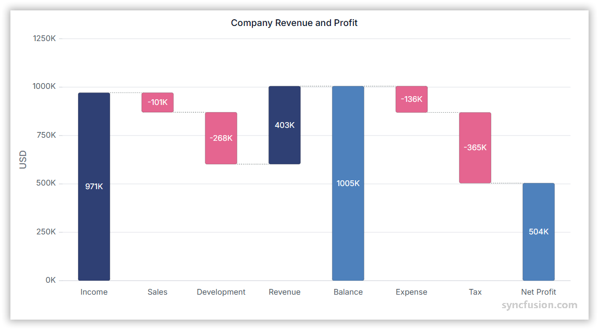

# Waterfall Chart in Angular Charts

## Waterfall Chart

A waterfall chart shows how an initial value changes step-by-step through additions and subtractions. It helps visualize running totals, such as profit breakdowns or budget changes.



Configure a waterfall series as follows:

1. **Set the series type**: Define the series [`type`](https://ej2.syncfusion.com/angular/documentation/api/chart/seriesDirective#type) as `Waterfall` in your chart configuration. The waterfall series illustrates the cumulative effect of sequentially introduced positive and negative values.
2. **Register the service**: Register `WaterfallSeriesService` (and any required axis services) in the module `providers` array, or in `ApplicationConfig.providers` for standalone applications. Confirm that `ChartModule` is imported.
3. **Configure sums and bind data**: Bind data with [`dataSource`](https://ej2.syncfusion.com/angular/documentation/api/chart/seriesDirective#datasource), map the fields with [`xName`](https://ej2.syncfusion.com/angular/documentation/api/chart/seriesDirective#xname) and [`yName`](https://ej2.syncfusion.com/angular/documentation/api/chart/seriesDirective#yname), and configure [`intermediateSumIndexes`](https://ej2.syncfusion.com/angular/documentation/api/chart/seriesDirective#intermediatesumindexes) and [`sumIndexes`](https://ej2.syncfusion.com/angular/documentation/api/chart/seriesDirective#sumindexes) to mark intermediate and cumulative totals.

















## Series customization

Customize a waterfall series using the following properties.

### Negative and summary colors

Use [`negativeFillColor`](https://ej2.syncfusion.com/angular/documentation/api/chart/seriesDirective#negativefillcolor) to color negative (downward) changes, and [`summaryFillColor`](https://ej2.syncfusion.com/angular/documentation/api/chart/seriesDirective#summaryfillcolor) to color summary totals. By default, `negativeFillColor` is `#C64E4A` and `summaryFillColor` is `#4E81BC`.

















### Corner radius

Use [`cornerRadius`](https://ej2.syncfusion.com/angular/documentation/api/chart/series#cornerradius) to round the corners of every waterfall bar. Configure each corner individually with the `topLeft`, `topRight`, `bottomLeft`, and `bottomRight` properties.

```ts
this.cornerRadius = { topLeft: 8, topRight: 8, bottomLeft: 0, bottomRight: 0 };
```

















## Empty points

A data point whose mapped value is `null` or `undefined` is empty. Configure its behavior with [`emptyPointSettings.mode`](https://ej2.syncfusion.com/angular/documentation/api/chart/emptyPointSettingsModel#mode).

### Mode

Use [`mode`](https://ej2.syncfusion.com/angular/documentation/api/chart/emptyPointSettingsModel#mode) to control empty-point rendering. The default is `Gap`.

| Mode      | Visual behavior |
|-----------|-----------------|
| `Gap`     | Skip the empty point; subsequent bars are still rendered. |
| `Zero`    | Treat the empty point as `0` and render a flat bar. |
| `Drop`    | Drop the empty bar; subsequent points are still rendered. |
| `Average` | Replace the empty value with the average of the surrounding points. |

















### Empty-point fill

Use [`emptyPointSettings.fill`](https://ej2.syncfusion.com/angular/documentation/api/chart/emptyPointSettingsModel#fill) to customize the fill color of empty-point bars.

















### Empty-point border

Use [`border`](https://ej2.syncfusion.com/angular/documentation/api/chart/emptyPointSettingsModel#border) to customize the width and color of the border for empty-point bars.

















## Events

### Series render

The [`seriesRender`](https://ej2.syncfusion.com/angular/documentation/api/chart#seriesrender) event allows you to customize series properties, such as `data`, `fill`, and `name`, before they are rendered on the chart. The callback receives an `ISeriesRenderEventArgs` argument that exposes mutable `series` and `data` properties.

```html
<ejs-chart (seriesRender)="onSeriesRender($event)"></ejs-chart>
```

















### Point render

The [`pointRender`](https://ej2.syncfusion.com/angular/documentation/api/chart#pointrender) event allows you to customize each data point before it is rendered on the chart. The callback receives an `IPointRenderEventArgs` argument that exposes the current `point`, `series`, `fill`, and `border`, plus a `cancel` flag. You can also use this event for per-point corner radius.

```html
<ejs-chart (pointRender)="onPointRender($event)"></ejs-chart>
```

















#### Point corner radius

Use the `pointRender` event to apply [`cornerRadius`](https://ej2.syncfusion.com/angular/documentation/api/chart/iPointRenderEventArgs) for individual points. This is useful when only certain points (for example, summary bars) should have rounded corners.

















## Troubleshooting

The following symptoms map to the most common configuration issues.

- **Bars do not render as waterfall steps**: Confirm that `WaterfallSeriesService` is registered, the series [`type`](https://ej2.syncfusion.com/angular/documentation/api/chart/seriesDirective#type) is `Waterfall`, and that `intermediateSumIndexes` and `sumIndexes` reference valid indexes in `data`.
- **All bars use the same color**: Verify that `negativeFillColor` and `summaryFillColor` are set and that the data includes at least one negative value.
- **Empty-point styling is not applied**: Confirm that `[emptyPointSettings]='emptyPointSettings'` is bound on the `<e-series>` element and that `mode`, `fill`, and `border` are configured.
- **Corner radius has no effect**: Confirm that `[cornerRadius]='cornerRadius'` is bound on `<e-series>` (not on `<ejs-chart>`) and that the property names match `topLeft`, `topRight`, `bottomLeft`, and `bottomRight`.

## See also

* [Data label](../../../chart-elements/data-labels)
* [Tooltip](../../../chart-interactive/tool-tip)
* [Legend](../../../chart-elements/legend)
* [Axis customization](../../axis/axis-customization)
* [Data binding](../../data-binding/working-with-data)
