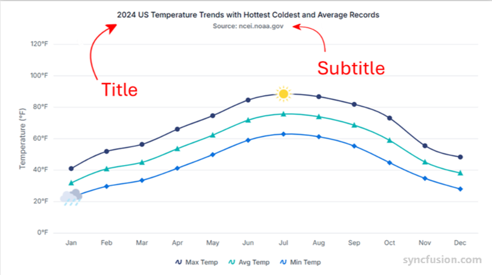

# Title and Subtitle in Angular Chart

Chart titles and subtitles help provide context for the visualized data. The title typically indicates the main subject or metric represented in the chart, while the subtitle adds supporting details such as data sources, time ranges, or explanatory notes. Both elements can be customized in terms of position, alignment, and style to match application design requirements.

## Chart title

Add a chart title using the [`title`](https://ej2.syncfusion.com/angular/documentation/api/chart/chartModel#title) property. The title appears at the top of the chart by default and describes the purpose or subject of the visualization.










  


### Title position

Use the [`position`](https://ej2.syncfusion.com/angular/documentation/api/chart/titleSettingsModel#position) property within [`titleStyle`](https://ej2.syncfusion.com/angular/documentation/api/chart/chartModel#titlestyle) to place the title at the left, right, top, or bottom of the chart. Valid values are `Top` (default), `Bottom`, `Left`, `Right`, and `Custom`.

#### Named positions

The following example positions the title at the bottom of the chart.










  


#### Custom position

To manually position the title anywhere within the chart, set `position` to `'Custom'` and use the [`x`](https://ej2.syncfusion.com/angular/documentation/api/chart/titleSettingsModel#x) and [`y`](https://ej2.syncfusion.com/angular/documentation/api/chart/titleSettingsModel#y) properties. The values are in pixels and are measured from the top-left corner of the chart area.










  


### Title alignment

Align the chart title using the [`textAlignment`](https://ej2.syncfusion.com/angular/documentation/api/chart/titleSettingsModel#textalignment) property. Valid values are `Near`, `Center` (default), and `Far`. When the title is positioned at `Top` or `Bottom`, the alignment is horizontal; when positioned at `Left` or `Right`, the alignment is vertical.










  


### Title styling

Customize the title's appearance using the [`titleStyle`](https://ej2.syncfusion.com/angular/documentation/api/chart/chartModel#titlestyle) property. Supported options include `size` (default `15px`), `color`, `fontFamily`, `fontWeight` (default `500`), `fontStyle` (default `Normal`), `opacity` (default `1`), `background`, `border`, and `accessibility`. The `textOverflow` option accepts `Wrap` (default), `Trim`, or `None`; use `Wrap` to wrap the text when the title exceeds the available width. For `textAlignment`, see [Title alignment](#title-alignment).










  


## Chart subtitle

Add a subtitle to the chart using the [`subTitle`](https://ej2.syncfusion.com/angular/documentation/api/chart/chartModel#subtitle) property. Subtitles help provide additional context such as descriptions, notes, or supporting information related to the chart data. The subtitle is rendered just below the main title.

### Subtitle styling

Style the subtitle with the [`subTitleStyle`](https://ej2.syncfusion.com/angular/documentation/api/chart/chartModel#subtitlestyle) property, which supports the same options as `titleStyle`: `size`, `color`, `fontFamily`, `fontWeight`, `fontStyle`, `opacity`, `background`, `border`, `accessibility`, `textAlignment`, and `textOverflow`. You can also set `position` to `Top`, `Bottom`, `Left`, `Right`, or `Custom` to control the subtitle placement independently of the title.










  


## Troubleshooting

- **Title or subtitle not visible** — Confirm the text was assigned to the `title` or `subTitle` input and that the chart element is inside a rendered component. Set `titleStyle.color` to a value that contrasts with the chart background.
- **Custom position has no effect** — `position: 'Custom'` only applies when both `x` and `y` are set; values are in pixels relative to the chart area, not the page.
- **`textOverflow: 'Trim'` cuts off text unexpectedly** — Provide a wider `width` on the chart, set `size` to a smaller value, or use `textOverflow: 'Wrap'` together with a sufficient chart height.
- **Standalone component does not render the chart** — Ensure `ChartModule` is added to the component's `imports` array and that the relevant series service (for example, `LineSeriesService` or `StepLineSeriesService`) is in `providers`.

## See also

- [Chart overview](./chart-overview)
- [Appearance](./appearance)
- [Accessibility](./accessibility)
- [Chart API reference](https://ej2.syncfusion.com/angular/documentation/api/chart/)