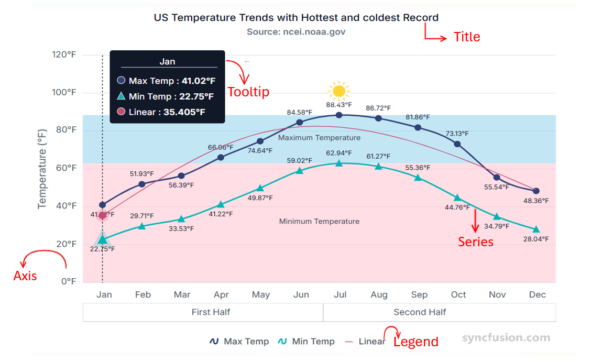

# Understanding the Chart in Angular Chart

The [Angular Charts](https://www.syncfusion.com/angular-components/angular-charts) component is a versatile visualization tool that presents data using a wide range of graphical formats. Each chart is composed of essential elements—such as the title, series, axes, legend, tooltip, data labels, markers, annotations, trendlines, striplines, and more—that work together to provide clear, interactive, and meaningful insights. Understanding these elements helps in configuring and customizing charts for various analytical needs.

The following image highlights the primary elements of a chart:

## Title

The chart title conveys the overall purpose or subject of the visualization. It typically appears at the top of the chart and can be customized in terms of alignment, style, and formatting.  
For more details, see the [Title and Subtitle](./title-subtitle) section.

## Series

A series represents a group of data points plotted on the chart. Charts can include one or more series depending on the scenario, and each series can use different chart types such as line, column, area, bar, scatter, bubble, polar, radar, or other supported visualizations.  
For more details, see the [Series](./series/series-types/line-types/line) section.

## Axes

Axes organize and scale chart data.

### Cartesian axes

Standard rectangular (Cartesian) charts include a horizontal x-axis (for independent or category values) and a vertical y-axis (for dependent or numeric values). Cartesian axes support tick labels, gridlines, ranges, and formatting such as numeric or datetime label formats. For more details, see the [Chart Axis](./chart-axis) section.

### Polar & Radar axes

[Polar](./series/series-types/polar) and [radar](./series/series-types/radar) charts use radial and angular axes. A radial axis measures distance from the chart center, while an angular axis defines the angular position or category around the circle.

## Legend

The legend identifies each series in the chart, making it easier for users to understand dataset distinctions. It also supports toggling the visibility of individual series to facilitate interactive data exploration.  
For more details, see the [Legend](./chart-elements/legend) section.

## Tooltip

Tooltips display helpful information when users hover over a data point or series. They offer interactive and contextual insights, such as exact values or additional metadata, and can be customized to match the design or analytical needs of the application.  
For more details, see the [Tooltip](./chart-interactive/tool-tip) section.

## Data label

Data labels display the value of a data point directly on the chart, improving readability without requiring users to hover or refer to the axes.  
For more details, see the [Data Labels](./chart-elements/data-labels) section.

## Marker

Markers use symbols to denote individual data points on a series, making them easier to identify, especially on line, scatter, and bubble charts.  
For more details, see the [Markers](./chart-elements/data-markers) section.

## Annotation

Annotations allow placement of custom text, shapes, or images at specific coordinates to highlight insights or call out important data points.  
For more details, see the [Annotations](./chart-elements/chart-annotations) section.

## Trendline

Trendlines add fitted lines (such as linear, exponential, or moving average) to a series to illustrate overall patterns or directional trends in the data.  
For more details, see the [Trendlines](./chart-elements/trend-lines) section.

## Stripline

Striplines highlight specific axis ranges with bands and labels to emphasize thresholds, target zones, or important periods.  
For more details, see the [Stripline](./chart-elements/strip-line) section.

## See also

* [Getting Started with Angular Chart](./getting-started)
* [Chart Dimensions](./chart-dimensions)
* [Chart Appearance](./appearance)
* [Chart API reference](https://ej2.syncfusion.com/angular/documentation/api/chart/)