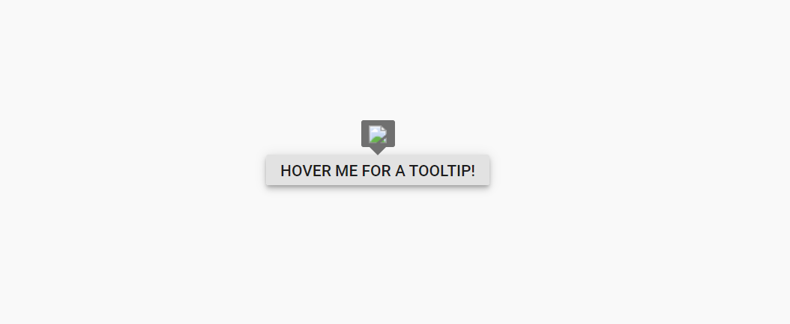
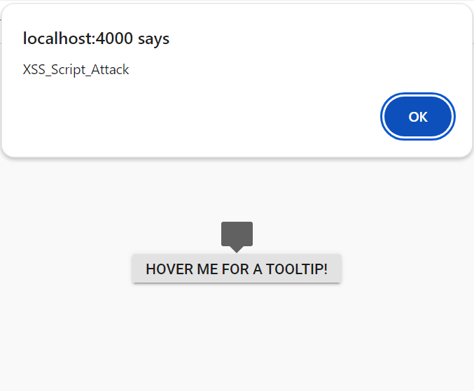

#  Syncfusion Angular Components - Security

Security is paramount in web application development to guard against various threats and vulnerabilities. Essential practices include using HTTPS for data encryption, validating and sanitizing user inputs, and implementing robust authentication measures such as multi-factor authentication.

Syncfusion Angular components are engineered with these critical security measures in mind, integrating seamlessly with Angular's built-in security features.

* [Security in Angular](https://v17.angular.io/guide/security)

## Security Vulnerabilities

Security vulnerabilities in web applications arise from weaknesses in the design, implementation, or configuration, potentially compromising the resources and data. Below are some common vulnerabilities:
* [Cross-Site Scripting](https://developer.mozilla.org/en-US/docs/Glossary/Cross-site_scripting) - XSS is a security vulnerability that can occur in web applications. These scripts can steal session cookies, redirect users to malicious websites, or deface the website. XSS vulnerabilities typically arise when the application fails to properly validate or encode user-supplied input before rendering it in the browser.

* [Cross-Site Request Forgery](https://developer.mozilla.org/en-US/docs/Glossary/CSRF) - CSRF is a type of web security vulnerability that allows an attacker to force a logged-in user to perform actions on a web application without their consent or knowledge. CSRF attacks exploit the trust that a web application has in the user's browser by tricking it into sending unauthorized requests to the vulnerable application.

* Injection Attacks - These occur when an attacker injects malicious code (such as SQL injection, XML injection, or command injection) into input fields or parameters of a web application. If the application does not properly sanitize or validate user inputs, it can execute unintended commands or gain unauthorized access to sensitive data.

Syncfusion Angular components support the implementation of secure web applications by addressing these vulnerabilities.
## Security Considerations

Security should be a foundational aspect of software development. Syncfusion adheres to comprehensive security protocols in the development of Angular components, focusing on the following aspects:
* [Content Security Policy](#content-security-policy)
* [HTML Sanitizer](#html-sanitizer)
* [Browser Storage](#browser-storage)

### Content Security Policy

[Content Security Policy](https://developer.mozilla.org/en-US/docs/Web/HTTP/CSP) (CSP) is a one of the security feature, that helps the detect the cross-site-scripting(XSS) attacks and malicious code injection. It will throw the errors and warnings while using the inline-styles and inline scripts, eval, new Function, etc in your applications.

To implement Content Security Policy (CSP) in your application, include a `<meta>` tag with specified CSP directives. Syncfusion Angular components have been designed and implemented with adherence to these CSP directives, ensuring enhanced security. These directives are below.

#### CSP Directives

For using Syncfusion Angular components effectively, the following directives are advised:
|    Directives    |    Description    |    Examples    |
|------------------|-------------------|----------------|
|  `style-src`  | Defines the allowed sources for loading stylesheets. This helps mitigate style-based attacks by restricting the locations from which styles can be applied. | `style-src 'self' https://cdn.syncfusion.com/ https://fonts.googleapis.com/ 'unsafe-inline';`|
|  `font-src`  | Defines the allowed sources for loading fonts. It helps prevent font-related security issues by restricting the locations from which fonts can be loaded. | `font-src 'self' https://fonts.googleapis.com/ https://fonts.gstatic.com/ data: cdn.syncfusion.com 'unsafe-inline';` |
|  `img-src`  | Specifies the allowed sources for loading images. It helps control from where images can be displayed on the web page. | `img-src 'self' data:"` |

> Utilizing a web worker within the Spreadsheet Control for exporting necessitates the addition of a specific directive to ensure proper functionality during the export process.
`worker-src 'self' 'unsafe-inline' * blob:;`

#### CSP Sources

The following sources refer to the origins from which resources such as styles, images, fonts are allowed to be loaded and executed on a web page.

|  Source  |  Description  | Examples  |
|----------|---------------|-----------|
|  `self`  |  Refers to the origin from which the protected document is being served, including the same URL scheme and port number  |  `style-src 'self'`  |
|  `data`  | Enables a website to fetch resources using the data scheme, such as loading Base64-encoded images.  |  `img-src 'self' data:`  |
|  `unsafe-inline`  | Allows the use of inline resources, such as inline `style` elements.  |  `style-src 'self' https://fonts.googleapis.com/ 'unsafe-inline'`  |

To know more information about the CSP, refer this [documentation](https://ej2.syncfusion.com/documentation/common/troubleshoot/content-security-policy).

### HTML Sanitizer

An HTML sanitizer removes potentially harmful code from HTML documents, preventing XSS attacks by eliminating malicious code like script tags or inline styles.

Syncfusion ensures security by offering the [enableHtmlSanitizer](https://ej2.syncfusion.com/angular/documentation/api/button#enablehtmlsanitizer) API. It sanitizes HTML strings, reducing potential threats.

The `enableHtmlSanitizer` property, when enabled, ensures content undergoes rigorous sanitization to mitigate XSS risks, strengthening component security.

Here is a sample code to sanitize input values using Syncfusion:

```ts
import { SanitizeHtmlHelper } from '@syncfusion/ej2-base';

let html: string = '<script>alert("XSS");</script>';

let sanitizedHtml: string = SanitizeHtmlHelper.sanitize(html);
```

When `enableHtmlSanitizer` is `true`, the content will be sanitized and displays the code.



When `enableHtmlSanitizer` is `false` or not included this property, the malicious code will be interpreted as script, and the alert pop-up window will be open.












  


### Browser Storage

Browser storage refers to the mechanisms provided by web browsers to store data locally on a user's device. Syncfusion Angular components utilize the following storage options only.

* Local Storage

#### Local Storage

[Local Storage](https://developer.mozilla.org/en-US/docs/Web/API/Web_Storage_API) allows persistent data storage on client devices using key-value pairs, accessible through Angular. Syncfusion uses local storage only when persistence is enabled.