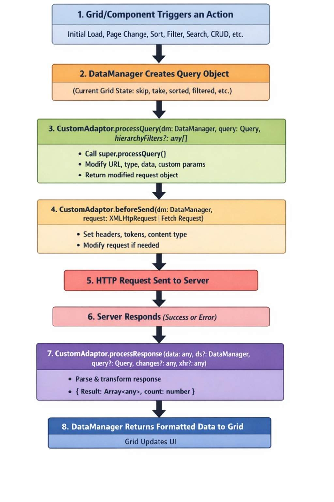

# Custom Remote Data Binding in Syncfusion Angular Components

The Custom Adaptor is a powerful extension mechanism that **customizes any existing adaptor** ([UrlAdaptor](./url-adaptor), [WebApiAdaptor](./webapi-adaptor), [ODataV4Adaptor](./odatav4-adaptor), [GraphQLAdaptor](./graphql-adaptor)) to meet specific application requirements. Instead of creating an entirely new adaptor from scratch, Custom Adaptor extends and modifies the behavior of existing adaptors by intercepting and customizing HTTP requests and responses.

## What is Custom Adaptor?

Custom Adaptor is not a standalone adaptor, it's a way to extend and customize existing Syncfusion<sup style="font-size:70%">&reg;</sup> adaptors (`UrlAdaptor`, `ODataV4Adaptor`, `WebApiAdaptor`, `GraphQLAdaptor`) by overriding their default behavior. 

The Custom Adaptor acts as a middleware layer between Syncfusion<sup style="font-size:70%">&reg;</sup> Angular components and the chosen adaptor (such as `UrlAdaptor`, `ODataV4Adaptor`, `WebApiAdaptor`, or `GraphQLAdaptor`). Its purpose is to customize the default HTTP request and response handling with custom logic. By intercepting the data flow, it allows overriding, adjusting, or extending behavior at specific points. This design makes it possible to control how data is fetched, processed, and returned while continuing to use the built‑in features of existing adaptors, avoiding the need to create a new adaptor from scratch.



## Why use Custom Adaptor?

Custom Adaptor is designed for scenarios where the built‑in DataManager adaptors are almost sufficient but require specific adjustments. It provides a way to extend existing adaptor logic without rewriting it entirely.

Typical use cases include:
- API requires authentication headers that change dynamically.
- API endpoint URLs need modification based on roles or environments.
- Response data needs transformation before displaying in Grid.
- Need to add calculated fields (serial numbers, computed values).
- API returns data in non-standard format that needs conversion.
- Multiple API environments (dev/staging/prod) with different URLs.
- Need to log requests/responses for debugging.
- Custom error handling beyond standard adaptor capabilities.

> The Custom adaptor response must be returned in the following formats when extending from default adaptors:
- `UrlAdaptor` / `GraphQLAdaptor`: { result: [], count: 100 }
- `WebApiAdaptor `: { items: [], count: 100 } (uses items instead of result)
- `ODataV4Adaptor`: { "@odata.count": 100, "value": [] }

## Real-world scenarios

### Scenario 1: Multi-tenant application

Problem: Same application serves multiple clients, each with different API endpoints. Since the tenant value changes dynamically, the URL needs to be constructed at runtime based on that tenant.

```ts
public processQuery(requestContext: DataManager, query: Query): Object {
    // Dynamically set API endpoint based on logged-in tenant.
    const tenantId = getCurrentTenant();
    requestContext.dataSource.url = `https://api.${tenantId}.company.com/orders`;
    return super.processQuery.apply(this, arguments as any);
}
```

### Scenario 2: Secure enterprise application

Problem: The APIs require JWT token authentication, which expires and must be refreshed. For applications with strict security requirements, authentication headers must be attached to every request before it is sent to the server.

```ts
public beforeSend(requestContext: DataManager, request: Request, settings?: any) {
    // Add fresh authentication token before each request.
    const token = getAuthToken(); // Retrieve current valid token.
    request.headers.set('Authorization', `Bearer ${token}`);
    request.headers.set('X-API-Key', process.env.API_KEY);
    super.beforeSend(requestContext, request, settings);
}
```

### Scenario 3: Legacy API integration

Problem: The API returns data in the format "{data: [...], total: 100}", but the Grid expects "{result: [...], count: 100}". After the server returns the response, it must be dynamically transformed to match the required structure.

```ts
public processResponse(): Object {
    const original: any = super.processResponse.apply(this, arguments as any);
    // Transform legacy API response to Grid-expected format.
    return {
        result: original.data,      // Rename 'data' to 'result'.
        count: original.total       // Rename 'total' to 'count'.
    };
}
```

### Scenario 4: Adding calculated fields

Problem: Need to display row numbers (serial numbers) that aren't in the database.

```ts
public processResponse(): Object {
    let serialNumber = 0;
    const original: any = super.processResponse.apply(this, arguments as any);
    // Add serial number to each record.
    if (original.result) {
        original.result.forEach((item: any) => {
            setValue('SNo', ++serialNumber, item);
        });
    }
    return original;
}
```

### Scenario 5: Environment-based configuration

Problem: The application must handle different API URLs for development, staging, and production environments, requiring dynamic selection of the correct endpoint at runtime.

```ts
public processQuery(requestContext: DataManager, query: Query): Object {
    const environment = process.env.NODE_ENV;
    const baseUrls = {
        development: 'http://localhost:5001',
        staging: 'https://staging-api.company.com',
        production: 'https://api.company.com'
    };
    requestContext.dataSource.url = `${baseUrls[environment]}/api/orders`;
    return super.processQuery.apply(this, arguments as any);
}
```

### Scenario 6: Request logging and monitoring

Problem: API calls need to be tracked for debugging and analytics. Before the server request is sent, each call must be logged and monitored.

```ts
public beforeSend(requestContext: DataManager, request: Request, settings?: any) {
    // Log request details for monitoring.
    console.log(`[API Request] ${request.url}`, {
        method: request.method,
        timestamp: new Date().toISOString(),
        params: requestContext.dataSource.url
    });
    super.beforeSend(requestContext, request, settings);
}
```

## Custom Adaptor methods

Custom Adaptor provides three powerful methods to intercept and customize data flow at different stages of the request-response cycle.

### processQuery method

The `processQuery` method runs before the HTTP request is constructed and sent to the server, enabling modification of query parameters, adjustment of API endpoints, or addition of custom parameters to meet application needs.

```ts
public processQuery(requestContext: DataManager, query: Query): Object{
    ...
    ...
}
```

Parameters:

| Parameter | Purpose | Key Details |
|-----------|--------------|-------------|
| **DataManager (requestContext)** | Contains data source configuration | Key property: `requestContext.dataSource.url` defines the API endpoint URL. Can be modified to change where requests are sent. |
| **Query (query)** | Holds all Grid operation parameters | Includes filters, sorts, grouping, and paging information. Methods available: `addParams()`, `where()`, `sortBy()`, `skip()`, `take()`. |
   
This method is typically used in scenarios such as:
- Change API endpoint URLs dynamically.
- Add custom query parameters.
- Modify filter/sort/page parameters.
- Route requests based on environment or tenant.

The following example dynamically constructs the URL and appends custom parameters.

```ts
public processQuery(requestContext: DataManager, query: Query): Object {
    // Use Case 1: Change API endpoint based on environment.
    const isProduction = window.location.hostname === 'app.example.com';
    requestContext.dataSource.url = isProduction 
        ? 'https://api.company.com/odata/orders'
        : 'https://localhost:7018/odata/orders';
    
    // Use Case 2: Add custom parameters (e.g., tenant ID).
    query.addParams('tenantId', getCurrentTenant());
    query.addParams('apiVersion', 'v2');
    
    // Use Case 3: Add tracking parameter.
    query.addParams('requestId', generateUniqueId());
    
    // Always call super to maintain base adaptor functionality.
    const result = super.processQuery.apply(this, arguments as any);
    return result;
}
```

The following snippet dynamically constructs a multi‑region URL based on the runtime region:

```ts
public processQuery(requestContext: DataManager, query: Query): Object {
    // Route requests to region-specific endpoints.
    const userRegion = getUserRegion(); // 'us', 'eu', 'asia'.
    const regionEndpoints = {
        us: 'https://us-api.example.com/orders',
        eu: 'https://eu-api.example.com/orders',
        asia: 'https://asia-api.example.com/orders'
    };
    requestContext.dataSource.url = regionEndpoints[userRegion];
    return super.processQuery.apply(this, arguments as any);
}
```

### beforeSend method

The `beforeSend` method modifies the HTTP request immediately before it is sent to the server, allowing authentication headers, custom headers, and request logging to be added.

```ts
public beforeSend(requestContext: DataManager, request: Request, settings?: any): void{
    ...
    ...
}
```

Parameters:

| Object                        | Purpose                               | Key Details                                                                 |
|-------------------------------|---------------------------------------------|------------------------------------------------------------------------------|
| **DataManager (requestContext)** | Provides access to the data source configuration | Same as `processQuery`; used to read or modify DataManager settings. |
| **Request (request)**         | Represents the actual HTTP request object    | Main property: `request.headers` for adding or modifying headers. Methods include `headers.set()`, `headers.append()`, `headers.delete()`. |
| **Settings (optional)**       | Defines request configuration options        | Can include Fetch API or XMLHttpRequest settings such as timeout, credentials, and other parameters. |

This method is typically used in scenarios such as:

- Add authentication headers (JWT tokens, API keys).
- Set custom HTTP headers.
- Modify request configuration.
- Log outgoing requests for debugging.

The following code adds an HTTP header before sending the request to the server.

```ts
public beforeSend(requestContext: DataManager, request: Request, settings?: any) {
    // Use Case 1: Add JWT authentication.
    const token = localStorage.getItem('authToken');
    if (token) {
        request.headers.set('Authorization', `Bearer ${token}`);
    }
    
    // Use Case 2: Add API key.
    request.headers.set('X-API-Key', process.env.ANGULAR_APP_API_KEY);
    
    // Use Case 3: Add custom headers.
    request.headers.set('X-Client-Version', '2.0.1');
    request.headers.set('X-Request-Source', 'Angular-Grid');
    
    // Use Case 4: Set content type.
    request.headers.set('Content-Type', 'application/json');
    
    // Use Case 5: Log request (debugging).
    console.log(`[API Call] ${request.method} ${request.url}`, {
        headers: Array.from(request.headers.entries()),
        timestamp: new Date().toISOString()
    });
    
    // Always call super to maintain base adaptor functionality.
    super.beforeSend(requestContext, request, settings);
}
```

The following example applies token refresh logic before sending the request to the server.

```ts
public async beforeSend(requestContext: DataManager, request: Request, settings?: any) {
    // Check if token is expired and refresh if needed.
    const token = getAuthToken();
    const isExpired = isTokenExpired(token);
    
    if (isExpired) {
        const newToken = await refreshAuthToken(); // Async token refresh.
        localStorage.setItem('authToken', newToken);
        request.headers.set('Authorization', `Bearer ${newToken}`);
    } else {
        request.headers.set('Authorization', `Bearer ${token}`);
    }
    
    // Add correlation ID for request tracking.
    request.headers.set('X-Correlation-ID', generateCorrelationId());
    
    super.beforeSend(requestContext, request, settings);
}
```

The following code adds an HTTP header with the multi-tenant value before sending the request to the server.

```ts
public beforeSend(requestContext: DataManager, request: Request, settings?: any) {
    // Add tenant-specific headers.
    const user = getCurrentUser();
    request.headers.set('X-Tenant-ID', user.tenantId);
    request.headers.set('X-User-ID', user.userId);
    request.headers.set('X-User-Role', user.role);
    
    super.beforeSend(requestContext, request, settings);
}
```

### processResponse method

The `processResponse` method transforms the server response after it is received but before the Grid processes it, enabling data transformation, calculated fields, and custom error handling.

```ts
public processResponse(): Object{
    ...
    ...
}
```


> Syncfusion<sup style="font-size:70%">&reg;</sup> Angular components that load data on-demand always require the final response to include:
> - `result`: An array of data records to be displayed.
> - `count`: The total number of records available in the data source, used for paging or virtualization.

This method is typically used in scenarios such as:

- Server returns non-standard format (not `{result, count}`).
- Need to add calculated/derived fields to data.
- Want to transform data structure.
- Need custom error handling.
- Want to add metadata (serial numbers, computed values).

The following snippet appends a serial number after receiving the response from the server, because the database does not store serial numbers while the Grid's Serial Number column requires them for display.

```ts
public processResponse(): Object {
    // Get original response from base adaptor.
    const original: any = super.processResponse.apply(this, arguments as any);
    
    // Use Case 1: Add serial numbers to records.
    let serialNumber = 0;
    if (original.result) {
        original.result.forEach((item: any) => {
            setValue('SNo', ++serialNumber, item);
        });
    }
    
    // Use Case 2: Add calculated field (e.g., full name).
    if (original.result) {
        original.result.forEach((item: any) => {
            setValue('FullName', `${item.FirstName} ${item.LastName}`, item);
        });
    }
    
    // Use Case 3: Format dates.
    if (original.result) {
        original.result.forEach((item: any) => {
            if (item.OrderDate) {
                item.OrderDate = new Date(item.OrderDate).toLocaleDateString();
            }
        });
    }
    
    // MUST return object with 'result' and 'count'.
    return original;
}
```

The following code dynamically converts the API response into the format required by the Grid, even when the server returns a different structure.

```ts
public processResponse(): Object {
    const original: any = super.processResponse.apply(this, arguments as any);
    
    // Legacy API returns: { data: [...], total: 100, status: 'success' }.
    // Grid expects: { result: [...], count: 100 }.
    
    if (original.data) {
        return {
            result: original.data,      // Rename 'data' to 'result'.
            count: original.total || 0  // Rename 'total' to 'count'.
        };
    }
    
    return original;
}
```

The following code applies business logic calculations after receiving the server response and before binding the data to the Grid.

```ts
public processResponse(): Object {
    const original: any = super.processResponse.apply(this, arguments as any);
    
    if (original.result) {
        original.result.forEach((order: any) => {
            // Calculate discount amount.
            order.DiscountAmount = (order.Total * order.DiscountPercent) / 100;
            
            // Calculate final amount.
            order.FinalAmount = order.Total - order.DiscountAmount;
            
            // Add status badge.
            order.StatusBadge = order.Amount > 1000 ? 'High Value' : 'Standard';
            
            // Format currency.
            order.TotalFormatted = `$${order.Total.toFixed(2)}`;
        });
    }
    
    return original;
}
```

The following code demonstrates error handling after receiving the server response.

```ts
public processResponse(): Object {
    try {
        const original: any = super.processResponse.apply(this, arguments as any);
        
        // Check for custom error format from server.
        if (original.error || original.status === 'error') {
            console.error('API Error:', original.message);
            // Return empty result to prevent Grid errors.
            return { result: [], count: 0 };
        }
        
        return original;
    } catch (error) {
        console.error('Response processing error:', error);
        // Return safe empty response.
        return { result: [], count: 0 };
    }
}
```

## Extending different adaptors using Custom Adaptor

This section demonstrates how to extend different Syncfusion<sup style="font-size:70%">&reg;</sup> adaptors (`ODataV4Adaptor`, `UrlAdaptor`, `WebApiAdaptor`, `GraphQLAdaptor`) using Custom Adaptor for various real-world scenarios.

### Extending ODataV4Adaptor with authentication and serial numbers

Why extend `ODataV4Adaptor`:
- OData services often require authentication (JWT tokens, API keys).
- Need to add client-side calculated fields (serial numbers, computed values).
- API endpoints may change based on environment (dev/staging/prod).
- Want to add custom query parameters or headers.

When to use this approach:
- Working with Microsoft OData services (ASP.NET Core OData).
- Need standard OData query support ($filter, $orderby, $top, $skip).
- API requires authentication on every request.
- Want to enhance data with calculated fields before Grid displays it.

Extend the `ODataV4Adaptor` to add authentication headers, modify API endpoints, and add calculated fields like serial numbers.

Use case: OData service requiring authentication and client-side serial number generation.

```ts

import { setValue } from '@syncfusion/ej2-base';
import { DataManager, ODataV4Adaptor, Query } from '@syncfusion/ej2-data';

export class CustomODataAdaptor extends ODataV4Adaptor {
    // Add serial numbers to response data.
    public processResponse() {
        let i = 0;
        const original: any = super.processResponse.apply(this, arguments as any);
        
        // Adding serial number to each record.
        if (original.result) {
            original.result.forEach((item: any) => setValue('SNo', ++i, item));
        }
        return original;
    }

    public processQuery(requestContext: DataManager, query: Query): Object {
        // Change endpoint based on environment.
        const environment = process.env.NODE_ENV;
        requestContext.dataSource.url = environment === 'production' 
            ? 'https://api.company.com/odata/orders'
            : 'https://localhost:7018/odata/orders';
        
        // Add custom query parameters.
        query.addParams('source', 'Angular-Grid');
        query.addParams('version', 'v2');
        
        const result = super.processQuery.apply(this, arguments as any);
        return result;
    }

    // Add authentication headers.
    public beforeSend(requestContext: any, request: any, settings: any) {
        const token = localStorage.getItem('authToken');
        if (token) {
            request.headers.set('Authorization', `Bearer ${token}`);
        }
        request.headers.set('X-Client-Id', 'angular-grid-app');
        super.beforeSend(requestContext, request, settings);
    }
}

```

### Extending UrlAdaptor with custom response transformation

Why extend `UrlAdaptor`:
- Custom REST APIs often return data in non-standard formats.
- Legacy APIs may use different property names (data/items instead of result).
- Multi-tenant applications need dynamic URL routing.
- Need to add correlation IDs or tracking headers for monitoring.

When to use this approach:
- Working with custom REST APIs (non-OData, non-GraphQL).
- API returns `{data: [], total: 100}` instead of `{result: [], count: 100}`.
- Need tenant-specific or region-specific URL routing.
- Want to add API keys, correlation IDs, or tracking headers.

Extend the `UrlAdaptor` to transform non-standard API responses and add authentication.

Use case: Custom REST API returning `{data: [], total: 100}` instead of `{result: [], count: 100}`.

```ts

import { setValue } from '@syncfusion/ej2-base';
import { DataManager, UrlAdaptor, Query } from '@syncfusion/ej2-data';

export class CustomUrlAdaptor extends UrlAdaptor {
    // Transform legacy API response format.
    public processResponse(): Object {
        const original: any = super.processResponse.apply(this, arguments as any);
        
        // Handle legacy response format: {data: [], total: 100}.
        // Transform to Grid format: {result: [], count: 100}.
        if (original.data !== undefined) {
            return {
                result: original.data,
                count: original.total || original.data.length
            };
        }
        
        // Add serial numbers.
        let serialNumber = 0;
        if (original.result) {
            original.result.forEach((item: any) => {
                setValue('SNo', ++serialNumber, item);
            });
        }
        
        return original;
    }

    // Add tenant-specific routing.
    public processQuery(requestContext: DataManager, query: Query): Object {
        // Multi-tenant URL routing.
        const tenantId = localStorage.getItem('tenantId') || 'default';
        requestContext.dataSource.url = `https://api.company.com/${tenantId}/api/orders`;
        
        // Add pagination metadata.
        query.addParams('includeMetadata', 'true');
        
        const result = super.processQuery.apply(this, arguments as any);
        return result;
    }

    // Add API key and correlation ID.
    public beforeSend(requestContext: DataManager, request: any, settings?: any) {
        // Add API key authentication.
        request.headers.set('X-API-Key', process.env.ANGULAR_APP_API_KEY || '');
        
        // Add correlation ID for tracking.
        const correlationId = `req-${Date.now()}-${Math.random().toString(36).substr(2, 9)}`;
        request.headers.set('X-Correlation-ID', correlationId);
        
        // Log request for debugging.
        console.log(`[API Request] ${request.url}`, { correlationId });
        
        super.beforeSend(requestContext, request, settings);
    }
}

```

### Extending WebApiAdaptor with custom error handling

Why extend `WebApiAdaptor`:
- ASP.NET Core Web APIs may have custom error response formats.
- Need to handle token expiration and refresh logic.
- Want to add computed fields or format data before display.
- Need environment-based endpoint configuration (dev/staging/prod).

When to use this approach:
- Working with ASP.NET Core Web API backend.
- API uses custom error response format (not standard HTTP errors).
- Need JWT token refresh logic.
- Want to add row numbers, full names, or formatted dates.
- Need to log requests for debugging or monitoring.

Extend the `WebApiAdaptor` to handle custom error responses and add request logging.

Use case: ASP.NET Core Web API with custom error format and authentication requirements.

```ts

import { setValue } from '@syncfusion/ej2-base';
import { DataManager, WebApiAdaptor, Query } from '@syncfusion/ej2-data';

export class CustomWebApiAdaptor extends WebApiAdaptor {
    // Handle custom error responses.
    public processResponse(): Object {
        try {
            const original: any = super.processResponse.apply(this, arguments as any);
            
            // Check for custom error format.
            if (original.error || original.success === false) {
                console.error('API Error:', original.message || 'Unknown error');
                // Return empty result to prevent Grid errors.
                return { result: [], count: 0 };
            }
            
            // Add computed fields.
            if (original.result) {
                original.result.forEach((item: any, index: number) => {
                    // Add row number.
                    setValue('RowNumber', index + 1, item);
                    
                    // Add computed field (example: full name).
                    if (item.FirstName && item.LastName) {
                        setValue('FullName', `${item.FirstName} ${item.LastName}`, item);
                    }
                    
                    // Format dates.
                    if (item.OrderDate) {
                        setValue('OrderDateFormatted', 
                            new Date(item.OrderDate).toLocaleDateString(), item);
                    }
                });
            }
            
            return original;
        } catch (error) {
            console.error('Response processing error:', error);
            return { result: [], count: 0 };
        }
    }

    // Add environment-based routing.
    public processQuery(requestContext: DataManager, query: Query): Object {
        // Environment-based endpoint configuration.
        const environment = process.env.NODE_ENV;
        const baseUrls: Record<string, string> = {
            development: 'http://localhost:5001',
            staging: 'https://staging-api.company.com',
            production: 'https://api.company.com'
        };
        
        requestContext.dataSource.url = `${baseUrls[environment] || baseUrls.development}/api/grid`;
        
        // Add request metadata.
        query.addParams('clientVersion', '2.0.1');
        query.addParams('timestamp', Date.now().toString());
        
        const result = super.processQuery.apply(this, arguments as any);
        return result;
    }

    // Add JWT authentication with refresh logic.
    public beforeSend(requestContext: DataManager, request: any, settings?: any) {
        // Get authentication token.
        const token = localStorage.getItem('authToken');
        
        // Check token expiry (basic check).
        const tokenExpiry = localStorage.getItem('tokenExpiry');
        const isExpired = tokenExpiry && Date.now() > parseInt(tokenExpiry);
        
        if (isExpired) {
            console.warn('Token expired, please refresh');
            // In production, trigger token refresh here.
        }
        
        if (token) {
            request.headers.set('Authorization', `Bearer ${token}`);
        }
        
        // Add custom headers.
        request.headers.set('X-Client-Platform', 'Angular-Web');
        request.headers.set('X-Request-Time', new Date().toISOString());
        
        super.beforeSend(requestContext, request, settings);
    }
}

```

### Extending GraphQLAdaptor with query customization

Why extend `GraphQLAdaptor`:
- GraphQL servers require authentication tokens in headers.
- Need region-specific GraphQL endpoint routing.
- Want to add custom variables based on role or permissions.
- Need to transform GraphQL response data or add calculated fields.

When to use this approach:
- Working with GraphQL backend (Apollo Server, GraphQL).
- API requires authentication headers for every request.
- Need multi-region endpoint support (US, EU, Asia).
- Want to add serial numbers or computed fields.
- Need to pass custom variables based on context.

Extend the `GraphQLAdaptor` to add authentication and modify GraphQL queries dynamically.

Use case: GraphQL server requiring authentication and custom query fields based on permissions.

```ts

import { setValue } from '@syncfusion/ej2-base';
import { DataManager, GraphQLAdaptor, Query } from '@syncfusion/ej2-data';

export class CustomGraphQLAdaptor extends GraphQLAdaptor {
    // Add serial numbers and transform GraphQL response.
    public processResponse(): Object {
        const original: any = super.processResponse.apply(this, arguments as any);
        
        // Add serial numbers to records.
        let serialNumber = 0;
        if (original.result) {
            original.result.forEach((item: any) => {
                setValue('SNo', ++serialNumber, item);
                
                // Add computed fields.
                if (item.freight) {
                    setValue('FreightFormatted', `$${item.freight.toFixed(2)}`, item);
                }
            });
        }
        
        return original;
    }

    // Modify GraphQL endpoint and query.
    public processQuery(requestContext: DataManager, query: Query): Object {
        // Dynamic GraphQL endpoint based on region.
        const userRegion = localStorage.getItem('region') || 'us';
        const endpoints: Record<string, string> = {
            us: 'https://us-graphql.company.com/graphql',
            eu: 'https://eu-graphql.company.com/graphql',
            asia: 'https://asia-graphql.company.com/graphql'
        };
        
        requestContext.dataSource.url = endpoints[userRegion] || endpoints.us;
        
        // Add custom parameters for GraphQL variables.
        query.addParams('includeArchived', 'false');
        query.addParams('userRole', localStorage.getItem('userRole') || 'viewer');
        
        const result = super.processQuery.apply(this, arguments as any);
        return result;
    }

    // Add authentication and custom GraphQL headers.
    public beforeSend(requestContext: DataManager, request: any, settings?: any) {
        // Add JWT token for GraphQL authentication
        const token = localStorage.getItem('authToken');
        if (token) {
            request.headers.set('Authorization', `Bearer ${token}`);
        }
        
        // Add GraphQL-specific headers.
        request.headers.set('Content-Type', 'application/json');
        request.headers.set('X-GraphQL-Client', 'Syncfusion-Angular-Grid');
        
        // Add operation name for monitoring.
        request.headers.set('X-Operation', 'GridDataQuery');
        
        // Log GraphQL requests.
        console.log('[GraphQL Request]', {
            url: request.url,
            timestamp: new Date().toISOString()
        });
        
        super.beforeSend(requestContext, request, settings);
    }
}
```

## Troubleshooting

| Issue | Cause | Solution |
|-------|-------|----------|
| Grid shows no data | Response format incorrect | Ensure `processResponse` returns `{result: [], count: 0}` |
| Authentication fails | Token not added to headers | Verify `beforeSend` sets `Authorization` header |
| Paging doesn't work | Missing count in response | Ensure response contains `count` property |
| Computed fields missing | Not setting values properly | Use `setValue('fieldName', value, item)` in `processResponse` |
| CRUD operations fail | URLs not configured | Set `insertUrl`, `updateUrl`, `removeUrl` in DataManager |
| API called twice | Calling super twice | Call `super.methodName()` only once per method |

## Custom Adaptor methods summary

| Method | When to override | Common use cases |
|--------|------------------|------------------|
| `processQuery` | Need to modify request before it's built | • Change API endpoints<br>• Add query parameters<br>• Route by environment |
| `beforeSend` | Need to modify request just before sending | • Add auth headers<br>• Add API keys<br>• Log requests |
| `processResponse` | Need to transform incoming response | • Transform data format<br>• Add calculated fields<br>• Handle errors |

## Integration with Syncfusion<sup style="font-size:70%">&reg;</sup> Angular Components

To integrate the Syncfusion<sup style="font-size:70%">&reg;</sup> Angular components with the Custom Adaptor, refer to the documentation below:

- [Grid](https://ej2.syncfusion.com/angular/documentation/grid/connecting-to-adaptors/custom-adaptor)

## See also

- [Connect to custom REST APIs](./url-adaptor)
- [Bind local JSON data](./json-adaptor)
- [Connect to GraphQL services](./graphql-adaptor)
- [Connect to OData v4 services](./odatav4-adaptor)
- [Hybrid data binding](./remote-save-adaptor)
- [Connect to Web Method services](./web-method-adaptor)
- [Connect to ASP.NET Web API](./webapi-adaptor)
- [Adding custom headers](../how-to#adding-custom-headers)