# Adaptors in Syncfusion Angular DataManager 

Different data sources and remote services often follow distinct protocols for handling requests and returning responses. While the Syncfusion Angular DataManager is designed to support a wide range of data services, it cannot natively interpret every possible data format or communication pattern.

To tackle this challenge, the  `DataManager` leverages a flexible adaptor system. Adaptors act as intermediaries that translate requests and responses between the DataManager and the data service, ensuring seamless interaction regardless of the backend’s architecture.

Adaptors in Syncfusion Angular DataManager act as communication bridges between the component and various data sources. They format queries and interpret responses appropriately depending on whether the data source is local or remote.

**Purpose of Adaptors:**

**For local data sources:** An adaptor facilitates the management of data that is already present within the application, such as a list or table maintained in memory. It handles operations like searching, sorting, filtering, and paging directly on this local dataset, eliminating the need for communication with an external server.

For example, imagine you have a contact list saved on your phone. If you want to quickly find all contacts with the name "John" or sort them by last called date, the adaptor handles this immediately on your phone without needing internet or asking a server.

**For remote data sources:** An adaptor serves as a bridge between the application and the server, translating data operations into appropriate request formats. It constructs and sends queries to the server using protocols like REST, OData, or GraphQL. Once the server responds, the adaptor processes and formats the data so the application can understand and use it.

For example, in an online shopping app where product information is stored on a remote server, when you search for products or browse pages, the adaptor formats your request properly, sends it to the server, and then converts the returned data into a list that the app can display.

**Types of Adaptors:**

Syncfusion provides several built-in adaptors to work with different data sources:

| Adaptor          | Description                                |
|------------------|--------------------------------------------|
| JsonAdaptor      | Works with local JavaScript arrays.        |
| ODataAdaptor     | Communicates with OData v3 services.       |
| ODataV4Adaptor   | For OData v4 endpoints.                     |
| WebApiAdaptor    | Integrates with ASP.NET Web API.            |
| WebMethodAdaptor | Integrates with web methods (e.g., ASP.NET server methods). |
| UrlAdaptor       | A generic adaptor for RESTful endpoints.   |
| CustomAdaptor    | Enables fully custom data processing logic.|
| GraphQLAdaptor   | Used to communicate with GraphQL services.|

## Json adaptor

The `JsonAdaptor` is a built-in adaptor provided by Syncfusion Angular DataManager module. It is specifically designed to work with local data sources, such as JavaScript arrays or in-memory collections.  It allows you to perform various data operations like filtering, sorting, paging, and grouping directly on the client-side, without the need for server-side requests.

If you're building a feature like a product listing or a customer table where data is already available on the client-side (e.g., fetched once from an API or stored locally), the `JsonAdaptor` allows you to perform data operations directly in the browser, eliminating unnecessary server requests and improving performance.

To achieve the manipulation of local data using `JsonAdaptor`, follow these steps:

**Step 1:** Import **DataManager**, **Query**, **JsonAdaptor** modules from **@syncfusion/ej2-data**.

```ts

import { DataManager, Query, JsonAdaptor } from '@syncfusion/ej2-data';

```

**Step 2:** Provide your local data array to `json` of **DataManager**.

```ts

const data: Object[] = [
  { OrderID: 10248, CustomerID: 'VINET', EmployeeID: 5 },
  { OrderID: 10249, CustomerID: 'TOMSP', EmployeeID: 6 },
  { OrderID: 10250, CustomerID: 'HANAR', EmployeeID: 4 },
  // ... more data items.
];

```

**Step 3: Configure the DataManager:**

Assign your local data array to the `json` property and set the `adaptor` to an instance of `JsonAdaptor`.

```ts

  this.items = new DataManager({ 
    json: data, 
    adaptor: new JsonAdaptor() 
  });

```

**Step 4: Apply a query using executeLocal method:**

Use the `executeLocal` method with a `Query` object to retrieve and manipulate data directly on the client-side. This method allows you to perform operations like filtering, sorting, paging, and grouping on local data without any server requests. For example, to retrieve the first 8 records.

```ts

  this.items.executeLocal(new Query().take(8));

```

Here is an example that demonstrates how to use the `JsonAdaptor`:








<table class='e-table'>
  <tr><th>Order ID</th><th>Customer ID</th><th>Employee ID</th></tr>
  <tr *ngFor="let item of items">
    <td>{{item.OrderID}}</td><td>{{item.CustomerID}}</td><td>{{item.EmployeeID}}</td>
  </tr>
</table>







  


## Client and server API integration

To configure a server with a table or Syncfusion Angular components, follow the steps below:

**Step 1: Project creation:**

Open Visual Studio and create an Angular and ASP.NET Core project named any of Adaptor(For ex: **UrlAdaptor**). To create an Angular and ASP.NET Core application, follow the documentation [link](https://learn.microsoft.com/en-us/visualstudio/javascript/tutorial-asp-net-core-with-angular?view=vs-2022) for detailed steps.

**Step 2: Model class creation:**

Create a model class named **OrdersDetails.cs** in the server-side **Models** folder to represent the order data.




 namespace UrlAdaptor.Server.Models
 {
  public class OrdersDetails
  {
    public static List<OrdersDetails> order = new List<OrdersDetails>();
    public OrdersDetails()
    {

    }
    public OrdersDetails(
    int OrderID, string CustomerId, int EmployeeId, double Freight, bool Verified,
    DateTime OrderDate, string ShipCity, string ShipName, string ShipCountry,
    DateTime ShippedDate, string ShipAddress)
    {
      this.OrderID = OrderID;
      this.CustomerID = CustomerId;
      this.EmployeeID = EmployeeId;
      this.Freight = Freight;
      this.ShipCity = ShipCity;
      this.Verified = Verified;
      this.OrderDate = OrderDate;
      this.ShipName = ShipName;
      this.ShipCountry = ShipCountry;
      this.ShippedDate = ShippedDate;
      this.ShipAddress = ShipAddress;
    }

    public static List<OrdersDetails> GetAllRecords()
    {
      if (order.Count() == 0)
      {
        int code = 10000;
        for (int i = 1; i < 10; i++)
        {
          order.Add(new OrdersDetails(code + 1, "ALFKI", i + 0, 2.3 * i, false, new DateTime(1991, 05, 15), "Berlin", "Simons bistro", "Denmark", new DateTime(1996, 7, 16), "Kirchgasse 6"));
          order.Add(new OrdersDetails(code + 2, "ANATR", i + 2, 3.3 * i, true, new DateTime(1990, 04, 04), "Madrid", "Queen Cozinha", "Brazil", new DateTime(1996, 9, 11), "Avda. Azteca 123"));
          order.Add(new OrdersDetails(code + 3, "ANTON", i + 1, 4.3 * i, true, new DateTime(1957, 11, 30), "Cholchester", "Frankenversand", "Germany", new DateTime(1996, 10, 7), "Carrera 52 con Ave. Bolívar #65-98 Llano Largo"));
          order.Add(new OrdersDetails(code + 4, "BLONP", i + 3, 5.3 * i, false, new DateTime(1930, 10, 22), "Marseille", "Ernst Handel", "Austria", new DateTime(1996, 12, 30), "Magazinweg 7"));
          order.Add(new OrdersDetails(code + 5, "BOLID", i + 4, 6.3 * i, true, new DateTime(1953, 02, 18), "Tsawassen", "Hanari Carnes", "Switzerland", new DateTime(1997, 12, 3), "1029 - 12th Ave. S."));
          code += 5;
        }
      }
      return order;
    }

    public int? OrderID { get; set; }
    public string? CustomerID { get; set; }
    public int? EmployeeID { get; set; }
    public double? Freight { get; set; }
    public string? ShipCity { get; set; }
    public bool? Verified { get; set; }
    public DateTime OrderDate { get; set; }
    public string? ShipName { get; set; }
    public string? ShipCountry { get; set; }
    public DateTime ShippedDate { get; set; }
    public string? ShipAddress { get; set; }
  }
}




**Step 3: API controller creation:**

Create a file named `OrdersController.cs` in the **Controllers** folder. This controller will manage data communication between the table or Syncfusion Angular components and the server.




using Microsoft.AspNetCore.Mvc;
using Syncfusion.EJ2.Base;
using UrlAdaptor.Server.Models;

namespace UrlAdaptor.Server.Controllers
{
  public class OrdersController: Controller
  {
    /// <summary>
    /// Processes the DataManager request to perform paging operations (skip and take) on the ordersdetails data.
    /// </summary>
    /// <param name="DataManagerRequest">Contains the details of the data operation requested, including paging parameters.</param>
    /// <returns>Returns a JSON object and the total record count.</returns>
    [HttpPost]
    [Route("api/[controller]")]
    public object Post([FromBody] DataManagerRequest DataManagerRequest)
    {
      // Retrieve data from the data source (e.g., database).
      IQueryable<OrdersDetails> DataSource = GetOrderData().AsQueryable();
            
      // Get the total count of records.
      int totalRecordsCount = DataSource.Count();

      // Return the paginated data and the total record count.
      return new { result = DataSource, count = totalRecordsCount };
    }

    /// <summary>
    /// Retrieves all order data records from the data source.
    /// </summary>
    /// <returns>Returns a list of all order records.</returns>
    [HttpGet]
    [Route("api/[controller]")]
    public List<OrdersDetails> GetOrderData()
    {
      var data = OrdersDetails.GetAllRecords().ToList();
      return data;
    }
  }
}




> The **GetOrderData** method retrieves sample order data. You can replace it with your custom logic to fetch data from a database or any other source.

> The controller logic can be modified based on the selected adaptor configuration such as Web API or OData to ensure seamless integration and optimal performance for each integration scenario.

**Step 4:** To integrate the table or Syncfusion components into your Angular and ASP.NET Core project using Visual Studio, follow these steps:

  **1. Install Syncfusion package:**

  Open your terminal in the project's client folder and install the required Syncfusion packages using npm:

  ```bash
    npm install @syncfusion/ej2-data --save
  ```
  **2. Add the following code to the `main.ts` file:**

  ```ts
  import { bootstrapApplication } from '@angular/platform-browser';
  import { AppComponent } from './app/app.component';
  import 'zone.js';
  bootstrapApplication(AppComponent).catch((err) => console.error(err));
  ```
  **3. Implement adaptor:**
  
  In your `src/app.component.html` to add the required HTML structure, and In your `src/app.component.ts` to implement the adapter logic, which has been elaborated based on each adaptor in below topics.

  **4. Run the application:**

  Run the application in Visual Studio. It will be accessible on a URL like **https://localhost:xxxx**. 

  After running the application, you can verify that the server-side API controller is successfully returning the order data in the URL(https://localhost:xxxx/api/Orders). Here **xxxx** denotes the port number.

  > Ensure your API service is configured to handle CORS (Cross-Origin Resource Sharing) if necessary.
  ```cs
    [program.cs]
    builder.Services.AddCors(options =>
    {
      options.AddDefaultPolicy(builder =>
      {
        builder.AllowAnyOrigin().AllowAnyMethod().AllowAnyHeader();
      });
    });
    var app = builder.Build();
    app.UseCors();
  ```
  > * In an API service project, add `Syncfusion.EJ2.AspNet.Core` by opening the NuGet package manager in Visual Studio (Tools → NuGet Package Manager → Manage NuGet Packages for Solution), search and install it.
  > * To access `DataManagerRequest` and `QueryableOperation`, import `Syncfusion.EJ2.Base` in `OrdersController.cs` file.

## Url adaptor

The `UrlAdaptor` is a built-in adaptor in Syncfusion Angular DataManager module designed to interact with remote web services such as RESTful APIs. It acts as the base class for many other adaptors (like WebApiAdaptor and ODataAdaptor), providing core functionality for HTTP communication.

This adaptor is especially useful when your data resides on a server and you need to perform operations like filtering, sorting, paging, or grouping on that remote data.

The `UrlAdaptor` expects the server's response to be a JSON object containing two primary properties:

- **result:**
  An array that contains the actual data records to be processed or displayed.

- **count:**
  A number representing the total count of records available on the server. This is especially important for enabling accurate pagination.

A sample response object should look like this:

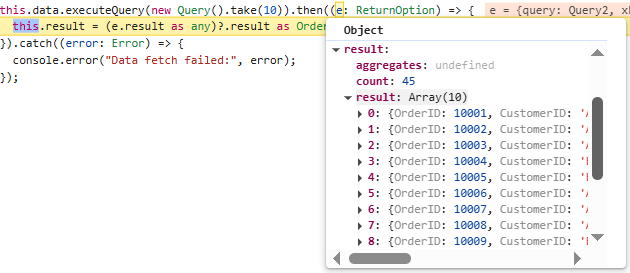

To achieve this, follow these steps:

**Step 1:** Import **DataManager**, **Query**, **UrlAdaptor** modules from **@syncfusion/ej2-data**.

```ts

import { DataManager, Query, UrlAdaptor, ReturnOption } from '@syncfusion/ej2-data';

```
**Step 2: Configure the DataManager:**

Assign your API endpoint to the `url` property and use `UrlAdaptor` as the `adaptor`.

```ts

this.data = new DataManager({
  // Use remote server host and port instead of 'xxxx'.
  url: 'https://localhost:xxxx/api/orders',
  adaptor: new UrlAdaptor()
});

```

**Step 3: Apply a query using executeQuery:**

Use the `executeQuery` method with a `Query` object to retrieve data. This enables you to perform server-side operations such as paging, filtering, or sorting. For example, the following code retrieves the first 10 records from the remote data source in the form of `result` and `count`.

```ts

this.data.executeQuery(new Query().take(10)).then((e: ReturnOption) => {
  this.result = (e.result as any)?.result as Order[];
}).catch((error: Error) => {
  console.error("Data fetch failed:", error);
});

```

This example demonstrates how to use the `UrlAdaptor` and return the data in result and count format from server end with **OrdersController.cs** as below:









<table class='e-table'>
  <tr><th>Order ID</th><th>Customer ID</th><th>Employee ID</th><th>Ship City</th><th>Ship Country</th></tr>
  <tr *ngFor="let item of result">
    <td>{{ item.OrderID }}</td>
    <td>{{ item.CustomerID }}</td>
    <td>{{ item.EmployeeID }}</td>
    <td>{{ item.ShipCity }}</td>
    <td>{{ item.ShipCountry }}</td>
  </tr>
</table>





















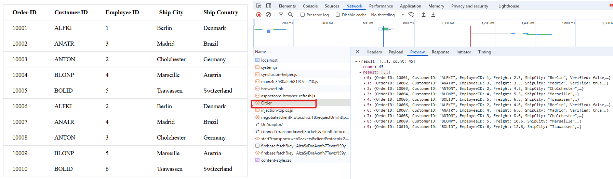
  
## OData adaptor

The `ODataAdaptor` in  Syncfusion Angular DataManager facilitates seamless integration with [OData](http://www.odata.org/documentation/odata-version-3-0/) services, which are standardized RESTful APIs designed for querying and manipulating data over HTTP. This adaptor streamlines operations such as querying, filtering, sorting, and paging data from OData endpoints, making it especially suitable for enterprise applications that require standardized and interoperable data access.

This adaptor is especially useful when:

* Connecting to an OData-compliant REST API.

* Utilizing built-in support for `OData` query options such as **$filter**, **$orderby**, **$top**, and **$skip**.

* Performing efficient server-side data operations, including paging, sorting, and filtering.

The `ODataAdaptor` automatically translates DataManager query operations into OData-compliant HTTP requests. It manages response parsing and maps the server data into the format expected by Syncfusion components, enabling smooth client-server communication.

The `ODataAdaptor` expects the server's response to be a JSON object containing two primary properties:

- **result:**
  An array that contains the actual data records to be processed or displayed.

- **count:**
  A number representing the total count of records available on the server. This is especially important for enabling accurate pagination.

A sample response object should look like this:

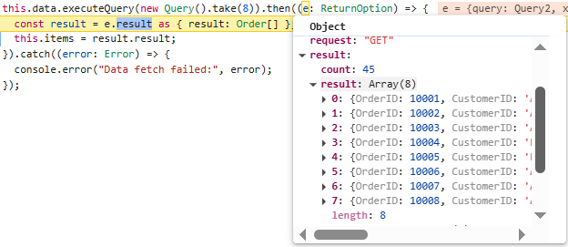

To retrieve data from an OData service using the DataManager, follow these steps:

**Step 1:** Import **DataManager**, **Query**, **ODataAdaptor** modules from **@syncfusion/ej2-data**.
```ts

import { DataManager, Query, ODataAdaptor, ReturnOption } from '@syncfusion/ej2-data';

```
**Step 2: Configure the DataManager:**

Assign your API endpoint to the `url` property and use `ODataAdaptor` as the `adaptor`.

```ts

this.data = new DataManager({
  // Use remote server host and port instead of 'xxxx'.
  url: 'https://localhost:xxxx/api/Orders',
  adaptor: new ODataAdaptor()
});

```

**Step 3: Apply a query using executeQuery:**

Use the `executeQuery` method with a `Query` object to retrieve data. This enables you to perform server-side operations such as paging, filtering, or sorting. For example, the following code retrieves the first 8 records from the remote data source in the form of `result` and `count`.

```ts

this.data.executeQuery(new Query().take(8)).then((e: ReturnOption) => {
  const result = e.result as { result: Order[] };
  this.items = result.result;
}).catch((error: Error) => {
  console.error("Data fetch failed:", error);
});

```

This example demonstrates how to use the `ODataAdaptor` and return the data in result and count format from server end with **OrdersController.cs** as below:








<table class='e-table'>
  <tr>
    <th>Order ID</th>
    <th>Customer ID</th>
    <th>Employee ID</th>
    <th>Ship City</th>
    <th>Ship Country</th>
  </tr>
  <tr *ngFor="let item of items">
    <td>{{ item.OrderID }}</td>
    <td>{{ item.CustomerID }}</td>
    <td>{{ item.EmployeeID }}</td>
    <td>{{ item.ShipCity }}</td>
    <td>{{ item.ShipCountry }}</td>
  </tr>
</table>





















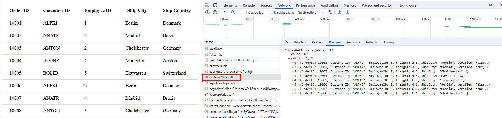

> By default, **ODataAdaptor** is used by `DataManager`

## ODataV4 adaptor

The `ODataV4Adaptor` is a specialized adaptor in Syncfusion Angular DataManager module, designed for interacting with OData v4 services. OData (Open Data Protocol) is a standardized protocol for creating and consuming RESTful APIs. The ODataV4 protocol is an improved version of previous OData protocols, offering enhanced capabilities and better support for modern web standards.

Syncfusion’s `ODataV4Adaptor` allows the DataManager to communicate with OData V4-compliant services, performing operations like filtering, sorting, paging, and grouping directly via OData query options in the URL. These operations are translated into OData query options and appended to the request URL, allowing the server to process them efficiently. This adaptor is particularly useful when integrating enterprise-grade OData services, such as those provided by Microsoft Dynamics 365, Azure, or SAP.

If you're building a reporting dashboard that connects to a Microsoft Dynamics 365 service (which exposes data via OData V4), you can use the `ODataV4Adaptor` to retrieve and manipulate data like customer orders, sales reports, or invoices directly from the OData-compliant API.

For more information on OData v4 protocol, refer to the official [OData V4 documentation](http://docs.oasis-open.org/odata/odata/v4.0/errata03/os/complete/part1-protocol/odata-v4.0-errata03-os-part1-protocol-complete.html#_Toc453752197).

To achieve this, follow these steps:

**Step 1:** Import **DataManager**, **Query**, **ODataV4Adaptor** modules from **@syncfusion/ej2-data**.

```ts

import { DataManager, Query, ReturnOption, ODataV4Adaptor } from '@syncfusion/ej2-data';

```
**Step 2: Configure the DataManager:**

Assign your API endpoint to the `url` property and use `ODataV4Adaptor` as the `adaptor`.

```ts

this.data= new DataManager({
  // Use remote server host and port instead of 'xxxx'.
  url: 'https://localhost:xxxx/odata/Orders',
  adaptor: new ODataV4Adaptor()
});

```

**Step 3: Apply a query using executeQuery:**

Use the `executeQuery` method with a `Query` object to retrieve data. This enables you to perform server-side operations such as paging, filtering, or sorting. For example, the following code retrieves the first 8 records from the remote data source.

```ts

this.data.executeQuery(new Query().take(8)).then((e: ReturnOption) => {
  this.items = e.result as Order[];
}).catch((error: Error) => {
  console.error("Data fetch failed:", error);
});

```
>  To construct the entity data model for your ODataV4 service, utilize the `ODataConventionModelBuilder` to define the model's structure. Start by creating an instance of the `ODataConventionModelBuilder`, then register the entity set **Orders** using the `EntitySet<T>` method, where `OrdersDetails` represents the CLR type containing order details. Once the entity data model is built, you need to register the ODataV4 services in your ASP.NET Core application. Please refer to the **Program.cs** file below.

This example demonstrates how to use the `ODataV4Adaptor` and return data from server side end with **OrdersController.cs** as below:









<table class='e-table'>
  <tr>
    <th>Order ID</th>
    <th>Customer ID</th>
    <th>Employee ID</th>
    <th>Ship Country</th>
  </tr>
  <tr *ngFor="let item of items">
    <td>{{ item.OrderID }}</td>
    <td>{{ item.CustomerID }}</td>
    <td>{{ item.EmployeeID }}</td>
    <td>{{ item.ShipCountry }}</td>
  </tr>
</table>




















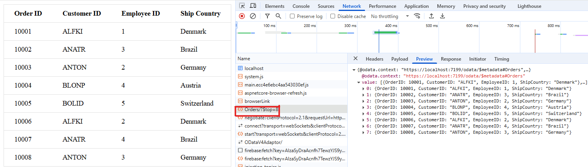

## Web API adaptor

The `WebApiAdaptor` is a specialized adaptor in Syncfusion Angular DataManager module designed to interact with Web APIs, particularly those that support OData query options. Since the `WebApiAdaptor` is extended from the `ODataAdaptor`, it requires that the remote service endpoint understands and can process OData-formatted queries sent along with the request.

Since `WebApiAdaptor` inherits from `ODataAdaptor`, it expects the API endpoint to understand and process OData-formatted queries such as **$top**, **$**, **$filter**, sent along with the request.

For example, if you are fetching employee records from a Web API that accepts OData queries (like $top, $skip, $filter, etc.), the `WebApiAdaptor` automatically formats and sends these queries and parses the response appropriately.

To enable OData query options for your Web API, you need to ensure that the Web API is configured to understand OData requests. For more information on how to implement OData in a Web API, refer to the [documentation](https://docs.microsoft.com/en-us/aspnet/web-api/overview/odata-support-in-aspnet-web-api/supporting-odata-query-options).

The `WebApiAdaptor` expects the server's response to be a JSON object containing two primary properties:

- **Items:**
  An array that contains the actual data records to be displayed or processed.

- **Count:**
  A number representing the total count of records available on the server. This is especially important for enabling accurate pagination.

A sample response object should look like this:

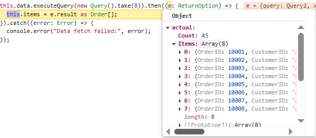

To achieve this, follow these steps:

**Step 1:** Import **DataManager**, **Query**, **WebApiAdaptor** modules from **@syncfusion/ej2-data**.

```ts

import { DataManager, Query, WebApiAdaptor, ReturnOption } from '@syncfusion/ej2-data';

```
**Step 2: Configure the DataManager:**

Assign your API endpoint to the `url` property and use `WebApiAdaptor` as the `adaptor`.

```ts

this.data = new DataManager({
  // Use remote server host and port instead of 'xxxx'.
  url: 'https://localhost:7112/api/Orders',
  adaptor: new WebApiAdaptor()
});

```

**Step 3: Apply a query using executeQuery:**

Use the `executeQuery` method with a `Query` object to retrieve data. This enables you to perform server-side operations such as paging, filtering, or sorting. For example, the following code retrieves the first 8 records from the remote data source in the form of `Items` and `Count`.

```ts

this.data.executeQuery(new Query().take(8)).then((e: ReturnOption) => {
  this.items = e.result as Order[];
}).catch((error: Error) => {
  console.error("Data fetch failed:", error);
});

```

This example demonstrates how to use the `WebApiAdaptor` and return the data in items and count format from server end with **OrdersController.cs** as below:









<table class='e-table'>
  <tr>
    <th>Order ID</th>
    <th>Customer ID</th>
    <th>Employee ID</th>
    <th>Ship City</th>
    <th>Ship Country</th>
  </tr>
  <tr *ngFor="let item of items">
    <td>{{ item.OrderID }}</td>
    <td>{{ item.CustomerID }}</td>
    <td>{{ item.EmployeeID }}</td>
    <td>{{ item.ShipCity }}</td>
    <td>{{ item.ShipCountry }}</td>
  </tr>
</table>





















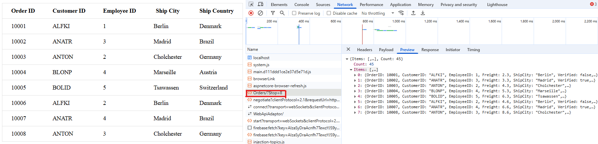

## WebMethod Adaptor

The `WebMethodAdaptor` is a powerful and flexible adaptor provided by Syncfusion Angular DataManager module, specifically designed to interact with remote services or server-side methods that accept data via HTTP POST requests. Unlike adaptors that communicate with standard REST or OData services, the `WebMethodAdaptor` enables seamless data binding from custom server-side logic such as controller actions, web services, or business-layer functions.

This adaptor is ideal for applications where server-side methods are responsible for data retrieval and business logic processing. It ensures that data operations such as paging, sorting, filtering, and grouping are handled on the server and returned to the client in a structured format.

The `WebMethodAdaptor` expects the server's response to be a JSON object containing two primary properties:

- **result:**
  An array that contains the actual data records to be displayed or processed.

- **count:**
  A number representing the total count of records available on the server. This is especially important for enabling accurate pagination.

A sample response object should look like this:

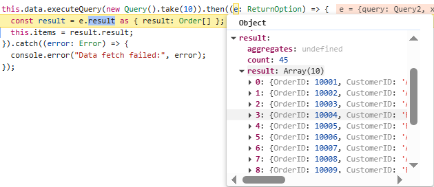

To achieve this, follow these steps:

**Step 1:** Import **DataManager**, **Query**, **WebMethodAdaptor** modules from **@syncfusion/ej2-data**.

```ts

import { DataManager, Query, WebMethodAdaptor, ReturnOption } from '@syncfusion/ej2-data';

```
**Step 2: Configure the DataManager:**

Assign your API endpoint to the `url` property and use `WebMethodAdaptor` as the `adaptor`.

```ts

this.data = new DataManager({
  // Use remote server host and port instead of 'xxxx'.
  url: 'https://localhost:xxxx/api/Orders',
  adaptor: new WebMethodAdaptor()
});

```

**Step 3: Apply a query using executeQuery:**

Use the `executeQuery` method with a `Query` object to retrieve data. This enables you to perform server-side operations such as paging, filtering, or sorting. For example, the following code retrieves the first 8 records from the remote data source in the form of `result` and `count`.

```ts

this.data.executeQuery(new Query().take(10)).then((e: ReturnOption) => {
  const result = e.result as { result: Order[] };
  this.items = result.result;
}).catch((error: Error) => {
  console.error("Data fetch failed:", error);
});

```

> The server-side method must accept a parameter named `value` to receive the request payload from the client.

This example demonstrates how to use the `WebMethodAdaptor` and return the data in result and count format from server end with **OrdersController.cs** as below:









<table class='e-table'>
  <tr>
    <th>Order ID</th>
    <th>Customer ID</th>
    <th>Employee ID</th>
    <th>Ship City</th>
    <th>Ship Country</th>
  </tr>
  <tr *ngFor="let item of items">
    <td>{{ item.OrderID }}</td>
    <td>{{ item.CustomerID }}</td>
    <td>{{ item.EmployeeID }}</td>
    <td>{{ item.ShipCity }}</td>
    <td>{{ item.ShipCountry }}</td>
  </tr>
</table>





















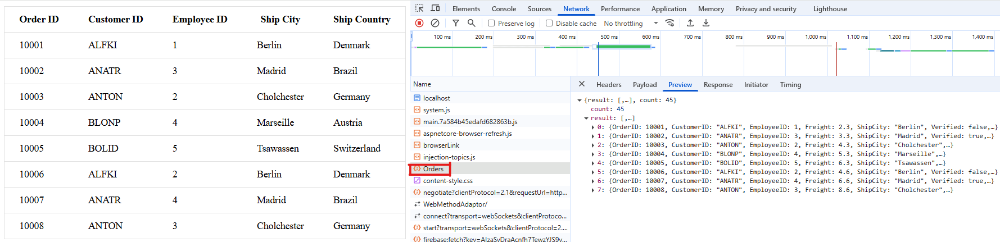

## RemoteSaveAdaptor

The `RemoteSaveAdaptor` is a specialized adaptor in Syncfusion Angular DataManager module designed to perform actions such as sorting, filtering, searching and paging primarily on the client-side while handling CRUD operations(Create, Read, Update, and Delete), on the server-side for data persistence. This approach optimizes your experience by minimizing unnecessary server interactions.

For example, if you are building a dashboard that displays order data stored remotely and users need to add, edit, or delete records with changes saved back to the server, the `RemoteSaveAdaptor` helps manage these interactions effectively.

To achieve this, follow these steps:

**Step 1:** Import **DataManager**, **Query**, **RemoteSaveAdaptor** modules from **@syncfusion/ej2-data**.
```ts

import { DataManager, Query, RemoteSaveAdaptor, ReturnOption } from '@syncfusion/ej2-data';

```
**Step 2: Configure the DataManager:**

Assign your API endpoint to the `json` property and use `RemoteSaveAdaptor` as the `adaptor`.

```ts

this.http.get<Order[]>('https://localhost:xxxx/api/orders').subscribe((value: Order[]) => {
  this.data = new DataManager({
    json: value,
    adaptor: new RemoteSaveAdaptor(),
  });
});
```

**Step 3: Apply a query using executeQuery:**

Use the `executeQuery` method with a `Query` object to retrieve data. This enables you to perform server-side operations such as paging, filtering, or sorting. For example, the following code retrieves the first 8 records from the remote data source.

```ts

this.data.executeQuery(new Query().take(8)).then((e: ReturnOption) => {
  this.items = e.result as Order[];
}).catch((error: Error) => {
  console.error("Data fetch failed:", error);
});

```

This example demonstrates how to use the `RemoteSaveAdaptor` and return data from server side end with **OrdersController.cs** as below:









<table class='e-table'>
  <tr>
    <th>Order ID</th>
    <th>Customer ID</th>
    <th>Employee ID</th>
    <th>Ship City</th>
    <th>Ship Country</th>
  </tr>
  <tr *ngFor="let item of items">
    <td>{{ item.OrderID }}</td>
    <td>{{ item.CustomerID }}</td>
    <td>{{ item.EmployeeID }}</td>
    <td>{{ item.ShipCity }}</td>
    <td>{{ item.ShipCountry }}</td>
  </tr>
</table>





















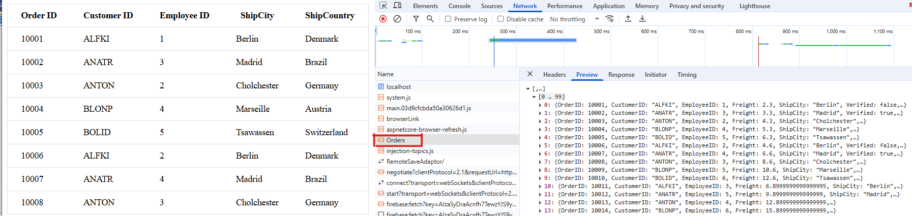

## GraphQL Adaptor

The `GraphQLAdaptor` enables seamless data retrieval and manipulation from a GraphQL server. It allows you to precisely fetch the data you need, reducing over-fetching and under-fetching of data. GraphQL provides a flexible and expressive syntax for querying, enabling clients to request only the specific data they require. It allows efficient data retrieval with support for various operations like CRUD (Create, Read, Update, and Delete), paging, sorting, and filtering.

The adaptor extends the `UrlAdaptor`, which means it expects the server to return responses in a specific JSON format for proper data processing.

To achieve this, follow these steps:

**Step 1: Create service for GraphQL:**

**1:** Create a new folder named **GraphQLServer** specifically for your GraphQL server.

**2:** Install the [graph pack](https://www.npmjs.com/package/graphpack) npm package. Open your terminal and navigate to the server folder, then run:

  ```bash
  npm i graphpack
  ```

**3:** To utilize Syncfusion's  **ej2-data** package, you need to include it as a dependency in your project's **package.json** file. Here's how you can mention it in the configuration:
  
  ```json
    {
      "name": "graphql-server",
      "version": "1.0.0",
      "description": "",
      "scripts": {
        "dev": "graphpack --port 4205",
        "build": "graphpack build"
      },
      "devDependencies": {
        "graphpack": "^1.0.9"
      },
      "dependencies": {
        "@syncfusion/ej2-data": "24.1.41"
      }
    }
  ```

**4:** Create a schema file (e.g., **src/schema.graphql**) in your GraphQL server project and write the schema definition.

  * **Define Types:** Create types representing the structure of data retrieved from GraphQL queries. Since the `GraphQLAdaptor` in  Syncfusion extends from `UrlAdaptor`, it expects a JSON response with specific properties:

    **result:** An array containing the data entities.
    **count:** The total number of records.
    **aggregates:** Contains total aggregate data(optional).

  * **Define Queries:** Define queries to retrieve data from the server. Whether using a normal table or Syncfusion components, you can define a query to fetch orders, accepting parameters such as a DataManager for advanced data operations.

  * **Define DataManager Input:** Define input types for DataManager, specifying parameters for sorting, filtering, paging, aggregates, etc., to be used in queries. The query parameters will be send in a string format which contains the below details.

  | Parameters       | Description                                                                     |
  | ---------------- | ------------------------------------------------------------------------------- |
  | `requiresCounts` | If it is **true** then the total count of records will be included in response. |
  | `skip`           | Holds the number of records to skip.                                            |
  | `take`           | Holds the number of records to take.                                            |
  | `sorted`         | Contains details about current sorted column and its direction.                 |
  | `where`          | Contains details about current filter column name and its constraints.          |
  | `group`          | Contains details about current grouped column names.                            |
  | `search`         | Contains details about current search data.                                     |
  | `aggregates`     | Contains details about aggregate data.                                          |

  
  
  
  
  

**5:** Create a resolver file (e.g., **src/resolvers.js**) to handle GraphQL queries and fetch data from your database or data source. Resolver functions are responsible for processing incoming GraphQL requests and returning the appropriate data in the expected `result` and `count` format.  To efficiently handle filtering, sorting, searching, and paging, you can use the utilities from the **@syncfusion/ej2-data** package such as **DataUtil**, `Query`, and **DataManager**.

  
  
  
  
  

**6:** Create a simple data file **src/db.js** that exports your data array.

  
  
  
  
  

**7:** Install required packages and start the GraphQL server by running the following commands in your terminal:

  ```bash
    npm install
    npm run dev
  ```
The server will be hosted at **http://localhost:xxxx/**. (where xxxx represents the port number).

**Step 2: Connect Syncfusion Angular DataManager to GraphQL:**

**1:** Create a new Angular application using the following Angular CLI command:

```bash
ng new ClientApp
```

This command will prompt you for a few settings for the new project, such as whether to add Angular routing and which stylesheet format to use.

```bash
cd ClientApp
```

**2: Add Syncfusion packages:**

To use  Syncfusion Angular DataManager, install the packages using the below command.

```bash
npm i @syncfusion/ej2-data 
```

**3: Configure DataManager with GraphQLAdaptor:**

In the `app.component.ts` file, configure the DataManager with `GraphQLAdaptor`.

**A.** Import **DataManager**, **Query**, **GraphQLAdaptor** modules from **@syncfusion/ej2-data**.

```ts

import { DataManager, Query, ReturnOption, GraphQLAdaptor } from '@syncfusion/ej2-data';

```
**B. Configure the DataManager:**

Assign your API endpoint to the `url` property and use `GraphQLAdaptor` as the `adaptor`.

```ts

this.dataManager = new DataManager({
  // Use remote server host and port instead of 'xxxx'.
  url: 'http://localhost:xxxx/graphql',
  adaptor: new GraphQLAdaptor({
    // Additional adaptor options can be specified here.
  })
});

```

**C.Define the GraphQL query and map the response:**

* The `GraphQLAdaptor` includes a `query` property where you define your GraphQL query string. The response from the server should follow this JSON structure:

  ```ts

  query: `query getOrders($datamanager: DataManager) {
    getOrders(datamanager: $datamanager) {
      count,
      result {
        OrderID,
        CustomerID,
        ShipCity,
        ShipCountry
      }
    }
  }

  ```

  ```ts

    {
     "data": {
        "getOrders": {
          "result": [...],
          "count": 100
        }
     }
    }

  ```

* To map this structure, set the `result` and `count` fields in the `response` property of the adaptor:

    ```ts

    response: {
      result: 'getOrders.result',
      count: 'getOrders.count'
    }

    ```

**D. Apply a query using executeQuery:**

Use the `executeQuery` method with a `Query` object to retrieve data. This enables you to perform server-side operations such as paging, filtering, or sorting.  The example below retrieves the first 8 records where the **ShipCity** contains "Cunewalde" and **ShipCountry** equals "Germany" sorted by **OrderID** descending.

```ts

const query = new Query().skip(0).take(8).search('Cunewalde', ['ShipCity']).where('ShipCountry', 'equal', 'Germany').sortBy('OrderID', 'descending');

this.dataManager.executeQuery(query).then((e: ReturnOption) => {
  const response = e.result as { result: Order[] };
  this.items =  response.result
}).catch((error) => {
  console.error('GraphQL data fetch error:', error);
});

```







**5: Add HTML Table:**

Create a basic HTML structure with a <table> element where data using the GraphQL adaptor will be rendered  in the `app.component.html` file.







**6: Run the Application:**

Once the GraphQL server is running, assign its URL (e.g., http://localhost:xxxx/) to the `dataManager.url` property of the `DataManager` in your application.

```bash
ng serve
```

### Performing CRUD action with GraphQLAdaptor

The `GraphQLAdaptor` in Syncfusion Angular DataManager provides a smooth way to integrate GraphQL endpoints for performing CRUD operations (Create, Read, Update, and Delete). This adaptor requires you to supply the appropriate GraphQL queries and mutations corresponding to each CRUD action.

You perform these actions by defining mutation queries dynamically inside the `getMutation` method, which returns the correct GraphQL mutation based on the CRUD operation being performed.

To implement CRUD operations using the `GraphQLAdaptor`, follow these steps:

**Step 1: Configure the DataManager:**

  * Define the GraphQL query to fetch data via the `query` property.

  * Map the response to extract the actual data and total count using the `response` object.

  * Implement mutation queries for `insert`, `update`, and `delete` actions inside the `getMutation` method.

**Step 2: Use DataManager CRUD methods:**

Use the `insert`, `update`, and `remove` methods of the **DataManager** configured with the `GraphQLAdaptor` to perform respective CRUD operations.













**Step 3: Implement server-side GraphQL resolvers:**

Create resolver functions on the server side to handle the GraphQL queries and mutations. These functions perform data processing using the **@syncfusion/ej2-data** library.







**Step 4: Define GraphQL schema:**

Create a schema that supports DataManager queries and mutations with the required input types.







**Step 5:** Create an HTML file with forms for insert, update, delete and a table to display the data:







**Step 6:** Create a simple data file (e.g., **src/db.js**) that exports an array of order objects used by the server-side resolvers.







## CustomDataAdaptor

The `CustomDataAdaptor` in Syncfusion Angular DataManager provides an option to send your own request and manually manage all data operations. It offers complete control over the way data is retrieved, processed, and transmitted between client and server. This adaptor is especially valuable when working with APIs that have non-standard request structures, authentication requirements, or custom business rules.

By extending the `UrlAdaptor`, `CustomDataAdaptor` inherits support for RESTful endpoints while allowing deep customization through method overrides.

**Custom request construction:**

Within the `getData` method of `CustomDataAdaptor`, you can inspect the `option` object to access details about the current action, such as:

- **Filtering:** `option.queries.where`
- **Sorting:** `option.queries.sort`
- **Paging:** `option.queries.skip`, `option.queries.take`
- **Searching:** `option.queries.search`

Use this information to build a custom request payload that matches your backend API requirements.

**Handling the server response:**

After fetching data from your service, you must notify the DataManager of the result:

- **On success, call:**  `option.onSuccess(responseData, additionalArgs);`
- **On failure, call:**  `option.onFailure(additionalArgs, error);`

Alternatively, you can use `this.processResponse(data, dataSource, option)` if you need to process the response before passing it to the DataManager.

**Expected server response format:**

Since `CustomDataAdaptor` extends `UrlAdaptor`, it expects the server to return a JSON object with the following structure:

- **result:** An array of data objects representing the records.
- **count:** The total number of records (for paging support).

Example:

```json
{
  "result": [
    { /* record 1 */ },
    { /* record 2 */ }
    // ...
  ],
  "count": 67
}
```

This structure ensures that DataManager can correctly handle data binding, paging, and other operations.

**Implement the CustomDataAdaptor:**

Use the following steps in your `src/app.component.ts` to fetch and display data with a `CustomDataAdaptor`:

**1. Import required modules:**

Import the necessary classes from the Syncfusion packages:

```ts
import { DataManager, Query, CustomDataAdaptor, ReturnOption } from '@syncfusion/ej2-data';

```

**2. Set up the CustomDataAdaptor with a getData function:**

Define how data is fetched from the server using the fetch API inside the `CustomDataAdaptor`.

```ts
this.data = new DataManager({
  adaptor: new CustomDataAdaptor({
  getData: (option: {
    onSuccess: (data: any, args: object) => void;
    onFailure: (args: object, error: any) => void;
  }) => {
      fetch("https://localhost:xxxx/api/Orders", {
        method: 'POST',
        headers: {
          'Content-Type': 'application/json; charset=utf-8',
        },
        body: JSON.stringify(option)
      }).then(response => {
        if (!response.ok) {
          throw new Error('Network response was not ok.');
        }
        return response.json();
      }).then(data => {
        option.onSuccess(data, {});
      }).catch(error => {
        option.onFailure({}, error);
      });
    }
  })
});

this.data.executeQuery(new Query()).then((e: ReturnOption) => {
  this.result = (e.result as any)?.result as Order[];
}).catch((error: Error) => {
  console.error("Data fetch failed:", error);
});
```









<table class='e-table'>
  <tr><th>Order ID</th><th>Customer ID</th><th>Employee ID</th><th>Ship City</th><th>Ship Country</th></tr>
  <tr *ngFor="let item of result">
    <td>{{ item.OrderID }}</td>
    <td>{{ item.CustomerID }}</td>
    <td>{{ item.EmployeeID }}</td>
    <td>{{ item.ShipCity }}</td>
    <td>{{ item.ShipCountry }}</td>
  </tr>
</table>













## CustomAdaptor

The `CustomAdaptor` in Syncfusion Angular DataManager allows you to extend built-in adaptors (like UrlAdaptor) and override specific methods to customize the data communication between the client and server. This adaptor is useful when integrating with non-standard APIs or when the server’s request and response formats do not match DataManager’s default expectations.

To create and use custom adaptor, please refer to the below steps:

* Select an built-in adaptor which will act as base class for your custom adaptor.
* Override the desired method to achieve your requirement.
* Assign the custom adaptor to the `adaptor` property of **DataManager**.

With a `CustomAdaptor`, you have control over:

* **Query translation:** Customize how queries (filtering, sorting, paging) are serialized into API-compatible formats.
* **Request building:** Modify request URLs, headers, or payloads.
* **Response processing:** Transform server responses into formats consumable by UI components.

### Types of CustomAdaptor methods

There are three types of methods in custom adaptors.

**processQuery:**

The `processQuery` method is responsible for transforming the incoming `Query` object into a request format understood by the server. It is typically used to construct URLs, append parameters, and serialize complex queries such as filtering, sorting, paging, and grouping. The `processQuery` method accepts two arguments: 

* `DataManager`: Used to modify the URL dynamically.

* `Query`: Allows setting additional parameter values or modifying queries such as sorting, filtering, and grouping, etc.









  


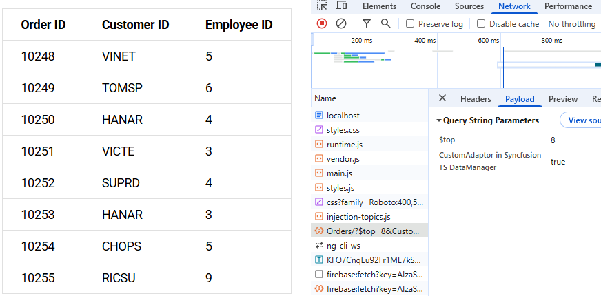

**beforeSend:**

The `beforeSend` method is called immediately before the request is sent to the server, allowing you to modify the request or perform final checks. This method is particularly useful for dynamically adding authentication headers, customizing the request payload, or injecting additional metadata. It accepts the following arguments:

* `DataManager`: Provides access to the data and the adaptor instance.
* `Request`: Represents the request object, which can be used to set custom headers (for example, the `Authorization` header).
* `Settings` (optional): Allows for further configuration of the request.

**Common use cases include:**

- Injecting a bearer token or other authentication credentials.
- Adding custom headers such as client ID, language, or tenant information.
- Performing preflight validation or logging request details before sending.









  


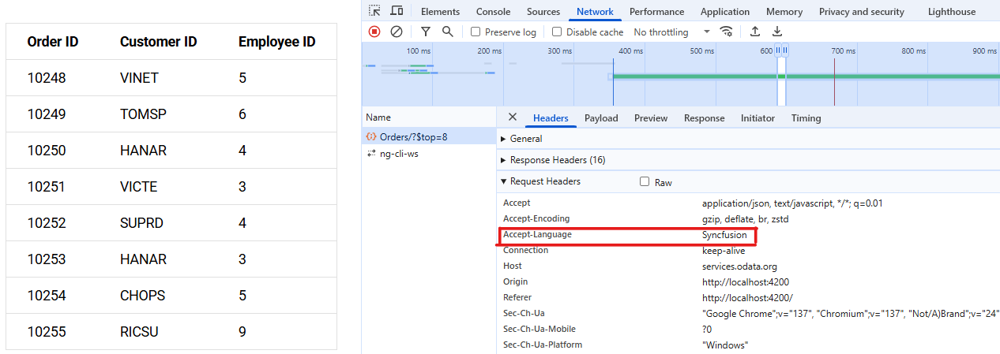

**processResponse:**

The `processResponse` method is executed after data is received from the server and before it is passed to the UI component. This method is responsible for parsing, transforming, or validating the server response to match the structure expected by Syncfusion components. It can accept multiple optional arguments, allowing for customization based on specific requirements.

**Use cases include:**

- Formatting nested or wrapped data (for example, extracting `data.items` and `data.count`).
- Normalizing inconsistent field names.
- Handling API-specific pagination or error formats.
- Removing metadata or enriching records before binding.









  


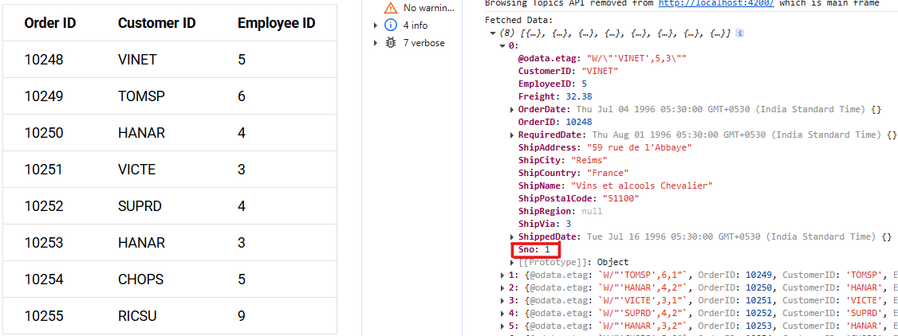

**Implement the custom adaptor:**

The following example demonstrates how to extend the `ODataV4Adaptor` to create a custom adaptor and bind data to a table using the Syncfusion Angular DataManager.

**1. Import required modules:**

```ts
import { DataManager, Query, ReturnOption, ODataV4Adaptor } from '@syncfusion/ej2-data';
```

**2. Create a custom adaptor by extending ODataV4Adaptor:**

```ts
class CustomAdaptor extends ODataV4Adaptor {
  // Override adaptor methods here as needed.
}
```

**3. Configure the DataManager:**

```ts

this.data = new DataManager({
  // Use remote server host and port instead of 'xxxx'.
  url: 'https://localhost:xxxx/odata/Orders',
  adaptor: new CustomAdaptor()
});

this.data.executeQuery(new Query().take(8)).then((e: ReturnOption) => {
  this.items = e.result as Order[];
}).catch((error: Error) => {
  console.error("Data fetch failed:", error);
});

```

This setup allows you to customize the adaptor's behavior by overriding methods in the `CustomAdaptor` class, while efficiently fetching and displaying data from your OData service.





import { CommonModule } from '@angular/common';
import { Component } from '@angular/core';
import { DataManager, Query, ODataV4Adaptor, ReturnOption } from '@syncfusion/ej2-data';


interface Order {
  OrderID: number;
  CustomerID: string;
  EmployeeID: number;
  ShipCity: string;
  ShipCountry: string;
}

@Component({
  imports: [CommonModule],
  standalone: true,
  selector: 'app-root',
  templateUrl: './app.component.html',
  styles: [`
    .e-table {
      border: solid 1px #e0e0e0;
      border-collapse: collapse;
      font-family: Roboto;
    }
    .e-table td, .e-table th {
      border-style: solid;
      border-width: 1px 0 0;
      border-color: #e0e0e0;
      display: table-cell;
      font-size: 14px;
      line-height: 20px;
      overflow: hidden;
      padding: 8px 21px;
      vertical-align: middle;
      white-space: nowrap;
      width: auto;
    }
  `]
})

export class AppComponent {
  public data?: DataManager;
  public items: Order[] = [];

  public ngOnInit(): void {
    this.data = new DataManager({
      // Use remote server host and port instead of 'xxxx'.
      url: 'https://localhost:xxxx/odata/Orders',
      adaptor: new CustomAdaptor()
    });

    this.data.executeQuery(new Query().take(8)).then((e: ReturnOption) => {
      this.items = e.result as Order[];
    }).catch((error: Error) => {
      console.error("Data fetch failed:", error);
    });
  }
}







<table class='e-table'>
  <tr>
    <th>Order ID</th>
    <th>Customer ID</th>
    <th>Employee ID</th>
    <th>Ship Country</th>
  </tr>
  <tr *ngFor="let item of items">
    <td>{{ item.OrderID }}</td>
    <td>{{ item.CustomerID }}</td>
    <td>{{ item.EmployeeID }}</td>
    <td>{{ item.ShipCountry }}</td>
  </tr>
</table>







using Microsoft.AspNetCore.Mvc;
using CustomAdaptor.Server.Models;
using Microsoft.AspNetCore.OData.Query;

namespace CustomAdaptor.Server.Controllers
{
  public class OrdersController : Controller
  {
    /// <summary>
    /// Retrieves all orders.
    /// </summary>
    /// <returns>The collection of orders.</returns>
    [HttpGet]
    [EnableQuery]
    public IActionResult Get()
    {
      var data = OrdersDetails.GetAllRecords().AsQueryable();
      return Ok(data);
    }
  }
}







using System.ComponentModel.DataAnnotations;

namespace CustomAdaptor.Server.Models
{
  public class OrdersDetails
  {
    public static List<OrdersDetails> order = new List<OrdersDetails>();
    public OrdersDetails()
    {

    }
    public OrdersDetails(
      int OrderID, string CustomerId, int EmployeeId, string ShipCountry)
    {
      this.OrderID = OrderID;
      this.CustomerID = CustomerId;
      this.EmployeeID = EmployeeId;
      this.ShipCountry = ShipCountry;
    }

    public static List<OrdersDetails> GetAllRecords()
    {
      if (order.Count() == 0)
      {
        int code = 10000;
        for (int i = 1; i < 10; i++)
        {
          order.Add(new OrdersDetails(code + 1, "ALFKI", i + 0, "Denmark"));
          order.Add(new OrdersDetails(code + 2, "ANATR", i + 2, "Brazil"));
          order.Add(new OrdersDetails(code + 3, "ANTON", i + 1, "Germany"));
          order.Add(new OrdersDetails(code + 4, "BLONP", i + 3, "Austria"));
          order.Add(new OrdersDetails(code + 5, "BOLID", i + 4, "Switzerland"));
          code += 5;
        }
      }
      return order;
    }

    [Key]
    public int? OrderID { get; set; }
    public string? CustomerID { get; set; }
    public int? EmployeeID { get; set; }
    public string? ShipCountry { get; set; }
  }
}







using Microsoft.AspNetCore.OData;
using Microsoft.OData.ModelBuilder;
using ODataV4Adaptor.Server.Models;

var builder = WebApplication.CreateBuilder(args);

// Create an ODataConventionModelBuilder to build the OData model.
var modelBuilder = new ODataConventionModelBuilder();
// Register the "Orders" entity set with the OData model builder.
modelBuilder.EntitySet<OrdersDetails>("Orders");

var recordCount = OrdersDetails.GetAllRecords().Count;

// Add controllers with OData support to the service collection.
builder.Services.AddControllers().AddOData(
    options => options
    .Count()
    .OrderBy()
    .Filter()
    .SetMaxTop(recordCount)
    .AddRouteComponents(
        "odata",
        modelBuilder.GetEdmModel()));

// Add services to the container.
builder.Services.AddControllers().AddJsonOptions(options =>
{
  options.JsonSerializerOptions.PropertyNamingPolicy = null; // Use PascalCase.
});

// Learn more about configuring OpenAPI at https://aka.ms/aspnet/openapi.
builder.Services.AddOpenApi();
builder.Services.AddCors(options =>
{
  options.AddDefaultPolicy(builder =>
  {
    builder.AllowAnyOrigin().AllowAnyMethod().AllowAnyHeader();
  });
});
var app = builder.Build();

app.UseDefaultFiles();
app.MapStaticAssets();

// Configure the HTTP request pipeline.
if (app.Environment.IsDevelopment())
{
  app.MapOpenApi();
}
app.UseCors();

app.UseHttpsRedirection();

app.UseAuthorization();

app.MapControllers();

app.MapFallbackToFile("/index.html");

app.Run();





### Error Handling

Proper error handling is essential when working with remote data sources to ensure a robust user experience and facilitate easier debugging. Syncfusion Angular DataManager provides built-in mechanisms to capture and respond to errors that occur during data operations.

When using a `CustomAdaptor`, you must explicitly invoke error callbacks in case of failures. This ensures that the DataManager triggers the appropriate error events on the bound UI components, such as Grid, allowing you to handle errors gracefully in the UI.

Use the following example to understand how to implement error handling in a `CustomAdaptor`:









<p id="error-message" style="color:red"></p>

<table class='e-table'>
  <tr>
    <th>Order ID</th>
    <th>Customer ID</th>
    <th>Employee ID</th>
    <th>Ship Country</th>
  </tr>
  <tr *ngFor="let item of items">
    <td>{{ item.OrderID }}</td>
    <td>{{ item.CustomerID }}</td>
    <td>{{ item.EmployeeID }}</td>
    <td>{{ item.ShipCountry }}</td>
  </tr>
</table>




















  


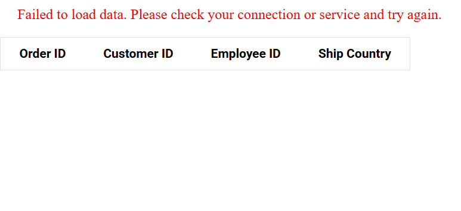

## CacheAdaptor

The `CacheAdaptor` is a powerful feature in Syncfusion Angular DataManager that enhances application performance by reducing redundant server calls. It caches previously fetched data on the client side, allowing your app to quickly retrieve cached data instead of making repeated HTTP requests when navigating through pages or revisiting previously loaded data. This significantly improves the responsiveness of data-bound components and reduces server load, especially in applications with large datasets or frequent data navigation.

You can enable this functionality by setting the `enableCache` property to true in the `DataManager` configuration.

**How it works:**

* When `enableCache` is set to **true**, the DataManager generates a unique ID at initialization and uses it to store previously loaded page data in cache memory. This enables efficient data retrieval without redundant server requests.

* The cache is automatically cleared when data actions such as sorting, filtering, grouping, searching, or CRUD operations (Create, Read, Update, and Delete) are performed.

* This feature is supported by all adaptors in DataManager, ensuring consistent caching behavior across different data sources.

Consider a customer order management dashboard that displays thousands of orders in a paginated grid with filtering and sorting options. By enabling `enableCache` in the DataManager:

* When the user first navigates to page 2, the data is fetched from the server and stored in the cache.

* If the user later returns to page 2, the DataManager serves the data directly from the cache, with no additional request sent.

* If the user applies a filter or sort, the cache is cleared to ensure new data is retrieved fresh from the server.

* This results in a smoother user experience, reduced load times, and improved overall performance.

This caching behavior is especially beneficial for:

* Applications with large datasets and frequent navigation.

* Scenarios with network latency or bandwidth constraints.

* Reducing costs in cloud-hosted backends by minimizing API calls.

The following example demonstrates how to enable caching using the `enableCache` property in the `DataManager`:





import { Component, OnInit } from '@angular/core';
import { DataManager, WebApiAdaptor } from '@syncfusion/ej2-data';

@Component({
  selector: 'app-root',
  template: `
    <ejs-grid [dataSource]="data">
      <e-columns>
        <e-column field="OrderID" headerText="Order ID" width="100" textAlign="Right"></e-column>
        <e-column field="CustomerID" headerText="Customer ID" width="100"></e-column>
        <e-column field="EmployeeID" headerText="Employee ID" textAlign="Right" width="100"></e-column>
        <e-column field="OrderDate" headerText="Order Date" format="yMd" textAlign="Right" width="120"></e-column>
      </e-columns>
    </ejs-grid>
  `
})
export class AppComponent implements OnInit {
  public data: DataManager;

  ngOnInit(): void {
    this.data = new DataManager({
      url: 'https://services.syncfusion.com/angular/production/api/Orders',
      adaptor: new WebApiAdaptor(),
      crossDomain: true,
      enableCache: true
    });
  }
}



