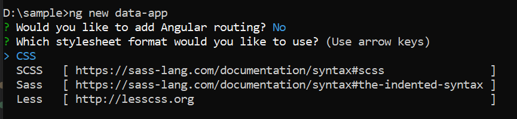

# Getting started with Angular Data component

## Dependencies

Below is the list of minimum dependencies required to use the DataManager.

```javascript
|-- @syncfusion/ej2-data
    |-- @syncfusion/ej2-base
    |-- es6-promise (Required when window.Promise is not available)
```

> **@syncfusion/ej2-data** requires the presence of a Promise feature in global environment. In the browser, "window.Promise" must be available.

## Setup Angular Environment

[Angular CLI](https://github.com/angular/angular-cli) can be used to setup Angular applications.

Install Angular CLI using the following command:

```bash
npm install -g @angular/cli@16.0.1
```

## Create an Angular Application

Create a new Angular application using the following Angular CLI command:

```bash
ng new data-app
```

The command prompts for project settings such as Angular routing and stylesheet format preferences.



By default, a CSS-based application is created.

Navigate to the created project folder:

```
cd data-app
```

## Installing Syncfusion<sup style="font-size:70%">&reg;</sup> Data package

Syncfusion<sup style="font-size:70%">&reg;</sup> packages are distributed in npm as `@syncfusion` scoped packages. You can get all the Angular Syncfusion<sup style="font-size:70%">&reg;</sup> package from npm [link]( https://www.npmjs.com/search?q=%40syncfusion%2Fej2-angular- ).

Currently, Syncfusion<sup style="font-size:70%">&reg;</sup> provides two types of package structures for Angular components,
1. Ivy library distribution package [format](https://v17.angular.io/guide/angular-package-format#angular-package-format)
2. Angular compatibility compiler(Angular’s legacy compilation and rendering pipeline) package.

### Ivy library distribution package

Syncfusion<sup style="font-size:70%">&reg;</sup> Angular packages(`>=20.2.36`) have been moved to the Ivy distribution to support the Angular [Ivy](https://docs.angular.lat/guide/ivy) rendering engine and the packages are compatible with Angular version 12 and above. To download the package, use the below command.

Add [@syncfusion/ej2-data](https://www.npmjs.com/package/@syncfusion/ej2-data/v/20.2.38) package to the application.

```bash
npm install @syncfusion/ej2-data --save
```

### Angular compatibility compiled package(ngcc)

For Angular version below 12, you can use the legacy (ngcc) package of the Syncfusion<sup style="font-size:70%">&reg;</sup> Angular components. To download the `ngcc` package use the below.

Add [@syncfusion/ej2-angular-grids@ngcc](https://www.npmjs.com/package/@syncfusion/ej2-angular-grids/v/20.2.38-ngcc) package to the application.

```bash
npm install @syncfusion/ej2-angular-grids@ngcc --save
```

To mention the ngcc package in the `package.json` file, add the suffix `-ngcc` with the package version as below.

```bash
@syncfusion/ej2-angular-grids:"20.2.38-ngcc"
```

>Note: If the ngcc tag is not specified while installing the package, the Ivy Library Package will be installed and this package will throw a warning.

## Connection to a data source

DataManager acts as a gateway for both local and remote data sources, using queries to interact with the data source.

### Binding to JSON data

**DataManager** can be bound to local data sources by assigning an array of JavaScript objects to the **json** property or by passing them to the constructor during instantiation.

Create a `src/app/datasource.ts` file and use the following dataset to provide JSON data:

```typescript
export let data: Object[] = [
    {
        OrderID: 10248, CustomerID: 'VINET', EmployeeID: 5, OrderDate: new Date(8364186e5),
        ShipName: 'Vins et alcools Chevalier', ShipCity: 'Reims', ShipAddress: '59 rue de l Abbaye',
        ShipRegion: 'CJ', ShipPostalCode: '51100', ShipCountry: 'France', Freight: 32.38, Verified: !0
    },
    {
        OrderID: 10249, CustomerID: 'TOMSP', EmployeeID: 6, OrderDate: new Date(836505e6),
        ShipName: 'Toms Spezialitäten', ShipCity: 'Münster', ShipAddress: 'Luisenstr. 48',
        ShipRegion: 'CJ', ShipPostalCode: '44087', ShipCountry: 'Germany', Freight: 11.61, Verified: !1
    },
    {
        OrderID: 10250, CustomerID: 'HANAR', EmployeeID: 4, OrderDate: new Date(8367642e5),
        ShipName: 'Hanari Carnes', ShipCity: 'Rio de Janeiro', ShipAddress: 'Rua do Paço, 67',
        ShipRegion: 'RJ', ShipPostalCode: '05454-876', ShipCountry: 'Brazil', Freight: 65.83, Verified: !0
    },
    {
        OrderID: 10251, CustomerID: 'VICTE', EmployeeID: 3, OrderDate: new Date(8367642e5),
        ShipName: 'Victuailles en stock', ShipCity: 'Lyon', ShipAddress: '2, rue du Commerce',
        ShipRegion: 'CJ', ShipPostalCode: '69004', ShipCountry: 'France', Freight: 41.34, Verified: !0
    },
    {
        OrderID: 10252, CustomerID: 'SUPRD', EmployeeID: 4, OrderDate: new Date(8368506e5),
        ShipName: 'Suprêmes délices', ShipCity: 'Charleroi', ShipAddress: 'Boulevard Tirou, 255',
        ShipRegion: 'CJ', ShipPostalCode: 'B-6000', ShipCountry: 'Belgium', Freight: 51.3, Verified: !0
    },
    {
        OrderID: 10253, CustomerID: 'HANAR', EmployeeID: 3, OrderDate: new Date(836937e6),
        ShipName: 'Hanari Carnes', ShipCity: 'Rio de Janeiro', ShipAddress: 'Rua do Paço, 67',
        ShipRegion: 'RJ', ShipPostalCode: '05454-876', ShipCountry: 'Brazil', Freight: 58.17, Verified: !0
    },
    {
        OrderID: 10254, CustomerID: 'CHOPS', EmployeeID: 5, OrderDate: new Date(8370234e5),
        ShipName: 'Chop-suey Chinese', ShipCity: 'Bern', ShipAddress: 'Hauptstr. 31',
        ShipRegion: 'CJ', ShipPostalCode: '3012', ShipCountry: 'Switzerland', Freight: 22.98, Verified: !1
    },
    {
        OrderID: 10255, CustomerID: 'RICSU', EmployeeID: 9, OrderDate: new Date(8371098e5),
        ShipName: 'Richter Supermarkt', ShipCity: 'Genève', ShipAddress: 'Starenweg 5',
        ShipRegion: 'CJ', ShipPostalCode: '1204', ShipCountry: 'Switzerland', Freight: 148.33, Verified: !0
    },
    {
        OrderID: 10256, CustomerID: 'WELLI', EmployeeID: 3, OrderDate: new Date(837369e6),
        ShipName: 'Wellington Importadora', ShipCity: 'Resende', ShipAddress: 'Rua do Mercado, 12',
        ShipRegion: 'SP', ShipPostalCode: '08737-363', ShipCountry: 'Brazil', Freight: 13.97, Verified: !1
    },
    {
        OrderID: 10257, CustomerID: 'HILAA', EmployeeID: 4, OrderDate: new Date(8374554e5),
        ShipName: 'HILARION-Abastos', ShipCity: 'San Cristóbal', ShipAddress: 'Carrera 22 con Ave. Carlos Soublette #8-35',
        ShipRegion: 'Táchira', ShipPostalCode: '5022', ShipCountry: 'Venezuela', Freight: 81.91, Verified: !0
    },
    {
        OrderID: 10258, CustomerID: 'ERNSH', EmployeeID: 1, OrderDate: new Date(8375418e5),
        ShipName: 'Ernst Handel', ShipCity: 'Graz', ShipAddress: 'Kirchgasse 6',
        ShipRegion: 'CJ', ShipPostalCode: '8010', ShipCountry: 'Austria', Freight: 140.51, Verified: !0
    },
    {
        OrderID: 10259, CustomerID: 'CENTC', EmployeeID: 4, OrderDate: new Date(8376282e5),
        ShipName: 'Centro comercial Moctezuma', ShipCity: 'México D.F.', ShipAddress: 'Sierras de Granada 9993',
        ShipRegion: 'CJ', ShipPostalCode: '05022', ShipCountry: 'Mexico', Freight: 3.25, Verified: !1
    },
    {
        OrderID: 10260, CustomerID: 'OTTIK', EmployeeID: 4, OrderDate: new Date(8377146e5),
        ShipName: 'Ottilies Käseladen', ShipCity: 'Köln', ShipAddress: 'Mehrheimerstr. 369',
        ShipRegion: 'CJ', ShipPostalCode: '50739', ShipCountry: 'Germany', Freight: 55.09, Verified: !0
    },
    {
        OrderID: 10261, CustomerID: 'QUEDE', EmployeeID: 4, OrderDate: new Date(8377146e5),
        ShipName: 'Que Delícia', ShipCity: 'Rio de Janeiro', ShipAddress: 'Rua da Panificadora, 12',
        ShipRegion: 'RJ', ShipPostalCode: '02389-673', ShipCountry: 'Brazil', Freight: 3.05, Verified: !1
    },
    {
        OrderID: 10262, CustomerID: 'RATTC', EmployeeID: 8, OrderDate: new Date(8379738e5),
        ShipName: 'Rattlesnake Canyon Grocery', ShipCity: 'Albuquerque', ShipAddress: '2817 Milton Dr.',
        ShipRegion: 'NM', ShipPostalCode: '87110', ShipCountry: 'USA', Freight: 48.29, Verified: !0
    }];
```







<table class='e-table'>
    <tr><th>Order ID</th><th>Customer ID</th><th>Employee ID</th></tr>
    <tr *ngFor="let item of items">
        <td>{{item.OrderID}}</td><td>{{item.CustomerID}}</td><td>{{item.EmployeeID}}</td>
    </tr>
</table>







  


### Binding to OData

**DataManager** can be bound to remote data source by assigning service endpoint URL to the **url** property.
Now all **DataManager** operations will address the provided service endpoint.







<table class='e-table'>
    <tr><th>Order ID</th><th>Customer ID</th><th>Employee ID</th></tr>
    <tr *ngFor="let item of items">
        <td>{{item.OrderID}}</td><td>{{item.CustomerID}}</td><td>{{item.EmployeeID}}</td>
    </tr>
</table>







  


## Filter

Data filtering enables a reduced view of data based on specified filter criteria.
Filter expressions can be built using the **where** method of the **Query** class.







<table class='e-table'>
    <tr><th>Order ID</th><th>Customer ID</th><th>Employee ID</th></tr>
    <tr *ngFor="let item of items">
        <td>{{item.OrderID}}</td><td>{{item.CustomerID}}</td><td>{{item.EmployeeID}}</td>
    </tr>
</table>







  


## Sort

Data can be ordered in ascending or descending sequence using the **sortBy** method of the **Query** class.







<table class='e-table'>
    <tr><th>Order ID</th><th>Customer ID</th><th>Employee ID</th></tr>
    <tr *ngFor="let item of items">
        <td>{{item.OrderID}}</td><td>{{item.CustomerID}}</td><td>{{item.EmployeeID}}</td>
    </tr>
</table>







  


## Page

The **page** method of the **Query** class retrieves a range of data based on the page number and page size.







<table class='e-table'>
    <tr><th>Order ID</th><th>Customer ID</th><th>Employee ID</th></tr>
    <tr *ngFor="let item of items">
        <td>{{item.OrderID}}</td><td>{{item.CustomerID}}</td><td>{{item.EmployeeID}}</td>
    </tr>
</table>







  


## Component binding

DataManager can be used with Syncfusion<sup style="font-size:70%">&reg;</sup> components that support data binding.

The following samples demonstrate grid component binding. Refer to the [Grid Getting Started](https://ej2.syncfusion.com/angular/documentation/grid/getting-started) documentation for complete grid configuration details.

### Local data binding

A DataSource can be created in-line with other Syncfusion<sup style="font-size:70%">&reg;</sup> component configuration settings.










  


### Remote data binding

To bind remote data to Syncfusion<sup style="font-size:70%">&reg;</sup> component, you can assign a service data as an instance of **DataManager** to the [dataSource](https://ej2.syncfusion.com/angular/documentation/api/grid#datasource) property.










  
