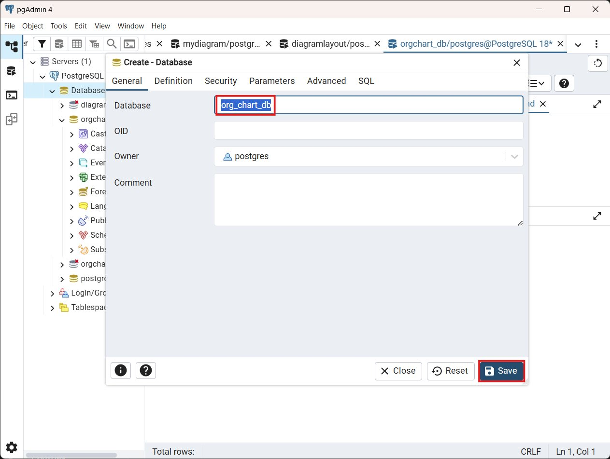

# Loading Angular Diagram from PostgreSQL database

The Syncfusion® Angular Diagram component allows visualization of organizational chart layout using data from a PostgreSQL database through a REST API. This guide explains how to set up the PostgreSQL database, create a Node.js backend service, and link the data to the Angular Diagram component to display an organizational chart layout.

> **Note**: This guide works with Angular Diagram version 28.x or later. The REST API needs to return an array of JSON objects with **id**, **parent_id**, and **role** fields for correct data binding.

## Overview

This integration workflow connects:

* **PostgreSQL** – Stores the organizational chart data.
* **Node.js + Express** – REST API that serves JSON data from PostgreSQL.
* **Angular + Syncfusion® EJ2 Diagram** – data binding via DataManager and rendering of an organizational chart layout.

## Prerequisites

Ensure availability of the following software:

- **Node.js** 20.x or newer
- **PostgreSQL** 12.x or newer
- **TypeScript** 5.x
- **Angular** 18.x or newer
- **Angular CLI** 18.x or newer

## PostgreSQL database setup

### Installing PostgreSQL

Download PostgreSQL from the official website: [https://www.postgresql.org/download/](https://www.postgresql.org/download/)


**Installation Steps:**

1. Download the installer for the preferred version (12.x or higher recommended).
2. Run the installer and follow the setup wizard.
3. During installation:
  - Set a password for PostgreSQL (example: **postgres123**) and remember it.
  - Keep the default port **5432**.
  - Next, the Select Components screen will open.
  - By default, all options are selected, as shown in the image:
    
  - Uncheck the **Stack Builder** option — it is not necessary for this setup.
  - Ensure **PostgreSQL Server**, **pgAdmin 4**, and **Command Line Tools** are selected.

4. Complete the installation.

Two options are available to create a database:
  * Manual (pgAdmin 4)
  * Automated (seed script)

### Option A: Manual (pgAdmin 4)

#### Opening pgAdmin

PostgreSQL includes pgAdmin 4, a graphical tool for database management. Open pgAdmin 4 from the Windows Start menu or application launcher.


#### Creating the database

Right-click the **Databases** option and select **Create** → **Database**.


In the **Create - Database** dialog:
1. Enter **org_chart_db** as the database name. 
2. Click **Save** to create the database.



After creating the database, right-click the **org_chart_db** database and choose **Query Tool** from the context menu.

**Quick procedure before running SQL:**

- Clear the editor (Ctrl+A → Delete) to remove any previous statements.
- Enter the SQL, then click **Execute / Execute Query** (or press **F5**) to run it.
- After execution, clear the editor again before entering the next statement.

Follow this simple sequence for every SQL in this guide.

#### Creating the table

Run the following SQL to create the **org_chart_layout** table:

```sql
CREATE TABLE IF NOT EXISTS org_chart_layout (
  id text PRIMARY KEY,
  role text NOT NULL,
  parent_id text NULL
);
```


The table structure includes:
- **id** - Primary key for unique node identification.
- **role** - Display text for the node in the organizational chart layout.
- **parent_id** - Foreign key reference to the parent node (NULL for root).

#### Inserting sample data

Add organizational chart data using the SQL **INSERT** statement. The sample data shows a typical organizational structure with board, management, and department levels.

```sql
INSERT INTO org_chart_layout (id, role, parent_id) VALUES
('parent', 'Board', NULL),
('1', 'General Manager', 'parent'),
('2', 'Human Resource Manager', '1'),
('3', 'Trainers', '2'),
('4', 'Recruiting Team', '2'),
('5', 'Finance Asst. Manager', '2'),
('6', 'Design Manager', '1'),
('7', 'Design Supervisor', '6'),
('8', 'Development Supervisor', '6'),
('9', 'Drafting Supervisor', '6'),
('10', 'Operations Manager', '1'),
('11', 'Statistics Department', '10'),
('12', 'Logistics Department', '10'),
('16', 'Marketing Manager', '1'),
('17', 'Overseas Sales Manager', '16'),
('18', 'Petroleum Manager', '16'),
('20', 'Service Department Manager', '16'),
('21', 'Quality Control Department', '16')
ON CONFLICT (id) DO UPDATE
SET role = EXCLUDED.role,
    parent_id = EXCLUDED.parent_id;
```


#### Verifying data insertion

Run a **SELECT** query to confirm the data insertion:

```sql
SELECT * FROM org_chart_layout ORDER BY id;
```

The query should return the inserted rows. Parent–child relationships are indicated by the **parent_id** column, which references the **id** of the parent node (NULL for root nodes).


### Option B: Automated (seed script)

This project includes an automated initialization script that handles database creation, table schema generation, and data seeding in one command.  

The script performs the following operations:
1. **Dynamic Database Provisioning**: Detects if the database exists and creates it automatically.
2. **Schema Generation**: Creates the **org_chart_layout** table with the required primary keys and organizational relationships.
3. **Data Seeding**: Populates the table with organizational data from a JSON source.

The implementation details for the automated initialization script are covered in the [Automated database initialization and seeding](#automated-database-initialization-and-seeding) section under Backend Implementation.

## Backend implementation

### Backend dependencies

Create a **server** folder inside the project root folder, navigate to it, and install the following packages:

```powershell
cd server
npm install express pg cors dotenv
npm install -D @types/express @types/pg @types/cors @types/node typescript tsx nodemon
```

**Dependencies Explained:**
- **express** - Web framework for building REST APIs.
- **pg** - PostgreSQL client for Node.js.
- **cors** - To enable cross-origin requests.
- **dot env** - Loads environment variables from the .env file.
- **typescript**, **ts** - TypeScript runtime and compiler.

> **Important**: If you're setting up the server folder for the first time, ensure all dependencies are installed before proceeding. Run `npm install` in the **server** folder to install all packages listed in the commands above.

### Database connection configuration

#### Environment configuration

Create a **server/.env** file with the following configuration:

```env
DB_USER=postgres
DB_PASSWORD=your_password
DB_HOST=localhost
DB_PORT=5432
DB_NAME=org_chart_db
PORT=5000
NODE_ENV=development
```

> **Note**: Update **DB_PASSWORD** to match your local PostgreSQL credentials.

#### Connection pool configuration

Create a **server/src/db/index.ts** file to configure the connection pool that manages database connections efficiently.

```ts
import { Pool } from 'pg';
import dotenv from 'dotenv';

dotenv.config();

const pool = new Pool({
  user: process.env.DB_USER,
  password: process.env.DB_PASSWORD,
  host: process.env.DB_HOST,
  port: parseInt(process.env.DB_PORT || '5432'),
  database: process.env.DB_NAME,
  max: 20,
  idleTimeoutMillis: 30000,
  connectionTimeoutMillis: 2000,
});

pool.on('error', (err) => {
  console.error('Unexpected error on idle client', err);
  process.exit(-1);
});

export default pool;
```
The error handler captures unexpected database errors on idle connections and terminates the application to prevent operating in an unstable state.

> **Important**: Replace **your_password** with the actual PostgreSQL password set during installation. Never commit the **.env** file to version control.

#### TypeScript type definitions

Create a **server/src/types/layout.types.ts** file and add the following interface:

```ts
export interface LayoutNode {
  id: string;
  parent_id: string | null;
  role: string;
}
```

### Automated database initialization and seeding

This section explains the automated database initialization and seeding process that creates the database, applies the schema, and populates the initial organizational chart data.

#### Seed data file

Create a **server/src/data/layoutSeed.json** file with the organizational chart data:

```json
[
  { "id": "parent", "parent_id": null, "role": "Board" },
  { "id": "1", "parent_id": "parent", "role": "General Manager" },
  { "id": "2", "parent_id": "1", "role": "Human Resource Manager" },
  { "id": "3", "parent_id": "2", "role": "Trainers" },
  { "id": "4", "parent_id": "2", "role": "Recruiting Team" },
  { "id": "5", "parent_id": "2", "role": "Finance Asst. Manager" },
  { "id": "6", "parent_id": "1", "role": "Design Manager" },
  { "id": "7", "parent_id": "6", "role": "Design Supervisor" },
  { "id": "8", "parent_id": "6", "role": "Development Supervisor" },
  { "id": "9", "parent_id": "6", "role": "Drafting Supervisor" },
  { "id": "10", "parent_id": "1", "role": "Operations Manager" },
  { "id": "11", "parent_id": "10", "role": "Statistics Department" },
  { "id": "12", "parent_id": "10", "role": "Logistics Department" },
  { "id": "16", "parent_id": "1", "role": "Marketing Manager" },
  { "id": "17", "parent_id": "16", "role": "Overseas Sales Manager" },
  { "id": "18", "parent_id": "16", "role": "Petroleum Manager" },
  { "id": "20", "parent_id": "16", "role": "Service Department Manager" },
  { "id": "21", "parent_id": "16", "role": "Quality Control Department" }
]
```

#### Seed script

Create a **server/src/script/seedLayout.ts** file that automates database creation and data insertion:

```ts
import pool from '../db/index.js';
import pkg from 'pg';
const { Client } = pkg;
import { readFileSync } from 'fs';
import { join, dirname } from 'path';
import { fileURLToPath } from 'url';
import { LayoutNode } from '../types/layout.types.js';

const __filename = fileURLToPath(import.meta.url);
const __dirname = dirname(__filename);

const seedDatabase = async (): Promise<void> => {
  const dbName = process.env.DB_NAME || 'org_chart_db';
  
  // Step 1: Create database if it doesn't exist
  const systemClient = new Client({
    user: process.env.DB_USER,
    password: process.env.DB_PASSWORD,
    host: process.env.DB_HOST,
    port: parseInt(process.env.DB_PORT || '5432'),
    database: 'postgres',
  });

  try {
    await systemClient.connect();
    const res = await systemClient.query(
      `SELECT 1 FROM pg_database WHERE datname = '${dbName}'`
    );
    
    if (res.rowCount === 0) {
      console.log(`Database "${dbName}" not found. Creating...`);
      await systemClient.query(`CREATE DATABASE ${dbName}`);
      console.log(`Database "${dbName}" created successfully.`);
    } else {
      console.log(`Database "${dbName}" already exists.`);
    }
  } catch (error) {
    console.error('Error checking/creating database:', error);
  } finally {
    await systemClient.end();
  }
  
  const client = await pool.connect();
  
  try {
    console.log('Starting database seeding...');

    const seedDataPath = join(__dirname, '../data/layoutSeed.json');
    const seedData: LayoutNode[] = JSON.parse(readFileSync(seedDataPath, 'utf-8'));

    await client.query(`
      DROP TABLE IF EXISTS org_chart_layout;
      
      CREATE TABLE org_chart_layout (
        id TEXT PRIMARY KEY,
        parent_id TEXT,
        role TEXT NOT NULL,
        FOREIGN KEY (parent_id) REFERENCES org_chart_layout(id) ON DELETE CASCADE
      );
      
      CREATE INDEX idx_org_chart_layout_parent_id ON org_chart_layout(parent_id);
    `);
    
    console.log('Table created successfully');
    
    for (const node of seedData) {
      await client.query(
        'INSERT INTO org_chart_layout (id, parent_id, role) VALUES ($1, $2, $3)',
        [node.id, node.parent_id, node.role]
      );
    }

    console.log(`Successfully seeded ${seedData.length} nodes`);
    console.log('Database seeding completed!');
    
    process.exit(0);
  } catch (error) {
    console.error('Error seeding database:', error);
    process.exit(1);
  } finally {
    client.release();
  }
};

seedDatabase();
```

#### Running the seed script

Add the seed script to your **server/package.json** file:

```json
{
  "scripts": {
    "build": "tsc",
    "start": "node dist/server.js",
    "dev": "tsx watch src/server.ts",
    "seed": "tsx src/script/seedLayout.ts"
  }
}
```

> **Important**: Before running the seed script, ensure all dependencies are installed. If this is your first time setting up the server folder, run:
> ```powershell
> cd server
> npm install
> ```

Execute the following command to initialize the database:

```powershell
cd server
npm run seed
```

This creates the database, table schema, and populates it with organizational chart nodes.

### Backend API endpoints

Create the API layer to expose organizational chart data to the frontend.

#### Controller

Create a **server/src/controllers/layout.controller.ts** file to handle database queries:

```ts
import { Request, Response } from 'express';
import pool from '../db/index.js';
import { LayoutNode } from '../types/layout.types.js';

/**
 * Fetches all organizational chart layout nodes from the database
 * Returns organizational chart data as JSON array
 */
export const getLayoutData = async (req: Request, res: Response): Promise<void> => {
  try {
    // Execute SQL query to fetch all nodes ordered by id
    const result = await pool.query<LayoutNode>(
      'SELECT id, parent_id, role FROM org_chart_layout ORDER BY id'
    );
    
    // Send the rows array as JSON response
    res.json(result.rows);
  } catch (error) {
    // Log error for debugging
    console.error('Error fetching layout data:', error);
    
    // Extract error message safely
    const errorMessage = error instanceof Error ? error.message : 'Unknown error';
    
    // Return 500 Internal Server Error with details in development mode
    res.status(500).json({
      message: 'Failed to fetch layout data',
      error: process.env.NODE_ENV === 'development' ? errorMessage : undefined
    });
  }
};
```

#### Routes

Create a **server/src/routes/layout.routes.ts** file to map URL endpoints to controller functions:

```ts
import { Router } from 'express';
import { getLayoutData } from '../controllers/layout.controller.js';

// Create a new router instance
const router = Router();

// Define GET endpoint: /api/layout
// When accessed, it calls the `getLayoutData` controller function
router.get('/layout', getLayoutData);

export default router;
```

This creates the endpoint **http://localhost:5000/api/layout** that returns the organizational chart data.

#### Main server file

Create a **server/src/server.ts** file to configure Express, enable CORS, and start the server:

```ts
import express, { Request, Response, NextFunction } from 'express';
import cors from 'cors';
import dotenv from 'dotenv';
import pool from './db/index.js';
import layoutRoutes from './routes/layout.routes.js';

// Load environment variables
dotenv.config();

const app = express();
const PORT = process.env.PORT || 5000;

// Middleware: Parse incoming JSON request bodies
app.use(express.json());

// Middleware: Enable CORS for Angular frontend
// Allows requests from Angular dev server (port 4200)
app.use(cors({
  origin: ['http://localhost:4200'],
  credentials: true
}));

// Register API routes with /api prefix
// All routes from `layoutRoutes` will be accessible at /api/*
app.use('/api', layoutRoutes);

// 404 Handler: Catch all undefined routes
app.use((req: Request, res: Response) => {
  res.status(404).json({ message: 'Route not found' });
});

// Global Error Handler: Catch any unhandled errors
app.use((err: Error, req: Request, res: Response, next: NextFunction) => {
  console.error('Server error:', err);
  res.status(500).json({
    message: 'Internal server error',
    error: process.env.NODE_ENV === 'development' ? err.message : undefined
  });
});

/**
 * Start the Express server
 * First tests database connectivity, then starts HTTP server
 */
const startServer = async (): Promise<void> => {
  try {
    // Test database connection before starting server
    await pool.query('SELECT NOW()');
    console.log('✓ Database connected successfully');
    
    // Start listening for HTTP requests
    app.listen(PORT, () => {
      console.log(`✓ Server running on http://localhost:${PORT}`);
      console.log(`✓ API endpoint: http://localhost:${PORT}/api/layout`);
    });
  } catch (error) {
    console.error('Failed to start server:', error);
    process.exit(1);  // Exit with error code
  }
};

startServer();
```

### Running the backend server

Open a terminal and navigate to the **server** folder:

```powershell
cd server
npm run dev
```

Expected console output when the server starts successfully:

```
✓ Database connected successfully
✓ Server running on http://localhost:5000
✓ API endpoint: http://localhost:5000/api/layout
```

This confirms:
- PostgreSQL connection is established.
- Express server is listening on port 5000.
- The API endpoint is accessible.

> **Important**: Keep this terminal window open. The backend must continue running to serve data to the frontend.

## Frontend implementation

### Frontend dependencies

From your project root, create the Angular application using Angular CLI:

```powershell
ng new client --routing=false --style=css --standalone
```

> **Note**: The `--standalone` flag is supported in Angular CLI 15.x and later. If you're using an older CLI version, you have two options:
> 1. **Update Angular CLI**: Run `npm install -g @angular/cli@latest` to upgrade to the latest version (recommended).
> 2. **Use traditional modules**: Remove the `--standalone` flag and use the traditional NgModule-based approach. You'll need to import components in `app.module.ts` instead of using standalone components.
> 
> For this guide, Angular CLI 18.x or newer is recommended (as specified in Prerequisites).

When prompted, choose the following options:
- **Would you like to enable Server-Side Rendering (SSR) and Static Site Generation (SSG/Pre rendering)?** No

Navigate to the client folder and install Syncfusion packages:

```powershell
cd client
npm install zone.js @syncfusion/ej2-angular-diagrams @syncfusion/ej2-data @syncfusion/ej2-base @syncfusion/ej2-diagrams
```

**Package Overview:**
- **zone.js** - Required Angular dependency for change detection (critical for Angular applications).
- **@syncfusion/ej2-angular-diagrams** - Angular Diagram component with **OrganizationalChart** layout support.
- **@syncfusion/ej2-data** - DataManager for data binding.
- **@syncfusion/ej2-base** - Core utilities and base components.
- **@syncfusion/ej2-diagrams** - Core diagram library.

> **Important**: If you're setting up the client folder for the first time after creating it with Angular CLI, ensure all dependencies are installed before proceeding. The `ng new` command automatically runs `npm install`, but if you're working with an existing folder or encounter dependency issues, run `npm install` in the **client** folder.

Import Syncfusion® CSS styles in the **client/src/styles.css** file for proper component rendering:

```css
/* Import Material theme base styles */
@import '@syncfusion/ej2-base/styles/material.css';

/* Import Diagram component-specific styles */
@import '@syncfusion/ej2-diagrams/styles/material.css';
```

> **Note**: Syncfusion® provides multiple themes (Material, Bootstrap, Fabric). This example uses Material theme for modern appearance.

#### TypeScript type definitions

Create a **client/src/types/layout.types.ts** file and add the following interface:

```ts
export interface LayoutNode {
  id: string;
  parent_id: string | null;
  role: string;
}
```

This interface defines the structure of each node in the organizational chart.

### Service layer

Create a **client/src/services/layout.service.ts** file to handle API communication:

This service layer handles the HTTP request, performs error checking, and returns typed data that components can use.

```ts
import { Injectable } from '@angular/core';
import { HttpClient } from '@angular/common/http';
import { Observable } from 'rxjs';
import { LayoutNode } from '../types/layout.types';

@Injectable({
  providedIn: 'root'
})
export class LayoutService {
  private readonly API_URL = 'http://localhost:5000/api/layout';

  constructor(private http: HttpClient) {}

  fetchLayoutData(): Observable<LayoutNode[]> {
    return this.http.get<LayoutNode[]>(this.API_URL);
  }
}
```

### App configuration

Update **client/src/app/app.config.ts** to include the HttpClient provider:

```ts
import { ApplicationConfig, provideZoneChangeDetection } from '@angular/core';
import { provideHttpClient } from '@angular/common/http';

export const appConfig: ApplicationConfig = {
  providers: [
    provideZoneChangeDetection({ eventCoalescing: true }),
    provideHttpClient()
  ]
};
```

### Diagram component

Create a **client/src/app/OrganizationalLayout/OrganizationalLayout.component.ts** file to render the organizational chart layout:

The Diagram component fetches data on initialization, binds it to the **DataManager**, and configures organizational chart layout properties.

```ts
import { Component, OnInit } from '@angular/core';
import { CommonModule } from '@angular/common';
import { 
  DiagramModule, 
  HierarchicalTree, 
  DataBinding, 
  NodeModel, 
  ConnectorModel, 
  Diagram 
} from '@syncfusion/ej2-angular-diagrams';
import { DataManager } from '@syncfusion/ej2-data';
import { LayoutService } from '../../services/layout.service';
import { LayoutNode } from '../../types/layout.types';

// Inject required diagram modules
Diagram.Inject(DataBinding, HierarchicalTree);

@Component({
  selector: 'app-OrganizationalLayout',
  standalone: true,
  imports: [CommonModule, DiagramModule],
  template: `
    <div class="diagram-container">
      <!-- Show loading message while fetching data -->
      <div *ngIf="loading" class="loading">
        <p>Loading diagram...</p>
      </div>
      
      <!-- Show error message if fetch failed -->
      <div *ngIf="error" class="error">
        <h3>Error Loading Diagram</h3>
        <p>{{ error }}</p>
      </div>
      
      <!-- Render diagram once data is loaded -->
      <ejs-diagram
        *ngIf="!loading && !error && data.length > 0"
        id="diagram"
        width="100%"
        height="700px"
        [dataSourceSettings]="dataSourceSettings"
        [layout]="layout"
        [getNodeDefaults]="getNodeDefaults"
        [getConnectorDefaults]="getConnectorDefaults"
      >
      </ejs-diagram>
    </div>
  `,
  styles: [`
    .diagram-container {
      width: 100%;
      height: 100%;
    }
    
    .loading, .error {
      text-align: center;
      padding: 40px;
      font-size: 16px;
    }
    
    .error {
      color: #d32f2f;
      background-color: #ffebee;
      border-radius: 4px;
      margin: 20px;
    }
    
    .error h3 {
      margin-bottom: 10px;
      font-size: 20px;
    }
    
    .loading {
      color: #1976d2;
    }
  `]
})
export class DiagramOrgchartLayoutComponent implements OnInit {
  // State management for data, loading, and error states
  data: LayoutNode[] = [];
  loading = true;
  error: string | null = null;

  constructor(private layoutService: LayoutService) {
    // Layout algorithm configuration
    this.layout = {
      type: 'OrganizationalChart',  // Use org chart layout
      horizontalSpacing: 50,        // Horizontal gap between nodes
      verticalSpacing: 50           // Vertical gap between levels
    };
  }

  // Fetch data when component initializes
  ngOnInit(): void {
    this.loading = true;
    // Call service layer to fetch data from backend using Observable pattern
    this.layoutService.fetchLayoutData().subscribe({
      next: (layoutData: LayoutNode[]) => {
        this.data = layoutData;
        
        // Data binding configuration
        this.dataSourceSettings = {
          id: 'id',                           // Field name for unique identifier
          parentId: 'parent_id',              // Field name for parent reference
          dataSource: new DataManager(this.data)   // Wrap data with DataManager
        };
        
        this.error = null;
        this.loading = false;
      },
      error: (err) => {
        // Handle fetch errors gracefully
        const errorMessage = err?.message || 'Failed to load diagram data';
        this.error = errorMessage;
        this.loading = false;
        console.error('Error loading layout data:', err);
      }
    });
  }

  // Customize default node appearance
  getNodeDefaults = (node: NodeModel): NodeModel => {
    node.width = 100;
    node.height = 40;
    node.shape = { type: 'Basic', shape: 'Rectangle' };
    node.style = { fill: '#6BA5D7', strokeColor: '#6BA5D7' };
    
    // Add text annotation showing the role field
    node.annotations = [
      {
        content: (node.data as LayoutNode).role,
        style: { color: 'white' }
      }
    ];
    return node;
  }

  // Customize default connector appearance
  getConnectorDefaults = (connector: ConnectorModel): ConnectorModel => {
    connector.type = 'Orthogonal';  // 90-degree angle connectors
    connector.targetDecorator = { 
      shape: 'Arrow', 
      width: 10, 
      height: 10 
    };
    connector.style = { strokeColor: '#6BA5D7' };
    return connector;
  }
}
```

**Key Features:**
- **Standalone Component**: Uses Angular's standalone component feature.
- **Life cycle Hook**: `ngOnInit` fetches data when component initializes.
- **State Management**: Loading, error, and data states for better UX.
- **Observable Pattern**: Uses RxJS subscribe for asynchronous data handling.
- **Data Binding**: Uses Syncfusion's DataManager for hierarchical data.
- **Custom Styling**: `getNodeDefaults` and `getConnectorDefaults` for visual customization.

### App component

Update **client/src/app/app.ts** to include the diagram component:

```ts
import { Component } from '@angular/core';
import { DiagramOrgchartLayoutComponent } from './OrganizationalLayout/OrganizationalLayout.component';

@Component({
  selector: 'app-root',
  standalone: true,
  imports: [DiagramOrgchartLayoutComponent],
  template: `
    <div class="app-container">
      <header class="app-header">
        <h1>Syncfusion® Angular Diagram - Organizational Chart Layout</h1>
      </header>
      <main class="app-main">
        <app-OrganizationalLayout></app-OrganizationalLayout>
      </main>
    </div>
  `,
  styles: [`
    .app-container {
      min-height: 100vh;
      background-color: #f5f5f5;
    }
    
    .app-header {
      background: linear-gradient(135deg, #667eea 0%, #764ba2 100%);
      color: white;
      padding: 20px;
      box-shadow: 0 2px 4px rgba(0,0,0,0.1);
    }
    
    .app-header h1 {
      margin: 0;
      font-size: 24px;
      font-weight: 600;
      text-align: center;
    }
    
    .app-main {
      padding: 20px;
    }
  `]
})
export class App {
  title = 'Syncfusion Angular Diagram - Organizational Chart';
}
```

### Running the application

Run the Angular dev server:

```powershell
cd client
npm start
```

Open `http://localhost:4200` in a browser. The organizational chart should render using data fetched from the backend API.

**Application Flow:**
1. Angular component initializes → triggers **ngOnInit** life cycle hook.
2. Service layer fetches data from **http://localhost:5000/api/layout** via HttpClient.
3. Backend queries PostgreSQL and returns JSON array.
4. Frontend receives data as Observable → subscribes to it → wraps it with **DataManager**.
5. **DiagramComponent** renders organizational chart visualization.

> **Note**: If the diagram doesn't appear, press F12 to check the browser console for errors and verify both backend and frontend servers are running.

## Troubleshooting

### Database initialization issues

**Symptom**: `Error: database "org_chart_db" does not exist`

**Root Cause**: The initialization script has not been run, or the database user lacks creation privileges.

**Resolution Steps**:
1. **Run Initialization**: Execute **npm run seed** in the **server** folder.
2. **PostgreSQL Service**: Ensure PostgreSQL is running on your system:
   ```powershell
   Get-Service postgresql*
   ```
3. **Check Permissions**: Ensure the database user has **CREATEDB** rights.
4. **Environment Check**: Verify **DB_NAME** in **server/.env** matches the expected name.

**Symptom**: `Error: password authentication failed`

**Root Cause**: The password in **server/.env** does not match the PostgreSQL user password.

**Resolution Steps**:
1. Open pgAdmin 4.
2. Right-click on user → **Properties** → **Definition**.
3. Enter a new password and save.
4. Update **DB_PASSWORD** in **server/.env** with the new password.
5. Restart the Node.js server with **npm run dev**.

> **Tip**: Avoid special characters in PostgreSQL passwords to prevent shell escaping issues.

### CORS configuration

CORS (Cross-Origin Resource Sharing) errors occur when the frontend and backend run on different ports without proper permission configuration.

**Symptom**: Browser console shows `Access to fetch at 'http://localhost:5000/api/layout' from origin 'http://localhost:4200' has been blocked by CORS policy`

**Root Cause**: The backend CORS configuration does not include the frontend's port.

**Resolution Steps**:
1. Check the Angular dev server port (default 4200).
2. Open **server/src/server.ts**.
3. Update the CORS origin array to include the Angular port:
   ```ts
   app.use(cors({
     origin: ['http://localhost:4200'],
     credentials: true
   }));
   ```
4. Save the file and refresh the browser page.

**Additional Check**: If using a different port, add it to the origins array.

### Empty diagram rendering

An empty diagram (no nodes visible) can result from API failures, empty database, or data binding issues.

**Symptom**: Page loads successfully but diagram area is blank with no nodes displayed.

**Diagnostic Steps**:

1. **Verify API is responding**:
   ```powershell
   Invoke-RestMethod -Uri http://localhost:5000/api/layout
   ```
   **Expected**: JSON array with organizational chart data should be returned.

2. **Check database has data**:
   Open pgAdmin Query Tool and execute:
   ```sql
   SELECT COUNT(*) FROM org_chart_layout;
   ```
   **Expected**: Should return the number of records inserted.

3. **Inspect browser Network tab**:
   - Press F12 → **Network** tab.
   - Refresh the page.
   - Look for the request to **api/layout**.
   - Check if the status is 200 OK.
   - **Preview** tab should show JSON data.

4. **Check component state**:
   - Add console logs in `OrganizationalLayout.component.ts`:
     ```ts
     ngOnInit(): void {
       this.layoutService.fetchLayoutData().subscribe({
         next: (layoutData: LayoutNode[]) => {
           console.log('Received data:', layoutData);
           this.data = layoutData;
           // ... rest of code
         }
       });
     }
     ```
   - Verify data is being received and set correctly.

**Common Resolution**: Most empty diagram issues are caused by the backend server not running or CORS blocking the API request.

### HttpClient provider

**Symptom**: `NullInjectorError: No provider for HttpClient!`

**Root Cause**: HttpClient is not provided in the application configuration.

**Resolution**:
Ensure **client/src/app/app.config.ts** includes `provideHttpClient()`:
```ts
import { provideHttpClient } from '@angular/common/http';

export const appConfig: ApplicationConfig = {
  providers: [
    provideHttpClient()
  ]
};
```

### Zone.js dependency

**Symptom**: `Failed to resolve import "zone.js" from ".angular/vite-root/client/main.js". Does the file exist?`

**Root Cause**: The `zone.js` package is not installed. Zone.js is a required dependency for Angular's change detection mechanism.

**Resolution Steps**:
1. Navigate to the **client** folder:
   ```powershell
   cd client
   ```
2. Install the `zone.js` package:
   ```powershell
   npm install zone.js
   ```
3. Restart the Angular dev server:
   ```powershell
   npm start
   ```

> **Note**: This error typically occurs when dependencies are not fully installed during the Angular CLI project creation. Always ensure all dependencies listed in the Frontend dependencies section are installed before running the application.

> Please find the sample in this [Github location](https://github.com/SyncfusionExamples/ej2-web-diagram-examples/tree/master/Angular/organizational-chart-postgresql)

## See Also

- [Syncfusion® Angular Diagram Documentation](https://ej2.syncfusion.com/angular/documentation/diagram/getting-started)
- [DataManager API Reference](https://ej2.syncfusion.com/angular/documentation/data/getting-started)
- [Organizational Chart Layout](https://ej2.syncfusion.com/angular/documentation/diagram/automatic-layout#organizational-chart)
- [PostgreSQL Node.js Driver](https://node-postgres.com/)
- [Express REST API Best Practices](https://expressjs.com/en/guide/routing.html)
