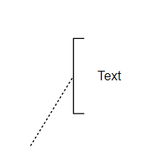
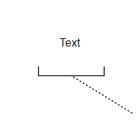

# BPMN Text Annotation in Angular Diagram

## Overview

A BPMN object can be associated with a text annotation that provides additional details about objects within a flow without affecting the actual process flow. Text annotations serve as documentation elements that help explain or clarify specific aspects of the BPMN diagram.

A TextAnnotation points to or references another BPMN shape through the [`textAnnotationTarget`](https://helpej2.syncfusion.com/angular/documentation/api/diagram/bpmnTextAnnotation#textannotationtarget) property. When the target shape is moved or deleted, any TextAnnotations attached to the shape will automatically move or be deleted as well. This ensures that TextAnnotations remain associated with their target shapes, though the TextAnnotation can be repositioned to any offset from its target.

The annotation element can be switched from one BPMN node to another by simply dragging the source end of the annotation connector to the desired BPMN node. By default, the TextAnnotation shape includes a connection to its target.

Before working with BPMN text annotations, ensure the BPMN shapes modules are injected into the Diagram. For more information, refer to the [BPMN Shapes](../bpmn-shapes/bpmn-shapes) and [Module Injection](../module-injection.md) documentation.

## Key properties

The [`textAnnotationDirection`](https://helpej2.syncfusion.com/angular/documentation/api/diagram/bpmnTextAnnotation#textannotationdirection) property controls the shape direction of the text annotation. By default, this property is set to `Auto`, which automatically determines the optimal direction based on the target's position.

The [`textAnnotationTarget`](https://helpej2.syncfusion.com/angular/documentation/api/diagram/bpmnTextAnnotation#textannotationtarget) property specifies the BPMN shape to which the text annotation is associated. When the target shape is moved or deleted, the associated TextAnnotation moves or is deleted automatically.

To set the size for text annotation, use the [`width`](https://helpej2.syncfusion.com/angular/documentation/api/diagram/node#width) and [`height`](https://helpej2.syncfusion.com/angular/documentation/api/diagram/node#height) properties of the node.

The [`offsetX`](https://helpej2.syncfusion.com/angular/documentation/api/diagram/node#offsetx) and [`offsetY`](https://helpej2.syncfusion.com/angular/documentation/api/diagram/node#offsety) properties position the TextAnnotation node at the specified coordinates on the diagram.

```
let textAnnotation = {
    offsetX: 300,
    offsetY: 100,
    width: 100,
    height: 40,
    annotations: [{ content: 'Text Annotation' }],
    shape: {
        type: 'Bpmn',
        shape: 'TextAnnotation',
        textAnnotation: {
            //Parent node of text annotation
            textAnnotationTarget: 'event',
            textAnnotationDirection: 'Auto',
        },
    },
};
```










  


## Text Annotation in Palette

Text annotation nodes can be rendered in the symbol palette alongside other BPMN shapes. The following example demonstrates how to render BPMN text annotation nodes in the symbol palette.










  


## Connect the Text Annotation to a BPMN Node

Users can drag and drop any BPMN shapes from the palette to the diagram and connect text annotations to BPMN nodes by interacting with the diagram.

Perform the following steps to connect a text annotation to a BPMN node:

1. Drag the BPMN text annotation shape from the symbol palette and drop it onto the diagram.
2. Drag the BPMN node to be annotated from the palette and place it on the diagram.
3. Hover over the text annotation to reveal its connector endpoint, then drag the connector source end and drop it onto the target BPMN node to establish the connection.

The following image demonstrates how to drag a symbol from the palette and connect the text annotation to a BPMN node using interaction.


## Text Annotation Direction

The text annotation supports several directional orientations to optimize the visual layout of the diagram:

| Text annotation direction | Description | Image |
| -------- | -------- | -------- |
| Auto | Automatically determines the optimal direction based on target position |  |
| Left | Positions the annotation to the left of the target |  |
| Right | Positions the annotation to the right of the target |  |
| Top | Positions the annotation above the target |  |
| Bottom | Positions the annotation below the target |  |

## Add Text Annotation at Runtime

Text annotations can be added dynamically using either the [`addTextAnnotation`](https://helpej2.syncfusion.com/angular/documentation/api/diagram#addtextannotation) method or the [`add`](https://helpej2.syncfusion.com/angular/documentation/api/diagram#add) method of the diagram. Use the [`addTextAnnotation`](https://helpej2.syncfusion.com/angular/documentation/api/diagram#addtextannotation) method when you want to add a text annotation and associate it with a specified BPMN node, and use the [`add`](https://helpej2.syncfusion.com/angular/documentation/api/diagram#add) method when you want to add a standalone object to the diagram canvas. The following example shows how to use these methods to add a text annotation node programmatically.










  
