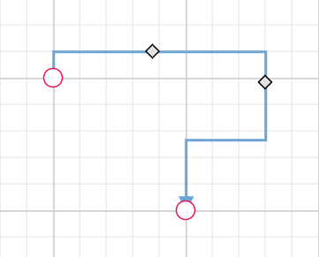

# Connector Customization

The Diagram component provides extensive customization options for connectors, allowing developers to modify visual appearance, behavior, and interaction properties. This guide covers decorator shapes, styling options, spacing controls, bridging effects, and advanced connector features.

## Decorator shapes and customization

Decorators are visual elements that appear at the starting and ending points of connectors, typically used to indicate direction or relationship types such as arrows, circles, diamonds, or custom shapes.

### Basic decorator configuration

The connection end points can be decorated using the [`sourceDecorator`](https://ej2.syncfusion.com/angular/documentation/api/diagram/connector#sourcedecorator) and [`targetDecorator`](https://ej2.syncfusion.com/angular/documentation/api/diagram/connector#targetdecorator) properties of the connector.

The [`shape`](https://ej2.syncfusion.com/angular/documentation/api/diagram/decoratorShapes) property of `sourceDecorator` allows defining the shape of the source decorators. Similarly, the [shape](https://ej2.syncfusion.com/angular/documentation/api/diagram/decoratorShapes) property of `targetDecorator` allows defining the shape of the target decorators.

To create custom shapes for decorators, use the [`pathData`](https://ej2.syncfusion.com/angular/documentation/api/diagram/decorator#pathdata) property to define SVG path strings for both source and target decorators.

The following code example illustrates how to create decorators of various shapes.










  


### Customize the decorator appearance

The visual appearance of decorators can be customized using stroke and fill properties to match design requirements or highlight specific connector types.

o customize the border of a decorator, use the [`strokeColor`](https://ej2.syncfusion.com/angular/documentation/api/diagram/strokeStyle#strokecolor), [`strokeWidth`](https://ej2.syncfusion.com/angular/documentation/api/diagram/strokeStyle#strokewidth), and [`strokeDashArray`](https://ej2.syncfusion.com/angular/documentation/api/diagram/strokeStyle#strokedasharray) properties on the `sourceDecorator` and `targetDecorator` objects. Similarly, use the `width` and `height` properties to control the size of each decorator.

The following code example illustrates how to customize the appearance of the decorator.










  


### Gradient styling for decorators

The gradient property applies smooth color transitions to decorators, providing enhanced visual appeal for complex diagrams or when highlighting important connections.

The gradient property supports two types of gradients:
 * Linear - Creates a straight-line color transition
 * Radial - Creates a circular color transition from center outward

The following code example illustrates how to apply gradient effects to decorators.










  


## Spacing and padding controls

### Padding between connectors and nodes

Padding creates visual separation between connector endpoints and the nodes they connect, preventing connectors from appearing to touch or overlap with node boundaries.

The [`sourcePadding`](https://ej2.syncfusion.com/angular/documentation/api/diagram/connector#sourcepadding) property of the connector defines space between the source point and the source node of the connector.

The [`targetPadding`](https://ej2.syncfusion.com/angular/documentation/api/diagram/connector#targetpadding) property of the connector defines space between the end point and the target node of the connector.

The following code example illustrates how to leave space between the connection endpoints and source and target nodes.










  


## Advanced connector features

### Line bridging for intersection handling

Line bridging creates visual bridges where connectors intersect, helping users distinguish between different connection paths in complex diagrams. By default, [`bridgeDirection`](https://ej2.syncfusion.com/angular/documentation/api/diagram/bridgeDirection) is set to top, with the bridge appearing based on the specified direction.

Bridging can be enabled or disabled using either `connector.constraints` or `diagram.constraints`. The following code example illustrates how to enable line bridging.










  


> Note: The `ConnectorBridging` module must be injected into the diagram to use this feature.

The [`bridgeSpace`](https://ej2.syncfusion.com/angular/documentation/api/diagram/connector#bridgespace) property of connectors defines the width for line bridging.

**Limitation**: Bezier segments do not support bridging functionality.

### Hit padding for interaction

The [`hitPadding`](https://ej2.syncfusion.com/angular/documentation/api/diagram/connector#hitpadding) property defines the clickable area around the connector path, making it easier for users to select connectors, especially thin ones. This improves user experience by expanding the interactive zone without changing the visual appearance. The default value for hitPadding is 10.

The following code example illustrates how to specify hit padding for connectors.










  


### Corner radius for rounded connectors

Corner radius creates connectors with rounded corners instead of sharp angles, providing a more polished appearance for diagrams. The radius of the rounded corner is set with the [`cornerRadius`](https://ej2.syncfusion.com/angular/documentation/api/diagram/connector#cornerradius) property.










  


## Connector Appearance

* The connector’s [`strokeWidth`](https://ej2.syncfusion.com/angular/documentation/api/diagram/strokeStyle#strokewidth), [`strokeColor`](https://ej2.syncfusion.com/angular/documentation/api/diagram/strokeStyle#strokecolor), [`strokeDashArray`](https://ej2.syncfusion.com/angular/documentation/api/diagram/strokeStyle#strokedasharray), and [`opacity`](https://ej2.syncfusion.com/angular/documentation/api/diagram/strokeStyle#opacity) properties are used to customize the appearance of the connector segments.

* The [`visible`](https://ej2.syncfusion.com/angular/documentation/api/diagram/connector#visible) property of the connector enables or disables the visibility of connector.

* Default values for all the `connectors` can be set using the `getConnectorDefaults` properties. For example, if all connectors have the same type or having the same property then such properties can be moved into `getConnectorDefaults`.

### Segment appearance

The following code example illustrates how to customize the segment appearance.










  



## Connector constraints and behavior

The [`constraints`](https://ej2.syncfusion.com/angular/documentation/api/diagram/connector#constraints) property of connectors enables or disables specific features such as selection, editing, deletion, or interaction behaviors.

To enable or disable constraints, refer to [`constraints`](https://ej2.syncfusion.com/angular/documentation/api/diagram/connectorConstraints#connectorconstraints).

The following code illustrates how to disable selection for a connector.










  


## Additional connector properties

### Adding custom information

The [`addInfo`](https://ej2.syncfusion.com/angular/documentation/api/diagram/connector#addinfo) property of connectors allows maintaining additional information or metadata associated with connectors for application-specific requirements.

```html
<e-connectors>
    <e-connector id='connector1' type='Straight' addInfo='centralconnector' [sourcePoint]='sourcePoint1' [targetPoint]='targetPoint1' [constraints]='constraints'></e-connector>
</e-connectors>
```

### Z-index for layering control

The [`zIndex`](https://ej2.syncfusion.com/angular/documentation/api/diagram/connector#zindex) property specifies the stack order of connectors. A connector with a greater stack order appears in front of connectors with lower stack orders, enabling precise control over visual layering.

The following code illustrates how to render connector based on the stack order.










  


### Connector spacing for routing

The [`connectorSpacing`](https://ej2.syncfusion.com/angular/documentation/api/diagram/connector#connectorspacing) property defines the minimum distance between the source node and the connector when automatic routing occurs. This determines how far the connector will reroute around obstacles or the minimum length for new segments.

The following code example illustrates how to configure connector spacing.













#### Maximum segment thumbs

The [`maxSegmentThumb`](https://ej2.syncfusion.com/angular/documentation/api/diagram/connector#maxsegmentthumb) property limits the number of segment manipulation handles displayed on a connector, helping maintain clean interfaces in complex diagrams.















#### Reset segments to default state

The [`resetSegments`](https://ej2.syncfusion.com/angular/documentation/api/diagram#resetsegments) method resets connector segments to their default state based on connection points. This operation removes custom segments and restores connectors to their original configuration, useful for cleaning up user modifications.












## Dynamic connector manipulation

### Enable connector splitting

Connector splitting allows creating new connections when a node is dropped onto an existing connector. The connector splits at the drop point, creating connections between the new node and the existing connected nodes. Enable this feature by setting [`enableConnectorSplit`](https://ej2.syncfusion.com/angular/documentation/api/diagram#enableconnectorsplit) to true. The default value is false.

The following code illustrates how to enable connector splitting functionality.










  



### Preserve Connector Styling when Splitting

When splitting a connector using [`enableConnectorSplit`](https://ej2.syncfusion.com/angular/documentation/api/diagram#enableconnectorsplit), the newly created connector appears as a default connector without inheriting the original connector's styling. To maintain consistent styling, use the collectionChange event to apply the original connector's properties to the new connector.

The following example demonstrates how to preserve the original connector's styling for newly created connectors during splitting:










  
