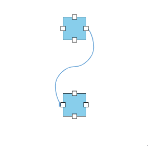
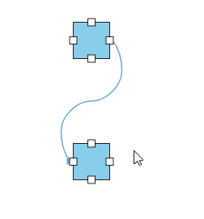
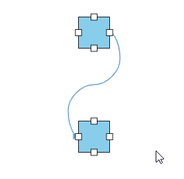
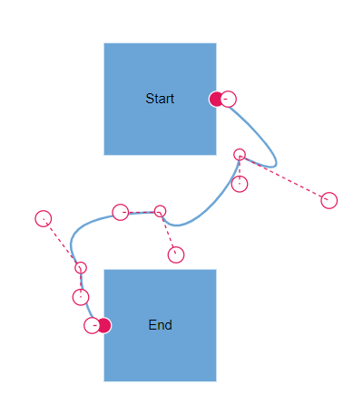
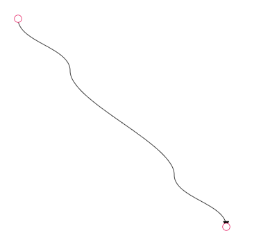
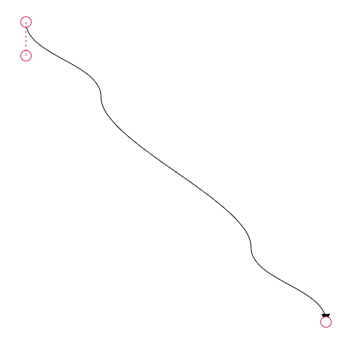
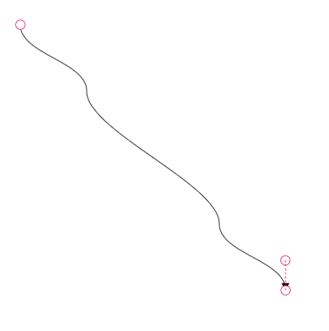
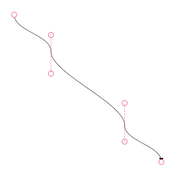
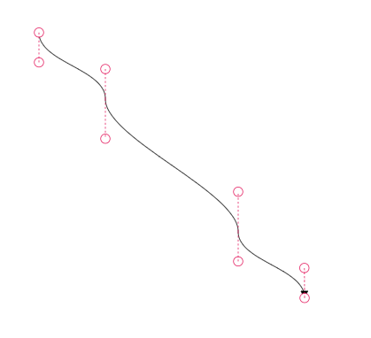

# Bezier Control Points Interaction

Bezier control points determine the curvature and shape of bezier connector segments in Angular Diagram components. These interactive handles allow users to modify connector paths dynamically while maintaining visual consistency across multiple segments.

## Configure Bezier Segment Smoothness

When working with multiple bezier segments, maintain visual consistency by configuring the smoothness behavior of control points using the [`bezierSettings`](https://ej2.syncfusion.com/angular/documentation/api/diagram/bezierSettingsModel/) property of the connector. The smoothness property controls how adjacent control points respond when one is modified.

| BezierSmoothness Value | Description | Output |
|-------- | -------- | -------- |
| SymmetricDistance | Adjacent segment control points maintain equal distance when either control point is modified |  |
| SymmetricAngle | Adjacent segment control points maintain equal angles when either control point is modified |  |
| Default | Adjacent segment control points maintain both equal distance and equal angles when either control point is modified |  |
| None | Control points operate independently without affecting adjacent segments |  |













## Control Bezier Control Points Visibility

Configure which control points are visible during interaction using the [`controlPointsVisibility`](https://ej2.syncfusion.com/angular/documentation/api/diagram/controlPointsVisibility/) property within [`bezierSettings`](https://ej2.syncfusion.com/angular/documentation/api/diagram/bezierSettingsModel/). This property provides granular control over control point display for different connector segments.

| ControlPointsVisibility Value | Description | Output |
|-------- | -------- | -------- |
| None | Hides all control points across the entire bezier connector |  |
| Source | Shows control points only for the source segment while hiding all others |  |
| Target | Shows control points only for the target segment while hiding all others |  |
| Intermediate | Shows control points only for intermediate segments while hiding source and target control points |  |
| All | Shows control points for all segments including source, target, and intermediate segments |  |