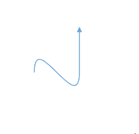
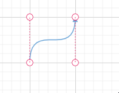
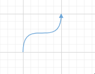
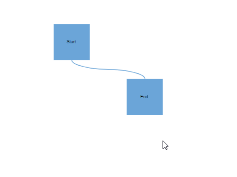
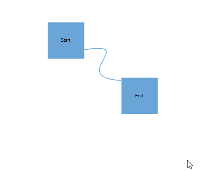

# Bezier Connectors in Angular Diagram

Bezier connectors are used to create smooth, curved lines between nodes in a diagram. These curves are mathematically defined and can be finely controlled through control points or vectors, allowing for precise and aesthetically pleasing visual connections.

To create a Bezier connector, set the `type` property of the connector to `bezier`. The curve itself is defined by one or more segments of `type` as `bezier`. The following example shows how to define a simple Bezier connector.










  


### Bezier Segment Editing

The shape of a Bezier connector can be interactively modified by dragging its segment control points. These points, also known as thumbs, appear along the connector and allow you to adjust the curve's vectors and points.

### Control Points

The curvature of a Bezier segment is determined by its control points. There are two primary ways to define the position of these control points:

*   **Fixed Positioning (`point1`, `point2`)**: When you use the [`point1`](https://ej2.syncfusion.com/angular/documentation/api/diagram/bezierSegment/#point1) and [`point2`](https://ej2.syncfusion.com/angular/documentation/api/diagram/bezierSegment/#point2) properties, the control points are set at fixed coordinates. These points remain stationary even when the connector's start or end points are moved. This is useful for creating static, predictable curves.

*   **Dynamic Positioning (`vector1`, `vector2`)**: When you use the [`vector1`](https://ej2.syncfusion.com/angular/documentation/api/diagram/bezierSegment/#vector1) and [`vector2`](https://ej2.syncfusion.com/angular/documentation/api/diagram/bezierSegment/#vector2) properties, the control points are defined by a vector (angle and distance) from the connector's endpoints. This approach allows the curve to adapt dynamically while maintaining its original shape relative to the endpoints.

#### Using Fixed Points

The following example demonstrates how to configure a Bezier segment using the `point1` and `point2` properties for fixed control points.










  


#### Using Dynamic Vectors

The following example shows how to configure a Bezier curve using the `vector1` and `vector2` properties for dynamic control points.










  


### Automatic Overlap Avoidance

By default, if no segments are explicitly defined for a Bezier connector, the Diagram component automatically generates segments. This routing logic is designed to prevent the connector from overlapping with its connected source and target nodes, ensuring a clean and readable layout.













### Segment Reset Behavior

The `allowSegmentReset` property gives you control over whether a Bezier segment’s control points should be reset to their default positions when the source or target node is moved. This provides greater flexibility in maintaining custom curve shapes during diagram editing.

#### `allowSegmentReset` is `true` (Default)

When `allowSegmentReset` is `true`, moving a connected node will reset the Bezier control points, recalculating the curve.

#### `allowSegmentReset` is `false`

When `allowSegmentReset` is `false`, the custom positions of the control points are preserved when a connected node is moved, maintaining the user-defined curve.










  


### Customizing Bezier Segment Thumb Size

The interactive thumbs used to edit Bezier segments have a default size of 10x10 pixels. This size can be customized either globally for all connectors or on a per-connector basis using the `segmentThumbSize` property.

To change the thumb size for all Bezier connectors in the diagram, set the [`segmentThumbSize`](https://ej2.syncfusion.com/angular/documentation/api/diagram/#segmentthumbsize) property in the diagram's model.

To customize the thumb size for a specific connector, you must first disable the `InheritSegmentThumbSize` constraint and then set the connector's individual `segmentThumbSize` property.










  
