# Orthogonal Connectors in Angular Diagram Component

Orthogonal connectors use segments that are always perpendicular to each other, which is ideal for creating structured layouts in flowcharts or organizational charts.

To create an orthogonal connector, set the connector's [`type`](https://ej2.syncfusion.com/angular/documentation/api/diagram/connector/#type) property to `Orthogonal`. The following code example illustrates how to create a default orthogonal connector.

For more fine-grained control, you can define individual segments within the [`segments`](https://ej2.syncfusion.com/angular/documentation/api/diagram/connector/#segments) collection. The [`length`](https://ej2.syncfusion.com/angular/documentation/api/diagram/orthogonalSegment/#length) property specifies the length of a segment, while the [`direction`](https://ej2.syncfusion.com/angular/documentation/api/diagram/orthogonalSegment/#direction) property determines its orientation (e.g., 'Right', 'Bottom'). The following code example shows how to create a connector with customized orthogonal segments.










  


N> When defining custom segments for an orthogonal connector, ensure that each segment's `type` is also set to `Orthogonal`.

## Orthogonal Segment Editing

The interactive thumbs on an orthogonal connector allow you to adjust the length of adjacent segments by clicking and dragging them. While dragging a thumb, segments may be added or removed automatically to maintain the connector's orthogonal path.










  


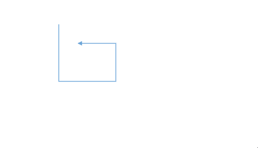

## Avoid Overlapping

Orthogonal segments automatically reroute themselves to avoid overlapping with their connected source and target nodes. The following example illustrates how an orthogonal connector adjusts its path when a connected node is moved.










  


## How to Customize Orthogonal Segment Thumb Shape

The thumbs used to edit orthogonal segments are rendered as a `Circle` by default. You can change this shape using the diagram's [`segmentThumbShape`](https://ej2.syncfusion.com/angular/documentation/api/diagram/#segmentthumbshape) property. The following predefined shapes are available:

| Shape Name | Preview |
|---|---|
| Rhombus | 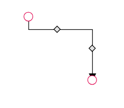 |
| Square | 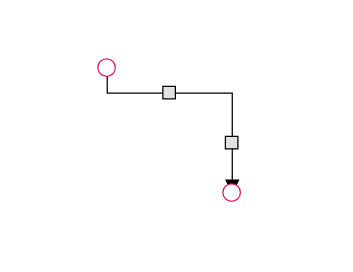 |
| Rectangle | 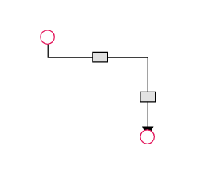 |
| Ellipse | 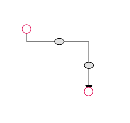 |
| Arrow| 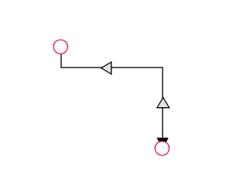 |
| OpenArrow | 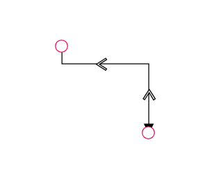 |
| Circle |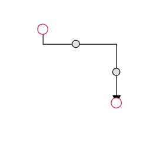 |
| Fletch|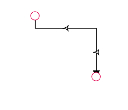 |
| OpenFetch| 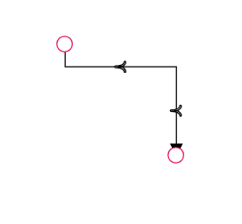 |
| IndentedArrow | 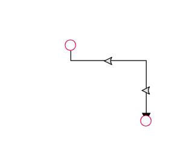 |
| OutdentedArrow | 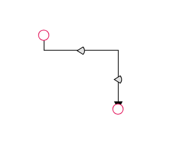 |
| DoubleArrow |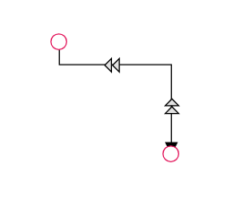 |

You can also customize the style of the thumb shape by overriding the `e-orthogonal-thumb` CSS class.










  



Use the following CSS to customize the segment thumb's appearance.

```scss
.e-orthogonal-thumb {
    fill: rgb(126, 190, 219);
    stroke: #24039e;
    stroke-width: 3px;
}
```

## How to Customize Orthogonal Segment Thumb Size

By default, orthogonal segment thumbs have a width and height of 10px. This can be customized for all connectors or for individual ones using the [`segmentThumbSize`](https://ej2.syncfusion.com/angular/documentation/api/diagram/#segmentthumbsize) property.

To change the thumb size for all orthogonal connectors in a diagram, set the [`segmentThumbSize`](https://ej2.syncfusion.com/angular/documentation/api/diagram/#segmentthumbsize) property in the diagram model.

To customize the thumb size for a specific connector, you must first disable its `InheritSegmentThumbSize` flag in the [`constraints`](https://ej2.syncfusion.com/angular/documentation/api/diagram/connectorConstraints/) property. Then, set the connector's [`segmentThumbSize`](https://ej2.syncfusion.com/angular/documentation/api/diagram/connector/#segmentthumbsize/) value as needed.










  
