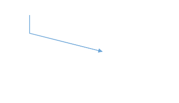

# Straight Connector Segments

Straight connector segments create direct linear connections between two points in a diagram. These segments are the simplest form of connector routing, providing the shortest path between nodes or connection points. Straight segments are ideal when you need clean, unobstructed connections without intermediate directional changes.

## Creating straight segments

To create a straight line connector, specify the [`type`](https://ej2.syncfusion.com/angular/documentation/api/diagram/segments) of the segment as **Straight** and add it to the [`segments`](https://ej2.syncfusion.com/angular/documentation/api/diagram/connector#segments) collection. You must also specify the [`type`](https://ej2.syncfusion.com/angular/documentation/api/diagram/connector#type) property for the connector itself. The following code example demonstrates how to create a basic straight segment connector.










  


## Defining segment end points

The [`point`](https://ej2.syncfusion.com/angular/documentation/api/diagram/straightSegment#point) property of a straight segment allows you to define its end point coordinates. This provides precise control over where each segment terminates, enabling complex connector paths composed of multiple straight segments. The following code example illustrates how to define the end point of a straight segment.










  


## Straight segment editing

The endpoint of each straight segment is represented by a visual thumb control that enables interactive editing of the segment position. This allows users to dynamically modify connector paths by dragging segment endpoints.

### Adding segments

New segments can be inserted into a straight line connector by clicking on the connector while pressing Shift and Ctrl keys simultaneously (Ctrl+Shift+Click). This creates additional control points for more complex routing.

### Removing segments

Straight segments can be removed by clicking the segment end point while holding Ctrl and Shift keys (Ctrl+Shift+Click). This simplifies the connector path by eliminating unnecessary way points.

### Programmatic editing

You can also add or remove segments programmatically using the [`editSegment`](https://ej2.syncfusion.com/angular/documentation/api/diagram#editsegment) method of the diagram component. This provides API-level control over connector segment manipulation.

The following example demonstrates how to add segments to a straight connector programmatically.










  


