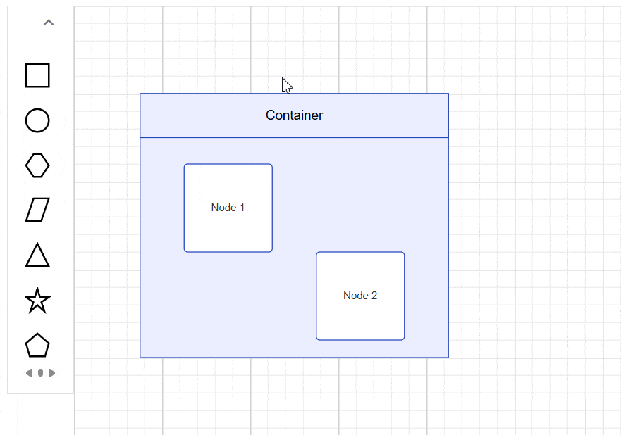

# Container in Angular Diagram Component

A Container is a specialized node that groups logically related shapes within a visible boundary. Unlike regular groups, containers automatically manage child elements while maintaining individual element properties. Common use cases include organizing related components in flowcharts, creating swimlanes in process diagrams, and building composite UI layouts.

## Create Container

### Add a Container

Container nodes require specific configuration to enable child element management and boundary recognition. The following example demonstrates creating a basic container with essential properties:










  


### Setting a Header

Headers provide textual identification for containers and can be fully customized for appearance and behavior. The [header](https://ej2.syncfusion.com/angular/documentation/api/diagram/containerModel/#header) property accepts text content, while the header's [style](https://ej2.syncfusion.com/angular/documentation/api/diagram/headerModel/#style) property controls visual formatting including fonts, colors, and alignment.

The following example shows header configuration with custom styling:










  


N> Double-click the header region to enable inline text editing functionality.

### Container from symbol palette

Preconfigured container templates can be added to the symbol palette for reusable across diagrams. This approach standardizes container designs and accelerates diagram creation workflows.

For detailed symbol palette integration steps, refer to the [Symbol Palette](./symbol-palette/symbol-palette) documentation.

### Interactively Add or Remove Elements

The diagram supports drag-and-drop operations for adding elements to containers at runtime. When elements approach a container's boundary, visual feedback indicates drop zones, and the container automatically expands to accommodate new children while maintaining proper spacing.

## Interaction

Containers support the same interactions as regular nodes—such as selection, dragging, resizing, and rotating. For more information refer to the [`nodes interactions`](./nodes/nodes-interaction)

## Events

The events triggered when interacting with container nodes are similar to those for individual nodes. For more information, refer to the [`nodes events`](./nodes/nodes-events)

## See Also

* [How to add nodes to the symbol palette](./symbol-palette/symbol-palette)
* [How to customize nodes](./nodes/nodes-customization)
* [How to add ports to the node](./ports/ports)
* [How to enable/disable the behavior of the node](./constraints)
* [How to create diagram nodes using drawing tools](./tools)
