# Flowchart layout in Angular Diagram control

The flowchart layout provides a visual representation of processes, workflows, systems, or algorithms in a diagrammatic format. It uses various symbols to depict different actions, with arrows connecting these symbols to indicate the flow or direction of the process. Flowcharts are essential tools for illustrating step-by-step sequences, making complex processes easier to understand and communicate.

## Common flowchart symbols

Different flowchart symbols have different meanings that are used to represent different states in flowchart. The following table describes the most common flowchart symbols that are used in creating flowchart.

|Symbol|Shape name|Description|
|---|---|---|
|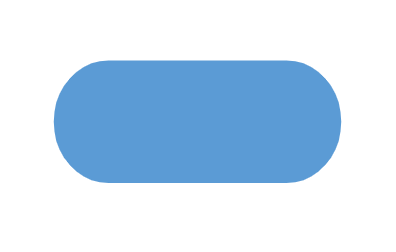|Terminator|Indicates the beginning and ending of the process.|
||Data|Indicates data input or output for a process.|
||Process|Represents an operation or set of operations and data manipulations.|
|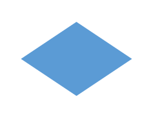|Decision|Shows a branching point where the decision is made to choose one of the two paths|
||Document|Represents a single document or report in the process.|
||PreDefinedProcess|Represents a sequence of actions that combine to perform a specific task that is defined elsewhere.|
|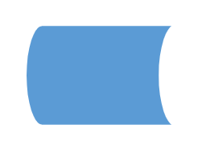|StoredData|Represents a step where data get stored within a process.|
||InternalStorage|Represents the internal storage|
|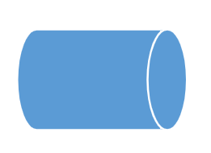|DirectData|Represents a collection of information that allows searching, sorting, and filtering.|
|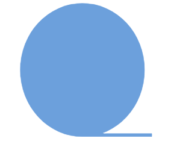|SequentialData|Represents the data that must be accessed sequentially|
||Sort|Represents a step that organizes items list sequentially|
||PaperTap|Represents a step where data get stored within a process.|
||ManualInput|Represents the manual input of data into a field or step in a process.|
|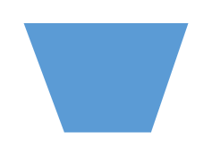|ManualOperation|Represents an operation in a process that must be done manually, not automatically.|
|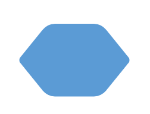|Preparation|Represents a setup or initialization process to another step in the process.|
|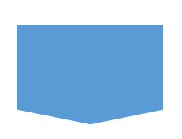|OffPageReference|Represents a labeled connector used to link two flowcharts on different pages.|
|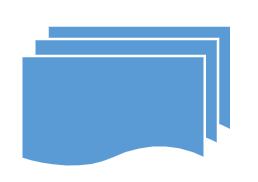|MultiDocument|Represents multiple documents or reports in the process.|
||Card|Represents a data card or punched card used for data entry or storage |
|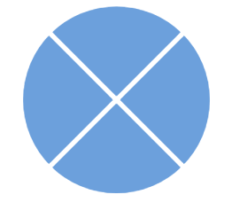|SummingJunction|Represents the logical AND (merge multiple inputs into a single output). |
|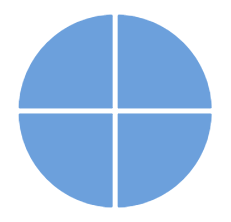|Or|Represents the logical OR|
|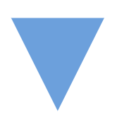|Merge|Represents a step where two or more sub-lists or sub-processes become one.|
|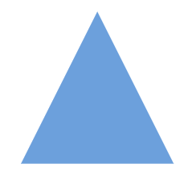|Extract|Represents retrieving or obtaining data from a source for further processing or analysis in a flowchart.|
|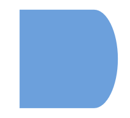|Delay|Represents the period of delay in a process|
||Collate|Represents the process of gathering and arranging data or documents from multiple sources into a structured format.|
|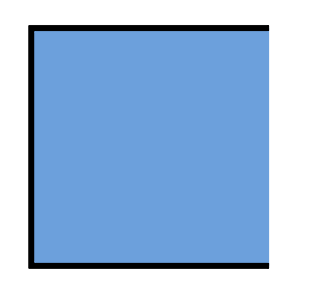|Annotation|Represents additional information, clarifications, about a process or decision point in the flowchart.|
||Annotation2|Represents additional information, or comments about a process in the flowchart.|
|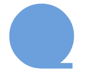|SequentialAccessStorage|Represents information that is stored in a sequence.|
|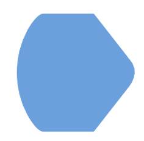|Display|Represents that the information, data, or output is being shown on a screen or printed for the user’s review.|
|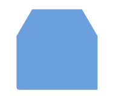|LoopLimit|Represents a maximum number of times a particular process or operation can be repeated within a loop.|
|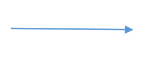|Connector|Represents a direction of flow from one step to another. It will get created automatically based on the relationship between the parent and child.|

## Render Flowchart layout with data source

To render `flowchart` layout, you need to set the [`layoutType`](https://ej2.syncfusion.com/angular/documentation/api/diagram/layout/#type) property as `Flowchart`. The following code example displays how to render flowchart layout using data source.














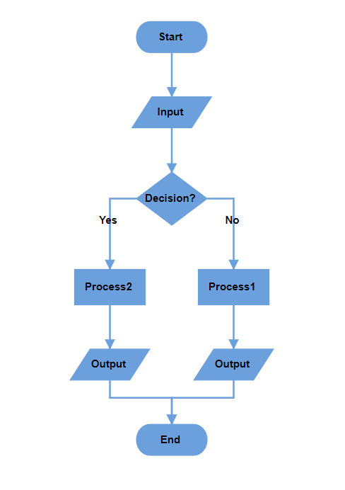

>Note: If you want to convert the data source into flowchart layout, you need to inject DataBinding along with FlowchartLayout module in the diagram.


## Defining data source with appearance configuration

In the flowchart layout, you can define the desired shape, style, and label for each node, as well as the decorator type for connectors, directly within the data source. The data source should be structured as shown in the example below:

```javascript
 var Data =  [
        {
            "id": "A",
            "name": "Start",
            "shape": "Terminator",
            "color": "#90EE90",
            "parentId": null,
            "stroke": "#333",
            "strokeWidth": 2
        },
        {
            "id": "B",
            "name": "Process",
            "shape": "Process",
            "color": "#4682B4",
            "parentId": [
                "A"
            ],
            "label":['A-B'],
            "arrowType": "Fletch",
            "stroke": "#333",
            "strokeWidth": 2
        },
    ]

```


### Field Definitions
- `name`: Represents the annotation displayed on the node.
- `shape`: Defines the shape of the node (e.g., Terminator, Process).
- `color`: Specifies the fill color of the node.
- `stroke`: Defines the border color of the node.
- `strokeWidth`: Specifies the border thickness of the node.
- `label`: Adds annotations to the incomming connectors.
- `arrowType`: Determines the arrowhead type (decorator) of the incoming connector (e.g., Diamond, Fletch).

This structure allows for easy customization of the flowchart's visual elements based on the provided data source.


## Render Flowchart layout with nodes and connectors

The following example demonstrates how to render a flowchart layout using nodes and connectors. To achieve this, you need to define the [`nodes`](https://ej2.syncfusion.com/angular/documentation/api/diagram/nodeModel/) and [`connectors`](https://ej2.syncfusion.com/angular/documentation/api/diagram/connectormodel/) collections and assign them to the diagram. Additionally, you need to set the [`layoutType`](https://ej2.syncfusion.com/angular/documentation/api/diagram/layout/#type) to `Flowchart`.















## Customize flowchart layout orientation

The sequence of a node's direction can be customized by flowchart's orientation, either vertically from top to bottom or horizontally from left to right. The [orientation](https://ej2.syncfusion.com/angular/documentation/api/diagram/layout/#orientation) property of the layout class allows you to define the flow direction for the flowchart as either `TopToBottom` or `LeftToRight`. The default orientation is `TopToBottom`.


### TopToBottom orientation

This orientation arranges elements in the layout vertically, flowing from top to bottom. It is commonly used in flowcharts to represent the sequential progression of steps or actions in a process.

```typescript

//Initialize the diagram
<ejs-diagram #diagram id="diagram" width="100%" height="600px" [layout]="layout"> </ejs-diagram>

export class AppComponent {
  @ViewChild("diagram")
  public diagram!: DiagramComponent;
  public layout?: LayoutModel;
  ngOnInit(): void {
    this.layout = {
        //Sets layout type
        type: 'Flowchart',
        //Sets the orientation of the layout
        orientation: 'TopToBottom'
    },
  }
};

```


### LeftToRight orientation

This orientation arranges elements in the layout horizontally, flowing from left to right. It is typically used to represent processes or workflows that move sequentially across the page, emphasizing a linear progression of steps or actions.

```typescript

//Initialize the diagram
<ejs-diagram #diagram id="diagram" width="100%" height="600px" [layout]="layout"> </ejs-diagram>

export class AppComponent {
  @ViewChild("diagram")
  public diagram!: DiagramComponent;
  public layout?: LayoutModel;
  ngOnInit(): void {
    this.layout = {
        //Sets layout type
        type: 'Flowchart',
        //Sets the orientation of the layout
        orientation: 'LeftToRight'
    },
  }
};

```


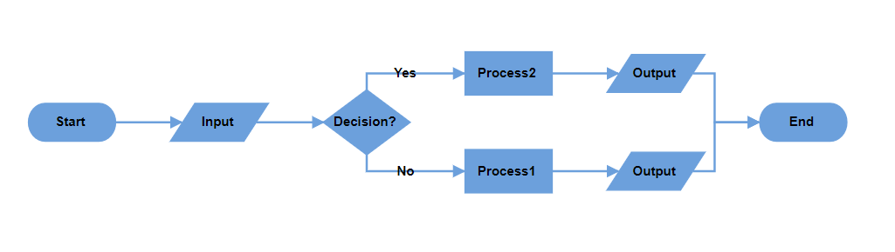


## Customize the decision output directions

The decision symbol in a flowchart represents a question or condition that leads to different paths based on a binary outcome (Yes/No, True/False). You can customize the output direction of these paths using the [`yesBranchDirection`](https://ej2.syncfusion.com/angular/documentation/api/diagram/branchDirection/) and [`noBranchDirection`](https://ej2.syncfusion.com/angular/documentation/api/diagram/branchDirection/) properties of the [`flowchartLayoutSettings`](https://ej2.syncfusion.com/angular/documentation/api/diagram/flowchartLayoutSettingsModel/) class.

- `LeftInFlow` - Arranges the Yes/No branch to the left of the decision symbol.
- `RightInFlow` - Arranges the Yes/No branch to the right of the decision symbol.
- `SameAsFlow` - Aligns the Yes/No branch in the same direction as the flow of the decision symbol.

The following example shows flowchart layout with `yesBranchDirection` as `SameAsFlow` and `noBranchDirection` as `LeftInFlow`.















The following table will explain the pictorial representation of the behavior:

|YesBranchDirection| NoBranchDirection | TopToBottom | LeftToRight |
|---|---|---|---|
| Left In Flow |Right In Flow|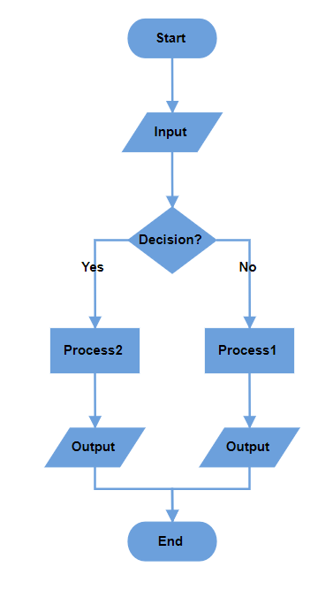|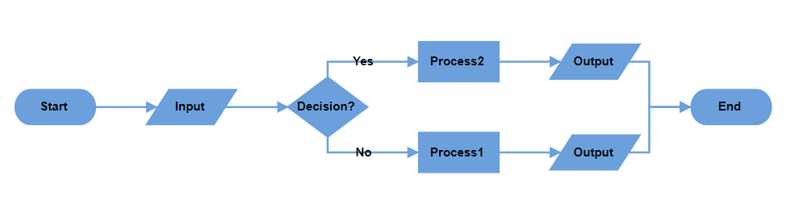|
| Right In Flow |Left In Flow |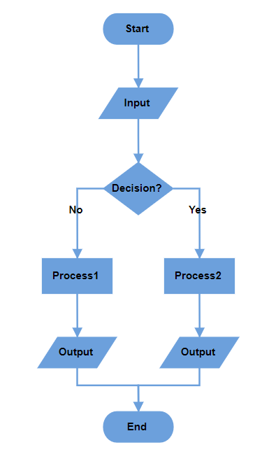|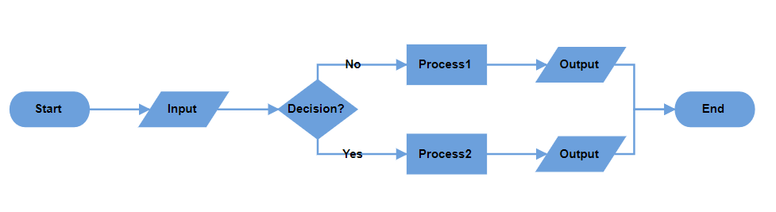 |
| Same As Flow |Right In Flow |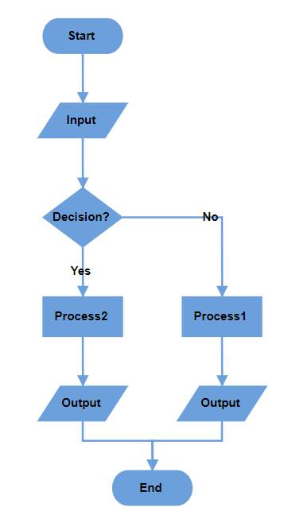|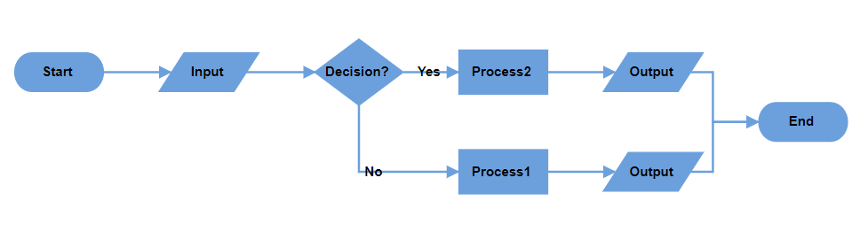 |
| Same As Flow |Left In Flow |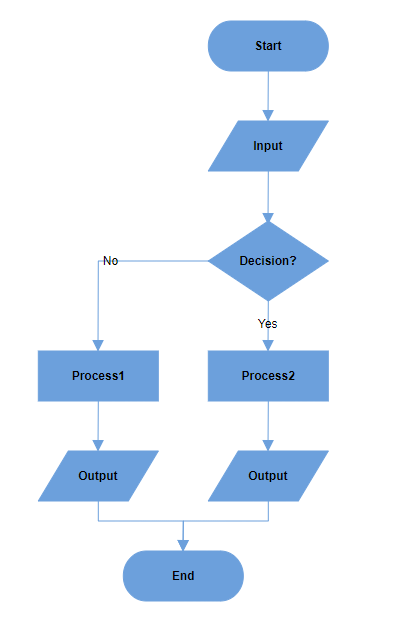|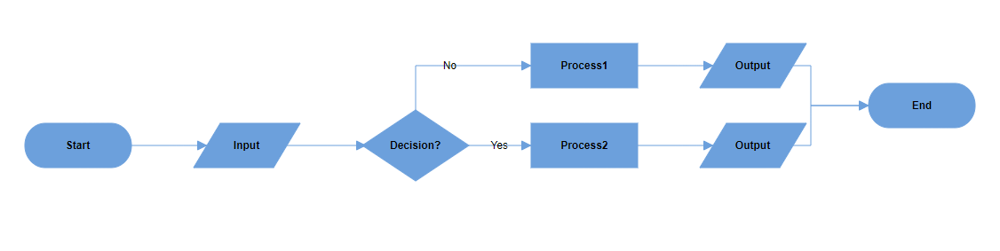 |
| Right In Flow | Same As Flow |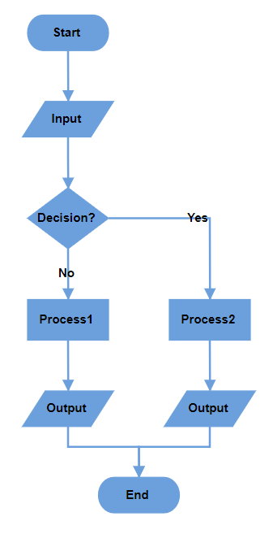|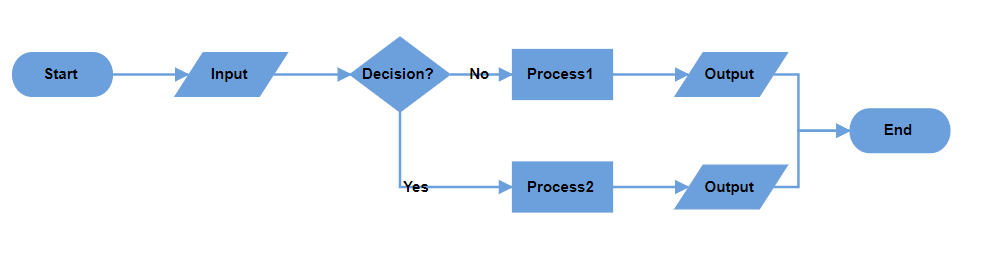 |
| Left In Flow | Same As Flow |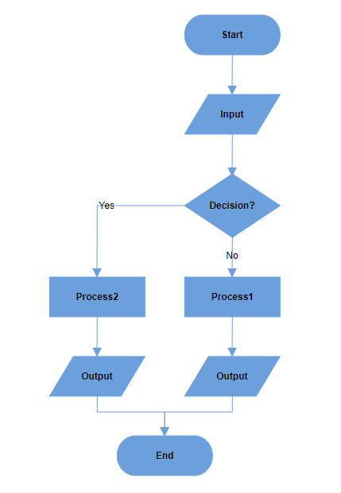|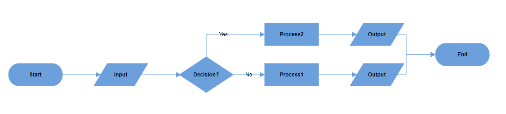 |
|Same As Flow |Same As Flow|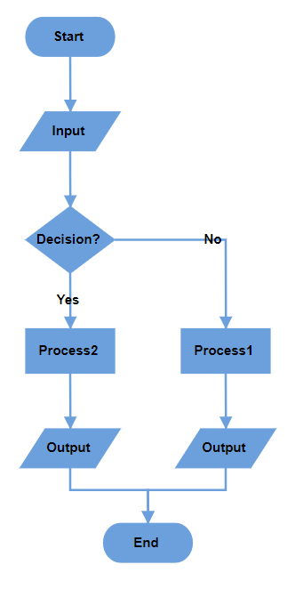|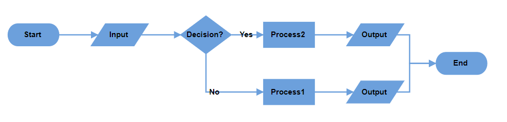|

>Note: If both branch directions are same, **Yes** branch will be prioritized.


## Custom Yes and No branch values

The decision symbol produces two output branches: a Yes branch and a No branch. If the connector text value matches any value in the [`yesBranchValues`](https://ej2.syncfusion.com/angular/documentation/api/diagram/flowchartLayoutSettingsModel/#yesbranchvalues) property of the [`flowchartLayoutSettings`](https://ej2.syncfusion.com/angular/documentation/api/diagram/flowchartLayoutSettingsModel/) class, it will be considered a Yes branch. Similarly, if the connector text value matches any value in the [`noBranchValues`](https://ej2.syncfusion.com/angular/documentation/api/diagram/flowchartLayoutSettingsModel/#nobranchvalues) property, it will be considered a No branch. By default, the `yesBranchValues` property contains the string values **Yes** and **True**, while the `noBranchValues` property contains **No** and **False**.

Any text can be used as the connector text to describe the flow. Additionally, custom string values can be assigned to the `yesBranchValues` and `noBranchValues` properties. To direct the flow based on a conditional decision (if/else), the connector text must match a value in either the `yesBranchValues` or `noBranchValues` properties.

The following example shows how to set custom text to the yes branch and no branch values.














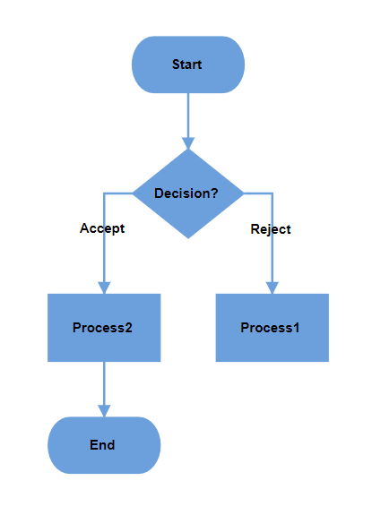