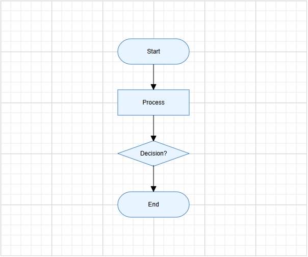

# Getting Started with Angular Diagram Component

This section explains the steps required to create a simple diagram and demonstrates the basic usage of the diagram component.

> **Ready to streamline your Syncfusion<sup style="font-size:70%">&reg;</sup> Angular development?** Discover the full potential of Syncfusion<sup style="font-size:70%">&reg;</sup> Angular components with Syncfusion<sup style="font-size:70%">&reg;</sup> AI Coding Assistant. Effortlessly integrate, configure, and enhance your projects with intelligent, context-aware code suggestions, streamlined setups, and real-time insights—all seamlessly integrated into your preferred AI-powered IDEs like VS Code, Cursor, Syncfusion<sup style="font-size:70%">&reg;</sup> Code Studio and more. [Explore Syncfusion<sup style="font-size:70%">&reg;</sup> AI Coding Assistant](https://ej2.syncfusion.com/angular/documentation/mcp-server/ai-coding-assistant/getting-started).

## Prerequisites

| Requirement | Version |
|-------------|---------|
| Angular | 12 and above |
| Node.js | 14.0.0 or above, Recommended: Latest Version |

### Angular supported versions

| Angular Version | Minimum Syncfusion<sup style="font-size:70%">&reg;</sup> Angular Diagram Version |
|-----------------|-----------------------------------------------|
|[Angular v20](https://www.syncfusion.com/blogs/post/whats-new-in-angular-20)| 29.2.8|
|[Angular v19](https://blog.angular.dev/meet-angular-v19-7b29dfd05b84/)| 26.1.35 |
| [Angular v18](https://blog.angular.dev/angular-v18-is-now-available-e79d5ac0affe/) | 25.2.3 |
| [Angular v17](https://blog.angular.io/introducing-angular-v17-4d7033312e4b/)| 23.2.4 |
| [Angular v16](https://blog.angular.io/angular-v16-is-here-4d7a28ec680d/)| 21.1.39 |
| [Angular v15](https://blog.angular.io/angular-v15-is-now-available-df7be7f2f4c8/) | 20.4.38 |
|[Angular v14](https://blog.angular.io/angular-v14-is-now-available-391a6db736af/)| 20.2.36 |
| [Angular v13](https://blog.angular.io/angular-v13-is-now-available-cce66f7bc296/) | 19.4.38 and above |
| [Angular v12](https://blog.angular.io/angular-v12-is-now-available-32ed51fbfd49/)| 19.3.43 |

### Browser Support

| Browser | Supported Versions |
|:--------|:-------------------|
| Google Chrome, including Android & iOS  | Latest 2 versions |
| Mozilla Firefox	 | Latest version |
| Microsoft Edge	    | Latest 2 versions |
| Apple Safari, including iOS	  | Latest 2 versions |

## Before You Begin

This guide uses the standalone application structure generated by the latest Angular CLI.

The main files used in this guide are:

- `src/app/app.ts` — Defines the root standalone component.
- `src/styles.css` — Contains global styles and Syncfusion® theme references.
- `src/index.html` — Contains the Angular root element (e.g., `<app-root>`).

N> In newer Angular CLI standalone projects, the root component may be generated as **src/app/app.ts**. In NgModule-based Angular projects, the equivalent file is typically **src/app/app.component.ts**.

N> If your application uses an older NgModule-based structure, import `DiagramModule` in the application module, such as `app.module.ts`, instead of adding it to the standalone component `imports` collection.

## Step 1: Set up the Angular environment

Use [Angular CLI](https://github.com/angular/angular-cli) to create and manage Angular applications. Install Angular CLI globally using the following command:

```bash
npm install -g @angular/cli
```

## Step 2: Create an Angular application

Create a new Angular application using the following command.

```bash
ng new my-diagram-app
```

During project creation, Angular CLI may prompt you to choose stylesheet, SSR/SSG, and AI tool configuration options. For this basic Diagram sample, you can use the following options:

* **Stylesheet system**: Choose any option. This guide uses `CSS` for simplicity and applies the Syncfusion® Tailwind 3 theme through CSS imports.
* **SSR and SSG/Pre-rendering**: Select `No`.
* **AI tools configuration**: Select `None`.

Navigate to the project folder:

```bash
cd my-diagram-app
```

## Step 3: Install the Syncfusion® Angular Diagram package

All Syncfusion Essential® JS 2 packages are available in the [npmjs.com](https://www.npmjs.com/~syncfusionorg) registry.

Install the Angular Diagram package using the following command:

```bash
npm install @syncfusion/ej2-angular-diagrams
```

N> Installing `@syncfusion/ej2-angular-diagrams` automatically installs the required dependency packages.

N> While a Syncfusion® license is not required for local development, you must register a valid Syncfusion® license key when deploying the application to production. For details, see [Registering a Syncfusion® license key](https://ej2.syncfusion.com/angular/documentation/licensing/overview).

N> For the latest tested version of the Diagram package, refer to the [`@syncfusion/ej2-angular-diagrams` package page](https://www.npmjs.com/package/@syncfusion/ej2-angular-diagrams).

## Step 4: Add the required styles

The Diagram component needs Syncfusion® theme styles to display correctly. Syncfusion® theme packages include ready-to-use styles for supported components. Install the Tailwind 3 theme package using the following command:

```bash
npm install @syncfusion/ej2-tailwind3-theme
```

Then add the following CSS reference to the **src/styles.css** file:

```css
@import "../node_modules/@syncfusion/ej2-tailwind3-theme/styles/diagram/index.css";
```

For the list of available themes, refer to the [Themes](https://ej2.syncfusion.com/angular/documentation/appearance/overview) documentation.

N> Syncfusion® provides multiple built-in themes. If the application uses a different theme, replace the `@syncfusion/ej2-tailwind3-theme/styles/diagram/index.css` reference with the corresponding theme path, such as `@syncfusion/ej2-material3-theme/styles/diagram/index.css`.

## Step 5: Register the Diagram module and add the component

Import `DiagramModule` from `@syncfusion/ej2-angular-diagrams` and add it to the `imports` collection of the standalone component. Then, add the Angular Diagram component using the `<ejs-diagram>` selector in the component template.

Update the **src/app/app.ts** file as follows:

```typescript
import { Component } from '@angular/core';
import { DiagramModule } from '@syncfusion/ej2-angular-diagrams';

@Component({
  selector: 'app-root',
  standalone: true,
  imports: [DiagramModule],
  template: `<ejs-diagram id="diagram" width="100%" height="580px"></ejs-diagram>`
})
export class App {}
```

This renders an empty diagram in the application. The next step replaces this code with a more complete example.

N> The component selector must match the root element used in the **src/index.html** file. Angular CLI commonly uses `<app-root></app-root>`, so this example uses `selector: 'app-root'`.

N> The Diagram component must have a valid height. If the height is not set, the Diagram canvas may not be visible.

## Step 6: Create your first Diagram with nodes and connectors

This section explains how to create a simple flowchart by adding nodes, customizing their appearance, and connecting them using connectors.

The following example creates a flowchart with four nodes: **Start**, **Process**, **Decision**, and **End**. It also applies common node and connector settings through the `getNodeDefaults` and `getConnectorDefaults` callback bindings.

Replace the entire contents of **src/app/app.ts** with the following code:

```typescript
import { Component } from '@angular/core';
import {
  ConnectorModel,
  DiagramModule,
  FlowShapeModel,
  NodeModel
} from '@syncfusion/ej2-angular-diagrams';

@Component({
  selector: 'app-root',
  standalone: true,
  imports: [DiagramModule],
  template: `
    <ejs-diagram
      id="diagram"
      width="100%"
      height="580px"
      [getNodeDefaults]="nodeDefaults"
      [getConnectorDefaults]="connectorDefaults">

      <e-nodes>
        <e-node id="node1" [offsetX]="300" [offsetY]="100" [shape]="terminator">
          <e-node-annotations>
            <e-node-annotation content="Start"></e-node-annotation>
          </e-node-annotations>
        </e-node>

        <e-node id="node2" [offsetX]="300" [offsetY]="200" [shape]="process">
          <e-node-annotations>
            <e-node-annotation content="Process"></e-node-annotation>
          </e-node-annotations>
        </e-node>

        <e-node id="node3" [offsetX]="300" [offsetY]="300" [shape]="decision">
          <e-node-annotations>
            <e-node-annotation content="Decision?"></e-node-annotation>
          </e-node-annotations>
        </e-node>

        <e-node id="node4" [offsetX]="300" [offsetY]="400" [shape]="terminator">
          <e-node-annotations>
            <e-node-annotation content="End"></e-node-annotation>
          </e-node-annotations>
        </e-node>
      </e-nodes>

      <e-connectors>
        <e-connector id="connector1" sourceID="node1" targetID="node2"></e-connector>
        <e-connector id="connector2" sourceID="node2" targetID="node3"></e-connector>
        <e-connector id="connector3" sourceID="node3" targetID="node4"></e-connector>
      </e-connectors>
    </ejs-diagram>
  `
})
export class App {
  public terminator: FlowShapeModel = {
    type: 'Flow',
    shape: 'Terminator'
  };

  public process: FlowShapeModel = {
    type: 'Flow',
    shape: 'Process'
  };

  public decision: FlowShapeModel = {
    type: 'Flow',
    shape: 'Decision'
  };

  public nodeDefaults(node: NodeModel): NodeModel {
    node.width = 140;
    node.height = 50;
    node.style = {
      fill: '#E8F4FF',
      strokeColor: '#357BD2'
    };
    return node;
  }

  public connectorDefaults(connector: ConnectorModel): ConnectorModel {
    connector.type = 'Orthogonal';
    connector.targetDecorator = {
      shape: 'Arrow',
      width: 10,
      height: 10
    };
    return connector;
  }
}
```

In this example:

**Template directives** (used inside the `<ejs-diagram>` template):

* [`e-nodes`](https://ej2.syncfusion.com/angular/documentation/api/diagram/nodemodel), [`e-connectors`](https://ej2.syncfusion.com/angular/documentation/api/diagram/connectormodel), and [`e-node-annotations`](https://ej2.syncfusion.com/angular/documentation/api/diagram/annotationmodel) are Angular Diagram child directives used to define nodes, connectors, and node annotations.
* [`e-node-annotation`](https://ej2.syncfusion.com/angular/documentation/api/diagram/annotationmodel) adds text inside each node using the [`content`](https://ej2.syncfusion.com/angular/documentation/api/diagram/annotationmodel#content) property.

**Node and connector configuration:**

* [`offsetX`](https://ej2.syncfusion.com/angular/documentation/api/diagram/nodemodel#offsetx) and [`offsetY`](https://ej2.syncfusion.com/angular/documentation/api/diagram/nodemodel#offsety) define the position of each node.
* [`shape`](https://ej2.syncfusion.com/angular/documentation/api/diagram/nodemodel#shape) defines the node shape configuration, and [`FlowShapeModel.shape`](https://ej2.syncfusion.com/angular/documentation/api/diagram/flowshapemodel#shape) specifies flowchart shapes such as `Terminator`, `Process`, or `Decision`.
* [`sourceID`](https://ej2.syncfusion.com/angular/documentation/api/diagram/connectormodel#sourceid) and [`targetID`](https://ej2.syncfusion.com/angular/documentation/api/diagram/connectormodel#targetid) connect one node to another.

**Common defaults applied via callbacks:**

* [`getNodeDefaults`](https://ej2.syncfusion.com/angular/documentation/api/diagram/index-default#getnodedefaults) applies common width, height, fill color, and stroke color to all nodes.
* [`getConnectorDefaults`](https://ej2.syncfusion.com/angular/documentation/api/diagram/index-default#getconnectordefaults) applies common connector settings, such as orthogonal routing and target arrows.

## Step 7: Run the application

Run the application using the following command:

```bash
npm start
```

N> The `npm start` script runs `ng serve` by default in an Angular CLI project. You can also run `ng serve` directly.

Open the generated local URL (`http://localhost:4200`) in the browser. The application displays the diagram as shown below:



N> If port 4200 is already in use, start the app on a different port with `ng serve --port 4201`.

N> To stop the development server, press `Ctrl + C` in the terminal where it is running.

N> To build the application for production, run `ng build`. The generated output is placed in the `dist` folder.

## Next steps

To explore the Diagram component in more depth, refer to the following topics:

* [Nodes](https://ej2.syncfusion.com/angular/documentation/diagram/nodes/nodes)
* [Connectors](https://ej2.syncfusion.com/angular/documentation/diagram/connectors/connectors)
* [Annotations](https://ej2.syncfusion.com/angular/documentation/diagram/labels/labels)
