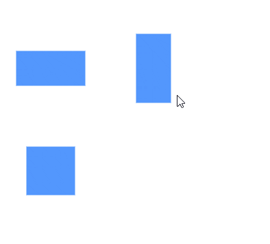
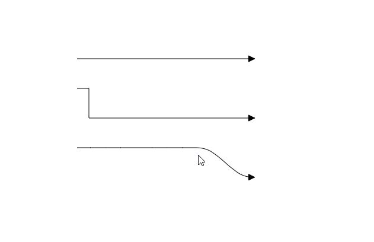
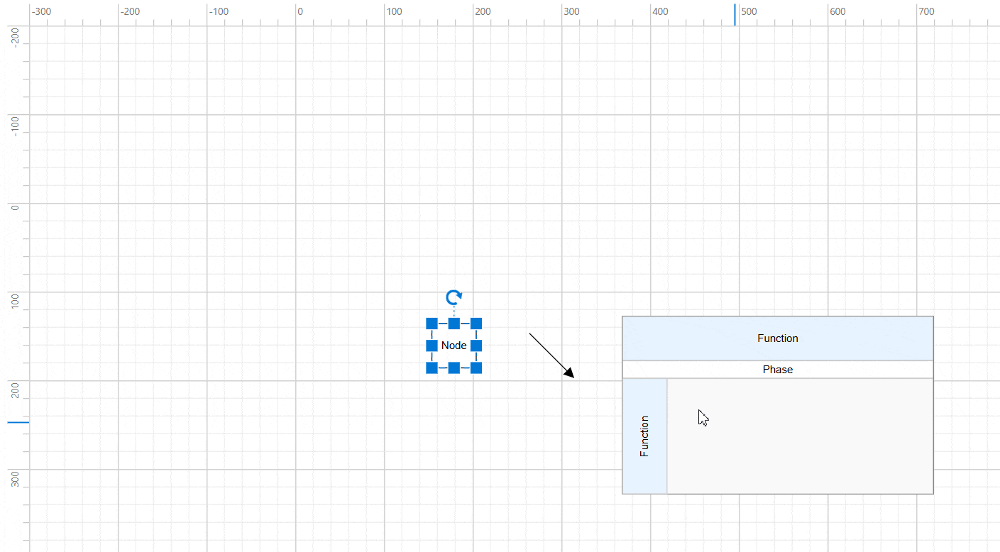

# Interaction in Angular Diagram Component

## Selector

The selector provides a visual representation of selected elements in the diagram, serving as an interactive boundary that enables users to modify the size, position, and rotation angle of selected items through direct manipulation or programmatic control. The selector supports both single and multiple element selection simultaneously.

## Selection

Elements can be selected by clicking on them directly. During a single click operation, all previously selected items are automatically cleared from the selection.

When selecting or unselecting diagram elements, the [`selectionChange`](https://ej2.syncfusion.com/angular/documentation/api/diagram#selectionchange) event and [`click`](https://ej2.syncfusion.com/angular/documentation/api/diagram#click) event are triggered. These events provide opportunities to customize the behavior and appearance of selected elements based on application requirements.

## Selecting a group

When clicking on a child element within any group, the diagram selects the containing group instead of the individual child element. Subsequent clicks on the already-selected element will cycle the selection through the hierarchy, moving from the top-level parent group down to its nested children.

## Multiple selection

Multiple elements can be selected using the following methods:

### Ctrl+Click

By default, clicking on an element clears any existing selection and selects only the clicked item. To maintain existing selections while adding new items, hold the Ctrl key while clicking additional elements.

### Rubber band selection

Click and drag in an empty area of the diagram to create a rectangular selection region. All elements within this region will be selected when the mouse button is released.

Rubber band selection supports two modes for determining which items to select:

- **CompleteIntersect**: Selects only items that are completely contained within the rectangular selection region
- **PartialIntersect**: Selects items that are partially or completely covered by the rectangular selection region

Configure this behavior using the [`rubberBandSelectionMode`](https://ej2.syncfusion.com/angular/documentation/api/diagram/selectorModel#rubberbandselectionmode) property.

### Select/Unselect elements using API

The [`select`](https://ej2.syncfusion.com/angular/documentation/api/diagram#select) and [`clearSelection`](https://ej2.syncfusion.com/angular/documentation/api/diagram#clearselection) methods enable dynamic selection and deselection of elements at runtime. The following example demonstrates how to use these methods:

```typescript
import { Component, ViewEncapsulation, ViewChild } from "@angular/core";
import { DiagramComponent, NodeModel } from '@syncfusion/ej2-angular-diagrams';

@Component({
  selector: "app-container",
  template: `<ejs-diagram #diagram id="diagram" width="100%" height="900px" [nodes]='nodes'></ejs-diagram>`
})
export class AppComponent {
    @ViewChild("diagram")
    public diagram: DiagramComponent;
    
    public nodes: NodeModel[] = [
        {
            id: 'node1',
            width: 90,
            height: 60,
            offsetX: 100,
            offsetY: 100,
            style: {
                fill: '#6BA5D7',
                strokeColor: 'white',
                strokeWidth: 1
            },
        }
    ]
    
    ngOnInit(): void {
        //Select a specified collection of nodes and connectors in the diagram
        this.diagram.select([this.diagram.nodes[0]]);
        //Removes all elements from the selection list, clearing the current selection
        this.diagram.clearSelection();
    }
}
```

### Get selected items

Access the currently selected [`nodes`](https://ej2.syncfusion.com/angular/documentation/api/diagram/selectorModel#nodes) and [`connectors`](https://ej2.syncfusion.com/angular/documentation/api/diagram/selectorModel#connectors) through the [`selectedItems`](https://ej2.syncfusion.com/angular/documentation/api/diagram#selecteditems) property:

```ts
this.selectedNodes = this.diagram.selectedItems.nodes;
this.selectedConnectors = this.diagram.selectedItems.connectors;
```

Alternatively, retrieve all currently selected objects (both nodes and connectors) in a single array using [`selectedObjects`](https://ej2.syncfusion.com/angular/documentation/api/diagram/selectorModel#selectedobjects):

```ts
this.selectedObjects = this.diagram.selectedItems.selectedObjects;
```

### Toggle selection

The [`canToggleSelection`](https://ej2.syncfusion.com/angular/documentation/api/diagram/selectorModel#cantoggleselection) property determines whether clicking on a selected element should deselect it. By default, this property is set to false. When enabled, the first click selects the element, and the second click deselects it.










  


## Select entire elements in diagram programmatically

Use the [`selectAll`](https://ej2.syncfusion.com/angular/documentation/api/diagram#selectall) method to programmatically select all nodes and connectors in the diagram:

```ts
//Selects all the nodes and connectors in diagram
this.diagram.selectAll();
```

Alternatively, use the keyboard shortcut Ctrl+A to select all elements in the diagram.

## Drag

Drag elements by clicking and dragging them to new positions. When multiple elements are selected, dragging any one of them moves the entire selection together. During drag operations, the [`positionChange`](https://ej2.syncfusion.com/angular/documentation/api/diagram#positionchange) event is triggered, providing opportunities to customize or validate the drag behavior.

## Resize

The selector displays eight resizing handles (thumbs) around selected elements. These handles allow users to modify element dimensions by clicking and dragging. When resizing using corner handles, the opposite corner remains fixed to maintain proper alignment during the resize operation.

The [`sizeChange`](https://ej2.syncfusion.com/angular/documentation/api/diagram#sizechange) event is triggered during resize operations, enabling customization based on the element's changing dimensions.

> While dragging and resizing, elements automatically snap to nearby objects for better alignment.

### Aspect ratio

Aspect ratio constraints ensure that when resizing a node by dragging its corner handles, both width and height adjust proportionally to maintain the original shape. Configure aspect ratio constraints using the [`NodeConstraints`](https://ej2.syncfusion.com/angular/documentation/api/diagram/nodeConstraints) property.










  


### Customizing resize handle size

Customize the size of resize handles and connector endpoint handles using the [`handleSize`](https://ej2.syncfusion.com/angular/documentation/api/diagram/selectorModel#handlesize) property:










  


Customize the appearance of resize handles and connector endpoints by overriding the `e-diagram-resize-handle` and `e-diagram-endpoint-handle` CSS classes to modify fill, stroke, and stroke width properties.

## Rotate

A rotation handler appears above the selector when elements are selected. Click and drag this handler in a circular motion to rotate selected elements. Elements rotate around a fixed pivot point, indicated by a pivot thumb that appears at the center during rotation operations.

Rotation operations trigger the [`rotateChange`](https://ej2.syncfusion.com/angular/documentation/api/diagram#rotatechange) event for customization purposes.

### Customize rotate handle position

Adjust the rotation handle position by modifying the node's [`pivot`](https://ej2.syncfusion.com/angular/documentation/api/diagram/node#pivot) property. The default pivot point is (0.5, 0.5), representing the center of the node. The following example positions the rotate handle at the top-left corner:










  




## Connection editing

Selected connectors display editable handles on each segment, enabling direct manipulation of connector paths and endpoints.

> To enable connector editing functionality, inject the [`ConnectorEditing`](https://ej2.syncfusion.com/angular/documentation/api/diagram/connectorEditing) module into your application.

### Drag connector endpoints

Source and target endpoints of selected connectors are represented by dedicated handles. Click and drag these handles to reposition the connector's start and end points.

Endpoint dragging operations trigger the following events:

- [`sourcePointChange`](https://ej2.syncfusion.com/angular/documentation/api/diagram/iEndChangeEventArgs) - Triggered when the connector's source point is modified
- [`targetPointChange`](https://ej2.syncfusion.com/angular/documentation/api/diagram/iEndChangeEventArgs) - Triggered when the connector's target point is modified  
- [`connectionChange`](https://ej2.syncfusion.com/angular/documentation/api/diagram/iConnectionChangeEventArgs) - Triggered when connecting to or disconnecting from ports or nodes

### Straight segment editing

Each endpoint of straight connector segments displays an editable handle. Add new segments to a straight connector by Ctrl+Shift+Click at the desired position along the connector path.

Remove straight segments by Ctrl+Shift+Click on the segment endpoint handle.

### Orthogonal segment editing

Orthogonal connectors display handles that allow adjustment of adjacent segment lengths through click and drag operations. The diagram automatically adds or removes segments as needed during editing to maintain proper orthogonal routing.

Segment editing operations trigger these events:
- [`segmentChange`](https://ej2.syncfusion.com/angular/documentation/api/diagram/iSegmentChangeEventArgs#isegmentchangeeventargs) - Triggered when modifying existing segments
- [`segmentCollectionChange`](https://ej2.syncfusion.com/angular/documentation/api/diagram/iSegmentCollectionChangeEventArgs) - Triggered when adding or removing segments

### Bezier segment editing

Bezier connectors provide handles for direct segment manipulation through click and drag operations.

#### Bezier Control Points

Bezier segments display two control point handles that define the curve characteristics. Drag these control points to adjust the angle and distance from the segment endpoints, modifying the curve shape and direction.



## Restrict interaction in negative axis area

The diagram component provides built-in constraints to prevent user interactions within negative coordinate regions (areas with negative X or Y values). Enable the `RestrictNegativeAxisDragDrop` constraint to prevent:

* **Dragging elements** into negative coordinate areas
* **Resizing elements** to extend into negative regions  
* **Dropping symbols** from the palette into negative areas

```typescript
@Component({
  selector: "app-container",
  template: `<ejs-diagram id="diagram" width="100%" height="580px" [constraints]='constraints'>
             </ejs-diagram>`
})
export class AppComponent {
// Prevent diagram interactions in the negative region
public constraints: DiagramConstraints = DiagramConstraints.Default |
                                         DiagramConstraints.RestrictNegativeAxisDragDrop
}
```



> Symbols dragged from the palette will only be added to the diagram when positioned entirely within positive coordinate space.

## User handles

User handles provide quick access to frequently used commands around selected elements. Define user handles by adding them to the [`userHandles`](https://ej2.syncfusion.com/angular/documentation/api/diagram/userHandleModel) collection within the [`selectedItems`](https://ej2.syncfusion.com/angular/documentation/api/diagram#selecteditems) property. Use the [`name`](https://ej2.syncfusion.com/angular/documentation/api/diagram/userHandleModel#name) property for runtime identification and customization.

User handle interactions trigger the following events:

* [`click`](https://ej2.syncfusion.com/angular/documentation/api/diagram#click) - Triggered when the user handle is clicked
* [`onUserHandleMouseEnter`](https://ej2.syncfusion.com/angular/documentation/api/diagram#onuserhandlemouseenter) - Triggered when mouse enters the handle region
* [`onUserHandleMouseDown`](https://ej2.syncfusion.com/angular/documentation/api/diagram#onuserhandlemousedown) - Triggered when mouse button is pressed on the handle
* [`onUserHandleMouseUp`](https://ej2.syncfusion.com/angular/documentation/api/diagram#onuserhandlemouseup) - Triggered when mouse button is released on the handle
* [`onUserHandleMouseLeave`](https://ej2.syncfusion.com/angular/documentation/api/diagram#onuserhandlemouseleave) - Triggered when mouse leaves the handle region

## Fixed user handles

Fixed user handles perform specific actions and are defined directly within node or connector objects, allowing different handles for different elements. Unlike regular user handles, [`fixedUserHandles`](https://ej2.syncfusion.com/angular/documentation/api/diagram/nodefixeduserhandlemodel) remain visible even when elements are not selected.

Fixed user handle interactions trigger these events:

* [`click`](https://ej2.syncfusion.com/angular/documentation/api/diagram#click) - Triggered when the fixed user handle is clicked
* [`onFixedUserHandleMouseEnter`](https://ej2.syncfusion.com/angular/documentation/api/diagram#onfixeduserhandlemouseenter) - Triggered when mouse enters the handle region
* [`onFixedUserHandleMouseDown`](https://ej2.syncfusion.com/angular/documentation/api/diagram#onfixeduserhandlemousedown) - Triggered when mouse button is pressed on the handle
* [`onFixedUserHandleMouseUp`](https://ej2.syncfusion.com/angular/documentation/api/diagram#onfixeduserhandlemouseup) - Triggered when mouse button is released on the handle
* [`onFixedUserHandleMouseLeave`](https://ej2.syncfusion.com/angular/documentation/api/diagram#onfixeduserhandlemouseleave) - Triggered when mouse leaves the handle region
* [`fixedUserHandleClick`](https://ej2.syncfusion.com/angular/documentation/api/diagram#fixeduserhandleclick) - Triggered when the fixed user handle is clicked

## Determining mouse button clicks

The diagram component can identify which mouse button triggered click events. The [`click`](https://ej2.syncfusion.com/angular/documentation/api/diagram#click) event provides details about the specific button used:

| Button | Description |
|--------|-------------|
| Left | Triggered when the left mouse button is clicked |
| Middle | Triggered when the mouse wheel button is clicked |
| Right | Triggered when the right mouse button is clicked |

```typescript
@Component({
    selector: "app-container",
    template: `<ejs-diagram id="diagram" width="100%" height="580px" (click)="click($event)"></ejs-diagram>`,
    encapsulation: ViewEncapsulation.None
})
export class AppComponent {
    ngOnInit(): void {
    }
    public click(args: IClickEventArgs): void {
        // Identify which mouse button was clicked
        var button = args.button;
    }
}
```

## Allow drop

The diagram supports drag-and-drop operations between elements. Enable the [`allowDrop`](https://ej2.syncfusion.com/angular/documentation/api/diagram/nodeConstraints) constraint on target nodes or connectors to indicate valid drop zones. When this constraint is enabled, a visual highlighter appears when dragging elements over valid drop targets. The [`drop`](https://ej2.syncfusion.com/angular/documentation/api/diagram#drop) event is triggered when elements are successfully dropped, providing information about both the dropped element and the drop target.

## Zoom and pan

Navigate large diagrams using zoom and pan operations. Scroll bars enable navigation to clipped portions of the diagram, while click-and-drag operations pan the viewport. Use Ctrl + mouse wheel to zoom in or out. The [`scrollChange`](https://ej2.syncfusion.com/angular/documentation/api/diagram#scrollchange) event is triggered during zoom and pan operations.

| Pan Status | Description |
|------------|-------------|
| Start | Triggered when mouse click-and-drag begins |
| Progress | Triggered during mouse movement while dragging |
| Completed | Triggered when pan operation ends |


## Keyboard shortcuts

The diagram provides comprehensive keyboard support for common operations. The following table lists available keyboard shortcuts:

### Selection and Navigation

| Shortcut | Command | Description |
|----------|---------|-------------|
| Ctrl + A | `selectAll` | Select all nodes and connectors |
| Tab | Tab to Focus | Select elements based on rendering order |
| Shift + Tab | Go to Previous Object | Select previous element in z-order |

### Editing Operations

| Shortcut | Command | Description |
|----------|---------|-------------|
| Ctrl + C | copy | Copy selected elements |
| Ctrl + V | paste | Paste copied elements |
| Ctrl + X | cut | Cut selected elements |
| Ctrl + Z | undo | Reverse last editing action |
| Ctrl + Y | redo | Restore last undone action |
| Delete | delete | Delete selected elements |
| Ctrl + D | Duplicate | Duplicate selected elements |

### Movement and Positioning

| Shortcut | Command | Description |
|----------|---------|-------------|
| Arrow Keys | nudge | Move selected elements by 1 pixel |
| Shift + Arrow Keys | nudge | Move selected elements by 5 pixels |
| Ctrl + R | Rotate clockwise | Rotate selected elements clockwise |
| Ctrl + L | Rotate anti-clockwise | Rotate selected elements counter-clockwise |
| Ctrl + H | Flip Horizontal | Flip selected elements horizontally |
| Ctrl + J | Flip Vertical | Flip selected elements vertically |

### Grouping and Ordering

| Shortcut | Command | Description |
|----------|---------|-------------|
| Ctrl + G | Group | Group selected elements |
| Ctrl + Shift + U | UnGroup | Ungroup selected elements |
| Ctrl + Shift + B | Send To Back | Send elements to back of stacking order |
| Ctrl + Shift + F | Bring To Front | Bring elements to front of stacking order |
| Ctrl + [ | Send Backward | Move elements one step backward |
| Ctrl + ] | Bring Forward | Move elements one step forward |

### Tools and Views

| Shortcut | Command | Description |
|----------|---------|-------------|
| Ctrl + 1 | Pointer tool | Activate pointer tool |
| Ctrl + 2 | Text tool | Activate text tool |
| Ctrl + 3 | Connector tool | Activate connector tool |
| Ctrl + 5 | Freeform tool | Activate freeform tool |
| Ctrl + 6 | Line tool | Activate polyline tool |
| Ctrl + + | Zoom In | Zoom in the diagram |
| Ctrl + - | Zoom Out | Zoom out the diagram |

### Text Formatting

| Shortcut | Command | Description |
|----------|---------|-------------|
| F2 | `startLabelEditing` | Begin editing element labels |
| Esc | `endLabelEditing` | Stop label editing |
| Ctrl + B | Bold | Toggle bold text formatting |
| Ctrl + I | Italic | Toggle italic text formatting |
| Ctrl + U | Underline | Toggle underline formatting |
| Ctrl + Shift + L | Align Text Left | Left-align selected text |
| Ctrl + Shift + C | Center Text Horizontally | Center text horizontally |
| Ctrl + Shift + R | Align Text Right | Right-align selected text |
| Ctrl + Shift + J | Justify Text Horizontally | Justify text alignment |
| Ctrl + Shift + E | Top-align Text Vertically | Align text to top |
| Ctrl + Shift + M | Center Text Vertically | Center text vertically |
| Ctrl + Shift + V | Bottom-align Text Vertically | Align text to bottom |

> The positionChange event is triggered only for mouse-based dragging operations and does not support keyboard-based movement interactions.

## See Also

* [How to create diagram nodes using drawing tools](./tools#draw-nodes)
* [How to create diagram connectors using drawing tools](./tools#draw-connectors)
* [How to disable the diagram interaction](./constraints#diagram-constraints)
* [How to control the diagram history](./undo-redo)
* [How to create overview control to the diagram](./overview)