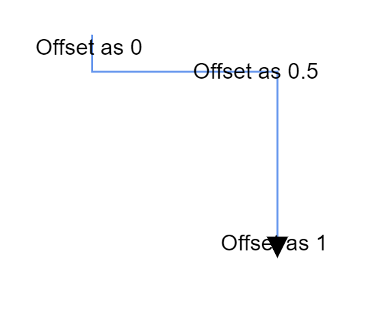
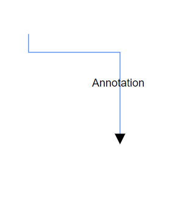

# Connector Labels in Angular Diagram

Connector annotations are text labels that can be positioned along connector paths to provide descriptive information or context. These annotations offer flexible positioning and styling options to enhance diagram readability and communication.

Annotations on connectors can be precisely positioned and customized using the following properties of the Annotation class:

* **Offset** - Controls position along the connector path (0 to 1)
* **Alignment** - Aligns annotation relative to connector segments
* **Displacement** - Moves annotation away from its calculated position
* **SegmentAngle** - Rotates annotation based on connector direction

## Annotation offset

The [`offset`](https://ej2.syncfusion.com/angular/documentation/api/diagram/pathannotationmodel#offset) property for [`pathAnnotation`](https://ej2.syncfusion.com/angular/documentation/api/diagram/pathannotationmodel) accepts a number value ranging from 0 to 1, representing the position along the connector path from source to target point. An offset value of 0 positions the annotation at the source point, while 1 positions it at the target point. The default offset value is 0.5, which centers the annotation on the connector.

The following code example demonstrates how to configure the offset for connector annotations:










  


The following image illustrates annotation positioning at different offset values along the connector path:

## Annotation alignment

Connector annotations can be aligned relative to their segment path using the [`alignment`](https://ej2.syncfusion.com/angular/documentation/api/diagram/pathannotationmodel#alignment) property. This property offers three alignment options:

* **Before** - Positions the annotation before the calculated offset point
* **Center** - Centers the annotation at the offset point (default)
* **After** - Positions the annotation after the calculated offset point

The following code example demonstrates how to configure alignment for connector annotations:










  


## Annotation displacement

The [`displacement`](https://ej2.syncfusion.com/angular/documentation/api/diagram/pathannotationmodel#displacement) property allows annotations to be moved away from their calculated position by a specified distance. This feature is particularly useful for avoiding overlaps with connector paths or improving visual clarity.

The following example shows how to apply displacement to connector annotations:










  


N> Displacement functionality is only applicable when the alignment property is set to `Before` or `After`. The displacement property offsets the annotation from its calculated position based on the selected alignment. Center-aligned annotations do not support displacement.

## Annotation segment angle

The [`segmentAngle`](https://ej2.syncfusion.com/angular/documentation/api/diagram/pathAnnotationModel#segmentangle) property controls whether annotations rotate to match the connector segment direction. When set to `true`, annotations automatically rotate based on the angle of the connector segment they are positioned on, creating a more integrated visual appearance. When set to `false` (default), annotations maintain their original orientation regardless of connector direction.

The following code example demonstrates how to configure segment angle rotation:










  


The following table illustrates the visual difference between segment angle settings:

|Segment angle|Output|
|-----|-----|
|True||
|False||