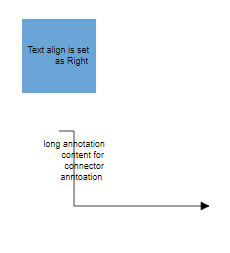
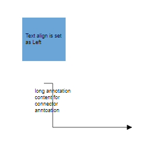
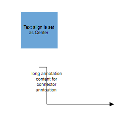
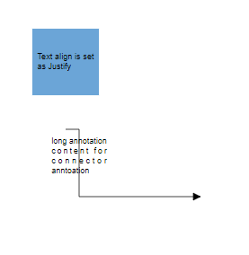
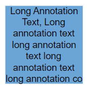
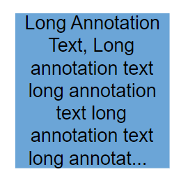
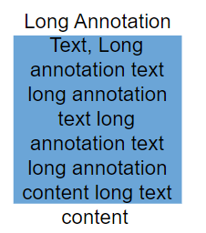

# Customizing Label Appearance in Angular Diagram Component

## Overview

The Angular Diagram component provides comprehensive styling options to customize label appearance. Labels can be enhanced with various font properties, colors, decorations, and visual effects to match application requirements.

Font styling properties such as [`fontSize`](https://ej2.syncfusion.com/angular/documentation/api/diagram/textStyleModel/#fontsize), [`fontFamily`](https://ej2.syncfusion.com/angular/documentation/api/diagram/textStyleModel/#fontfamily), and [`color`](https://ej2.syncfusion.com/angular/documentation/api/diagram/textStyleModel/#color) control the basic text appearance. Additional text formatting is available through [`bold`](https://ej2.syncfusion.com/angular/documentation/api/diagram/textStyleModel/#bold), [`italic`](https://ej2.syncfusion.com/angular/documentation/api/diagram/textStyleModel/#italic), and [`textDecoration`](https://ej2.syncfusion.com/angular/documentation/api/diagram/textStyleModel/#textdecoration) properties.

Background and border styling can be applied using [`fill`](https://ej2.syncfusion.com/angular/documentation/api/diagram/textStyleModel/#fill), [`strokeColor`](https://ej2.syncfusion.com/angular/documentation/api/diagram/textStyleModel/#strokecolor), and [`strokeWidth`](https://ej2.syncfusion.com/angular/documentation/api/diagram/textStyleModel/#strokewidth) properties. The [`opacity`](https://ej2.syncfusion.com/angular/documentation/api/diagram/textStyleModel/#opacity) property controls label transparency.

Control label visibility using the [`visible`](https://ej2.syncfusion.com/angular/documentation/api/diagram/annotationModel/#visibility) property, which enables or disables label display.

The following code demonstrates comprehensive label appearance customization:










  


## Horizontal and vertical alignment

Label positioning within nodes and connectors can be precisely controlled through horizontal and vertical alignment properties. The following table illustrates all possible alignment combinations with offset (0, 0):

| Horizontal Alignment | Vertical Alignment | Output with Offset(0,0) |
| -------- | -------- | -------- |
| Left | Top |  |
| Center | Top |  |
| Right | Top |   |
| Left | Center |  |
| Center | Center|  |
| Right | Center |  |
| Left | Bottom |  |
| Center | Bottom |  |
| Right |Bottom | |

The following code example shows how to configure label alignment:










  


## Label Margin

The [`Margin`](https://ej2.syncfusion.com/angular/documentation/api/diagram/marginModel/) property adds spacing around labels by specifying absolute values for any or all four sides. This property works in conjunction with offset, horizontal alignment, and vertical alignment to achieve precise label positioning.

The following example demonstrates label positioning using [`margin`](https://ej2.syncfusion.com/angular/documentation/api/diagram/annotationModel/#margin) combined with alignment properties:










  


## Hyperlink

Labels can include interactive [`hyperlinks`](https://ej2.syncfusion.com/angular/documentation/api/diagram/annotationModel/#hyperlink) for both nodes and connectors. Hyperlink behavior and appearance can be customized with several properties.

The [`hyperlinkOpenState`](https://ej2.syncfusion.com/angular/documentation/api/diagram/hyperlinkModel/#hyperlinkopenstate) property controls how the hyperlink opens - in a new window, the same tab, or a new tab.

Hyperlink appearance is controlled through the [`content`](https://ej2.syncfusion.com/angular/documentation/api/diagram/hyperlinkModel/#content) property for display text, [`color`](https://ej2.syncfusion.com/angular/documentation/api/diagram/hyperlinkModel/#color) for text color, and [`textDecoration`](https://ej2.syncfusion.com/angular/documentation/api/diagram/hyperlinkModel/#textdecoration) for styling effects like Underline, LineThrough, or Overline.

The following example shows hyperlink implementation and customization:










  


## Rotate Label

Labels can be rotated to any angle using the [`rotateAngle`](https://ej2.syncfusion.com/angular/documentation/api/diagram/shapeAnnotationModel/#rotateangle) property. This feature is useful for creating dynamic label orientations that match specific design requirements.

The following example demonstrates label rotation:










  


## Template support for labels

The Diagram component provides flexible template support for creating custom label layouts. Templates can be defined as either string templates or HTML-based templates, enabling rich content presentation beyond simple text.

### String template

String templates allow defining SVG or HTML content directly within the label's [`template`](https://ej2.syncfusion.com/angular/documentation/api/diagram/annotationModel/#template) property. This approach is suitable for inline content definition.

The following code shows string template implementation:










  


N> Specify width and height for labels when using templates to ensure proper alignment and rendering.

### Label template

HTML-based templates provide more complex content structures by defining templates in separate HTML files. Assign the template to the [`annotationTemplate`](https://ej2.syncfusion.com/angular/documentation/api/diagram/#annotationtemplate) property of the diagram. This template system works with both nodes and connectors.

The following code demonstrates HTML template usage for labels:










  


## Text align

The [`textAlign`](https://ej2.syncfusion.com/angular/documentation/api/diagram/textStyleModel/#textalign) property controls text alignment within the label boundaries. Available alignment options include left, right, center, and justify, providing flexibility for various content layouts.

The following code demonstrates text alignment configuration:










  


The following table shows different text alignment options:

| Text Align | Output image |
|-----|-----|
| Right |  |
| Left |  |
| Center |  |
| Justify |  |

## Text Wrapping

When label text exceeds node or connector boundaries, the [`text wrapping`](https://ej2.syncfusion.com/angular/documentation/api/diagram/textStyleModel/#textwrapping) property controls how content is handled. Text can be wrapped into multiple lines based on the specified wrapping behavior.

The following code shows text wrapping implementation:










  


| Value | Description | Image |
| -------- | -------- | -------- |
| No Wrap | Text will not be wrapped and may extend beyond boundaries. |  |
| Wrap | Text wrapping occurs when content overflows beyond available width. |  |
| WrapWithOverflow (Default) | Text wrapping occurs with overflow allowed for very long words that cannot be broken. |  |

## Text overflow

The [`TextOverflow`](https://ej2.syncfusion.com/angular/documentation/api/diagram/textStyleModel/#textoverflow) property manages content display when text exceeds the available label space. This property works in conjunction with text wrapping to provide comprehensive text handling.

Available overflow options include:

- `Clip` - Overflowing content beyond node boundaries is removed
- `Ellipsis` - Overflowing content is replaced with three dots (...)
- `Wrap` - Content renders with vertical overflow and horizontal wrapping

| TextOverflow | Output image |
|-----|-----|
| Clip |  |
| Ellipsis |  |
| Wrap (Default) |  |










  
