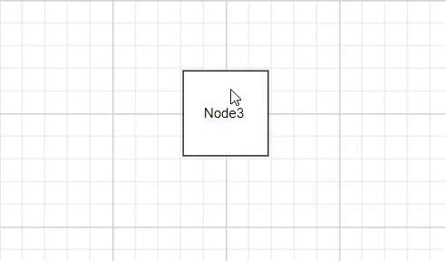
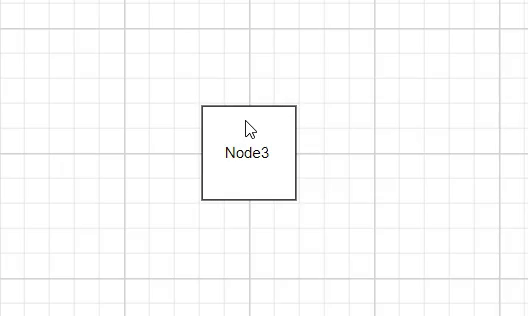

# Label Interaction in Angular Diagram

The Angular Diagram component allows labels to be interactive through selecting, dragging, rotating, resizing, and editing operations. Label interaction is disabled by default. Enable label interaction using the `constraints` property of the label. You can also control specific interaction types by enabling individual constraints for selecting, dragging, rotating, or resizing. The following code demonstrates how to enable interactive mode.










  


## Constraints

The [`constraints`](https://ej2.syncfusion.com/angular/documentation/diagram/constraints#annotation-constraints) property of labels allows enabling or disabling specific label behaviors. Use these constraints to control which interaction types are available for each label. The available annotation constraint values are listed below:

| Constraint value | Description |
| -------- | -------- |
| `ReadOnly` | Enables read-only mode for the annotation. |
| `InheritReadOnly` | Inherits read-only settings from parent objects. |
| `Select` | Enables selection capability for the annotation. |
| `Drag` | Enables dragging functionality for the annotation. |
| `Resize` | Enables resize capability for the annotation. |
| `Rotate` | Enables rotation capability for the annotation. |
| `Interaction` | Enables general interaction capabilities for the annotation. |
| `None` | Disables all constraints for the annotation. |

## Label Editing

The Angular Diagram component supports editing labels at runtime, both programmatically and interactively. By default, labels are in view mode. Labels can be switched to edit mode using two approaches:

### Programmatic Editing
Use the [`startTextEdit`](https://ej2.syncfusion.com/angular/documentation/api/diagram#starttextedit) method to programmatically enter edit mode for a specific label.










  


### Interactive Editing
Labels can be edited interactively through user actions:
1. Double-clicking the label
2. Selecting the parent node or connector and pressing the F2 key

Double-clicking any label enables editing mode. When the editor loses focus, the label content is updated. The [`doubleClick`](https://ej2.syncfusion.com/angular/documentation/api/diagram#doubleclick) event triggers when double-clicking on nodes, connectors, or the diagram canvas.

## Label Rotation

The [`rotationReference`](https://ej2.syncfusion.com/angular/documentation/api/diagram/shapeAnnotation#rotationreference) property controls whether labels rotate relative to their parent node or remain fixed relative to the page. The following code examples demonstrate how to configure rotationReference for labels.










  


| Value | Description | Image |
| -------- | -------- | -------- |
| Page | The label maintains its original orientation even when the parent node rotates. |  |
| Parent | The label rotates along with its parent node. |  |

## Read-only Labels
The Angular Diagram component supports read-only labels that users cannot edit. Read-only mode is disabled by default. To enable it, include `AnnotationConstraints.ReadOnly` in the label’s [`constraints`](https://ej2.syncfusion.com/angular/documentation/api/Angular Diagram/annotationModel#constraints) property. The following code demonstrates how to enable read-only mode.










  


## Drag Limits

The Angular Diagram component supports defining [`dragLimit`](https://ej2.syncfusion.com/angular/documentation/api/Angular Diagram/annotationModel#draglimit) properties for connector labels to restrict dragging within specified boundaries. The drag limit automatically updates the label position to the nearest valid segment offset when dragging.

Configure drag limit boundaries using the [`left`](https://ej2.syncfusion.com/angular/documentation/api/diagram/marginModel#left), [`right`](https://ej2.syncfusion.com/angular/documentation/api/diagram/marginModel#right), [`top`](https://ej2.syncfusion.com/angular/documentation/api/diagram/marginModel#top), and [`bottom`](https://ej2.syncfusion.com/angular/documentation/api/diagram/marginModel#bottom) properties. The default value for each boundary is **0**. These properties limit connector label dragging based on user-defined values.

Drag limits are disabled by default for connectors. Enable drag limits by setting the connector constraints to include drag functionality.

The following code demonstrates how to configure dragLimit for connector labels:










  


## Multiple Labels

Nodes and connectors support multiple labels. Each label can have independent properties and constraints. The following code demonstrates how to add multiple labels to nodes and connectors.










  
