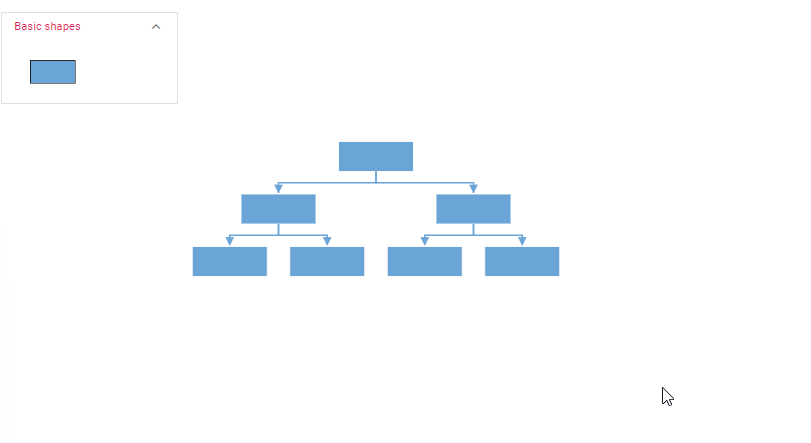

# Customizing layout in Angular Diagram control

Orientation, spacings, and alignment of the layout can be customized with a set of properties.

To explore layout properties, refer to [`Layout Properties`](https://ej2.syncfusion.com/angular/documentation/api/diagram/layout/#properties).

## Layout bounds


Diagram provides support to align the layout within any custom rectangular area. 

The following example shows how to align the layout within the given layout bounds.













For more information about bounds, refer to [`bounds`](https://ej2.syncfusion.com/angular/documentation/api/diagram/layoutModel/#bounds).


## Layout alignment

The layout can be aligned anywhere over the layout bounds/viewport using the [`horizontalAlignment`](https://ej2.syncfusion.com/angular/documentation/api/diagram/layoutModel/#horizontalalignment) and [`verticalAlignment`](https://ej2.syncfusion.com/angular/documentation/api/diagram/layoutModel/#verticalalignment) properties of the layout.

The following code illustrates how to align the layout and how to change layout horizontal and vertical alignment at runtime.













## Layout spacing

Layout provides support to add space horizontally and vertically between the nodes. The [`horizontalSpacing`](https://ej2.syncfusion.com/angular/documentation/api/diagram/layoutModel/#horizontalspacing) and [`verticalSpacing`](https://ej2.syncfusion.com/angular/documentation/api/diagram/layoutModel/#verticalspacing) properties of the layout allows you to set the space between the nodes in horizontally and vertically.

The following code illustrates how to set the initial horizontal and vertical spacing for the layout, as well as how to change these spacing values at runtime














## Layout margin

Layout provides support to add some blank space between the layout bounds/viewport and the layout. The [`margin`](https://ej2.syncfusion.com/angular/documentation/api/diagram/layout/#margin) property of the layout allows you to set the blank space.

The following code demonstrates how to set the initial layout margin and how to modify the layout margin dynamically at runtime.













## Layout orientation

The layout orientation can used to arrange the layout based on the direction. there are different orientation types that are defined in the following table.

|Orientation|Description|
| -------- | ----------- |
|TopToBottom|Aligns the layout from top to bottom. All the roots are placed at top of diagram.|
|LeftToRight|Aligns the layout from left to right. All the roots are placed at left of diagram.|
|BottomToTop|Aligns the layout from bottom to top. All the roots are placed at bottom of the diagram.|
|RightToLeft|Aligns the layout from right to left. All the roots are placed at right of the diagram.|

Diagram provides support to customize the  [`orientation`](https://ej2.syncfusion.com/angular/documentation/api/diagram/layout/#orientation) of layout. You can set the desired orientation using layout.orientation.

N> In the diagram the default orientation is `TopToBottom`.

The following code demonstrates how to set the initial orientation for the layout and how to change it dynamically at runtime.













## Exclude from layout

In some cases, you may need one or two nodes not to be arranged based on the layout algorithm but instead positioned manually. You can exclude these nodes from the layout algorithm by setting the [`excludeFromLayout`](https://ej2.syncfusion.com/angular/documentation/api/diagram/nodeModel/#excludefromlayout) property to true.

The following code example demonstrates how to exclude a node from the layout and position it manually:














## Fixed node

Layout provides support to arrange the nodes with reference to the position of a fixed node and set it to the [`fixedNode`](https://ej2.syncfusion.com/angular/documentation/api/diagram/layoutModel/#fixednode) of the layout property. This is helpful when you try to expand/collapse a node. It might be expected that the position of the double-clicked node should not be changed.













## Expand and collapse

Diagram allows to expand/collapse the subtrees of a layout. The node’s isExpanded property allows you to expand/collapse its children. The following code example shows how to expand/collapse the children of a node.













For more details about customizing the expand and collapse icon refer [`expand Collapse`](./nodes-expandAndCollapse)

## Layout animation

While performing expand and collapse operations, the layout can be animated by applying a small delay. This can be achieved by setting the [`enableAnimation`](https://ej2.syncfusion.com/angular/documentation/api/diagram/layoutModel/#enableanimation) property of the layout. By default, `enableAnimation` is set to true.

In the following example, the enableAnimation property ensures that the layout changes are animated, enhancing the visual experience during expand and collapse operations.














N> To enable layout animation, you need to inject LayoutAnimation module in diagram.

## Parent - child relation with dropped nodes from symbol palette

You can create a layout with dropped nodes from symbol palette using the [`drop`](https://ej2.syncfusion.com/angular/documentation/api/diagram/#drop) event. In `drop` event, you have to create a connection between the source and target item.

Find the code example to create parent - child relation between source and target nodes in drop event.















## setNodeTemplate

 The [`setNodeTemplate`](https://ej2.syncfusion.com/angular/documentation/api/diagram/#setnodetemplate) function is provided for the purpose of customizing nodes. It will be called for each node on node initialization. In this function, the node style and its properties can be customized and can bind the custom JSON with node.













## Refresh layout

Diagram allows refreshing the layout at runtime. To refresh the layout, you need to call the [`doLayout`](https://ej2.syncfusion.com/angular/documentation/api/diagram/#dolayout) method.


```typescript
//To refresh layout
this.diagram.doLayout();

```

