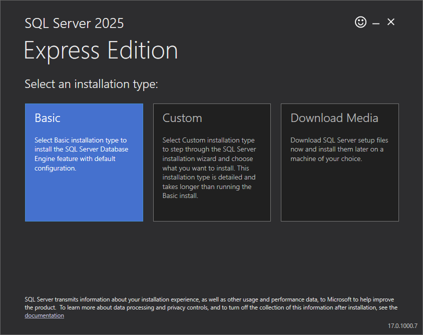
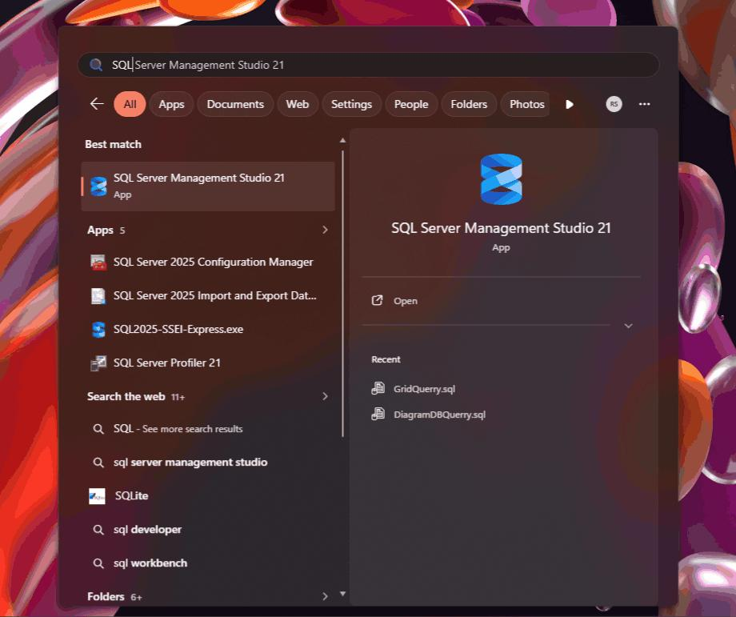
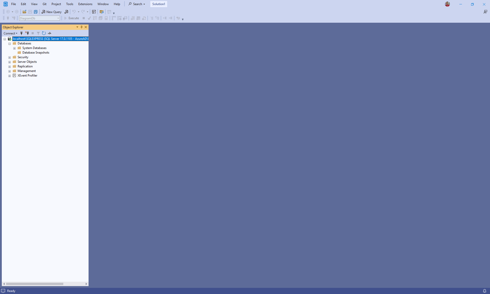
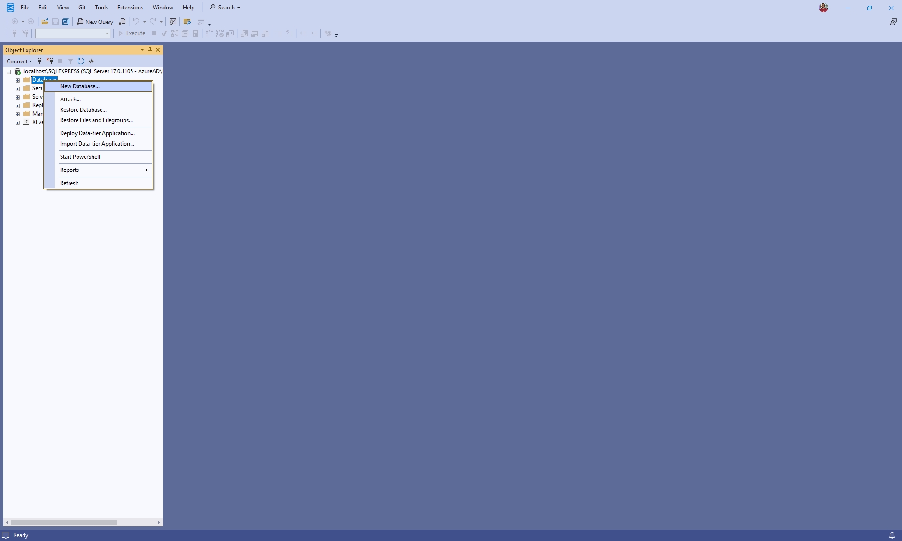
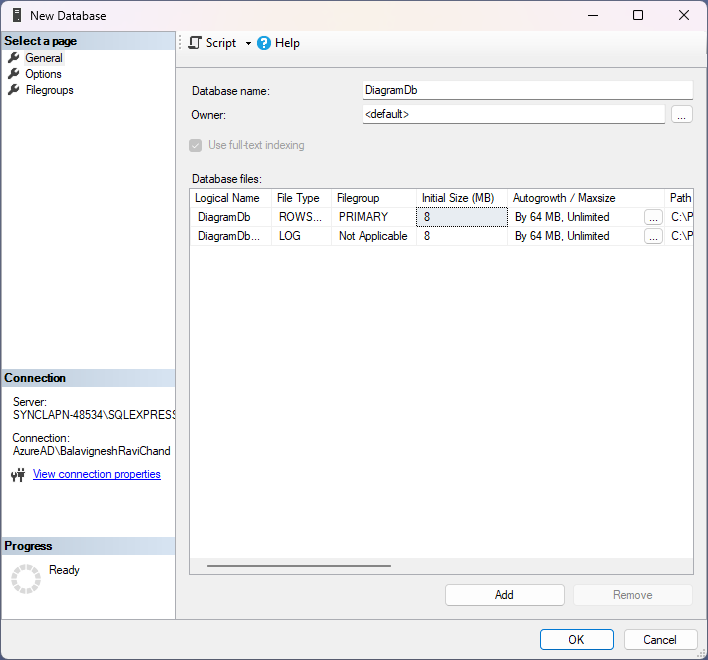
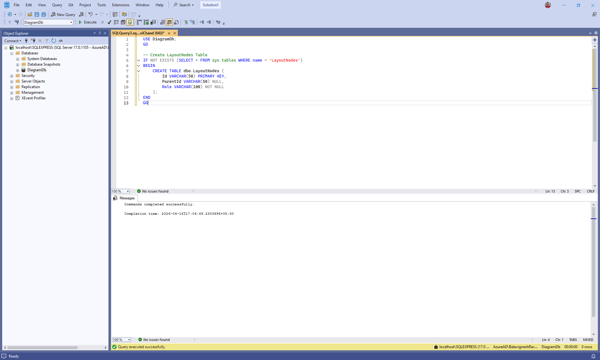
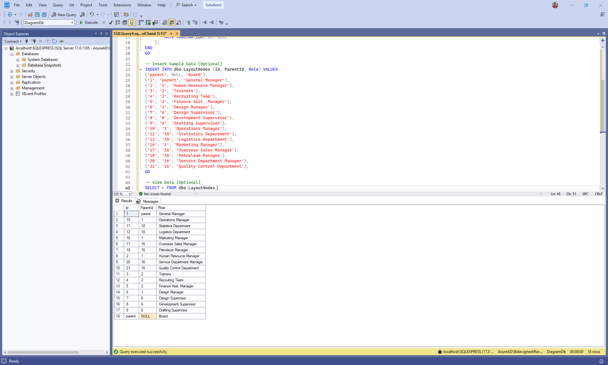

# Connecting SQL Server to Angular Diagram using ASP.NET Core Web API

This guide explains how to load and visualize organizational chart data stored in a Microsoft SQL Server database using the Syncfusion® Angular Diagram component. It demonstrates how to configure SQL Server, create the required database schema, expose the data through an ASP.NET Core Web API, and bind the API response to a Angular application to render an organizational chart diagram.

**What is Microsoft SqlClient?**

[Microsoft.Data.SqlClient](https://www.nuget.org/packages/Microsoft.Data.SqlClient) is the official .NET data provider used to connect ASP.NET Core applications to Microsoft SQL Server. It enables applications to execute SQL queries, call stored procedures, and read or write data securely using strongly supported APIs from Microsoft. SqlClient is commonly used in Web APIs where precise control over database access, performance, and security is required.

**Key Benefits of SqlClient:**

- **Secure by design**: Enforces parameterized queries to help prevent SQL injection attacks.
- **High performance**: Provides efficient, low‑level access to SQL Server with minimal overhead.
- **Asynchronous support**: Supports async database operations for better scalability in web APIs.
- **Full SQL control**: Allows precise control over SQL queries, stored procedures, and transactions.
- **Official Microsoft provider**: Maintained and supported by Microsoft for long‑term compatibility with SQL Server.

## Prerequisites

Ensure the following software and packages are installed before proceeding:

| Software / Package | Version | Purpose |
|-------------------|---------|---------|
| Node.js | 18.x or later | Angular development runtime |
| Angular CLI | 16 or later | Create, build, and run Angular application |
| .NET SDK | 8.0 or later | Build and run the ASP.NET Core Web API |
| Microsoft SQL Server | 2019 or later | Relational database server |
| SQL Server Management Studio (SSMS) | Latest | Manage SQL Server databases and execute queries |
| Microsoft.Data.SqlClient (NuGet) | 7.0.0 or later | SQL Server connectivity for ASP.NET Core |
| Syncfusion.EJ2.AspNet.Core (NuGet) | 33.1.45 or later | Server‑side helpers for DataManager operations |
| @syncfusion/ej2-angular-diagrams (npm) | 33.1.45 or later | Angular Diagram component |

## Installing and configuring Microsoft SQL Server and SQL Server Management Studio (SSMS)

To store and manage diagram data, Microsoft SQL Server must be installed and configured before integrating it with the ASP.NET Core Web API. This section explains how to install SQL Server, install SQL Server Management Studio (SSMS), and preparing the environment for database creation. This setup is a one‑time process and only needs to be completed before configuring the backend API.

### Installing Microsoft SQL Server

Microsoft SQL Server provides the relational database engine used to store organizational chart data required by the diagram component.

Follow these steps to install SQL Server:

1. Download the Microsoft SQL Server installer for the required edition from the official page: [https://www.microsoft.com/en-in/sql-server/sql-server-downloads] (https://www.microsoft.com/en-in/sql-server/sql-server-downloads). For this guide, **SQL Server Express** is selected. It is a free, lightweight edition suitable for development, testing, and sample applications.

2. Open the downloaded installer file to launch the setup wizard.

3. Choose the installation type (for example, **Basic** for quick setup or **Custom** for advanced configuration).



4. Select the installation location when prompted and proceed with the installation.


5. Wait for the setup process to complete. Once finished, a confirmation message indicates that SQL Server has been installed successfully.


At this stage, the SQL Server database engine is installed, but a management tool is required to interact with the server.


### Installing SQL Server Management Studio (SSMS)

SQL Server Management Studio (SSMS) is a graphical interface used to connect to SQL Server, manage databases, execute queries, and inspect data.

Follow these steps to install SSMS:

1. From the SQL Server installer completion screen, click the **Install SSMS** button. This action redirects you to the official Microsoft download page. 


2. Download the SSMS installer.

3. Open the downloaded installer file. This launches the Visual Studio Installer.

4. Select the required workloads (the default selections are sufficient for most users).


5. Click the **Install** button and wait for the installation to complete.


6. Once installation finishes, close the installer.


### Connecting to SQL Server using SQL Server Management Studio (SSMS)

After installing SQL Server Management Studio (SSMS), connect to the SQL Server instance to begin creating databases and tables.

1. Launch **SQL Server Management Studio** from the Windows Start menu or application launcher.



2. In the **Connect to Server** dialog, configure the connection properties:
   - **Server name**: Required (for example, **localhost** or **.\SQLEXPRESS**)
   - **Authentication**: Windows Authentication (recommended for local development)
   - Enable **Trust server certificate** if prompted


3. Click the **Connect** button to establish the connection.

4. After a successful connection, the **Object Explorer** displays the connected SQL Server instance and its available components such as databases, security settings, and server objects.



The SQL Server environment is now ready for database creation and data configuration.


## Creating the database and schema

After connecting to SQL Server using SSMS, the next step is to create the database and schema required to store organizational chart data. The schema represents parent–child relationships that are rendered as nodes and connectors in the Syncfusion® Angular Diagram component.

### Creating the database

A dedicated database named **DiagramDb** is used to store organizational chart data. The database can be created using either the SSMS user interface or a SQL script.

#### Manual approach (using SSMS UI)

1. In **Object Explorer**, right‑click the **Databases** folder.


2. Select **New Database** from the context menu.
3. Enter **DiagramDb** as the database name.
4. Click the **OK** button to create the database.



#### Query‑Based approach

Alternatively, the database can be created using a SQL query.

- Click **New Query** button in the SSMS toolbar to open the query editor.

 

- Paste the following SQL script into the query editor and click **Execute** to run the query.

 ```sql
-- Create Database
IF NOT EXISTS (SELECT * FROM sys.databases WHERE name = 'DiagramDb')
BEGIN
    CREATE DATABASE DiagramDb;
END
GO
```


### Creating the table

Create a table named **LayoutNode** to store the data that defines the structure of the diagram.

- Each record represents a diagram node.
- The **Id** column uniquely identifies a node.
- The **ParentId** column establishes parent–child relationships.
- Root‑level nodes contain a **NULL** value for **ParentId**.

Run the following SQL script in the query editor to create the table in the **DiagramDb** database.

```sql
-- Create LayoutNode Table
IF NOT EXISTS (SELECT * FROM sys.tables WHERE name = 'LayoutNode')
BEGIN
    CREATE TABLE dbo.LayoutNode (
        Id VARCHAR(50) PRIMARY KEY,
        ParentId VARCHAR(50) NULL,
        Role VARCHAR(100) NOT NULL
    );
END
GO
```



### Inserting sample data

Sample records can be added to the **LayoutNode** table to populate the database with initial data.

Run the following SQL script in the query editor to insert sample records into the table.

```sql
-- Insert Sample Data (Optional)
INSERT INTO dbo.LayoutNode (Id, ParentId, Role) VALUES
('parent', NULL, 'Board'),
('1', 'parent', 'General Manager'),
('2', '1', 'Human Resource Manager'),
('3', '2', 'Trainers'),
('4', '2', 'Recruiting Team'),
('5', '2', 'Finance Asst. Manager'),
('6', '1', 'Design Manager'),
('7', '6', 'Design Supervisor'),
('8', '6', 'Development Supervisor'),
('9', '6', 'Drafting Supervisor'),
('10', '1', 'Operations Manager'),
('11', '10', 'Statistics Department'),
('12', '10', 'Logistics Department'),
('16', '1', 'Marketing Manager'),
('17', '16', 'Overseas Sales Manager'),
('18', '16', 'Petroleum Manager'),
('20', '16', 'Service Department Manager'),
('21', '16', 'Quality Control Department');
GO
```


### Verifying the inserted data

Verify that the records have been created successfully by querying the **LayoutNode** table. 

Run the following SQL query in the query editor to view the inserted data.

```sql
SELECT * FROM dbo.LayoutNode;
```




## Integrating SQL Server with ASP.NET Core Web API

In this section, an ASP.NET Core Web API project is created and configured to connect to SQL Server using **Microsoft.Data.SqlClient**. The API retrieves organizational chart layout data from the database and returns it in a format that can be consumed by the Syncfusion® Angular Diagram component.

### Step 1: Create the ASP.NET Core Web API project

#### Creating the Web API project using Visual Studio

The ASP.NET Core Web API project can be created using Visual Studio as follows:

1. Open **Visual Studio**.
2. Select **Create a new project**.
3. Choose **ASP.NET Core Web API** and click **Next**.
4. Enter the project name as **Angular_Diagram_MSSQL.Server**.
5. Select the project location and click **Next**.
6. Choose the target framework (for example, **.NET 8.0**).
7. Keep authentication set to **None**.
8. Click **Create**.

Visual Studio generates a new ASP.NET Core Web API project with default files such as **Program.cs** and **appsettings.json**.

#### Creating the Web API project using Visual Studio Code

Alternatively, the project can be created using the .NET CLI, which is commonly used with Visual Studio Code.

1. Open a terminal or command prompt.
2. Navigate to the directory where you want to create the server application.
3. Run the following commands:

```bash
dotnet new webapi -n Angular_Diagram_MSSQL.Server
cd Angular_Diagram_MSSQL.Server
```

### Step 2: Installing required NuGet packages

After creating the ASP.NET Core Web API project, install the following required NuGet packages.

- **Microsoft.Data.SqlClient** – Provides connectivity to Microsoft SQL Server.
- **Syncfusion.EJ2.AspNet.Core** – Provides server‑side support for `DataManager` operations.

The required NuGet packages can be installed using any one of the following methods.

#### Method 1: Using Package Manager Console (Visual Studio)

1. Open **Visual Studio**.
2. Navigate to **Tools → NuGet Package Manager → Package Manager Console**.
3. Run the following commands:

```powershell
Install-Package Microsoft.Data.SqlClient
Install-Package Syncfusion.EJ2.AspNet.Core
```

#### Method 2: Using NuGet Package Manager UI (Visual Studio)

1. Open Visual Studio.
2. Navigate to Tools → NuGet Package Manager → Manage NuGet Packages for Solution.
3. Select the Browse tab.
4. Search for and install each package individually:
   - **Microsoft.Data.SqlClient**
   - **Syncfusion.EJ2.AspNet.Core**

#### Method 3: Using .NET CLI / Integrated Terminal (Visual Studio Code)

The required packages can also be installed using the .NET CLI. Ensure the commands are executed from the Web API project directory.

```powershell
dotnet add package Microsoft.Data.SqlClient
dotnet add package Syncfusion.EJ2.AspNet.Core
```

### Step 3: Create the data model

A data model defines how data stored in a database table is represented within the ASP.NET Core application. It maps database records to C# objects that can be used by the Web API and returned to the Syncfusion® Angular Diagram component.

In this application, the data model maps directly to the **LayoutNode** table created in SQL Server.

> This model does not create or modify database tables. It only represents the existing SQL Server schema within the application.

**Instructions:**

1. Create a new folder named **Data** in the application project.
2. Inside the **Data** folder, create a new file named **LayoutNode.cs**.
3. Define the `LayoutNode` class with the following code:

```csharp
using System.ComponentModel.DataAnnotations;

namespace Angular_Diagram_MSSQL.Server.Data
{
  /// <summary>
  /// Represents a node in the layout hierarchy used by the diagram.
  /// </summary>
  public class LayoutNode
  {
      /// <summary>
      /// Gets or sets the unique identifier for the layout node.
      /// </summary>
      /// <remarks>
      /// This property serves as the primary key for the node.
      /// </remarks>
      [Key]
      public string Id { get; set; } = null!;

      /// <summary>
      /// Gets or sets the identifier of the parent node.
      /// </summary>
      /// <remarks>
      /// A null value indicates that this node is a root-level node.
      /// </remarks>
      public string? ParentId { get; set; }

      /// <summary>
      /// Gets or sets the role associated with the layout node.
      /// </summary>
      /// <remarks>
      /// This value determines the responsibility or classification of the node
      /// within the diagram.
      /// </remarks>
      public string Role { get; set; } = null!;
  }
}
```

### Step 4: Create the repository class

A repository class acts as a bridge between the ASP.NET Core Web API and the SQL Server database. It contains the logic required to read data from the database and return it in a format that can be used by the API.

Using a repository helps maintain a clear separation by isolating database access logic from controller logic.

**Instructions:**

1. Inside the **Data** folder, create a new file named **LayoutNodeRepository.cs**.
2. Define the `LayoutNodeRepository` class with the following code:

```csharp
using Microsoft.Data.SqlClient;

namespace Angular_Diagram_MSSQL.Server.Data
{
    public class LayoutNodeRepository
    {
        private readonly string _connectionString;

        /// <summary>
        /// Initializes the repository with a connection string from configuration.
        /// </summary>
        public LayoutNodeRepository(IConfiguration configuration)
        {
            _connectionString = configuration.GetConnectionString("DiagramDb")!;
        }

        /// <summary>
        /// Creates a new SQL connection using the configured connection string.
        /// </summary>
        private SqlConnection GetConnection() => new SqlConnection(_connectionString);

        /// <summary>
        /// Returns all layout nodes ordered by Id.
        /// </summary>
        public async Task<List<LayoutNode>> GetLayoutNodesAsync()
        {
            var list = new List<LayoutNode>();
            const string sql =
                @"SELECT Id, ParentId, Role FROM dbo.LayoutNodes";

            await using var conn = GetConnection();
            await conn.OpenAsync();
            await using var cmd = new SqlCommand(sql, conn);
            await using var reader = await cmd.ExecuteReaderAsync();

            while (await reader.ReadAsync())
            {
                list.Add(
                    new LayoutNode
                    {
                        Id = reader["Id"] as string ?? string.Empty,
                        ParentId = reader["ParentId"] as string,
                        Role = reader["Role"] as string ?? string.Empty
                    }
                );
            }
            return list;
        }
    }
}

```

**Explanation:**

- The repository reads the SQL Server connection string from application configuration.
- A helper method creates a new SqlConnection when needed.
- The `GetLayoutNodesAsync` method retrieves all layout nodes from the **LayoutNode** table and maps each record to a `LayoutNode` object.
- The method returns the data as a list that can be consumed by the API controller.

### Step 5: Create the API controller

The API controller exposes layout‑node data as an HTTP endpoint that can be consumed by the diagram component.

**Instructions:**

1. Create a new folder named **Controllers** (if it does not already exist).
2. Add a new file named **LayoutNodesController.cs**.
3. Paste the following code:

```csharp
using Angular_Diagram_MSSQL.Server.Data;
using Microsoft.AspNetCore.Mvc;
using Syncfusion.EJ2.Base;
using Newtonsoft.Json.Linq;

namespace Angular_Diagram_MSSQL.Server.Controllers
{
    [ApiController]
  [Route("api/[controller]")]
  public class LayoutNodesController : ControllerBase
  {
      private readonly LayoutNodeRepository _repository;

      public LayoutNodesController(LayoutNodeRepository repository)
      {
          _repository = repository;
      }

      // GET api/layoutnodes
      [HttpGet]
      public async Task<IActionResult> GetAll()
      {
          var data = await _repository.GetLayoutNodesAsync();
          return Ok(data);
      }

      // GET api/layoutnodes/ping
      [HttpGet("ping")]
      public IActionResult Ping()
      {
          return Ok(new { status = "ok", time = DateTime.UtcNow });
      }
  }
}

```
**Explanation**

* **/api/layoutnodes** returns all layout nodes from SQL Server.
* Data is retrieved through the `LayoutNodeRepository` class.

### Step 6: Configure the connection string

A connection string contains the information needed to connect the application to the SQL Server database, including the server address, database name, and authentication credentials.

**Instructions:**

1. Open the **appsettings.json** file in the project root.
2. Add or update the `ConnectionStrings` section with the SQL Server connection details:

```json
{
  "ConnectionStrings": {
    "DiagramDb": "Data Source=localhost;Initial Catalog=DiagramDb;Integrated Security=True;Connect Timeout=30;Encrypt=False;Trust Server Certificate=False;Application Intent=ReadWrite;Multi Subnet Failover=False"
  },
  "Logging": {
    "LogLevel": {
      "Default": "Information",
      "Microsoft.AspNetCore": "Warning"
    }
  },
  "AllowedHosts": "*"
}
```

**Connection string components:**

| Component | Description |
| ----------- | ------------- |
| Data Source | The address of the SQL Server instance (server name, IP address, or localhost) |
| Initial Catalog | The database name (in this case, **DiagramDb**) |
| Integrated Security | Set to **True** for Windows Authentication; use **False** with Username/Password for SQL Authentication |
| Connect Timeout | Connection timeout in seconds (default is 15) |
| Encrypt | Enables encryption for the connection (set to **True** for production environments) |
| Trust Server Certificate | Whether to trust the server certificate (set to **False** for security) |
| Application Intent | Set to **ReadWrite** for normal operations or **ReadOnly** for read-only scenarios |
| Multi Subnet Failover | Used in failover clustering scenarios (typically **False**) |


### Step 7: Register services

The **Program.cs** file is where application services are registered and configured. This file must be updated to register services and the repository for dependency injection.

**Instructions:**

1. Open the **Program.cs** file at the project root.
2. Replace the existing content with the following configuration:

```csharp
using Angular_Diagram_MSSQL.Server.Data;

var builder = WebApplication.CreateBuilder(args);

// Add MVC controllers with Newtonsoft.Json (for JObject support)
builder
    .Services.AddControllers()
    .AddNewtonsoftJson(options =>
    {
        options.SerializerSettings.NullValueHandling = Newtonsoft.Json.NullValueHandling.Ignore;
    });

// (Optional) Swagger for API exploration in Development
builder.Services.AddEndpointsApiExplorer();
builder.Services.AddSwaggerGen();

// CORS: allow all (simple for local dev / separate frontend)
builder.Services.AddCors(options =>
{
    options.AddDefaultPolicy(policy => policy.AllowAnyOrigin().AllowAnyHeader().AllowAnyMethod());
});

// Register repository for DI
builder.Services.AddScoped<LayoutNodeRepository>();

var app = builder.Build();

// Swagger only in Development
if (app.Environment.IsDevelopment())
{
    app.UseSwagger();
    app.UseSwaggerUI();
}

// Enable CORS and map controllers
app.UseCors();
app.MapControllers();

app.Run();

```
**Explanation**

* Controller support is enabled to expose API endpoints.
* The `LayoutNodeRepository` is registered for dependency injection.
* CORS is enabled to allow the Angular application to call the API.
* Swagger is enabled in development for testing and exploration.

The backend setup is now complete. 

## Integrating Syncfusion® Angular Diagram

The following steps describe how to render the Diagram and connect it to the SQL Server back-end.

### Step 1: Creating the Angular client application

Create the Angular client application using the following commands in a Visual Studio Code terminal or command prompt:

```bash
ng new Angular_Diagram_MSSQL.client
cd Angular_Diagram_MSSQL.client
```

### Step 2: Adding Syncfusion® packages

Install the required Syncfusion® packages by running the following commands:

```bash
npm install @syncfusion/ej2-angular-diagrams --save
```

After installation, the necessary CSS files are available in the **node_modules** directory.
Add the required CSS references to the **src/styles.css** file to apply styling to the Diagram component.

```css
@import '../node_modules/@syncfusion/ej2-base/styles/bootstrap5.3.css';  
@import '../node_modules/@syncfusion/ej2-buttons/styles/bootstrap5.3.css';  
@import '../node_modules/@syncfusion/ej2-calendars/styles/bootstrap5.3.css';  
@import '../node_modules/@syncfusion/ej2-dropdowns/styles/bootstrap5.3.css';  
@import '../node_modules/@syncfusion/ej2-inputs/styles/bootstrap5.3.css';  
@import '../node_modules/@syncfusion/ej2-navigations/styles/bootstrap5.3.css';
@import '../node_modules/@syncfusion/ej2-popups/styles/bootstrap5.3.css';
@import '../node_modules/@syncfusion/ej2-notifications/styles/bootstrap5.3.css';
@import '../node_modules/@syncfusion/ej2-angular-diagrams/styles/bootstrap5.3.css';
@import "../node_modules/@syncfusion/ej2-angular-base/styles/bootstrap5.3.css";
```

For this project, the "Bootstrap 5.3" theme is applied. Other themes can be selected, or the existing theme can be customized to meet specific project requirements. For detailed guidance on theming and customization, refer to the [Syncfusion® Angular Components Appearance](https://ej2.syncfusion.com/angular/documentation/appearance/theme-studio) documentation.

### Step 3: Add Syncfusion® Angular Diagram

The Angular Diagram component can be added to the (**src/app/app.component.ts**) file using the following code.

```ts
import { Component, ViewEncapsulation, ViewChild } from '@angular/core';
import { DiagramComponent, Diagram, NodeModel, ConnectorModel, LayoutModel, DataSourceModel, DiagramModule,
  HierarchicalTreeService, DataBindingService, DataBinding, HierarchicalTree, SnapSettingsModel, SnapConstraints } from '@syncfusion/ej2-angular-diagrams';

Diagram.Inject(DataBinding, HierarchicalTree);

@Component({
  selector: "app-root",
  standalone: true,
  imports: [DiagramModule],
  templateUrl: "app.component.html",
  styleUrls: ["app.component.css"],
  providers: [HierarchicalTreeService, DataBindingService],
  encapsulation: ViewEncapsulation.None,
})
export class AppComponent {
  @ViewChild('diagram') diagram?: DiagramComponent;
}
```

And update (**src/app/app.component.html**):

```html
<ejs-diagram 
  #diagram 
  id="diagram" 
  width="100%" 
  height="580px">
</ejs-diagram>
```
This code initializes the Diagram component with default dimensions.

### Step 4: Fetch data from Web API and bind it to the Diagram

In this step, data is retrieved from the ASP.NET Core Web API and assigned to the Diagram as a data source. Create a `loadData` function in the (**src/app/app.component.ts**) file to fetch the API data and assign it to the Diagram using `dataSourceSettings`.

```ts

import { Component, ViewEncapsulation, ViewChild } from '@angular/core';
import { DiagramComponent, Diagram, NodeModel, ConnectorModel, LayoutModel, DataSourceModel, DiagramModule,
  HierarchicalTreeService, DataBindingService, DataBinding, HierarchicalTree, SnapSettingsModel, SnapConstraints } from '@syncfusion/ej2-angular-diagrams';
import { DataManager, Query } from '@syncfusion/ej2-data';

Diagram.Inject(DataBinding, HierarchicalTree);

const BASE_URL = "/api/layoutnodes";


export class AppComponent {
  @ViewChild('diagram') diagram?: DiagramComponent;

  public items?: DataManager;
  public layout?: LayoutModel;
  public dataSourceSettings?: DataSourceModel;
 
  ngOnInit(): void {
    this.loadData();
  }

  private loadData() {
    fetch(BASE_URL, {
      method: 'GET',
      headers: { 'Content-Type': 'application/json' },
    })
      .then((response) => {
        if (!response.ok) {
          throw new Error(`HTTP error! status: ${response.status}`);
        }
        return response.json();
      })
      .then((data) => {
        this.items = new DataManager(data as JSON[], new Query().take(5));
        // Force diagram refresh
        if (this.diagram) {
          this.layout = {
            //Sets layout type
            type: 'OrganizationalChart'
          }

          //Configures data source for Diagram
          this.dataSourceSettings = {
            id: 'id',
            parentId: 'parentId',
            dataSource: this.items
          }
        }
      })
      .catch((error) => {
        console.error('Error loading data:', error);
      });
  }
}

```

### Step 5: Complete code

The following snippet shows the complete Angular Diagram configuration with data binding, layout, and styling applied.

**app.component.html:**



<!-- app.component.html -->

<ejs-diagram 
  #diagram 
  id="diagram" 
  width="100%" 
  height="580px"
  [getConnectorDefaults]='connDefaults'
  [getNodeDefaults]='nodeDefaults'
  [layout]='layout'
  [dataSourceSettings]='dataSourceSettings'
  [snapSettings] = 'snapSettings'>
</ejs-diagram>





**app.component.ts:**

```ts

import { Component, ViewEncapsulation, ViewChild } from '@angular/core';
import { DiagramComponent, Diagram, NodeModel, ConnectorModel, LayoutModel, DataSourceModel, DiagramModule,
  HierarchicalTreeService, DataBindingService, DataBinding, HierarchicalTree, SnapSettingsModel, SnapConstraints } from '@syncfusion/ej2-angular-diagrams';
import { DataManager, Query } from '@syncfusion/ej2-data';

Diagram.Inject(DataBinding, HierarchicalTree);

const BASE_URL = "/api/layoutnodes";

@Component({
  selector: "app-root",
  standalone: true,
  imports: [DiagramModule],
  templateUrl: "app.component.html",
  styleUrls: ["app.component.css"],
  providers: [HierarchicalTreeService, DataBindingService],
  encapsulation: ViewEncapsulation.None,
})
export class AppComponent {
  @ViewChild('diagram') diagram?: DiagramComponent;
  public snapSettings: SnapSettingsModel = {
      // Display both Horizontal and Vertical gridlines
      constraints:  SnapConstraints.None
  };
  public items?: DataManager;
  public layout?: LayoutModel;
  public dataSourceSettings?: DataSourceModel;
 
  public nodeDefaults = (obj: NodeModel): NodeModel => {
    obj.width = 120;
    obj.height = 40;
    obj.shape = { type: 'Basic', shape: 'Rectangle' };
    obj.annotations = [{ content: (obj.data as { role: 'string' }).role }];
    obj.style = { fill: '#6BA5D7', strokeColor: 'white' };
    return obj;
  };

  public connDefaults = (connector: any): void => {
    connector.type = 'Orthogonal';
    connector.cornerRadius = 7;
    connector.targetDecorator = { shape: 'None' };
  };

  ngOnInit(): void {
    this.loadData();
  }

  private loadData() {
    fetch(BASE_URL, {
      method: 'GET',
      headers: { 'Content-Type': 'application/json' },
    })
      .then((response) => {
        if (!response.ok) {
          throw new Error(`HTTP error! status: ${response.status}`);
        }
        return response.json();
      })
      .then((data) => {
        this.items = new DataManager(data as JSON[], new Query().take(5));
        // Force diagram refresh
        if (this.diagram) {
          this.layout = {
            //Sets layout type
            type: 'OrganizationalChart'
          }

          //Configures data source for Diagram
          this.dataSourceSettings = {
            id: 'id',
            parentId: 'parentId',
            dataSource: this.items
          }
        }
      })
      .catch((error) => {
        console.error('Error loading data:', error);
      });
  }
}

```

## Running the application

**Step 1: Build and run the ASP.NET Core Web API:**

Navigate to the server project folder and run the following command in a terminal:

```bash
dotnet build
dotnet run
```
**Step 2: Run the Angular client:**

From the client folder, run the following command in a terminal to start the Angular application:

```bash
ng serve --open
```

**Step 3: Access the application:**

Open a web browser and navigate to the URL shown in the terminal to view the Diagram.

## Complete sample repository

A complete, working sample implementation is available in the [GitHub repository](https://github.com/SyncfusionExamples/ej2-web-diagram-examples/tree/master/Angular/syncfusion-angular-diagram-MSSQL).

## Summary

| Step | Description | Reference |
|-----:|-------------|-----------|
| 1 | Install and configure Microsoft SQL Server and SQL Server Management Studio | [View](#installing-and-configuring-microsoft-sql-server-and-ssms) |
| 2 | Create the database, schema, and insert hierarchical diagram data | [View](#creating-the-database-and-schema-for-diagram-data) |
| 3 | Create and configure the ASP.NET Core Web API backend | [View](#integrating-sql-server-with-aspnet-core-web-api) |
| 4 | Integrate and configure the Syncfusion® Angular Diagram component | [View](#integrating-syncfusion-angular-diagram) |
| 5 | Run and test the complete application | [View](#running-the-application) |

## See also

- [Data Binding](https://ej2.syncfusion.com/angular/documentation/diagram/data-binding)
- [Organizational Chart Layout](https://ej2.syncfusion.com/angular/documentation/diagram/automatic-layout/org-chart)