# Node Interaction in Angular Diagram Component

The Angular Diagram component provides comprehensive support for interactive node operations, enabling users to select, drag, resize, rotate, and flip nodes through both mouse interactions and programmatic methods. These interactions form the foundation of dynamic diagram editing capabilities.

## Select

Node selection is fundamental to diagram interaction. Users can select nodes by clicking on them and deselect by clicking on the diagram canvas.

### Programmatic Node Selection

Nodes can be selected at runtime using the [`select`](https://ej2.syncfusion.com/angular/documentation/api/diagram#select) method. The selection can be cleared using either the [`clearSelection`](https://ej2.syncfusion.com/angular/documentation/api/diagram#clearselection) method to clear all selections or the [`unSelect`](https://ej2.syncfusion.com/angular/documentation/api/diagram#unselect) method to remove specific objects from selection.










  


### Selection Methods Reference

|Method | Parameter | Description|
|----|----|----|
|[`unSelect`](https://ej2.syncfusion.com/angular/documentation/api/diagram#unselect)| NodeModel/ConnectorModel | Removes the specified object from the current selection.|
|[`clearSelection`](https://ej2.syncfusion.com/angular/documentation/api/diagram#clearselection)| - | Clears all selected objects in the diagram.|

## Drag

Node dragging allows users to reposition nodes within the diagram canvas. Users can click and hold a node, then drag it to any location on the canvas.

### Programmatic Node Dragging

Nodes can be moved programmatically using the [`drag`](https://ej2.syncfusion.com/angular/documentation/api/diagram#drag) method, which accepts the target object and new position coordinates.










  


## Resize

When a node is selected, resize handles appear on all sides, allowing users to modify the node's dimensions by clicking and dragging these handles.

### Programmatic Node Resizing

Node dimensions can be modified at runtime using the [`scale`](https://ej2.syncfusion.com/angular/documentation/api/diagram#scale) method, which applies scaling factors to adjust the node size proportionally.










  


## Rotate

Node rotation is performed interactively by clicking and dragging the rotate handle that appears when a node is selected.

### Programmatic Node Rotation

Nodes can be rotated at runtime using the [`rotate`](https://ej2.syncfusion.com/angular/documentation/api/diagram#rotate) method, which accepts the target object and rotation angle in degrees.










  


## Flip

The diagram component supports node flipping operations to create mirrored images of nodes. The [`flip`](https://ej2.syncfusion.com/angular/documentation/api/diagram/node#flip) property controls the flip direction and behavior.

### Flip Directions

| Flip Direction | Description |
| -------- | ----------- |
|HorizontalFlip |[`Horizontal`](https://ej2.syncfusion.com/angular/documentation/api/diagram/flipDirection) mirrors the node across the horizontal axis.|
|VerticalFlip|[`Vertical`](https://ej2.syncfusion.com/angular/documentation/api/diagram/flipDirection) mirrors the node across the vertical axis.|
|Both|[`Both`](https://ej2.syncfusion.com/angular/documentation/api/diagram/flipDirection) mirrors the node across both horizontal and vertical axes.|
|None|Disables all flip operations for the node.|

The following example demonstrates how to apply flip transformations to nodes:










  


### Runtime Flip Updates

Node flip properties can be updated dynamically at runtime using the `^` operator, which allows toggling flip states by applying the same flip direction multiple times.










  


### Flip Modes

The [`flipMode`](https://ej2.syncfusion.com/angular/documentation/api/diagram/flipMode) property controls which elements are affected during flip operations, determining whether ports, labels, and label text are flipped along with the node.

| FlipMode | Description | 
| -------- | -------- |
|Label| Flips the label along with the node while maintaining text readability.|
|Port| Flips the port positions along with the node.|
|All| Flips the port, label, and label text along with the node.|
|None| Flips only the node geometry without affecting ports or labels.|
|LabelText| Flips the node and inverts the label text without changing label position.|
|PortAndLabel| Flips both port positions and labels along with the node while keeping text readable.|
|PortAndLabelText| Flips port positions and label text along with the node.|
|LabelAndLabelText| Flips both labels and label text along with the node.|

### Flip Mode Visual Examples

The following table demonstrates how different flip modes affect node appearance across various flip directions:

| Flip Direction | Flip Mode | Default Node | Flipped Node |
| -------- | -------- | -------- | -------- |
| Horizontal | All |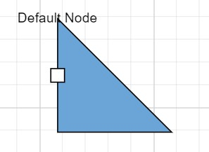|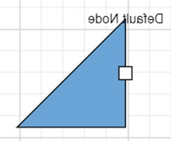| 
| Horizontal | Label ||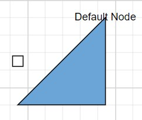|
| Horizontal | LabelText ||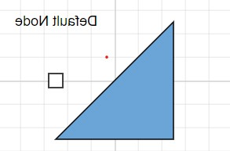|
| Horizontal | Port ||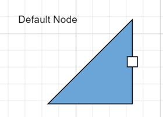|
| Horizontal | None ||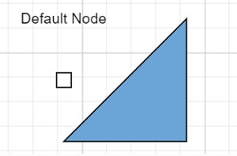|
| Horizontal | PortAndLabel ||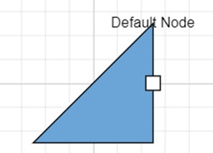|
| Horizontal | PortAndLabelText ||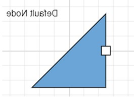|
| Horizontal | LabelAndLabelText |||
| Vertical | All |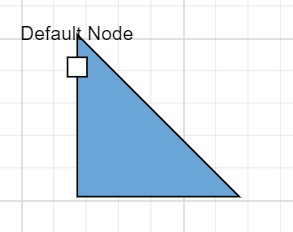|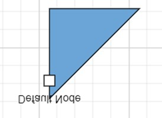| 
| Vertical | Label ||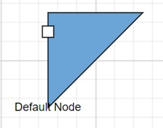|  
| Vertical | LabelText ||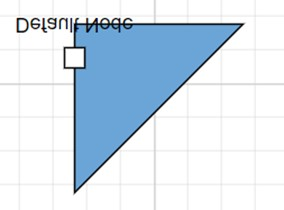| 
| Vertical | Port ||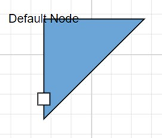| 
| Vertical | None ||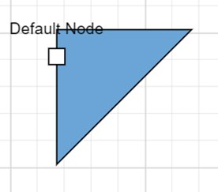|  
| Vertical | PortAndLabel ||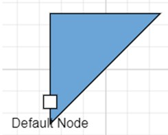|  
| Vertical | PortAndLabelText ||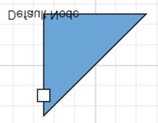|  
| Vertical | LabelAndLabelText ||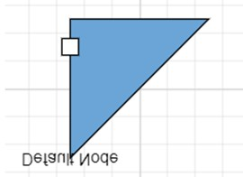|  
| Both | All ||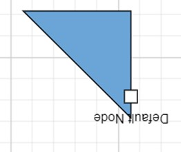|  
| Both | Label ||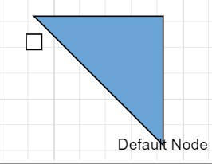|
| Both | LabelText ||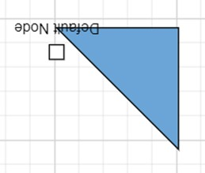| 
| Both | Port ||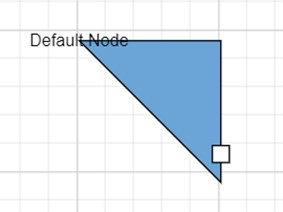| 
| Both | None ||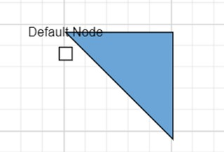|
| Both | PortAndLabel ||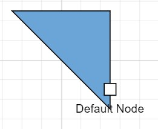| 
| Both | PortAndLabelText ||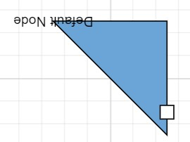| 
| Both | LabelAndLabelText ||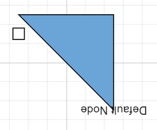| 

The following example demonstrates implementing different flip modes:










  
