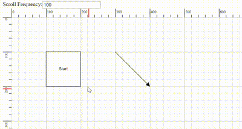

# Scroll settings in Angular Diagram component

The diagram can be scrolled using both the vertical and horizontal scrollbars. Additionally, the mouse wheel can be used to scroll the diagram. The diagram's [`scrollSettings`](https://helpej2.syncfusion.com/angular/documentation/api/diagram/scrollSettingsModel/) allow you to read the current scroll status, view port size, current zoom level, and zoom factor. These settings also provide the capability to programmatically control the scrolling of the diagram.

## Access and Customize Scroll Settings

Scroll settings in a diagram allow you to access and customize various properties such as [`horizontalOffset`](https://helpej2.syncfusion.com/angular/documentation/api/diagram/scrollSettingsModel/#horizontaloffset), [`verticalOffset`](https://helpej2.syncfusion.com/angular/documentation/api/diagram/scrollSettingsModel/#verticaloffset), [`viewPortWidth`](https://helpej2.syncfusion.com/angular/documentation/api/diagram/scrollSettingsModel/#viewportwidth), [`viewPortHeight`](https://helpej2.syncfusion.com/angular/documentation/api/diagram/scrollSettingsModel/#viewportheight), [`currentZoom`](https://helpej2.syncfusion.com/angular/documentation/api/diagram/scrollSettingsModel/#currentzoom), [`zoomFactor`](https://helpej2.syncfusion.com/angular/documentation/api/diagram/scrollSettingsModel/#zoomfactor), [`maxZoom`](https://helpej2.syncfusion.com/angular/documentation/api/diagram/scrollSettingsModel/#maxzoom), [`minZoom`](https://helpej2.syncfusion.com/angular/documentation/api/diagram/scrollSettingsModel/#minzoom), [`scrollLimit`](https://helpej2.syncfusion.com/angular/documentation/api/diagram/scrollSettingsModel/#scrolllimit), [`canAutoScroll`](https://helpej2.syncfusion.com/angular/documentation/api/diagram/scrollSettingsModel/#canautoscroll), [`autoScrollBorder`](https://helpej2.syncfusion.com/angular/documentation/api/diagram/marginModel/), [`padding`](https://helpej2.syncfusion.com/angular/documentation/api/diagram/marginModel/), [`scrollableArea`](https://helpej2.syncfusion.com/angular/documentation/api/diagram/rect/)

These properties enable you to read and adjust the scroll status, scroll offset, zoom levels, and more. For a comprehensive overview of these properties, refer to the [`Scroll Settings`](https://helpej2.syncfusion.com/angular/documentation/api/diagram/scrollSettingsModel/)

<!-- ## Get current scroll status

Scroll settings allow you to read the scroll status, [`viewPortWidth`](https://ej2.syncfusion.com/angular/documentation/api/diagram/scrollSettings/), [`viewPortHeight`](https://ej2.syncfusion.com/angular/documentation/api/diagram/scrollSettings/), and [`currentZoom`](https://ej2.syncfusion.com/angular/documentation/api/diagram/scrollSettings/) with a set of properties. To explore those properties, see [`Scroll Settings`](https://ej2.syncfusion.com/angular/documentation/api/diagram/scrollSettings/). -->

## Define scroll offset

The diagram allows you to pan before loading, ensuring that any desired region of a large diagram is visible. You can programmatically pan the diagram using the [`horizontalOffset`](https://helpej2.syncfusion.com/angular/documentation/api/diagram/scrollSettingsModel/#horizontaloffset) and [`verticalOffset`](https://helpej2.syncfusion.com/angular/documentation/api/diagram/scrollSettingsModel/#verticaloffset) properties of the scroll settings. The following code illustrates how to programmatically pan the diagram upon initialization also defined scrollLimit as 'Infinity' to scroll infinitely in diagram. To learn more about scrollLimit refer to [`scrollLimit`](https://ej2.syncfusion.com/angular/documentation/diagram/scroll-settings#scroll-limit).

In the example below, the vertical scrollbar is scrolled down by 100 px, and the horizontal scrollbar is scrolled to the right by 100 px.










  


## Update scroll offset at runtime

There are several ways to update the scroll offset at runtime:

* `Scrollbar`: Use the horizontal and vertical scrollbars of the diagram.
* `Mousewheel`: Scroll vertically with the mouse wheel. Hold the Shift key while scrolling to scroll horizontally.
* `Pan Tool`: Activate the ZoomPan [`tool`](https://helpej2.syncfusion.com/angular/documentation/api/diagram/diagramTools/) in the diagram to scroll by panning.
* `Touch`: Use touch pad gestures for scrolling.

### Programmatically update Scroll Offset

You can programmatically change the scroll offsets of diagram by customizing the [`horizontalOffset`](https://helpej2.syncfusion.com/angular/documentation/api/diagram/scrollSettingsModel/#horizontaloffset) and [`verticalOffset`](https://helpej2.syncfusion.com/angular/documentation/api/diagram/scrollSettingsModel/#verticaloffset) of [`Scroll Settings`](https://helpej2.syncfusion.com/angular/documentation/api/diagram/scrollSettingsModel/) at runtime. The following code illustrates how to change the scroll offsets at runtime.










  


## Update zoom at runtime

### Zoom using mouse wheel

Another way to zoom in and out the diagram is by using the mouse wheel. This method is a quick and convenient way to zoom in and out without having to use any additional tools or gestures.

- Zoom in: Press Ctrl+mouse wheel, then scroll upward.

- Zoom out: Press Ctrl+mouse wheel, then scroll downward.

### Zoom using Keyboard Shortcuts

Using keyboard shortcuts is a quick and easy way to zoom the diagram without having to use the mouse or touch pad.

- Zoom in: Press Ctrl and the plus(+) key.

- Zoom out: Press Ctrl and the minus(-) key.

### Programmatically update zoom

You can programmatically change the current zoom of diagram by utilizing the [`zoomTo`](https://helpej2.syncfusion.com/angular/documentation/api/diagram/#zoomto) public method.

#### ZoomOptions

The [`zoomTo`](https://helpej2.syncfusion.com/angular/documentation/api/diagram/#zoomto) method takes one parameter [`zoomOptions`](https://helpej2.syncfusion.com/angular/documentation/api/diagram/zoomOptions/). In that zoomOptions we can specify the [`focusPoint`](https://helpej2.syncfusion.com/angular/documentation/api/diagram/pointModel/) , [`type`](https://helpej2.syncfusion.com/angular/documentation/api/diagram/zoomTypes/) and [`zoomFactor`](https://helpej2.syncfusion.com/angular/documentation/api/diagram/zoomOptions/#zoomfactor)

The following example shows how to zoom-in and zoom-out the diagram using zoomTo method










  


For more information on various ways to zoom and pan the diagram, refer to [`zoomPan with various ways`](https://support.syncfusion.com/kb/article/12643/how-to-perform-zoom-and-pan-angular-diagram-in-various-ways?highlight=How%20to%20zoom%20and%20pan)

## AutoScroll

The autoscroll feature automatically scrolls the diagram when a node or connector is moved beyond its boundary. This ensures that the element remains visible during operations like dragging, resizing, and selection.

The autoscroll behavior triggers automatically when any of the following actions occur towards the edges of the diagram:

- Node dragging or resizing
- Connector control point editing
- Rubber band selection

The client-side event [`ScrollChange`](https://helpej2.syncfusion.com/angular/documentation/api/diagram/iScrollChangeEventArgs/) is triggered when autoscroll occurs, allowing for customizations. Refer [`scrollChange-event`](https://ej2.syncfusion.com/angular/documentation/diagram/scroll-settings#scroll-change-event) for more information.

Autoscroll behavior can be enabled or disabled using the  [`canAutoScroll`](https://helpej2.syncfusion.com/angular/documentation/api/diagram/scrollSettingsModel/#canautoscroll) property of the diagram.

## Autoscroll border

The autoscroll border defines the maximum distance from the mouse pointer to the diagram edge that triggers autoscroll. By default, this distance is set to 15 pixels for all sides (left, right, top, and bottom). You can adjust this using the [`autoScrollBorder`](https://helpej2.syncfusion.com/angular/documentation/api/diagram/marginModel/) property of the scroll settings.

The following example demonstrates how to configure autoscroll:










  


N> To use auto scroll the scrollLimit should be set as 'Infinity'

## Controlling Autoscroll Speed

You can control how often the scrolling needs to be performed automatically in the Diagram component during the auto-scrolling behavior. You can now adjust the frequency, ranging from slow and smooth to quick and rapid, to suit their preferences. To configure, set the value in milliseconds to the [`autoScrollFrequency`](https://ej2.syncfusion.com/angular/documentation/api/diagram/scrollSettings/#autoscrollfrequency) property within the scrollSettings class, allowing precise control over how often auto-scrolling occurs.



## Scroll limit

The [`scrollLimit`](https://helpej2.syncfusion.com/angular/documentation/api/diagram/scrollSettingsModel/#scrolllimit) allows you to define the scrollable region of the diagram. It includes the following options:

* `Infinity`: Allows scrolling in all directions without any restriction.
* `Diagram`: Allows scrolling within the diagram region.
* `Limited`: Allows scrolling within a specified scrollable area.

The `scrollLimit` property in scroll settings helps to define these limits.

### Scrollable Area

Scrolling beyond a particular rectangular area can be restricted by using the [`scrollableArea`](https://helpej2.syncfusion.com/angular/documentation/api/diagram/rect/) property in [`scrollSettings`](https://helpej2.syncfusion.com/angular/documentation/api/diagram/scrollSettingsModel/) . To restrict scrolling beyond a custom region, set the scrollLimit to "limited" and define the desired bounds in `scrollableArea` property.

The following code example illustrates how to specify the scroll limit and customize the scrollable area.










  


## Scroll padding

The [`padding`](https://helpej2.syncfusion.com/angular/documentation/api/diagram/marginModel/) property of the scroll settings allows you to extend the scrollable region based on the scroll limit. This property is useful for adding extra space around the diagram content, making it easier to navigate and interact with elements near the edges.

The following code example illustrates how to set scroll padding for the diagram region:










  


## Reset scroll

The [`reset`](https://helpej2.syncfusion.com/angular/documentation/api/diagram/#reset) method resets the zoom and scroller offsets to their default values.

``` javascript
//Resets the scroll and zoom to default values
(this.diagram as Diagram).reset();

```

## UpdateViewport

The [`updateViewPort`](https://ej2.syncfusion.com/angular/documentation/api/diagram/) method is used to update the dimensions of the diagram viewport.

```javascript
//Updates diagram viewport
(this.diagram as Diagram).updateViewPort();

```

## Events

### Scroll change event

The [`scrollChange`](https://helpej2.syncfusion.com/angular/documentation/api/diagram/iScrollChangeEventArgs/) event is triggered whenever the scrollbar is updated. This can occur during actions such as zooming in, zooming out, using the mouse wheel, or panning. The following example shows how to capture the `scrollChange` event.










  

