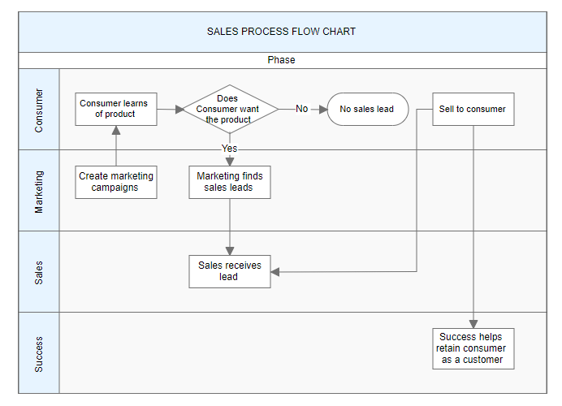

# Swimlane in Angular Diagram

Swimlanes are specialized diagram nodes that visualize business processes by organizing activities into distinct lanes or sections. Each lane typically represents a department, role, or responsibility area, making it easy to understand who is responsible for each step in a process. Swimlanes are particularly useful for workflow documentation, process mapping, and cross-functional process analysis.



## Create a swimlane

To create a swimlane, set the node's shape type to [`swimlane`](https://ej2.syncfusion.com/angular/documentation/api/diagram/swimLaneModel). Swimlanes are arranged horizontally by default and require proper configuration of headers and lanes to function correctly.

The following code example demonstrates how to define a basic swimlane object:










  


N> When setting a swimlane's `id`, ensure that it does not contain spaces or special characters, including underscores, and does not start with a number.

## Orientation

Swimlanes support two orientation modes, configured via the [`orientation`](https://ej2.syncfusion.com/angular/documentation/api/diagram/swimLaneModel#orientation) property, to accommodate different layout requirements and design preferences.

### Horizontal orientation

Lanes are arranged from top to bottom, with the header positioned on the left side. This is the default orientation and works well for processes that flow from left to right.

### Vertical orientation
Lanes are arranged from left to right, with the header positioned at the top. This orientation suits processes that flow from top to bottom.

The following code example demonstrates how to set the swimlane orientation:

```
orientation: 'Vertical'
```










  


## Headers

The header serves as the primary identifying element of a swimlane, providing a title or description for the entire swimlane container. The [`header`](https://ej2.syncfusion.com/angular/documentation/api/diagram/headerModel) property allows customization of both content and appearance. The header is also the primary interaction point for selecting and dragging the swimlane.

The following code example shows how to define and configure a swimlane header:










  


### Header customization

Swimlane headers can be extensively customized to match design requirements and improve visual clarity. The dimensions can be controlled using [`width`](https://ej2.syncfusion.com/angular/documentation/api/diagram/headerModel#width) and [`height`](https://ej2.syncfusion.com/angular/documentation/api/diagram/headerModel#height) properties. Visual styling, including background color and text formatting, can be applied through the [`style`](https://ej2.syncfusion.com/angular/documentation/api/diagram/headerModel#style) property. The swimlane's orientation can be controlled using the [`orientation`](https://ej2.syncfusion.com/angular/documentation/api/diagram/swimLaneModel#orientation) property.

The following code example demonstrates comprehensive header customization:










  


### Dynamic header customization

Headers can be modified programmatically during runtime to respond to user interactions or changing business requirements. This capability enables dynamic updating of swimlane titles, styling, and other properties based on application state or user input.

```
this.diagram.nodes[0].shape.header.style.fill = 'blue';
this.diagram.dataBind();
```










  


### Header editing

The Angular Diagram supports in-place editing of swimlane headers through user interaction. Double-clicking a header label activates edit mode, allowing users to modify the header text directly within the diagram. This feature enhances user experience by providing immediate editing capabilities without requiring separate dialog boxes or forms.


## Limitations

* Connectors cannot be added directly to swimlane.

## See also

- [Nodes](../nodes)
- [Connectors](../connectors/connector-interaction)
- [Group](../group)