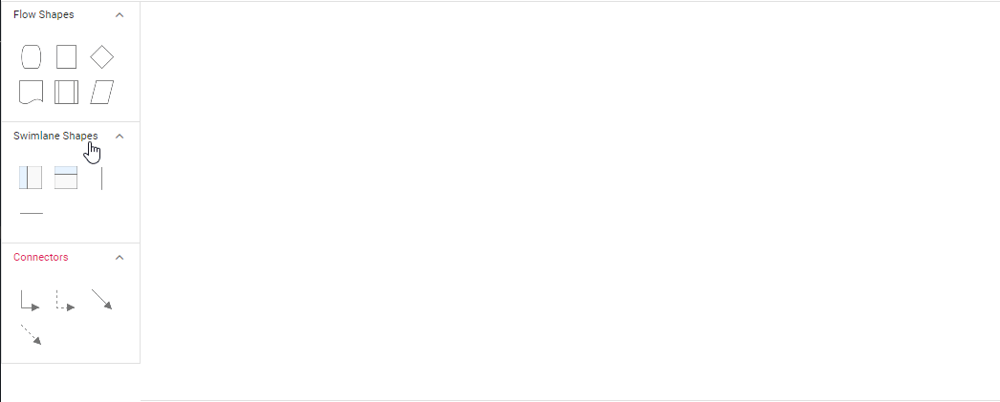

# Swimlane in Symbol Palette in Angular Diagram

The Angular Diagram component provides comprehensive support for adding swimlane shapes and phases to the symbol palette. Swimlanes help organize process flows by grouping related activities into lanes, making complex diagrams more readable and structured.

## Add Swimlane to Palette

The diagram component supports adding both swimlane containers and individual phases to the symbol palette. This enables users to drag and drop pre-configured swimlane elements into their diagrams.










 


### Drag and drop swimlane to palette

* The drag and drop support for swimlane shapes has been provided.
* Horizontal lanes can be added to vertical swimlanes, and vice versa.
* The phase will only drop on swimlane shape with same orientation. The following image illustrates how to drag symbol from palette.
