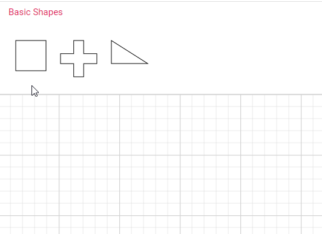

# Symbol Palette Customization in Angular Diagram Component

## Customize the palette header

Palettes can be annotated with their header texts.

The [`title`](https://ej2.syncfusion.com/angular/documentation/api/diagram/paletteModel/#title) property is displayed as the header text of the palette.

The [`expanded`](https://ej2.syncfusion.com/angular/documentation/api/diagram/paletteModel/#expanded) property of the palette allows users to expand or collapse its palette items.

The [`height`](https://ej2.syncfusion.com/angular/documentation/api/diagram/paletteModel/#height) property of the palette sets the height of the palette or symbol group.

The [`iconCss`](https://ej2.syncfusion.com/angular/documentation/api/diagram/paletteModel/#iconcss) property sets the icon to be rendered with the title.

The following code example illustrates how to customize palette headers.










  


## Animation

The expand and collapse operations of the symbol palette can be animated by utilizing the [`enableAnimation`](https://ej2.syncfusion.com/angular/documentation/api/symbol-palette/#enableanimation) property of the symbol palette. The following example demonstrates how to enable and disable animation for the symbol palette.










  


## Description for symbols

The [`description`](https://ej2.syncfusion.com/angular/documentation/api/diagram/symboldescription/#description) property defines the descriptive text that appears beneath each symbol in the palette. This text provides additional information about the symbol's purpose or usage within the diagramming context. The description can be dynamically retrieved and defined using the [`getSymbolInfo`](https://ej2.syncfusion.com/angular/documentation/api/symbol-palette/#getsymbolinfo) property, allowing for contextual information to assist users in understanding the function or meaning of each symbol.










  


### Text wrapping and text overflow

The descriptive text that appears beneath each symbol can vary in length. In cases where the text might overlap neighboring symbols in the palette, text wrapping is employed. Text wrapping is controlled using the symbolInfo's [`description`](https://ej2.syncfusion.com/angular/documentation/api/diagram/symbolDescription/#symboldescription) property [`wrap`](https://ej2.syncfusion.com/angular/documentation/api/diagram/symbolDescription/#wrap), which supports three modes: `Wrap`, `NoWrap`, and `WrapWithOverflow`. By default, text wrapping is set to `Wrap`.

Additionally, to handle overflowing text, the [`overflow`](https://ej2.syncfusion.com/angular/documentation/api/diagram/symbolDescription/#overflow) property can be used. By default, textOverflow is set to `Ellipsis`, which truncates overflowing text with an ellipsis (...).

The following example demonstrates how text wrapping and text overflow are applied based on the symbol ID:










  


### Appearance of symbol description

The appearance of a symbol description in the palette can be customized by changing its [`color`](https://ej2.syncfusion.com/angular/documentation/api/diagram/symbolDescription/#color), [`fill`](https://ej2.syncfusion.com/angular/documentation/api/diagram/symbolDescription/#fill), [`fontSize`](https://ej2.syncfusion.com/angular/documentation/api/diagram/symbolDescription/#fontsize), [`fontFamily`](https://ej2.syncfusion.com/angular/documentation/api/diagram/symbolDescription/#fontfamily), [`bold`](https://ej2.syncfusion.com/angular/documentation/api/diagram/symbolDescription/#bold), [`italic`](https://ej2.syncfusion.com/angular/documentation/api/diagram/symbolDescription/#italic), [`textDecoration`](https://ej2.syncfusion.com/angular/documentation/api/diagram/symbolDescription/#textdecoration), and [`margin`](https://ej2.syncfusion.com/angular/documentation/api/diagram/symbolDescription/#margin) properties.

The following code example shows how to customize the symbol description.










  


## Symbol size and symbol margin

The size of individual symbols can be customized. The [`symbolWidth`](https://ej2.syncfusion.com/angular/documentation/api/symbol-palette/#symbolwidth) and [`symbolHeight`](https://ej2.syncfusion.com/angular/documentation/api/symbol-palette/#symbolheight) properties enable you to define the size of the symbols. The following code example illustrates how to change the size of a symbol.

The [`symbolMargin`](https://ej2.syncfusion.com/angular/documentation/api/diagram/symbolPaletteModel/#symbolmargin) property is used to create space around elements, outside of any defined borders. By setting the symbol margin with specific values for left, right, top, and bottom, you can create consistent spacing on all sides around the shape.

The following code example illustrates how to set symbol size and symbol margin for the symbol palette.










  


## Symbol preview

The symbol preview size of palette items can be customized using the [`symbolPreview`](https://ej2.syncfusion.com/angular/documentation/api/diagram/symbolPreviewModel/) property of the symbol palette. 
The [`width`](https://ej2.syncfusion.com/angular/documentation/api/diagram/symbolPreview/#width-number/) and [`height`](https://ej2.syncfusion.com/angular/documentation/api/diagram/symbolPreview/#height-number/) properties of SymbolPalette allow you to define the preview size for all symbol palette items. The [`offset`](https://ej2.syncfusion.com/angular/documentation/api/diagram/symbolPreview/#offset-PointModel/) property specifies the position of the dragging helper relative to the mouse cursor.

The following code example illustrates how to change the preview size of a palette item.










  


## Symbol drag size

The [`symbolDragSize`](https://ej2.syncfusion.com/angular/documentation/api/diagram/symbolPaletteModel/#symboldragsize) property sets the dimensions (height and width) of a shape while it is being dragged from the palette to the diagram canvas. This differs from the preview size, which only affects how symbols appear in the palette itself. The following code illustrates how to set `symbolDragSize` for the symbol palette.










  


N> If the size of the symbol is not defined, the default size will be determined based on its shape.

## Expand mode

The [`expandMode`](https://ej2.syncfusion.com/angular/documentation/api/symbol-palette/#expandmode) property of the symbol palette allows you to customize whether to expand all palettes simultaneously or to expand only one palette at a time.

The following example demonstrates how to set the `expandMode` property to control the expansion behavior of the palettes:










  


### Restrict expand/collapse of the palette

The symbol palette panel can be restricted from expanding. When the expand icon of the palette is clicked, the [paletteExpanding](https://ej2.syncfusion.com/angular/documentation/api/diagram/symbolPaletteModel/#paletteexpanding) event is triggered. In this event, you can determine whether the palette's panel should be expanded or collapsed by utilizing the `cancel` argument of the event. By default, the panel is expanded. This restriction can be applied to each palette in the symbol palette as desired.

In the following code example, the basic shapes palette is restricted from expanding, and the flow shapes palette is restricted from collapsing, whereas the swimlane shapes palette can be expanded or collapsed:










  


## Tooltip for symbols in symbol palette

The symbol palette supports displaying tooltips when the mouse hovers over symbols. You can customize the tooltip for each symbol in the symbol palette.

### Default tooltip for symbols

When hovering over symbols in the symbol palette, the default tooltip displays the symbol's ID.
Refer to the image below for an illustration of the tooltip behavior in the symbol palette.

### Custom tooltip for symbols

To customize tooltips for symbols in the symbol palette, assign a custom tooltip to the [`content`](https://ej2.syncfusion.com/angular/documentation/api/diagram/diagramTooltipModel/#content) property of the ['tooltip'](https://ej2.syncfusion.com/angular/documentation/api/diagram/nodeModel/#tooltip) for each symbol. Once you define the custom tooltip, enable the [`Tooltip`](https://ej2.syncfusion.com/angular/documentation/api/diagram/nodeConstraints/) constraints for each symbol, ensuring that tooltips are displayed when users hover over them.

The code provided below demonstrates how to define tooltip content for symbols within a symbol palette.










  


### How to enable or disable the default tooltip for shapes in the symbol palette

By default, the symbol ID is displayed as a tooltip when hovering over a symbol in the Symbol Palette. To disable this default tooltip, you can use the `showTooltip` property within the [`getSymbolInfo`](https://ej2.syncfusion.com/angular/documentation/api/symbol-palette/#getsymbolinfo) method. The `showTooltip` property is set to **true** by default, which enables the tooltip.

The following example demonstrates how to configure selective tooltip display:










  


N> This property is effective only when tooltip constraints are disabled for the symbol palette element.

### How to provide different tooltip for Symbol palette and diagram elements.

When a custom tooltip is defined for a symbol, it will be displayed for both the symbol and the dropped node in the diagram canvas. 

However, to provide distinct tooltips for symbols in the palette and dropped nodes, capture the dragEnter event and assign specific tooltips dynamically.  

When a symbol is dragged from the symbol palette and enters the diagram canvas, the [`DragEnter`](https://ej2.syncfusion.com/angular/documentation/api/diagram/#dragenter/) event is fired, accompanied by an argument of type [`IDragEnterEventArgs`](https://ej2.syncfusion.com/angular/documentation/api/diagram/iDragEnterEventArgs/). Within this event, you can define a new tooltip for the dropped node. By assigning custom tooltip content to the Tooltip property of the node, you can provide a distinct tooltip that is specific to the dropped node.

The following image illustrates the differentiation of tooltips displayed in the Symbol Palette and the Diagram.

The following code snippet demonstrates how to define two different tooltips for symbols in the symbol palette and dropped nodes in the diagram canvas.










  


## Localization

To localize the symbol palette search box, define the [`locale`](https://ej2.syncfusion.com/angular/documentation/api/symbol-palette/#locale) property of the symbol palette with the preferred culture. In the example below, **'de-DE'** is used, which is the locale code for German as used in Germany.

The following code shows how to localize the symbol palette.










  


## Restrict symbol dragging from palette

You can restrict symbols from being dragged from the symbol palette by setting the [`allowDrag`](https://ej2.syncfusion.com/angular/documentation/api/symbol-palette/#allowdrag) property of the symbol palette to false. By default, allowDrag is set to **true**.










  


## Search symbol

The diagram provides support for enabling the search option in the palette. The [`enableSearch`](https://ej2.syncfusion.com/angular/documentation/api/symbol-palette/#enablesearch) property of the palette is used to show or hide the search textbox in the palette. You can search for symbols in the palette by entering the symbol ID (e.g., "rectangle") and search keywords into the search text box. The symbols are retrieved by matching the value of the ID property with the string entered in the search textbox.










  


## Ignore symbols on search

The [`ignoreSymbolsOnSearch`](https://ej2.syncfusion.com/angular/documentation/api/symbol-palette/#ignoresymbolsonsearch) property allows you to specify which symbols should be excluded from search results within the symbol palette. By setting this property, you can control the visibility of specific symbols during a search operation. This feature is useful for hiding certain symbols that should not be shown through search functionality.

In the following example, the symbol with the ID 'plus' is ignored, so it will not appear in search results.










  


## Filter search

You can filter search results based on specific requirements. To achieve this, customize the [`filterSymbols`](https://ej2.syncfusion.com/angular/documentation/api/symbol-palette/#filtersymbols) method of the symbol palette according to your needs. In the following example, the results are filtered to display only flow shapes in the search palette.










  


N> The diagram provides support to cancel the drag and drop operation from the symbol palette to the diagram when the ESC key is pressed

## See Also

* [How to add the symbol to the diagram](../nodes/nodes)