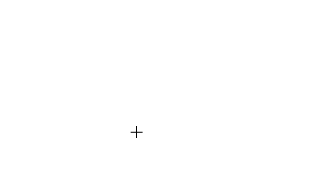

# Tools in Angular Diagram Component

The Angular Diagram component provides a comprehensive set of interactive tools that enable users to create, modify, and navigate diagrams efficiently. These tools facilitate real-time interaction with diagram elements through mouse and keyboard operations.

## Overview

The diagram control offers three primary tool categories:

- **Select**: Choose and manipulate specific elements within the diagram
- **Pan**: Navigate the diagram view to different areas without modifying elements  
- **Draw**: Create new shapes, connectors, and freehand drawings on the diagram surface

These tools are essential for building complex diagrams and provide the foundation for user interaction within the diagram environment.

## Drawing tools

Drawing tools enable real-time creation of diagram elements by clicking and dragging on the diagram canvas. All drawing operations are configured through the [`drawingObject`](https://ej2.syncfusion.com/angular/documentation/api/diagram/#drawingobject) property and activated using the [`tool`](https://ej2.syncfusion.com/angular/documentation/api/diagram/#tool) property.

### Draw nodes

To draw shapes during runtime, configure the JSON representation of the desired shape in the [`drawingObject`](https://ej2.syncfusion.com/angular/documentation/api/diagram/#drawingobject) property and set the tool to drawing mode. The following example demonstrates how to draw a rectangle shape:










  


Path shapes can be drawn using the same approach with custom path data. The following example shows how to draw a path shape:










  


### Text nodes

Text nodes are created by setting the shape type as 'Text' in the [`drawingObject`](https://ej2.syncfusion.com/angular/documentation/api/diagram/#drawingobject) property. The [`text`](https://ej2.syncfusion.com/angular/documentation/api/diagram/textModel/) node includes a content property that defines the displayed text. Users can add or modify the content after completing the drawing operation:










  


### Draw connectors

Connectors are drawn by defining the connector configuration in the [`drawingObject`](https://ej2.syncfusion.com/angular/documentation/api/diagram/#drawingobject) property. The drawing tool supports various connector types including straight, orthogonal, and bezier connectors:










  


### Polygon shapes

The diagram supports interactive polygon creation through point-and-click interaction. Users can define custom shapes with multiple sides by specifying vertices directly on the diagram canvas. To enable polygon drawing, set the [`drawingObject`](https://ej2.syncfusion.com/angular/documentation/api/diagram/#drawingobject) type as 'Polygon':










  


### Polyline connectors

Polyline connectors enable creation of multi-segment connections with straight lines and angled vertices. Users can interactively add control points by clicking on the diagram canvas. To draw polyline connectors, set the [`drawingObject`](https://ej2.syncfusion.com/angular/documentation/api/diagram/#drawingobject) type as 'Polyline':










  


### Freehand drawing

Freehand drawing allows users to create custom paths and sketches by dragging the mouse freely across the diagram canvas. This tool is ideal for creating organic shapes, annotations, or rough sketches. Enable freehand drawing by setting the [`drawingObject`](https://ej2.syncfusion.com/angular/documentation/api/diagram/#drawingobject) type to 'Freehand':










  


Freehand connector segments can be adjusted after creation by dragging the segment thumbs. To enable this functionality, apply the [`DragSegmentThumb`](https://ej2.syncfusion.com/angular/documentation/api/diagram/connectorModel/#constraints) constraint to the connector:

## Tool selection and precedence

The diagram supports multiple tool configurations that can be combined for different interaction scenarios. When multiple tools are enabled simultaneously, the system follows a specific precedence order to determine which tool takes priority:

### Tool precedence hierarchy

The following table shows the precedence order from highest to lowest priority:

|Precedence|Tool|Description|
|----------|-----|-----------|
|1st|ContinuesDraw|Enables continuous drawing mode. Once activated, prevents all other interactions until deactivated.|
|2nd|DrawOnce|Allows drawing a single element. After completion, automatically enables SingleSelect and MultipleSelect tools.|
|3rd|ZoomPan|Enables diagram panning. When combined with SingleSelect, panning activates when cursor hovers over empty diagram areas.|
|4th|MultipleSelect|Enables selection of multiple elements. When combined with ZoomPan, selection takes priority over panning when hovering over elements.|
|5th|SingleSelect|Enables selection of individual elements.|
|6th|None|Disables all interactive tools.|

These tools provide flexibility and functionality for creating and interacting with elements within the diagram interface.

## Pan tool

The pan tool enables users to navigate large diagrams by dragging the view area. To activate panning mode, set the [`tool`](https://ej2.syncfusion.com/angular/documentation/api/diagram/#tool) property to `ZoomPan`:










  


N> Panning is disabled when 'multiplePage' is set to false and diagram objects exist outside the defined page boundaries.

## Events

The [`elementDraw`](https://ej2.syncfusion.com/angular/documentation/api/diagram/#elementdraw) event triggers whenever users create nodes or connectors using drawing tools. This event provides access to the newly created element and enables custom logic during the drawing process:










  

