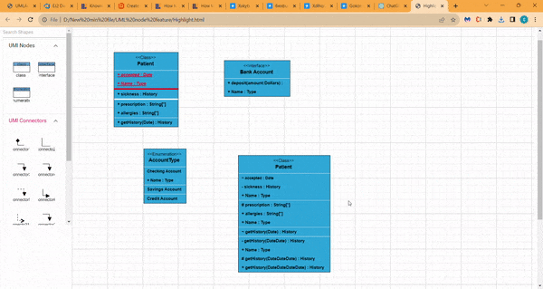
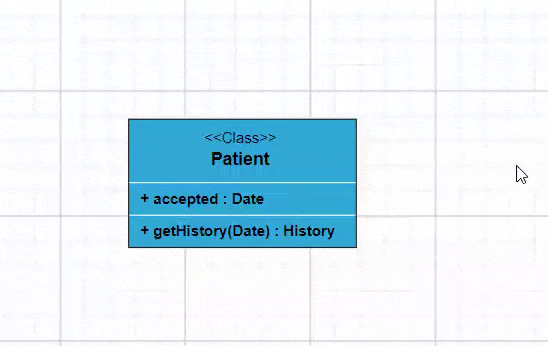
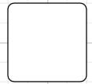

# UML Diagrams in Angular Diagram Component

This guide demonstrates how to create and customize UML (Unified Modeling Language) diagrams using the Syncfusion Angular Diagram component. You'll learn to build UML Class diagrams for object-oriented system modeling and UML Activity diagrams for workflow visualization.

## UML Class Diagram

A class diagram visually depicts the static structure of an application and is extensively employed in modeling object-oriented systems. It holds a unique position in UML diagrams, as it directly aligns with object-oriented languages. The diagram also facilitates automatic generation of class diagram shapes based on business logic, streamlining the translation from conceptual models to practical implementation.

## UML Class Diagram Shapes

The UML class diagram shapes are explained as follows.

### Class

A class defines a group of objects that share common specifications, features, constraints, and semantics. To create a class object, the classifier should be defined using the [`class`](https://ej2.syncfusion.com/angular/documentation/api/diagram/umlClassifierShapeModel/#class) notation. This notation serves as a foundational element in object-oriented programming, encapsulating the characteristics and behavior that objects belonging to the class will exhibit.

Define the [`name`](https://ej2.syncfusion.com/angular/documentation/api/diagram/umlClassModel/#name), [`attributes`](https://ej2.syncfusion.com/angular/documentation/api/diagram/umlClassModel/#attributes), and [`methods`](https://ej2.syncfusion.com/angular/documentation/api/diagram/umlClassModel/#methods) of the class using the class property of node.

The attribute's [`name`](https://ej2.syncfusion.com/angular/documentation/api/diagram/umlClassAttributeModel/#name), [`type`](https://ej2.syncfusion.com/angular/documentation/api/diagram/umlClassAttributeModel/#type), and [`scope`](https://ej2.syncfusion.com/angular/documentation/api/diagram/umlClassAttributeModel/#scope) properties allow you to define the name, data type, and visibility of the attribute.

The method's [`name`](https://ej2.syncfusion.com/angular/documentation/api/diagram/umlClassMethodModel/#name), [`parameters`](https://ej2.syncfusion.com/angular/documentation/api/diagram/umlClassMethodModel/#parameters), [`type`](https://ej2.syncfusion.com/angular/documentation/api/diagram/umlClassMethodModel/#type), and [`scope`](https://ej2.syncfusion.com/angular/documentation/api/diagram/umlClassMethodModel/#scope) properties allow you to define the name, parameter, return type, and visibility of the methods.

The method [`parameters`](https://ej2.syncfusion.com/angular/documentation/api/diagram/umlClassMethodModel/#parameters) object properties allow you to define the name and type of the parameter.

The following code example illustrates how to create a class.










  


### Interface

An [`interface`](https://ej2.syncfusion.com/angular/documentation/api/diagram/umlClassifierShapeModel/#interface) is a specific type of classifier that represents a declaration of a cohesive set of public features and obligations. When creating an interface, define the classifier property using the interface notation. This concept in object-oriented programming outlines a contract for classes to implement, specifying the required methods and behaviors without providing implementation details.

Define the [`name`](https://ej2.syncfusion.com/angular/documentation/api/diagram/umlInterfaceModel/#name), [`attributes`](https://ej2.syncfusion.com/angular/documentation/api/diagram/umlInterfaceModel/#attributes), and [`methods`](https://ej2.syncfusion.com/angular/documentation/api/diagram/umlInterfaceModel/#methods) of the interface using the interface property of the node.

The attribute's [`name`](https://ej2.syncfusion.com/angular/documentation/api/diagram/umlClassAttributeModel/#name), [`type`](https://ej2.syncfusion.com/angular/documentation/api/diagram/umlClassAttributeModel/#type), and [`scope`](https://ej2.syncfusion.com/angular/documentation/api/diagram/umlClassAttributeModel/#scope) properties allow you to define the name, data type, and visibility of the attribute.

The method's [`name`](https://ej2.syncfusion.com/angular/documentation/api/diagram/umlClassMethodModel/#name), [`parameters`](https://ej2.syncfusion.com/angular/documentation/api/diagram/umlClassMethodModel/#parameters), [`type`](https://ej2.syncfusion.com/angular/documentation/api/diagram/umlClassMethodModel/#type), and [`scope`](https://ej2.syncfusion.com/angular/documentation/api/diagram/umlClassMethodModel/#scope) properties allow you to define the name, parameter, return type, and visibility of the methods.

The method parameter object properties of name and type allow you to define the name and type of the parameter.

The following code example illustrates how to create an interface.










  


### Enumeration

To create an enumeration, set the classifier property of the node as [`enumeration`](https://ej2.syncfusion.com/angular/documentation/api/diagram/umlClassifierShapeModel/#enumeration). Define the [`name`](https://ej2.syncfusion.com/angular/documentation/api/diagram/umlEnumerationModel/#name) and enumerate the [`members`](https://ej2.syncfusion.com/angular/documentation/api/diagram/umlEnumerationModel/#members) of the enumeration using the appropriate enumeration property of the node. This process encapsulates a set of distinct values within the enumeration, allowing for clear representation of specific, named constants within a system.

You can set a name for the enumeration members collection using the [`name`](https://ej2.syncfusion.com/angular/documentation/api/diagram/umlClassAttributeModel/#name) property of members collection.

The following code example illustrates how to create an enumeration.










  


## UML Class Relationships

A class may be involved in one or more relationships with other classes. The relationship types available are as follows:

| Shape       | Image                                |
| ----------- | ------------------------------------ |
| Association |  |
| Aggregation |   |
| Composition |  |
| Inheritance |     |
| Dependency  | |

### Association

Association is a set of links that connects elements of a UML model. The types of association are as follows:

1. Directional
2. BiDirectional

The association property allows you to define the type of association. The default value of association is "Directional". The following code example illustrates how to create an association.










  


### Aggregation

Aggregation is a binary association between a property and one or more composite objects that group together a set of instances. Aggregation is decorated with a hollow diamond. To create an aggregation shape, define the [`relationship`](https://ej2.syncfusion.com/angular/documentation/api/diagram/relationShipModel/#relationship) of connector shape as "Aggregation".

The following code example illustrates how to create an aggregation.










  


### Composition

Composition is a strong form of aggregation. The composition is decorated with a black diamond. To create a composition shape, define the [`relationship`](https://ej2.syncfusion.com/angular/documentation/api/diagram/relationShipModel/#relationship) property of the connector shape as "Composition".

The following code example illustrates how to create a composition.










  


### Inheritance

Inheritance is also called "generalization". Inheritance is a binary taxonomic directed relationship between a more general classifier (super class) and a more specific classifier (subclass). Inheritance is shown as a line with hollow triangle.

To create an inheritance, define the [`relationship`](https://ej2.syncfusion.com/angular/documentation/api/diagram/relationShipModel/#relationship) as "inheritance".

The following code example illustrates how to create an inheritance.










  


### Dependency

Dependency is a directed relationship used to show that some UML elements need or depend on other model elements for specifications. Dependency is shown as a dashed line with an open arrow. To create a dependency, define the [`relationship`](https://ej2.syncfusion.com/angular/documentation/api/diagram/relationShipModel/#relationship) property of the connector shape as "dependency".

The following code example illustrates how to create a dependency.










  


### Multiplicity

Multiplicity defines an inclusive interval of non-negative integers to specify the allowable number of instances of the described element. The types of multiplicity are as follows:

1. OneToOne
2. ManyToOne
3. OneToMany
4. ManyToMany

By default, the multiplicity is considered as "OneToOne".

The multiplicity property in UML allows you to specify a large number of elements or some collection of elements.

The shape multiplicity's [`source`](https://ej2.syncfusion.com/angular/documentation/api/diagram/classifierMultiplicityModel/#source) property sets the source label to the connector and the [`target`](https://ej2.syncfusion.com/angular/documentation/api/diagram/classifierMultiplicityModel/#target) property sets the target label to the connector.

To set optionality or cardinality for the connector source label, use the [`optional`](https://ej2.syncfusion.com/angular/documentation/api/diagram/multiplicityLabelModel/#optional) property.

The [`lowerBounds`](https://ej2.syncfusion.com/angular/documentation/api/diagram/multiplicityLabelModel/#lowerBounds) and [`upperBounds`](https://ej2.syncfusion.com/angular/documentation/api/diagram/multiplicityLabelModel/#upperBounds) can be natural constants or constant expressions evaluated to natural (non-negative) numbers. Upper bound can also be specified as asterisk '*' which denotes unlimited number of elements. Upper bound should be greater than or equal to the lower bound.

The following code example illustrates how to customize the multiplicity.










  


## How to add UML child at runtime

In UML nodes, child elements such as member, method and attribute can be added either programmatically or interactively.

### Adding UML child through code

The [`addChildToUmlNode`](https://ej2.syncfusion.com/angular/documentation/api/diagram/#addchildtoumlnode) method is used for dynamically adding a child to the UML node during runtime, providing flexibility in modifying the diagram structure programmatically.

The following code example illustrates how to add members, methods and attributes to UML node at runtime.










  


### Adding UML child through user interaction

To include a child, select a node, move the mouse outside it, and position the pointer near the right side. A highlighter emerges between the two child elements. Click the highlighter to add a child type to the chosen UML node seamlessly. The following gif illustrates how to add a child through user interaction.

## Adding UML Nodes in Symbol palette

UML built-in shapes are easily rendered in a symbol palette. The [`symbols`](https://ej2.syncfusion.com/angular/documentation/api/diagram/paletteModel/#symbols) property of [`palettes`](https://ej2.syncfusion.com/angular/documentation/api/diagram/paletteModel/) is used to define UML symbols with the necessary classes and methods. This feature allows you to add a collection of predefined UML symbols to the palette, making your UML diagramming application more versatile.

The following code example showcases the rendering of UML built-in shapes in a symbol palette.










  


## Editing in UML nodes

You can edit the name, attributes, and methods of the class diagram shapes by double clicking, similar to editing a node annotation.

The following image illustrates how the text editor appears in edit mode.

## UML Activity diagram

An Activity diagram functions as a visual flowchart, illustrating the progression from one activity to the next within a system. Each activity corresponds to a system operation, providing a clear depiction of the sequential flow in a dynamic process.

The purpose of an activity diagram includes:

1. Drawing the activity flow of a system
2. Describing the sequence from one activity to another
3. Describing the parallel, branched, and concurrent flow of the system
    
## UML Activity diagram Shapes

To create a UmlActivity, define type as "UmlActivity" and set the list of built-in shapes as demonstrated in the following table in the "shape" property.

| Shape          | Image                                    |
| -------------- | ---------------------------------------- |
| Action         |           |
| Decision       |          |
| MergeNode      |        |
| InitialNode    |        |
| FinalNode      |       |
| ForkNode       |        |
| JoinNode       |        |
| TimeEvent      |       |
| AcceptingEvent |  |
| SendSignal     |      |
| ReceiveSignal  |   |
| StructuredNode |  |
| Note           |            |

The following code illustrates how to create UmlActivity shapes.









  


### UML Activity connector

To establish a UML Activity connector, specify the [`type`](https://ej2.syncfusion.com/angular/documentation/api/diagram/relationShipModel/#type) of connector shape as "UmlActivity" and define the flow as either "Exception," "Control," or "Object." This configuration delineates the nature of the connection, allowing for precise representation of the interaction within the activity diagram.

The following code illustrates how to create a UmlActivity connector.










  
